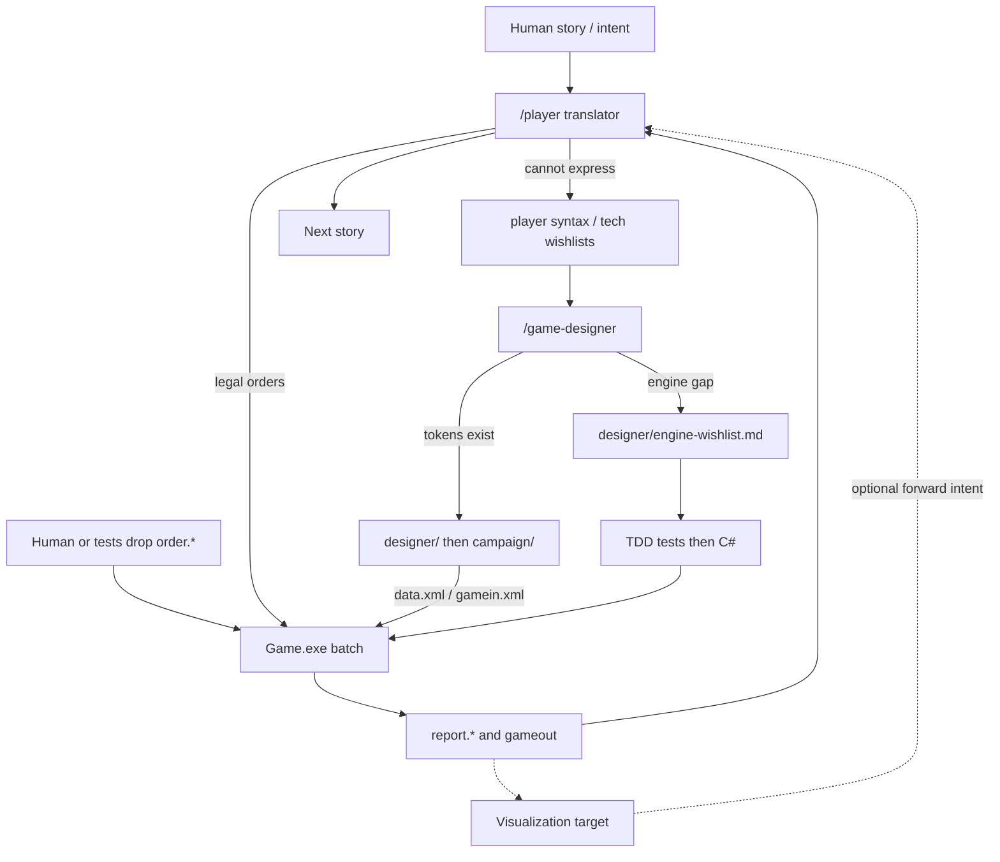

# ADR-0007: PBAI product loop around the existing batch engine

Date: 2026-08-19  
Status: **Accepted**  
Amends: [ADR-0003](ADR-0003-filesystem-pbem-batch.md) — *product* wrapper only. ADR-0003’s **engine** decision (offline file-in / file-out batch; no SMTP in-process) stays **Accepted**.

Does **not** reopen: ADR-0001 (net48), ADR-0002 (Windows-1251), ADR-0004 (test layers), ADR-0005 (`ModuleStack` partials), ADR-0006 (`DataFile` facade).

## Context

The engine is a deterministic console batch processor: load catalog and game XML, parse `order.*`, run 13 weeks, write reports and `gameout`. That shape came from play-by-email (PBEM): humans mailed precise orders; a GM ran `Game.exe`; reports went back by mail. ADR-0003 locked the **filesystem** contract and kept mail **outside** the process.

The product is pivoting. Humans should play by **story / intent** (play-by-AI, **PBAI**), not by authoring a full turn file. Example intent: “build the spaceship with a minimal set of modules but include a research facility and send it to the moon.”

Constraints that must not break:

- Game mechanics and `Game.exe` remain the source of truth for catalog, galaxy, execute, orders, battle, reports, and save.
- File names, encoding, and CLI stay as ADR-0003 decided.
- Precise order syntax remains a valid path (humans, tests, TDD fixtures).
- Campaign catalog stays with `/game-designer`; live order manuals with `/player`; C# and tests with TDD.

An LLM must not become the turn processor, a database, or an online service that “plays” the week loop.

## Decision

1. **Product interface.** The default path is **intent → player agent (`/player`) → legal engine orders**. Humans (and tests) may still write exact `order.*` syntax and skip the translator.

2. **Sole turn executor.** Only `Game.exe` advances the world. Agents never mutate `gameout.*` (or goldens) by hand as a substitute for a batch run. They do not invent week outcomes, combat results, or catalog effects in prose and then patch XML to match.

3. **Wishlist protocol (ownership).** No agent writes outside its tree.
   - `/player` drafts only implemented syntax. If the story cannot be expressed (missing verb, clumsy syntax, missing tech/module, missing galaxy capability), it records `player/order_wishlist.md` and/or `player/technologies_wishlist.md` — it does not invent live verbs or patch C#.
   - `/game-designer` answers catalog/galaxy/balance wishlists in `designer/` then `campaign/` when the engine already has tokens. If the engine lacks an effect, order, group, trigger, location-type, etc., it records `designer/engine-wishlist.md` and hands off to TDD — designer does not write C#.
   - TDD implements engine gaps **when asked**, failing tests first (ADR-0004). TDD does not play the turn, author campaign XML, or judge story beats.

4. **Visualization.** A **new bounded context** (planned, not present). It reads engine artifacts (`report.*`, optional XML report, `gameout`, catalog). It is **not** a second rules engine and **not** a rewrite of `Game/reports/`. Prefer keeping it **out of `Game.exe`**. It must not write orders except possibly by forwarding human intent to `/player`. Choosing a UI stack, folder, or project is a **later ADR**; this ADR only names the layer. Adding a UI or SMTP still needs its own decision (ADR-0003).

5. **PBEM mailer.** Email remains optional metadata (`Faction.email`, report `To:` / `Subject` headers). An external mailer may still wrap the same files. **PBEM is a compatible mode; PBAI is the product direction.** The default is no longer “players email orders / GM mails reports.”

6. **Engine surface unchanged.** net48, Windows-1251, single `SpaceAge` namespace, `DataFile` facade, CLI (`/data`, `/turn-dir`, `/check`), and file names stay as already decided. This ADR does not retarget, re-encode, or replace the batch pipeline.

## Consequences

- Implementers treat `architecture/` plus this ADR as the product loop; they do not replace `Game.Execute` with an LLM or a hosted service.
- TDD still does not draft orders or judge story beats (existing `/player` rule). Tests still use **precise** orders. SampleGame goldens are **unchanged** by this ADR.
- Designer still does not write C# or `Tests/**`.
- Player-facing live manuals live in `player/`. `Game/documentation/` remains historical design intent, not the PBAI interface.
- `/check` staying a stub is acceptable until a later ADR (or explicit implement request) promotes it — e.g. validating AI-drafted orders before execute.
- Visualization work is backlog ([`../future-work.md`](../future-work.md)); do not fold presentation logic into `Game.Execute` or `ReportWriter` as a drive-by.

## Product loop (2026-08-19)

