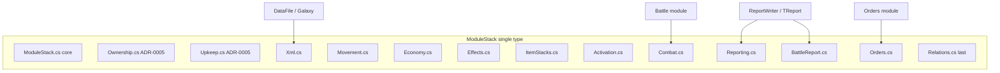

# ADR-0008: ModuleStack decomposition seams

Date: 2026-09-09  
Status: **Accepted** (strategy and seams; implementation is phased)  
Engine cited: current `master` (~2,960 lines across three partial files)

This ADR is the gate that [ADR-0005](ADR-0005-modulestack-partials.md) required before splitting the rest of `ModuleStack`. Implementers may execute the phases below; they must not invent extra seams, DI, namespace splits, or a big-bang rewrite.

## Context

`ModuleStack` is the largest domain type in the engine. It currently spans **~2,960 lines** in three `partial` files:

| File | Lines (approx.) | Concern |
|------|-----------------|--------|
| `Game/data structures/ModuleStack.cs` | ~2,336 | Core graph, activation, combat, movement, orders host, reporting, economy, effects, XML |
| `Game/data structures/ModuleStack.Upkeep.cs` | ~588 | Medical consume, sick bay, quarterly maintenance (ADR-0005) |
| `Game/data structures/ModuleStack.Ownership.cs` | ~37 | Recursive owner transfer, technology collection (ADR-0005) |

The type implements **eight interfaces** plus order hosting:

| Interface / role | Primary `#region`(s) in main file (line refs approximate) |
|------------------|--------------------------------------------------------|
| `IHolder` / graph | `relations` (~92–621) |
| Requirements / activation | `requirements`, `settlement modules`, `energy modules` (~622–935) |
| Combat / battle hooks | `combat` (~936–1328) |
| `IItemStacksHolder` | `IItemStacksHolder Members` (~1329–1422) |
| `IMoveable` | `movement` (~1423–1464) |
| `IOrderable` | `IOrderable Members`, `Execute` (~1467–1475, ~1866–1876) |
| `IReporting` | `report` / `IReporting Members` (~1477–1814) |
| `IOfferent` / economy | `economy` (~1816–1828) |
| Research on stack | `research` (~1830–1837) |
| `IEffectable` | `IEffectable Members` (~1839–1847) |
| `IEventReporting` | `IEventReporting Members` (~1849–1857) |
| Battle report | `battle report` (~1878–2257) |
| Persistence | `LoadXml` / `SaveXml` (~2259–2334) |

Static registry `ModuleStack.All` is load-bearing ([ADR-0003](ADR-0003-filesystem-pbem-batch.md)). XML for stacks is already partially on domain types: `ModuleStack.All.LoadXml` / `ModuleStacks.SaveXml` orchestrate instance load/save ([ADR-0006](ADR-0006-datafile-facade-and-xml-seams.md)); `DataFile` must remain the host facade for game documents.

[ADR-0005](ADR-0005-modulestack-partials.md) (Accepted) allows partial files **only** for ownership and upkeep today, and forbids splitting orders, combat, XML, or movement without a new ADR that names seams. This ADR satisfies that gate.

Parallel type: `Person.cs` (~771 lines) implements six of the same interfaces (`IItemStacksHolder`, `IOfferent`, `IReporting`, `IEventReporting`, `IEffectable`, `IMoveable`). A follow-up ADR may mirror these seams on `Person`; **Person is out of scope** for the first refactor PR series.

Constraints that stay in force: net48, non-SDK csproj, single `SpaceAge` namespace, Windows-1251 I/O, static `*.All` registries, NUnit in one `Tests.dll`, SampleGame goldens. No DI, async, SDK-style, or namespace splits.

## Options considered

### A. Partials only (extend ADR-0005)

Keep a **single** `ModuleStack` type. Move each `#region` (or grouped regions) into a named `partial` file. Public methods and properties stay on `ModuleStack`; only file placement changes.

- **Pros:** Lowest golden risk; same pattern as ADR-0005 and optional ADR-0006 partials; navigable diffs; no new types or call-site churn.
- **Cons:** `ModuleStack` remains one logical god class; shared private fields stay visible across partials; does not reduce compile-time coupling.

### B. Facade + extracted service types

Introduce collaborators (`ModuleStackCombat`, `ModuleStackReporter`, …) constructed by or passed into `ModuleStack`. Interface implementations delegate to services.

- **Pros:** Clearer ownership boundaries on paper.
- **Cons:** Easy to mint **new** god classes; requires wiring and field access decisions; diverges from ADR-0005/0006 “one domain type” precedent; smells like DI without containers ([`../future-work.md`](../future-work.md) gates DI behind an ADR).

### C. Push behavior onto existing composed types

Move combat onto `Modules` / `Tactics`, reporting onto `ReportLines` helpers only, activation onto `ModuleType` checks at call sites.

- **Pros:** Aligns with “behavior lives with data” in the long run.
- **Cons:** Largest behavior risk; `ModuleStack` is the battle/order/report subject throughout the engine; would touch `Battle`, `OrdersReader`, and report goldens in one sweep.

### D. Hybrid / phased (chosen)

**Target:** option **A** — named **`partial` files** per seam, preserving the **stable public surface** on `ModuleStack` (same method names, properties, and interface implementations). Optional **static** pure helpers (no instance state), in the spirit of `ModuleTypeGroupXml` in ADR-0006, **only** if a single partial still exceeds ~500 lines **after** the first cut **and** the helper is stateless formula code with no second public API.

**Not chosen:** new loader/service types (B), mass behavior relocation (C), or collapsing partials back into one file after extract.

Rationale:

- ADR-0005 already established `partial` as the approved file-split mechanism for this type.
- ADR-0006 showed phased, behavior-neutral extracts with facade preserved — same culture applies here, but the facade **is** `ModuleStack` itself (not `DataFile`).
- Combat (~400 lines), reporting (~340 + ~380 battle report), and relations (~530 lines) dominate size; partials make each slice reviewable without changing call sites.
- XML orchestration is already on the instance; moving it to `ModuleStack.Xml.cs` is mechanical.
- Tests already cluster by concern (`TBattle`, `TReport`, `TMove`, `TModuleStack`, `TDataFile`, SampleGame) — phases can map to them.

## Decision

**Phased partial-file decomposition.** `ModuleStack` remains one type implementing the same interfaces. [ADR-0005](ADR-0005-modulestack-partials.md) partials (`Ownership`, `Upkeep`) are unchanged. Additional partials are added **only** along the named seams below.

### What stays on `ModuleStack`

Always on the type (core partial or thin glue):

- All **constructors** and registration in `ModuleStack.All`.
- **Interface list** on the class declaration (unchanged).
- **Public API** used by orders, battle, reports, and tests: same method and property names; extracts **move bodies**, not rename.
- **`Execute(int week)`** — order/effect week loop stays as the orchestration entry (may live in `ModuleStack.Orders.cs` but remains on the type).
- **Static registry** `ModuleStack.All` — not extracted.
- **Cross-cutting private fields** referenced by multiple seams remain `private` on the partial class; partials share one type’s field table (standard C# partial semantics).

### Named seams (partial files)

All files stay in `Game/data structures/`, namespace `SpaceAge`. Legacy `Game/Game.csproj` needs `<Compile Include="data structures\ModuleStack.*.cs" />` for each new partial (csproj does not glob).

| Partial file | Owns (move from main `ModuleStack.cs`) | `ModuleStack` keeps at call sites |
|--------------|----------------------------------------|-----------------------------------|
| `ModuleStack.cs` (core) | Constructors, `All`, essential identity, anything not yet moved | Type declaration, anything deferred to last phase |
| `ModuleStack.Ownership.cs` | *(existing ADR-0005)* | — |
| `ModuleStack.Upkeep.cs` | *(existing ADR-0005)* | — |
| `ModuleStack.Xml.cs` | `LoadXml`, `SaveXml` | Same public overrides; orchestration only |
| `ModuleStack.Movement.cs` | `IMoveable`: `MovingTo`, `IsRoot`, `MoveModes` | Interface on type |
| `ModuleStack.Economy.cs` | `HasBankAccess`, `Offers`, `ResearchPoints` | `IOfferent` surface |
| `ModuleStack.Effects.cs` | `Effects`, `EventReports`, `ExecutedLongOrder` properties | `IEffectable`, `IEventReporting` |
| `ModuleStack.ItemStacks.cs` | `IItemStacksHolder` implementation | Interface on type |
| `ModuleStack.Activation.cs` | `requirements`, `settlement modules`, `energy modules` regions | Activation helpers used by orders/effects |
| `ModuleStack.Combat.cs` | `combat` region: hit points, damage, modules list surface tied to combat, tactics hooks, `IsAvoiding`, etc. | Members consumed by `Battle` and combat tests |
| `ModuleStack.Reporting.cs` | `report` / `IReporting Members`: `Report`, `ReportName`, `Alias`, visibility helpers, `HasPresence`, … | `IReporting` |
| `ModuleStack.BattleReport.cs` | `battle report` region: `BattleReport`, `battleReportDetails`, combat report lines | Called from reports and integration goldens |
| `ModuleStack.Orders.cs` | `IOrderable Members`, `Execute` | `IOrderable` |
| `ModuleStack.Relations.cs` | `relations` region: parent/owner/location, nesting, formation, quantity, module type, visibility graph | `IHolder` graph (extract **last** — most cross-seam references) |

Optional later (still this ADR, not required for first merge): static pure helpers (e.g. combat stat aggregation) in `Game/data structures/ModuleStackCombatHelpers.cs` **only** if `ModuleStack.Combat.cs` remains too large after the first move and the helper has **no** public surface beyond `internal`/`private` static methods used by the partial.

Do **not** create `ModuleStackLoader`, `ModuleStackService`, or other types that become a second public API for stack behavior.

### Explicitly out of this ADR’s first PR series

- **`Person` decomposition** — follow-up ADR after ModuleStack phases are green.
- **`Person.Location` getter** — possible inverted null branch; fix only with a regression test in a separate bugfix PR, not during extract commits.
- **Order factory duplication** (`OrderXml` vs `OrdersReader`) — [ADR-0006](ADR-0006-datafile-facade-and-xml-seams.md) / [`../modules-and-integrations.md`](../modules-and-integrations.md) anti-pattern; not part of stack partials.
- **DI**, `*.All` replacement, namespace splits, SDK migration — [`../future-work.md`](../future-work.md).
- **Behavior fixes** disguised as moves (visibility rules, combat formulas, report wording) — extract copies current behavior; failing tests first in a follow-up PR.

## Interim vs target

Dated: 2026-09-09.

**Interim (after Phase 1–3):** Main `ModuleStack.cs` still holds relations and combat or reporting; new partials prove the pattern. All tests green.

**Target (after all phases):** Main file is a **small core** (constructors, registry, any shared glue). Each concern has a named partial (~37–600 lines). `ModuleStack` public API and interface list unchanged. `ModuleStack.All` and XML entry points unchanged for `DataFile` / `Galaxy`.

## Consequences

- TDD may extract along these seams **one phase at a time**. Opportunistic splits of `ModuleStack` outside this ADR are forbidden ([`../modules-and-integrations.md`](../modules-and-integrations.md)).
- [ADR-0005](ADR-0005-modulestack-partials.md) consequence is **superseded for listed seams only** once this ADR is **Accepted**; ownership/upkeep partials remain as-is.
- Call sites (`Orders`, `Battle`, `ReportWriter`, `DataFile`, tests) keep using `ModuleStack` directly — no retargeting to new public types.
- Do not bump `EngineVersion` for behavior-neutral file moves.
- Do not regenerate SampleGame goldens for whitespace-only diffs.
- `ClearDictionaries()` teardown remains mandatory ([ADR-0003](ADR-0003-filesystem-pbem-batch.md)).

## Migration phases (TDD handoff)

Each phase is **one planned TDD step** — one commit on the refactor PR (or its own PR). Stay green on `Tests.dll` before the next phase. Prefer characterizing existing tests over new goldens ([ADR-0004](ADR-0004-test-layers.md)).

Checklist and commit order: [`../delivery/modulestack-refactor.md`](../delivery/modulestack-refactor.md).

### Tests that must stay green (every phase)

| Layer | What |
|-------|------|
| **Unit** `Tests/TModuleStack.cs`, `Tests/TModuleStacks.cs` | Stack size, capacity, consume, formation |
| **Unit** `Tests/TMove.cs`, `TMoveMode.cs`, `TMoveDuration.cs`, `TMoveEnvironment.cs`, `TAlderson.cs`, `TBelt.cs` | Movement |
| **Unit** `Tests/TBattle.cs`, `TItemCombat.cs`, `TUseRepairEffect.cs`, `TRepair.cs` | Combat and damage |
| **Unit** `Tests/TReport.cs` | Report lines (integration namespace but stack reports) |
| **Unit** `Tests/TDataFile.cs` | Stack XML round-trips, module damage persistence |
| **Unit** `Tests/TResearch.cs`, `TConsume.cs`, `TUse.cs`, `TGetGiveHas.cs`, `TFormStack.cs`, `TSee.cs`, `TTrain.cs`, `TMarket.cs`, `TDiplomacy.cs`, `TCampaign.cs`, … | Any fixture constructing or executing on stacks |
| **Integration** `Tests/SampleGame/` | Load/save goldens, execute-turn reports. Do not enable ignored turns 4–5 |

Phase 0 may add **characterization** tests only where a seam lacks proof; do not snapshot new goldens without `/player` + human approval.

### Suggested extract order (summary)

See delivery checklist for commit table. Order rationale: **smallest / most isolated first**, **relations last** (highest coupling).

1. **Phase 0** — characterize (docs + optional tests); no production move.
2. **Phase 1** — `ModuleStack.Xml.cs`
3. **Phase 2** — `ModuleStack.Movement.cs`
4. **Phase 3** — `ModuleStack.Economy.cs` + `ModuleStack.Effects.cs` (small, low coupling)
5. **Phase 4** — `ModuleStack.ItemStacks.cs`
6. **Phase 5** — `ModuleStack.Orders.cs` (`Execute` + orders property region)
7. **Phase 6** — `ModuleStack.Activation.cs`
8. **Phase 7** — `ModuleStack.Combat.cs`
9. **Phase 8** — `ModuleStack.Reporting.cs`
10. **Phase 9** — `ModuleStack.BattleReport.cs`
11. **Phase 10** — `ModuleStack.Relations.cs` (core graph last)

Optional follow-on: static combat helpers if Phase 7 file is still too large; `Person` partial mirror (new ADR).

### What not to change in the same PRs

- Behavior, report text, combat math, or XML attribute semantics.
- `Person.cs`, order factory duplication, `DataFile` facade boundaries.
- Engine version, encoding, namespace, or test project layout.

### csproj / layout notes for implementers

- Add each new partial to `Game/Game.csproj` next to existing `ModuleStack*.cs` entries.
- Keep `partial class ModuleStack` in every file; same namespace; no `InternalsVisibleTo` unless already present.
- After Phase 10, main `ModuleStack.cs` should be mostly constructors + any truly shared helpers — not a hiding place for unmoved regions.

## Revision

- 2026-09-09: Proposed. Names seams so TDD can split `ModuleStack` beyond ADR-0005 without opportunistic god-class edits.
- 2026-09-09: Accepted. Human approved; TDD may execute phases in [`../delivery/modulestack-refactor.md`](../delivery/modulestack-refactor.md).
