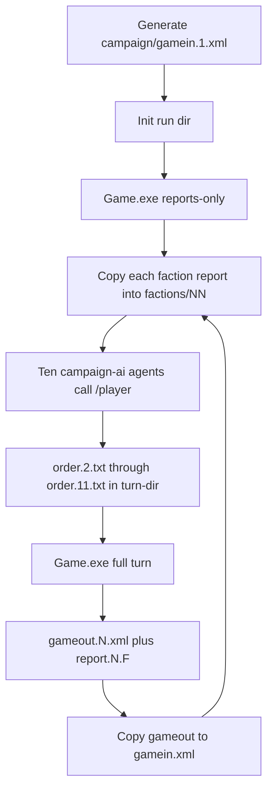

# Campaign load, gamein.1, CLI play, AI factions

Last updated: 2026-08-29

Design seed is in [designer/galaxy.md](../../designer/galaxy.md): factions 1–13, Rootfast/Crusthold, Helios Gate `P00009` ↔ Fomal Gate `P00010`. Catalog has `adpnt` and combat `weapon-group`/`resists` in [campaign/data.xml](../../campaign/data.xml). Environment bands: [designer/environments.md](../../designer/environments.md). Combat ladders: [designer/combat-balance.md](../../designer/combat-balance.md).

**In scope engine TDD (this plan):** `JUMP`, body gravity/temp/atmosphere, typed combat, AU×drive space duration, system XYZ load, **hull groups beyond frigate**.

**Already in the engine (do not TDD):** region and moon-region exits, including `<exit orbit="O…">` ([Galaxy.LoadExits](../../Game/data%20structures/Galaxy.cs) + `loadGalaxyExits`). Campaign XML should keep using those; no second pass over orbit elements.

**Still out of scope:** hostility-flip Events, militia yearly raids, item `attack` in `ModuleStack.Attack` (unless a typed-combat test needs it).

Tick matching rows in [designer/engine-wishlist.md](../../designer/engine-wishlist.md) when each slice lands.

## Constraints

- TDD owns C# / `Tests/`. Designer owns `campaign/` XML and the generator. `/player` owns order drafts and manuals. Architecture docs under `architecture/`.
- Engine loads catalog as `data.xml` and state as `gamein.xml` ([Game/game/DataFile.cs](../../Game/game/DataFile.cs) `LoadGameDocument` hardcodes `gamein.xml`). Orders are every `order.*` in `/turn-dir` ([Game/orders/OrdersReader.cs](../../Game/orders/OrdersReader.cs)). Reports are `report.{turn}.{faction}.txt` plus `.xml` when `xml-report` is true.
- `Game.Execute()` increments `Turn` then runs 13 weeks. A starting snapshot **cannot** come from a full exe run: SampleGame writes `report.1.*` by calling `GenerateReports` **without** `Execute`. Program.Main has no such path today.
- `/player` manuals currently track `Tests/data.xml`. Campaign play must point the player agent at `campaign/data.xml` without overwriting SampleGame manuals.

## Target play loop

## Todos

- [x] Unit test: `LoadConfiguration` against `campaign/data.xml`; fix catalog if load throws
- [x] Python generator + committed `campaign/gamein.1.xml` from `galaxy.md` (factions 1–13, Gates, militias, HQs)
- [x] Test `LoadGame` of campaign catalog + `gamein.1.xml` (systems, Gates, Rootfast/Crusthold, 10 HQs)
- [ ] TDD `/reports` only (`GenerateReports`, no `Execute`). Scripts copy `gamein.N.xml` → `/data/gamein.xml`; do not relocate gamein into `/turn-dir`
- [ ] `play/runs` layout, gitignore, init/reports/isolate/turn/next PowerShell + README
- [ ] campaign-ai + campaign-gm Cursor agents; persona prefs; isolated reports; `/player` with campaign catalog
- [x] TDD `JumpOrder`: `JUMP` pair-id, 1 week, ships only, `pair=` on `<alderson>`; no 1-week corona MOVE
- [ ] TDD load gravity/temperature/atmosphere; shuttle `h2o2` surcharge; frigate land ban; high-g upkeep; cold/hot settlement gates
- [ ] TDD load `weapon-group`/`resists`/`armor-module`; matchup table; armour 5× `hitWeight` + no capture; shield 90% intercept. SampleGame stays flat (no attrs)
- [ ] TDD space MOVE duration from ΔAU × catalog drive speed (same-system planet/moon orbits); replace hardcoded 1-week and `NotImplemented` planet–planet
- [ ] TDD `LoadGalaxy` assigns system X Y Z (uncomment); round-trip save; reports show coords. Empty systems `X=4+`
- [ ] TDD hull groups `corvette`/`destroyer`/`cruiser`/`capital`/`ark`; Parse/ToToken; `IsShipHull` helper; campaign catalog groups; SampleGame stays `frigate`
- [ ] `player/campaign/basic_technologies.md` from `campaign/data.xml`; `/player` refresh `rules.md` (`JUMP`, space MOVE ETA, hull groups) and `battle.md` typed combat; architect `campaign-play.md`
- [ ] New branch `cursor/campaign-load-play`; commit; push `-u`; `gh pr create` against main (not stacked on SampleGame turn 5)

## 1. Prove the campaign catalog loads

Unit test in `Tests/` (namespace `UnitTests`): `DataFile.LoadConfiguration` with [campaign/data.xml](../../campaign/data.xml) (use existing `LoadConfiguration(confDir, dataFile)`). Assert planet type `adpnt` exists, uniqueness check passes, no unknown module groups.

If load throws (name collision, bad `group`, unknown `location-type`), **fix `campaign/data.xml`**, not `Tests/data.xml`.

## 2. Generate `campaign/gamein.1.xml`

Designer-owned Python generator [campaign/_gen_gamein.py](../../campaign/_gen_gamein.py) emitting Windows-1251 XML from [designer/galaxy.md](../../designer/galaxy.md) / [designer/xml-schema.md](../../designer/xml-schema.md):

- `<game turn="1">`, factions 1–13 (UN, players 2–11, Arbor First 12, HCS 13). Player passwords generated at init-run time or seeded placeholders documented in the run folder.
- Helios + Fomal full Arbor/Anvil grids, UN + militia + HQ stacks. Gates emit `pair=` for `JUMP`. Planetary regions do not exit to Gates. **Do not** emit a 1-week corona-to-corona MOVE. Do **not** bake 8/13/26 week space durations once AU×drive is green (formula owns ETA).
- System `X Y Z` on every `<system>` (Helios 0,0,0; Fomal 1,0,0; empty `X` 4+).
- Body attrs on planets/moons per [designer/environments.md](../../designer/environments.md) (`gravity` `temperature` `atmosphere`).
- Same-system pockets as landing stubs; empty systems SS0003–SS0010 condensed; **no** empty-system APs; **no** unknown contract triggers (only live `give-module` / `research` from [designer/contracts.md](../../designer/contracts.md)).
- Commit both the generator and `campaign/gamein.1.xml`.

Load test (unit or a small `IntegrationTests.Campaign` fixture, **not** SampleGame goldens): load campaign catalog + `gamein.1.xml`, assert 10 systems, Gates `P00009`/`P00010`, Rootfast `120001` on `R00014`, Crusthold `130001` on `R00060`, 10 player `corphq` stacks. Round-trip save is optional and must not become a SampleGame-style golden unless `/player` + human approve.

## 3. CLI: keep live file names, add `/reports` only

Live `Game.exe` 0.1.144:

- `/data` holds **`data.xml` + `gamein.xml` + `gameout.{turn}.xml`**. There is no `gamein.N.xml` loader. Scripts **copy** `campaign/gamein.1.xml` → `play/.../gamein.xml`. Do **not** TDD moving gamein into `/turn-dir`.
- `/turn-dir` holds **`order.*` in** and **`report.{turn}.{faction}.*` out**. Glob is `order.*` (`order.2.txt`); SampleGame `orders.1.2.txt` does **not** match. Encoding Windows-1251. Clear stale `order.*` before each run.
- `Execute` does `turn++` first: seed `turn="1"` then a full run writes **`report.2.*`** and **`gameout.2.xml`**.
- `/no-turn` does not write reports. `/check` is a stub.

The only justified Program TDD: **`/reports`** — load, `GenerateReports`, **do not** `Execute`. That is how SampleGame produces starting `report.1.*`. Do not seed `turn="0"` to fake report.1 (that would run a blank quarter and change the world).

Never point `/data` at `campaign/` for a live run (would write `gameout` into the catalog tree). Copy `campaign/data.xml` into the run’s `/data` folder.

## 4. Run folder and scripts

Gitignore `play/runs/` (keep `play/README.md`). Layout:

- `play/runs/<id>/` — live `gamein.xml`, `order.*`, `gameout.*`, `report.*`
- `play/runs/<id>/factions/02` … `11/` — **only** that faction’s reports, `persona.md`, and drafted orders (isolation boundary)

PowerShell scripts (Windows-first, matching this repo):

- `play/init-run.ps1` — copy `campaign/data.xml` and `campaign/gamein.1.xml` into the run `/data` as `data.xml` / `gamein.xml`; assign each of 10 players a random preference (`military` | `economic` | `researcher` | `contractor`); write `persona.md` (password, preference, explore → exploit → conquer; win solitary or by **mutual** `DECLARE FACTION <id> ALLY`).
- `play/reports.ps1` — `Game.exe /data <run>/data /turn-dir <run>/turn /reports`
- `play/isolate.ps1` — copy **text** `report.{turn}.{faction}.txt` into `factions/NN/` only (XML reports leak foreign cargo/techs; never give faction `1` XML)
- `play/turn.ps1` — clear old `order.*`, copy ten `order.{id}.txt` into `/turn-dir`, `Game.exe /data ... /turn-dir ...`, then isolate
- `play/next.ps1` — copy `gameout.{N}.xml` → `gamein.xml` for the next exe run

NPC factions 1/12/13 submit no `order.*` until a later GM/raid slice.

Document the exact exe command lines in [play/README.md](../../play/README.md) and this file.

## 5. AI player agents

Do **not** create ten near-duplicate agent files. Two Cursor agents:

- [`.cursor/agents/campaign-ai.md`](../../.cursor/agents/campaign-ai.md) — invoked **once per faction**. Workspace for that call is `play/runs/<id>/factions/NN/` plus `player/rules.md` and a **campaign** L0–L1 excerpt. Forbidden: `gamein.xml`, `gameout.xml`, other factions’ reports, `campaign/gamein.1.xml`. Feed **text** reports only. It writes a short **story** then **calls `/player`** with: faction id, password, report path, catalog `campaign/data.xml`, objective from the story. `/player` drafts UTF-8; host copies must be Windows-1251 `order.{id}.txt` in `/turn-dir`.
- [`.cursor/agents/campaign-gm.md`](../../.cursor/agents/campaign-gm.md) — orchestrator: init/reports/isolate, launch ten campaign-ai tasks, collect orders, run `turn.ps1`, check crude win (all other player HQs gone, or a bloc where **both** sides have `DECLARE FACTION … ALLY` and everyone else is gone). No C#. Alliance is one-way until both declare.

Preference mapping (live verbs only, from [player/rules.md](../../player/rules.md)):

- **military** — `inftry`/`tanks`, `ATTACK`/`CAPTURE`/`DECLARE ENEMY`, then `JUMP` via Gates; typed weapons vs shields/armour when researching military techs
- **economic** — `USE` extract/farm, `BUY`/`SELL` at UN markets, spaceport trade
- **researcher** — `RESEARCH`, wreck charters, `SEE`/`COPY`
- **contractor** — UN `CONTRACT` / `give-module` jobs first, then trade

Shared doctrine in the persona: explore local hinterland and Gate → exploit complementary resources (Arbor organics vs Anvil metals) → conquer (militia after flip, then other corps) or ally.

`/player` prompt must say **campaign catalog**, not `Tests/data.xml`. Add [player/campaign/basic_technologies.md](../../player/campaign/basic_technologies.md) from `campaign/data.xml`. After engine slices: docs-only refresh of [player/rules.md](../../player/rules.md) (`JUMP`) and [player/battle.md](../../player/battle.md) (matchups, armour, shields). Do not replace SampleGame manuals’ catalog path.

## 6. Engine TDD slices (in scope)

Unit tests, owned fixtures under `Tests/fixtures/` if the world must not be SampleGame. **Do not** retune `Tests/data.xml` or SampleGame goldens. Campaign attrs already exist; SampleGame catalog has no `weapon-group` so battles stay flat dice.

### JUMP

Live. Spec: [designer/galaxy.md](../../designer/galaxy.md) Alderson section.

- `<alderson pair="P00010">` with an orbit and no corona region.
- `JUMP <pair-id>` while the stack is on that Gate’s orbit. Duration **1 week** (long order). Ships only (`shuttl`, `frigate`, `spacecraft`). Arrival is the pair’s orbit.
- Planetary regions do not exit to Gates. Reaching a Gate is AU×drive (wishlist).

### Body gravity / temperature / atmosphere

Spec: [designer/environments.md](../../designer/environments.md). Planet/Moon already have an unused **numeric** `temperature`; add **band** fields (`low|normal|high`, `habitable|cold|hot`, `none|thin|terair|hostile`) so the Kelvin leftover is not overloaded. Defaults if omitted: gravity `normal`, temperature `cold`, atmosphere `none`.

- `LoadGalaxy` reads attrs on planet/moon; round-trip save.
- Shuttle `h2o2` surcharge on solid-surface ↔ orbit `MOVE` (table in environments.md); fail if cargo short. Same charge both directions when atmosphere is present; low/none vacuum hop is 0.
- `frigate` (and larger hulls) cannot use solid-surface exits if body `atmosphere` ≠ `none`.
- Quarterly: `gravity="high"` → +50% cash upkeep (round up); populated habitats +2 food.
- Settlement `USE` / place: `cold` needs `clddom` (or nested `cryhab`); `hot` needs `hotdom`; `habitable` uses `city`/`popcnt` as today.

Generator emits Arbor/Anvil/Selene/Scoria/Pyre/moons per the environments default table.

### Typed combat

Spec: [designer/combat-balance.md](../../designer/combat-balance.md) matchup table + wishlist armour/shield rows. Campaign modules already emit `weapon-group`, `resists`, `armor-module`.

- Load those attrs on `ModuleType` (CatalogLoader fill-pass). Missing attr → current flat `attack`/`defense`/`damage` (protects SampleGame).
- `Battle.getChance` / shot damage: attacker `weapon-group` vs defender stack `resists` (laser vs shield, kinetic vs armour, missile vs pbpd, drone vs ew). Strong/weak modifiers as the balance doc; +2 tech-level capture-in-10 still the acceptance check on **campaign** stats.
- Armour (`armor-module` / `resists="armour"`): `hitWeight` ×5; capture damage ignored / cannot complete capture on armour-only modules.
- Shield (`resists="shield"`): intercept **90%** of incoming shot damage; remainder uses normal hit-weight. Track shield HP depletion.

### Hull groups beyond frigate

Spec: [designer/combat-balance.md](../../designer/combat-balance.md) hull table; [designer/engine-wishlist.md](../../designer/engine-wishlist.md); [designer/xml-schema.md](../../designer/xml-schema.md).

Today [EModuleTypesGroup](../../Game/data%20structures/EModuleTypesGroup.cs) and [ModuleTypeGroupXml.Parse](../../Game/game/ModuleTypeGroupXml.cs) only know `frigate`. Unknown `group` throws on catalog load. Campaign hulls (`corhul` `deshul` `cruhul` `arkhul`) currently emit `group="frigate"`.

- Add enum + Parse/ToToken: `corvette` `destroyer` `cruiser` `capital` `ark`. Patrol `sshull` stays `frigate` (SampleGame).
- Shared helper `IsShipHull` (frigate ∪ new groups ∪ type `shuttl`) for `JUMP`, atmosphere land ban, and nesting checks that today test `== frigate` ([ModuleStack](../../Game/data%20structures/ModuleStack.cs) ~1220).
- After Parse is green: set campaign catalog groups (`corhul`→corvette, `deshul`→destroyer, `cruhul`→cruiser, `arkhul`→ark or capital). **Do not** change `Tests/data.xml`.
- RESEARCH GROUP tokens / reports: round-trip the new names. Capacity `group=` on regions unchanged.

### AU × drive space duration

Spec: [designer/engine-wishlist.md](../../designer/engine-wishlist.md) “Space transit time from ΔAU × drive `speed`”; bands in [designer/galaxy.md](../../designer/galaxy.md) travel table.

Today [MoveOrder.movementDuration](../../Game/orders/MoveOrder.cs): same-body region↔orbit is hardcoded **1 week**; planet↔moon orbits use a mass-capacity hack; **planet↔planet orbits throw `NotImplementedException`**. Catalog `move speed` is already loaded ([CatalogLoader](../../Game/game/CatalogLoader.cs)); ground already divides exit duration by `Mover.Speed`.

- Intra-system space `MOVE` (orbit↔orbit, and region↔orbit when parents differ): `duration = ceil(f(|ΔAU|) / driveSpeed)` using the stack’s space `move` speed, not mass/capacity.
- Tune `f` so L0–L2 chemical matches the table (inner 0.5–2 AU → **8–13** weeks; gas giant ~5 AU → **13+**; spaceport→Gate 80 AU → **13** order-of; L10 ark inner → **2–4**). Same-body surface↔local orbit stays **0–1** (surcharge is the environment slice).
- Inter-system Helios↔Fomal is **`JUMP`**, not AU. The 26-week Pad chemical hop is optional leftover `MOVE` via long ΔAU if both spaceports stay linked; prefer JUMP for the intended crossing.
- Tests: owned fixture with two planets at known AU; shuttle vs high-speed drive. Do not change SampleGame goldens unless a 1-week local hop assertion breaks — keep local same-planet region↔orbit at 1 week.

### System XYZ load

[Galaxy.LoadXml](../../Game/data%20structures/Galaxy.cs) currently comments out `system.Coordinates.X/Y/Z`. Save and [SpaceSystem.ReportName](../../Game/data%20structures/SpaceSystem.cs) already emit them.

- Uncomment assign on `<system>` (star XYZ optional, not required).
- Round-trip: load Helios `(0,0,0)`, Fomal `(1,0,0)`, empty `X>=4`; save keeps values.
- No FTL from XYZ this slice. Reports show coordinates so AIs can see the map layout.

## 7. Out of scope for this implementation

- Hostility-flip Events, yearly militia raids, multi-reward / `capture-stack` contracts.
- A second `LoadExits` pass over `<orbit>` elements (region/moon `exit orbit=` already works).
- Changing SampleGame goldens or `Tests/data.xml`.
- Engine victory flag.

## Suggested implementation order

TDD catalog load → TDD XYZ load → TDD hull groups (enum + campaign catalog) → TDD environments → TDD AU×drive → TDD JUMP (use `IsShipHull`) → TDD typed combat → generator + `gamein.1.xml` → TDD galaxy load → TDD `/reports` → play scripts → campaign-ai / campaign-gm → `/player` manuals + architect delivery note → **new PR**.

## 8. New pull request

Do **not** open this work as a continuation of `cursor/sample-turn5-execution` (SampleGame turn 5). After the slice is green locally:

1. Create branch `cursor/campaign-load-play` from the commit that contains this work (or from `main` and bring the files if this branch is mixed).
2. Commit only campaign/engine/play/agent files for this plan (no SampleGame golden replacements, no `Tests/data.xml` retune).
3. `/player` docs-only manuals refresh, then `git push -u origin HEAD`.
4. `gh pr create` against **main** with:
   - Title: campaign load, JUMP/environments/combat/hulls, play loop
   - Body: summary bullets (catalog + `gamein.1`, CLI `/reports`, AU×drive, XYZ, hull groups, AI agents) and a test plan (unit catalog/galaxy load, JUMP/MOVE duration, typed combat fixture, SampleGame still green, `Game.exe /reports` smoke).

If `gh` auth fails (as on an earlier designer push), stop and give the human the push/PR commands — do not force-push.
