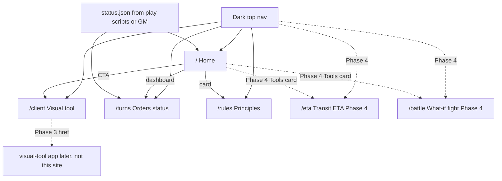

# Public campaign website — implementation plan

Last updated: 2026-08-29  
Decision: [ADR-0007](../adr/ADR-0007-public-campaign-website.md)

This is the **product brief and implementation plan** for a public SpaceAge lobby site. It is **not** the engine, **not** the visual tool, and **not** a built site. Do not create `website/` source from this document unless you are the website implementer executing a later phase.

Player-facing flavour lives in [`Game/documentation/Rules.txt`](../../Game/documentation/Rules.txt). Operational play-loop checkboxes live in [`campaign-play.md`](campaign-play.md) (owned by the campaign/designer track — **do not edit that file from this workstream**).

## Purpose

Give players and observers a **closed PBEM lobby**:

1. Explain what SpaceAge is (Alderson flavour + PBEM loop in this engine’s terms).
2. Credit lineage (Atlantis, Rise of Heroes, Vincent Archer) on the home page.
3. Show **orders-submission status** for the ten player factions (2–11).
4. Link to the **visual tool** (a separate product) when it exists; until then, a Client page with a placeholder.
5. **Later (Phase 4):** two **client-side planning tools** — an AU transit ETA calculator and a two-side battle simulator. Requested 2026-08-29; see [Phase 4 — Player tools](#phase-4--player-tools-feature-requests).

The site is a **content lobby**, not a signup mill and not a report browser. Phase 4 tools never host `report.*` or `gamein.xml`; they run in the browser on **user-entered** text and numbers.

## In scope

| In | Notes |
|----|--------|
| Public pages listed below | Few routes, mobile-friendly, hard-science / space aesthetic |
| Flavour excerpt + attribution | Shortened from Rules.txt §§1, 1.1, 2.1 — do not invent a different origin myth |
| Orders-status widgets | Driven by a **status JSON file**, never by calling `Game.exe` |
| Visual-tool CTA and `/client` page | Link / placeholder only |
| Phase 4: `/eta` transit calculator | Client-side only; paste **text** ship report + two AU-from-star fields → weeks |
| Phase 4: `/battle` what-if simulator | Client-side only; user-entered units/tactics, both sides → round log + winner |
| Static hosting | GitHub Pages (preferred) or Cloudflare Pages / Netlify |
| Folder `website/` at repo root | Separate from `Game/`, `Tests/`, `campaign/`, `play/` |

## Out of scope

| Out | Why |
|-----|-----|
| Implementing the visual tool | Separate product ([`visual tool prompt.txt`](../../visual%20tool%20prompt.txt)); Phase 3 only **turns the link on** |
| `Game.exe` HTTP/SMTP/DB, or retargeting off net48 | [ADR-0001](../adr/ADR-0001-net48-legacy-csproj.md), [ADR-0003](../adr/ADR-0003-filesystem-pbem-batch.md) |
| Serving `gamein.xml`, `gameout.*.xml`, `data.xml`, order files, or reports | Secrets and foreign intel |
| Open “Join Game Now” signup | Closed 10-player campaign (factions 2–11); NPC 1 / 12 / 13 submit no orders |
| Dumping the full rulebook | Excerpt flavour; later link to `player/rules.md` |
| Serving or storing pasted reports | Phase 4 `/eta` parses in the browser and **discards** the paste; never POST, never write `report.*` |
| Porting `Battle.cs` / calling `Game.exe` for the sim | `/battle` is a documented-formula what-if, not the engine |
| Cloning Atlantis hex art, Bootstrap-default look, Discord-only community, Ukraine banner | Information architecture only |
| Engine TDD / C# / `campaign/` XML | Other agents |
| Editing [`campaign-play.md`](campaign-play.md) | Sibling designer track owns the play-loop todo there |

**Play-loop checkbox:** whether `play/runs/<id>/` scripts exist and can emit status JSON is tracked on [`campaign-play.md`](campaign-play.md). Website Phase 2 waits on that checkbox; this plan does not duplicate or tick it.

## Product stance — closed lobby

SpaceAge campaign play is a **closed PBEM lobby** for ten Interests (factions **2–11**). NPC factions **1 / 12 / 13** never appear as order-submission rows. There is no public account creation, no password reset, and no “join the game” form.

Say this on the home page (short, visible): the campaign is invitation-only; the site is for players and observers of that table.

## Information architecture (Atlantis review, 2026-08-29)

Reviewed [Atlantis New Origins](https://atlantis-pbem.com/) for **structure**, not look. Adopt:

- Dark top nav + light content cards on a dark/space page background.
- Hero: preview of the **client / visual tool** beside a short “what is PBEM” blurb + primary CTA (Client, not “sign up”).
- Live **status dashboard**: Game Status, Total Players (10 seats), Turn Number, Next Turn (countdown or “when the GM runs the turn”).
- Secondary cards: community (only if we have a real channel — do not invent Discord), **visual tool / client**, **rules**. Phase 4 adds a **Tools** card (ETA + battle).
- Footer meta: engine version (`0.1.x`), game start date, turn schedule.
- Separate **Game Client** page vs public home.
- Separate **Players & Turns** surface for who has submitted orders.

Do **not** copy fantasy hex art or an open-enrollment CTA.

### Atlantis widgets → SpaceAge widgets

| Atlantis home | SpaceAge home / turns |
|---------------|------------------------|
| Game Status | `status` from status JSON (`accepting-orders` / `processing` / `reports-out` / `not-started`) |
| Total Players | Fixed **10** player seats (factions 2–11), not a growing signup count |
| Turn Number | Engine turn (`gamein` `<game turn="N">` as published by scripts) |
| Next Turn countdown | `nextTurnAt` if the GM set a wall-clock deadline; else “GM-scheduled” |
| Join Game Now | **Omitted.** Replace with “Closed campaign” + Client / Turns CTAs |
| Game Client card | Visual tool CTA → `/client` (placeholder until Phase 3) |
| Rules card | `/rules` excerpt + pointer to `player/rules.md` when published |
| Discord / community | Optional; omit until a real channel exists |
| Players & Turns | `/turns` — per-faction **orders submitted: yes/no** only |
| *(none — add in Phase 4)* | **Tools** card → `/eta` (transit ETA) and `/battle` (what-if fight) |

## Pages

| Route | Purpose |
|-------|---------|
| `/` | Concept, flavour excerpt, **required attribution**, status dashboard, Client + Turns + Rules cards |
| `/client` | Visual tool: what it is, screenshot/placeholder, launch/download link (Phase 3) or “coming later” (Phases 1–2) |
| `/turns` | Players & Turns: ten seats, submitted / missing, turn number, next deadline |
| `/rules` | Short principles (Open PBEM, Interests, quarterly reports). Link out to `player/rules.md` / Rules.txt — **do not** paste the book |
| `/eta` | **Phase 4.** Transit time calculator (ship-report paste + two AU-from-star). See [Phase 4](#phase-4--player-tools-feature-requests) |
| `/battle` | **Phase 4.** Two-side battle what-if. Same section |

Phase 1 ships only `/`, `/client`, `/turns`, `/rules`. Do not add `/eta` or `/battle` until Phase 4.

All pages share the dark nav, light cards, and footer (engine version, start date, schedule). Mobile: collapse nav; cards stack.

### Site map



## Home-page copy outline (required)

Shorten; do not rewrite the origin myth. Source: [`Game/documentation/Rules.txt`](../../Game/documentation/Rules.txt) (Alderson V 1.5). Website copy should be UTF-8 even though game files are Windows-1251.

### Attribution (visible on home, not footer-only)

> Original ideas are taken from **Atlantis** and **Rise of Heroes**, and influenced by **Vincent Archer**. Archer wrote a 1998 generic PBEM engine used by Overlord and then Rise of Heroes (1999–2000), intended for Atlantis-like games. SpaceAge / Alderson sits in that family. SpaceAge is a **spiritual successor**, not those games.

Keep a visible link to [https://overlord.sourceforge.net/](https://overlord.sourceforge.net/) near this block.

### Flavour — §1 Introduction (Rules.txt ~lines 6–27)

Lead with:

> A long, long time ago, in a galaxy far, far away…  
> Or maybe in our future, here, in the Milky Way?

Then: Alderson theorised **weak points** in space-time at the **fringes of gravity wells**. From those points one could jump to another. The experimental **Alderson Drive** sent an expedition more than **750 light-years** — and back the next week — in the wink of an eye. Today those Points link the galaxy. Resources await explorers, traders, operators, and captains.

### Flavour — §1.1 In-game history (Rules.txt ~lines 30–108)

Condense, keep these beats:

1. Points are stable wormhole-class anomalies; the Drive enlarges them so a dense ship can jump if the Point sits inside its structure.
2. Points form in star systems but only far out (the **Alderson Corona**): near enough a sun to form, far enough not to tear apart.
3. Humanity rushed the Points; wars followed; an Imperium rose.
4. In a single day the Points **shut down**. Commerce died; colonies starved; more than 28% of the Imperium’s population died in months.
5. After four months, Points **reopened** — mostly the old links, some new. Contact never resumed with 10% of systems.
6. **Two Points that led to Earth stayed dark.** Radio from Sol dwindled to silence. Astronomy showed no nuking, no orbital wreck. Only the **Fear** remains.

### Principles — §2.1 The game (Rules.txt ~lines 113–137), in SpaceAge terms

Rules.txt describes weekly email and a generic “game server.” This engine is file-in / file-out ([ADR-0003](../adr/ADR-0003-filesystem-pbem-batch.md)):

- SpaceAge is an **Open PBEM** of galactic strategy: no forced victory condition; players set their own goals (settlers, explorers, traders, warlords).
- Each player is an **Interest** (corporation, association, fleet, or all of the above) — factions **2–11**.
- One engine **turn** is one **in-game quarter**: `Game.Execute()` runs **13 weeks**, then writes per-faction reports.
- Players receive a **quarterly report**, discuss, and send back an **order file** (`order.{faction}.txt`, Windows-1251). The GM or `play/` scripts collect files and run `Game.exe`.
- Reports go back out as `report.{turn}.{faction}.*`. The website never hosts those files.

### Hero “what is PBEM” (one short card)

Play-by-email / play-by-file: you do not log into a live sim. You read last quarter’s report (text today; visual tool later), write orders, and wait for the next processed turn.

Primary CTA: **Open the client** → `/client`. Secondary: **Turn status** → `/turns`.

## Visual design notes (for implementers, not a built stylesheet)

- **Hard science / space**, not fantasy hex: deep navy / near-black, thin teal or amber accents, readable off-white body text, light cards (`#f4f1ea` or similar) so long flavour is easy to read.
- Hero may show a **star-map / client mock** (screenshot or CSS placeholder), never an Atlantis hex map.
- Typography: a readable humanist sans for body; optional condensed/display face for titles. Avoid blackletter and “parchment.”
- Mobile-first cards; dashboard is a 2×2 grid that stacks.
- Do not ship Bootstrap defaults or an Atlantis theme clone.

Design tokens may later be shared with the visual tool (optional). **MVP does not require a shared package.**

## Technology choice

**Winner: Astro (static output) + hand-written CSS + TypeScript only where needed (e.g. a countdown island).**

Recommend current stable Astro from npm (`npm create astro@latest`), `output: 'static'`. No SSR adapter in MVP. No React/Vue on the public lobby unless a single island needs it.

Folder: **`website/`** at the repository root. The engine stays `Game/` + `Tests/` on net48. Do not add a `Game` project reference, do not import C#, do not parse Windows-1251 XML in Node.

### Why Astro

1. **Fit.** A few content pages and a JSON-backed dashboard is a static site. Astro’s default is zero JS; a countdown can be one island.
2. **Deploy.** `astro build` is plain HTML/CSS/JS for GitHub Pages / Cloudflare Pages / Netlify. The GM does not run PHP or IIS.
3. **Later coexistence.** The visual tool may be a React app. Astro can host a link (and later an island) without pulling the engine into Node or forcing one SPA for both products. Shared tokens are a Phase 3+ option, not a coupling.

### Alternatives considered

| Option | Verdict |
|--------|---------|
| Vite + vanilla HTML/CSS/TS | Rejected for MVP. Fine for one page; weaker multi-page content, layouts, and markdown than Astro. |
| Next.js static export | Rejected. App-router weight and Vercel gravity for a four-page lobby. |
| Plain HTML, no bundler | Rejected. Copy/layout drift across pages; no typed status JSON at build time. Acceptable only as an emergency fallback. |
| PHP / Laravel Atlantis clone | Rejected. Implies a PHP host; copies the wrong stack and look. |
| ASP.NET on net48 / Kestrel next to `Game.exe` | Rejected. Violates [ADR-0003](../adr/ADR-0003-filesystem-pbem-batch.md); couples lobby uptime to the engine CLR. |
| UI embedded in `Game.exe` | Rejected. New product surface must stay off the batch host. |
| CMS (WordPress, etc.) | Rejected. Closed lobby, few pages, no editorial workflow that justifies a CMS. |

### Stack constraints for the website implementer

- TypeScript is allowed **inside `website/`**.
- Do not add `Game` to a Node solution or compile C# from the site build.
- Status JSON is UTF-8. Game files remain Windows-1251 ([ADR-0002](../adr/ADR-0002-windows-1251-io.md)).
- **Phase 4 exception (client only):** the ETA island may parse a **user-pasted UTF-8 text** ship-report excerpt in the browser. It must not read `gamein.xml`, `data.xml`, or `report.*.xml` at build time or from disk. Treat the textarea as untrusted input; never persist it.
- CSS: one or two files under `website/src/styles/`. No CSS-in-JS. Tailwind is optional and not required.
- Keep dependencies few (`astro` + types + the test tools below). No auth libraries.

## Testing (website only — not NUnit)

Engine tests stay in `Tests/` (NUnit 4, Mono). **Do not** add website cases to `Tests.dll` or run `astro` under `.cursor/run-tests.sh`. Website tests live in `website/` and run with Node.

Astro’s own guide names **Vitest** for unit/component tests and **Playwright** for end-to-end ([Testing](https://docs.astro.build/en/guides/testing/), retrieved 2026-08-29). That is the stack.

| Layer | Tool | What it proves |
|-------|------|----------------|
| Typecheck | `astro check` (`@astrojs/check` + TypeScript) | Templates and islands type-check; `status.json` types stay aligned |
| Unit | **Vitest** via Astro `getViteConfig()` | Status schema (exactly factions 2–11, allowed `status` enum, **no** password/email/path keys), countdown/`nextTurnAt` formatting, any TS helpers |
| Component (optional) | Vitest + Astro **Container API** (`experimental_AstroContainer`) | A card/table renders expected strings without a browser. Skip until there is a reusable `.astro` component worth isolating |
| End-to-end | **Playwright** against `astro build` + `astro preview` | Phase 1: four routes exist; home has flavour + **Atlantis / Rise of Heroes / Vincent Archer**; `/turns` shows ten seats; `/client` is a placeholder then a live href; dashboard reads `/status.json`; mobile viewport (one width, e.g. 390px). Phase 4: `/eta` and `/battle` (WS-010…WS-012) |

**MVP commands** (document in `website/package.json`): `npm run check`, `npm test` → `vitest run`, `npm run test:e2e` → `playwright test`. Playwright `webServer` should be `npm run preview` on `http://localhost:4321/` after a build, not the Vite dev server.

**MVP browser matrix:** Chromium only. Firefox/WebKit are optional later; a four-page static lobby does not need three engines on day one.

**Security assertions (Playwright or Vitest on the published JSON):** response body / fixture must not contain passwords, `gamein`, `order.`, or `report.` paths.

### Alternatives rejected

| Option | Why not |
|--------|---------|
| NUnit / `Tests.dll` | Wrong runtime (net48/Mono). Website is Node. |
| Jest | Overlaps Vitest; Astro is Vite-native, so Vitest is the documented default |
| Cypress / Nightwatch | Astro documents them; extra runner and UI for four routes. Playwright is the documented e2e default and matches a later visual-tool app |
| Storybook / Percy visual regression | Optional later; not required to ship the lobby |
| Testing Library + React | No React on the public lobby unless a single island appears |

Phase 2 PowerShell that **writes** `status.json` is tested with **Pester** next to `play/` (or a Vitest fixture of sample JSON), not by calling `Game.exe`.

**Who runs which layer:** `/website-developer` owns `astro check` + Vitest. `/website-tester` owns the [scenario catalog](website-scenarios.md) and Playwright. Pairing, handoff, and the done gate are in [Cursor agents and test pairing](#cursor-agents-and-test-pairing). **Do not** treat a human clicking around in a browser as acceptance.

## Status-data contract

`Game.exe` has **no HTTP API**. Status is a file the GM or `play/` scripts already can write.

**Canonical public file:** `website/public/status.json` (copied into the static build as `/status.json`).

**Producer (Phase 2):** a PowerShell step in `play/` (e.g. after isolate / before announce) that inspects `play/runs/<id>/` for `order.2.txt` … `order.11.txt` (or the run’s agreed names) and writes **only** the schema below. Until that script exists, the GM may hand-edit the committed JSON.

Phase 1 ships a **committed placeholder** `status.json` (`not-started` or `accepting-orders` with all `ordersSubmitted: false`).

### Schema (v1)

```json
{
  "schemaVersion": 1,
  "engineVersion": "0.1.x",
  "gameName": "Space Age",
  "runId": "optional-public-label",
  "status": "not-started",
  "turnNumber": 1,
  "playerCount": 10,
  "gameStartDate": "2026-09-01",
  "turnSchedule": "GM-scheduled; one wall-clock window per in-game quarter (13 weeks).",
  "nextTurnAt": null,
  "factions": [
    { "id": 2, "displayName": "Faction 2", "ordersSubmitted": false }
  ]
}
```

| Field | Rules |
|-------|--------|
| `status` | One of `not-started` \| `accepting-orders` \| `processing` \| `reports-out` |
| `turnNumber` | Integer the GM/scripts publish (the turn players are writing orders **for**, or the last completed — pick one and document it in the JSON comment / README; recommend **orders-due-for this turn**) |
| `playerCount` | Always 10 for this campaign |
| `nextTurnAt` | ISO-8601 UTC or `null` (“GM-scheduled”) |
| `factions` | Exactly ids **2–11**. `displayName` may be the public corp name. **No passwords, emails, or report paths** |
| NPC 1 / 12 / 13 | **Absent** |

The site **fetches `/status.json`** at runtime (small island or `fetch` on `/` and `/turns`) so a GM can update JSON and rsync/commit without a full content rebuild — **or** import it at build time if the deploy always rebuilds after the script. Prefer **runtime fetch** of the static file so Phase 2 is “write JSON + publish file.”

Do not derive status by parsing `gamein.xml` in the browser or in Astro.

## Visual-tool integration

The visual tool is a **separate** product: Stellaris-inspired report/XML client (star map, unit tree, order editing, warnings). MVP of that tool is multi-window, Atlantis Advisor–like ([`visual tool prompt.txt`](../../visual%20tool%20prompt.txt)). It consumes XML reports; the **website only links**.

| Phase | `/client` behaviour | Href |
|-------|---------------------|------|
| 1–2 | Placeholder: purpose, “not built yet,” screenshot/mock | `#` disabled or in-page anchor; do not 404 |
| 3 | Link live | **Placeholder now:** `/visual-tool/` (same origin, later app) **or** absolute `https://play.example/visual-tool/` when hosted separately |

Document the chosen href in `website/` README when Phase 3 lands. Do not implement map, unit tree, or order editors in `website/`.

## Phase 4 — Player tools (feature requests)

Requested 2026-08-29. **Not Phase 1.** Do not scaffold these routes until Phases 1–2 (lobby + status JSON) exist. Same bounded context: Astro static pages + TypeScript **islands**. Still no `Game.exe`, no React unless a later named deviation, no hosted reports.

Home gets a **Tools** card. Nav adds **ETA** and **Battle**. Scenario ids: `WS-010`, `WS-011`, `WS-012` (seeded in [`website-scenarios.md`](website-scenarios.md)).

These are **planning aids**. Label both pages: estimates follow published engine formulas; the next processed turn is authoritative.

### `/eta` — Time required / transit ETA

**User goal:** paste a ship from last quarter’s **text** report, enter two orbital radii, see weeks to MOVE.

| Input | Rules |
|-------|--------|
| Ship report paste | One textarea. Parse the owner-visible mass line: `mass: {thrust}/{mass}` (engine: `MassCapacity` / `Mass`, e.g. `mass: 40000/4150`). Optional: `movement speed: … in space` for display only. If the mass pair is missing, show a parse error and allow **manual** thrust + mass |
| Distance | **Two AU-from-star** numbers (origin, destination). ΔAU = \|AU₂ − AU₁\|. This is the Helios/Fomal geometry ([`designer/au-transit.md`](../../designer/au-transit.md)): Arbor/Anvil = 1.0, Gates = 80. Optional **presets** (planet→moon 0.04, belt 1.7, gas giant 4.2, Gate 79) may fill the two fields; they must not replace the two-AU model |
| Drive speed | Dropdown or number. Default **1** (L2 fusion torch). Chemical / hydrolox **0.5**. Do not infer catalog speed by scraping `data.xml` |

**Formula** (port to TypeScript; Vitest against the locked table in `au-transit.md`):

```
load = thrust / max(mass, 1)
referenceLoad = 40000 / 4150
massFactor = clamp(load / referenceLoad, 0.67, 1.50)
effectiveSpeed = catalogSpaceSpeed * massFactor
weeks = SpaceTransit.DurationWeeks(ΔAU, effectiveSpeed)
```

`DurationWeeks` is `Game/game/SpaceTransit.cs`: moon hops (ΔAU below 0.1) use `max(1, ΔAU × 50)`; else `8 + 6 × (ΔAU / (ΔAU + 0.8))`; then `ceil(weeksAtSpeedOne / speed)`. Same-body surface↔orbit stays **1 week** (checkbox or ΔAU ≈ 0). `JUMP` is out of scope.

**Output:** integer **weeks** (ETA in-game), plus ΔAU, thrust/mass, mass factor, effective speed. Optional: helium-3 hint (`2 × weeks` for `fustor`) as copy, not a fuel sim.

**Must not:** upload the paste; store it; parse XML reports; read `gamein.xml` / `data.xml`; treat the result as a GM-scheduled wall-clock date.

### `/battle` — Two-side what-if

**User goal:** enter units and tactics on **both** sides; the page plays out rounds and shows a winner or indecisive end.

| Input | Rules |
|-------|--------|
| Sides | Two columns: Attackers / Defenders. Each side is a list of combatants the user adds |
| Combatant | Name; quantity; attack; defense; damage; hit points; optional immobile; **tactic** (`destroy` default, `capture`, `evade`; optional prioritize `armed` / `command` / `storage`) |
| Catalog | **User-entered stats** for MVP. A later committed UTF-8 **combat-stats excerpt** (public module attack/defense/damage/HP only — not `campaign/data.xml`) is optional. Never ship or fetch the live catalog |
| RNG | Seeded (`seed` field, default 1). Same seed + same roster → same log. Document that the engine uses `Sequence`; this tool is a **replayable estimate** |

**Loop** (document in the page; implement from [`player/battle.md`](../../player/battle.md), not from a C# import):

- Up to **10** rounds or until one side has no intact combatants.
- Initiative: lowest first (user-entered initiative, default 0).
- To-hit and damage per the live formulas (chance = attack/2; evade halves; immobile +50%; hit if roll ≤ chance; destroy vs capture split; wreck at HP).
- Evade: leave after **two consecutive** unhit rounds.

**Output:** a readable round log (who fires, chance, hit/miss, wreck/capture) and an end line: attackers win / defenders win / indecisive.

**Out of `/battle` MVP:** hangar launch, location scan, diplomacy / attitudes, third-faction sit-out, typed `weapon-group` matchup, shield intercept, nested stacks, officers, items-as-weapons, calling `Game.exe`. Those stay engine-only unless a later dated revision adds them.

### Phase 4 implementation notes

- Islands are **pre-approved** for these two pages (same as countdown / `status.json` fetch). Still no SSR, no accounts, no engine HTTP.
- Vitest owns formula helpers (`DurationWeeks`, mass factor, to-hit / damage). Playwright owns WS-010…WS-012 (page exists, sample paste/inputs produce the locked weeks or a finished log, paste is not in `status.json` or static HTML).
- `/website-developer` implements; `/website-tester` automates. Green e2e remains the done gate.

## Security

- **Never** publish passwords (they live in `gamein` / `#faction` lines).
- **Never** serve `gamein.xml`, `gameout.*.xml`, catalog `data.xml`, raw `order.*`, or `report.*`.
- **Never** leak foreign reports (XML reports especially — see campaign isolate rules).
- Status JSON is an **allow-list**. Scripts must not dump the run directory.
- No player accounts, cookies, or analytics that identify a faction unless the GM later asks (new ADR).
- Footer engine version is public and already appears on reports.
- Phase 4: pasted report text and battle rosters stay **in-memory in the browser**. No `localStorage` of full report bodies unless a later ADR allows it. No POST of pastes. WS-012 asserts the published origin still has no `report.` / `gamein` / `order.` files.

## Deploy target

**Preferred:** GitHub Pages from the `website/` static build (`astro build` → `dist/`).

Acceptable equivalents: Cloudflare Pages or Netlify, same artifact.

| Concern | Guidance |
|---------|----------|
| Project vs user Pages | If the site is a project page (`/<repo>/`), set Astro `base` accordingly |
| GM workflow | Build on CI or locally; commit or upload `dist/` + current `status.json` |
| Engine CI | `.cursor/install.sh` / Mono **must not** be required to build the site |
| Custom domain | Optional later; not MVP |

There is no production PHP/ASP.NET host.

## Phased implementation

### Phase 0 — Architecture (this work)

- [x] This plan, [ADR-0007](../adr/ADR-0007-public-campaign-website.md), index / module / tech / overview / dependency updates (2026-08-29)
- [x] Cursor agent/tester pairing contract + seed scenario catalog ([`website-scenarios.md`](website-scenarios.md)) (2026-08-29)

### Phase 1 — Static public site (`/website-developer` then `/website-tester`)

- [x] Scaffold Astro static app in `website/` (not under `Game/`) — developer, after reading this file + ADR-0007 + [`technology.md`](../technology.md) Website section (2026-09-09)
- [x] Layout: dark nav, light cards, footer meta (engine version placeholder, start date, schedule) (2026-09-09)
- [x] Home: flavour excerpt, **attribution block**, PBEM loop in SpaceAge terms, closed-lobby sentence, dashboard **wired to placeholder** `public/status.json` (2026-09-09)
- [x] `/client` placeholder, `/turns` table (ten seats), `/rules` short principles (2026-09-09)
- [x] Mobile-first CSS (tester proves WS-007 in Playwright; developer does not “explore in a browser” as the done path) (2026-09-09)
- [x] Developer: `astro check` + Vitest (status schema) → **handoff** to `/website-tester` (2026-09-09)
- [x] Tester: copy seed catalog to `website/e2e/scenarios.md`; Playwright Chromium vs `astro preview` for WS-001…WS-009 (2026-09-09)
- [ ] Deploy recipe (GitHub Pages) documented in `website/README.md`
- [x] Do **not** implement the visual tool

### Phase 2 — Orders-status feed from play scripts

- [ ] PowerShell in `play/` writes `website/public/status.json` (or copies onto the Pages artifact) from `play/runs/<id>/` order files
- [ ] Depends on the play-loop existing — **checkbox lives in [`campaign-play.md`](campaign-play.md)**, not here
- [ ] `/` and `/turns` consume the file; still no engine HTTP
- [ ] Confirm JSON never includes passwords or report bodies

### Phase 3 — Visual-tool link goes live

- [ ] Point `/client` CTA at the real visual-tool URL or `/visual-tool/`
- [ ] Optional screenshot from the real client
- [ ] Visual tool **implementation** remains a different agent / folder / host

### Phase 4 — Player tools (`/eta`, `/battle`)

Feature requests recorded 2026-08-29. Start only after Phase 1 exists (Phase 2 status feed is not a hard gate).

- [ ] `/eta`: paste parser for `mass: thrust/mass`, two AU-from-star inputs, `DurationWeeks` + mass factor, Vitest vs `au-transit.md` locked table
- [ ] `/battle`: two-side roster + tactics, seeded rounds, Vitest vs `player/battle.md` formulas
- [ ] Home Tools card + nav links; disclaimer that the next engine turn is authoritative
- [ ] Developer: `astro check` + Vitest → handoff. Tester: WS-010…WS-012 Playwright. Do **not** implement the visual tool here

## Ownership

| Role | Owns | Does not own |
|------|------|----------------|
| **Architect** | `architecture/` (this plan, ADR-0007, indexes) | `website/` source, C#, campaign XML |
| **Designer** | Flavour accuracy, public faction names, aesthetic notes, campaign fiction | Engine code; do not edit this file’s play-loop todos in `campaign-play.md` from the website stream |
| **TDD / engine** | `Game/`, `Tests/`, net48 behaviour | Website pages, Astro |
| **Play-script / campaign-play** | `play/` scripts, run layout; status JSON **producer** | Site chrome |
| **Website developer** (`/website-developer`) | `website/src/**` pages, layout, CSS, TS helpers, Vitest (`*.test.ts`), `astro check`, status JSON **types** + committed **placeholder** `public/status.json` | Playwright acceptance; restyling after handoff; visual tool app; `Game.exe`; `campaign-play.md` |
| **Website tester** (`/website-tester`) | Scenario catalog + Playwright specs + e2e fixtures (lobby **and** future user tools) | Lobby routes/CSS; inventing IA; implementing the visual tool |
| **Visual-tool implementer** (future) | Separate client (not inside `website/` pages) | Public lobby copy |

## Implementer reading order

1. This file (including [Cursor agents and test pairing](#cursor-agents-and-test-pairing)).
2. [ADR-0007](../adr/ADR-0007-public-campaign-website.md).
3. [`technology.md`](../technology.md) **Website** section.
4. [ADR-0003](../adr/ADR-0003-filesystem-pbem-batch.md) — why there is no engine API.
5. Rules.txt §§1, 1.1, 2.1 for copy — plus `player/rules.md` for a later `/rules` link, not for flavour.
6. Seed / live scenario catalog: [`website-scenarios.md`](website-scenarios.md) now; `website/e2e/scenarios.md` after Phase 1.
7. [`campaign-play.md`](campaign-play.md) **read-only** for run-folder facts (`play/runs/<id>/`, factions 2–11).

## Cursor agents and test pairing

Two Cursor roles, matching engine **csharp-tdd ↔ `/player`**: an implementer who follows architecture, and a tester who **defines and automates** acceptance. Cursor files exist: `.cursor/agents/website-developer.md`, `.cursor/agents/website-tester.md`, `.cursor/rules/website-astro.mdc`, `.cursor/rules/website-tester.mdc`. This document remains the pairing source of truth.

**Manual exploration of the site in a browser is not the acceptance path.** Outcomes are tested by `/website-tester` against the scenario catalog.

### Two roles, two agents, two rules

Recommended slash names: **`/website-developer`** and **`/website-tester`**. They match the Website bounded context ([ADR-0007](../adr/ADR-0007-public-campaign-website.md)) and house style (`/player`, `/project-architect`, `/game-designer`). Do not name the developer `/astro-*` — the role is the lobby (and later user-tool **compliance**), not a permanent stack nickname.

| Role | Agent file | Rule file | `alwaysApply` |
|------|-----------------------------|----------------------------|---------------|
| Developer | `.cursor/agents/website-developer.md` | `.cursor/rules/website-astro.mdc` | **`false`** (file-scoped) |
| Tester | `.cursor/agents/website-tester.md` | `.cursor/rules/website-tester.mdc` | **`false`** (file-scoped) |

Do **not** fire these rules on `Game/` or `Tests/`. Engine pairing stays `.cursor/rules/csharp-tdd.mdc`.

#### Recommended globs

**`website-astro.mdc`** (production + unit tests only):

```
website/src/**
website/public/**
website/**/*.test.ts
website/astro.config.*
website/tsconfig*.json
```

- Vitest lives next to helpers (`website/src/**/*.test.ts`) or under `website/tests/**/*.test.ts` (covered by `website/**/*.test.ts`).
- **Exclude** Playwright by location: e2e **must** live in `website/e2e/`, not under `src/`.
- Do **not** glob `architecture/**` (architect-owned). The developer **reads** this file; they do not own it.
- `website/package.json`: dual-touch (developer: `check`, `test` → Vitest, app deps; tester: `test:e2e`, `@playwright/test`). Prefer **not** putting `package.json` on either always-fire glob; document the split in both agent files.

**`website-tester.mdc`** (catalog + e2e only):

```
website/e2e/**
website/**/*.spec.ts
website/playwright.config.*
architecture/delivery/website-scenarios.md
```

After Phase 1, `website/e2e/scenarios.md` is already covered by `website/e2e/**`. Keep the architecture seed path so the rule still applies before `website/` exists.

**Future user-tool glob (do not add until the folder exists):** when `/project-architect` names the visual-tool (or other player-facing web tool) directory, append that app’s `e2e/**` (and its scenario file) to `website-tester.mdc`. Same tester, same catalog discipline. Never put the Stellaris-style client inside `website/` lobby pages.

### Architect compliance gate (like csharp-tdd)

`/website-developer` reads **this file**, [ADR-0007](../adr/ADR-0007-public-campaign-website.md), and [`technology.md`](../technology.md) **Website** section **before** scaffolding `website/` or changing the stack.

Delegate **`/project-architect` first**, then **wait**, when the request would add:

- a **new public page** beyond `/`, `/client`, `/turns`, `/rules`, and the Phase 4 pair `/eta` `/battle`;
- a **new runtime** (SSR adapter, React/Vue island, player accounts, cookies, engine HTTP/SMTP/DB);
- a **new npm dependency** beyond the approved list (below).

`/eta` and `/battle` are **approved Phase 4 routes** (this file, 2026-08-29). Implementing them before Phase 1, or expanding `/battle` into a `Battle.cs` port, still needs a dated revision.

**Approved MVP dependencies:** `astro` (current stable, `output: 'static'`), TypeScript, `@astrojs/check`, Vitest (`getViteConfig()`), `@playwright/test` (tester-owned). Tailwind is **pre-approved but not required**. No auth libraries.

Copy and flavour accuracy remain **designer-owned**. The developer excerpts Rules.txt per this plan; they **do not invent a new origin myth**. If copy vs Rules.txt is disputed, stop for `/game-designer` and the human — do not “improve” the Alderson history.

#### Deviation / human-approval wording (copy into `website-astro.mdc`)

If the intended change **diverges** from `architecture/delivery/website.md`, [ADR-0007](../adr/ADR-0007-public-campaign-website.md), or `architecture/technology.md` (Website section), **stop**. Do not silently deviate. Present the gap (what architecture says vs what the request or code would do). Require **explicit human approval of this deviation** before writing the diverging code.

Approval must name **this** deviation (e.g. “approve SSR for the lobby”, “approve adding React”, “approve engine HTTP”). Plan “next” / “continue” / “lgtm” on a different step is **not** deviation approval.

After an explicit yes: `/project-architect` records an ADR or a dated revision in the affected architecture file **before** or **in the same change** as the code. Do not ship diverging code against an unchanged baseline.

### Developer vs tester split

| | `/website-developer` | `/website-tester` |
|--|----------------------|-------------------|
| **Owns** | `website/src/**` pages, layout, CSS, TS helpers; Vitest `*.test.ts`; `astro check`; status JSON **types**; committed **placeholder** `public/status.json` (schema only — not the `play/` producer) | **Scenario catalog** + Playwright specs + e2e fixtures |
| **Does not** | Treat Playwright as their acceptance suite; declare done by exploring the site in a browser; restyle after handing off; add routes without the architect gate; implement the visual tool | Restyle the lobby; add routes; invent IA; write production `.astro`/CSS except fixtures the spec needs |
| **May** | Run Vitest while coding (red–green for helpers/schema) | Update catalog rows when a vertical slice changes observable acceptance |
| **Done when** | Handoff checklist (below) is complete — **not** when the page “looks fine” | Done-gate checklist (below): **green Playwright** |

After each **vertical slice**, the developer **handoffs to `/website-tester`**. The tester updates scenarios if needed, writes or adjusts Playwright, runs `astro build` + Playwright. Failures go **back to the developer**. Green e2e is the **done gate**.

### Scenario catalog (canonical path)

| When | Path | Role |
|------|------|------|
| **Now** (no `website/` yet) | [`architecture/delivery/website-scenarios.md`](website-scenarios.md) | Seed source of truth |
| **Phase 1+** | **`website/e2e/scenarios.md`** | **Canonical** acceptance catalog. Tester moves or copies the seed here and maintains it |

The catalog is the **source of truth** for acceptance. Each row: **id**, user goal, route(s), given / when / then, Vitest vs Playwright layer, security check if any. Specs cite ids (`WS-001`, …).

Seeded lobby ids (maintain in the catalog, not by inventing parallel lists in code): `WS-001` home flavour + credits; `WS-002` closed lobby; `WS-003` status dashboard; `WS-004` `/turns` ten seats (2–11 only); `WS-005` `/client` placeholder then live href; `WS-006` `/rules` principles not rulebook; `WS-007` mobile nav/cards; `WS-008` no secret leak; `WS-009` four routes + chrome. Reserved Phase 4: `WS-010` `/eta`; `WS-011` `/battle`; `WS-012` tools leak bar. Reserved **`UT-*`** visual-tool rows: see the catalog (link to [`visual tool prompt.txt`](../../visual%20tool%20prompt.txt)).

### User tools

**User tools** = the visual tool **and** the Phase 4 lobby islands (`/eta`, `/battle`). `/website-tester` owns those e2e scenarios. The Stellaris-inspired client stays a **separate folder** when it exists — do **not** put it inside `website/` lobby pages. Phase 3 only turns the `/client` href on. Phase 4 **does** live in `website/` (static islands).

### Modern Astro techniques (copy into `website-astro.mdc`)

Prefer official docs: [Astro](https://docs.astro.build/en/getting-started/), [Astro testing](https://docs.astro.build/en/guides/testing/) (linked from [`docs-index.md`](../docs-index.md)).

- **Content-first pages**; Astro `output: 'static'`. No SSR adapter in MVP.
- **Islands only when interactivity is required** (countdown / `fetch` of `/status.json`; Phase 4 `/eta` and `/battle`). Default is zero client JS.
- **Typed `status.json`**: TypeScript type + Vitest schema tests (factions 2–11, `status` enum, forbidden secret keys).
- **Accessible HTML**: `nav`, heading rank, buttons that are real `<button>` / `<a>` — not clickable `div`s.
- **CSS files**, not CSS-in-JS; mobile-first under `website/src/styles/`.
- **No React/Vue** unless `/project-architect` + **human** approved (deviation wording above).
- **No engine XML parse in Node** (no `gamein.xml` / 1251 reports in the site build). Phase 4 may parse **user-pasted UTF-8 text** in the browser only.
- **`astro check` + Vitest green before handoff** to `/website-tester`.
- Keep dependencies few; no auth libraries.

### CI note

Website test commands stay in **`website/package.json`** (`check`, `test` → Vitest, `test:e2e` → Playwright). Engine **`.cursor/run-tests.sh` stays NUnit-only**. Do **not** merge pipelines, add `astro` to Mono install, or put website cases in `Tests.dll`.

### Developer handoff checklist (to `/website-tester`)

The developer does **not** run Playwright as acceptance and does **not** declare the slice done from a browser tour. After a vertical slice, hand off with:

1. Architecture still matches (or a recorded ADR / dated revision + human yes for a named deviation).
2. Routes and files touched; catalog ids that should already apply (`WS-001`…).
3. `astro check` green; `vitest run` green (schema / helpers).
4. Placeholder `public/status.json` still schema-valid; no new secret keys.
5. Copy is excerpted from the plan / Rules.txt — no new origin myth.
6. Known gaps (placeholder href, missing screenshot, Phase 2 producer not started).
7. Prompt `/website-tester`: update catalog if acceptance changed; write or adjust Playwright; run `astro build` + `playwright test`.

### Tester done-gate checklist

`/website-tester` defines and maintains scenarios; automation is the path.

1. Catalog is current (`website-scenarios.md` until Phase 1, then `website/e2e/scenarios.md`). Every new spec has a row.
2. Playwright specs cite scenario ids; Chromium vs `astro preview` after `astro build` (not the Vite dev server).
3. `npm run test:e2e` (or equivalent) **green** for the slice’s ids. Failures return to `/website-developer` with the failing id and assertion — tester does not “fix” lobby CSS/routes.
4. WS-008 (and per-row security lines) still hold on HTML + `/status.json`.
5. No manual-exploration sign-off. **Green e2e is the done gate.**
6. User-tool `UT-*` rows stay reserved until that app exists; do not implement the visual tool to get a green lobby.

## Revision

- 2026-08-29: Initial plan. Astro + static JSON status. Visual tool linked, not built.
- 2026-08-29: Website tests = `astro check` + **Vitest** + **Playwright** (Chromium, preview of static build). Not NUnit.
- 2026-08-29: Cursor pairing — `/website-developer` + `/website-tester`; seed catalog [`website-scenarios.md`](website-scenarios.md); green e2e is the done gate.
- 2026-08-29: Created `.cursor` agent and rule files from this contract.
- 2026-08-29: Phase 4 feature requests — `/eta` transit calculator (report paste + two AU-from-star) and `/battle` two-side what-if. Client-side only; not Phase 1.
