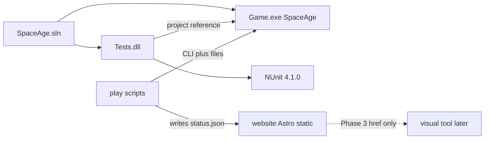

# Dependency map

Last updated: 2026-08-29

SpaceAge-2024 is a **single repository**. There are no sibling application repos and no runtime package feeds other than nuget.org. The planned public lobby (`website/`) is in this repo but **not** part of `SpaceAge.sln`.

## Projects

| From | To | Contract |
|------|----|----------|
| `Tests` | `Game` | Compile-time project reference; tests construct `DataFile` / `Game` in-process |
| GM / mailer (external, not in repo) | `Game.exe` | CLI + files: `/data`, `/turn-dir`, reports with `To:` headers |
| `play/` scripts (Phase 2) | `website/public/status.json` | UTF-8 JSON allow-list (factions 2–11, submitted yes/no). **No** `Game` project reference |
| `website/` | status JSON + static host | Fetches `/status.json`; does not call `Game.exe`. Phase 4 `/eta` `/battle` are browser-only |
| `website/` `/client` | visual tool (future) | Href only (`/visual-tool/` placeholder) |
| Cursor Cloud | this repo | Checkout + `.cursor/install.sh` (engine only; site is Node/Astro when built) |

Do not add a second engine repo or a shared “core” library unless an ADR splits the solution.

## NuGet (nuget.org)

See [`../technology.md`](../technology.md) for pins. NUnit and its net48 transitives (`System.Runtime.CompilerServices.Unsafe`, `System.Threading.Tasks.Extensions`) are restored from `Tests/packages.config` only. `Game` has an empty `packages.config`.

## Filesystem contracts (integration surface)

Documented in [`../modules-and-integrations.md`](../modules-and-integrations.md). Engine: no HTTP, no message bus, no database. Website: static files plus published `status.json` ([ADR-0007](../adr/ADR-0007-public-campaign-website.md)).
