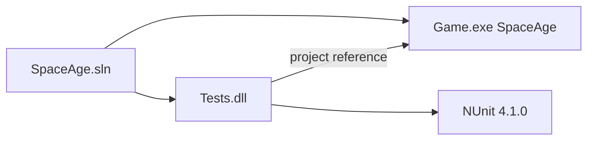

# Dependency map

Last updated: 2026-08-19

SpaceAge-2024 is a **single repository**. There are no sibling application repos and no runtime package feeds other than nuget.org. Do not split a second engine repo. PBAI agents and (target) visualization are **consumers of the same file contracts**, not a new engine distribution.

## Projects

Target visualization, if added, should be a **separate** folder or future project in this repo (or a later ADR-gated project). It must not become a second `Game.exe`.

| From | To | Contract |
|------|----|----------|
| `Tests` | `Game` | Compile-time project reference; tests construct `DataFile` / `Game` in-process |
| `/player` agent | engine file contracts + `player/` | Reads `report.*` / optional XML / manuals; writes `order.*` or `player/drafts/` and wishlists. Does not run a second engine |
| `/game-designer` agent | `designer/` then `campaign/` | Catalog/galaxy/contracts XML; `engine-wishlist.md` for TDD. Same `data.xml` / `gamein.xml` shapes |
| Visualization (target, not present) | engine file contracts | Read-only consume of `report.*`, `gameout`, catalog. No HTTP inside `Game.exe` |
| GM / mailer (external, optional) | `Game.exe` | CLI + files: `/data`, `/turn-dir`, reports with `To:` headers. PBEM-compatible wrap; not the product default |
| Cursor Cloud | this repo | Checkout + `.cursor/install.sh` |

Do not add a second engine repo or a shared “core” library unless an ADR splits the solution.

## NuGet (nuget.org)

See [`../technology.md`](../technology.md) for pins. NUnit and its net48 transitives (`System.Runtime.CompilerServices.Unsafe`, `System.Threading.Tasks.Extensions`) are restored from `Tests/packages.config` only. `Game` has an empty `packages.config`.

## Filesystem contracts (integration surface)

Documented in [`../modules-and-integrations.md`](../modules-and-integrations.md). No HTTP, no message bus, no database. [ADR-0007](../adr/ADR-0007-pbai-product-loop.md) wraps this surface; it does not replace it.

## Revision

- 2026-08-19: Agents and target viz as file-contract consumers. Still one repo. Mailer marked optional / PBEM-compatible.
