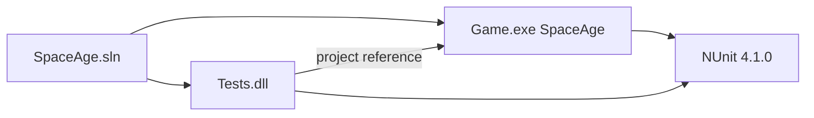

# Dependency map

Last updated: 2026-08-16

SpaceAge-2024 is a **single repository**. There are no sibling application repos and no runtime package feeds other than nuget.org.

## Projects

| From | To | Contract |
|------|----|----------|
| `Tests` | `Game` | Compile-time project reference; tests construct `DataFile` / `Game` in-process |
| GM / mailer (external, not in repo) | `Game.exe` | CLI + files: `/data`, `/turn-dir`, reports with `To:` headers |
| Cursor Cloud | this repo | Checkout + `scripts/cloud-install.sh` |

Do not add a second engine repo or a shared “core” library unless an ADR splits the solution.

## NuGet (nuget.org)

See [`../technology.md`](../technology.md) for pins. Both projects restore the same `packages.config` set. Transitive packages (`System.Runtime.CompilerServices.Unsafe`, `System.Threading.Tasks.Extensions`) exist only to run NUnit 4 on net48.

## Filesystem contracts (integration surface)

Documented in [`../modules-and-integrations.md`](../modules-and-integrations.md). No HTTP, no message bus, no database.
