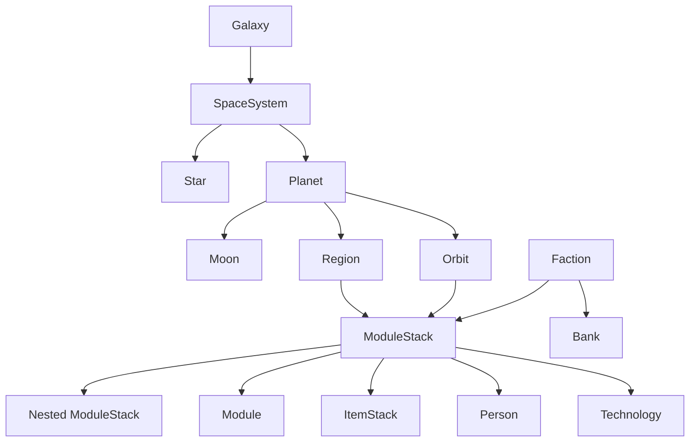
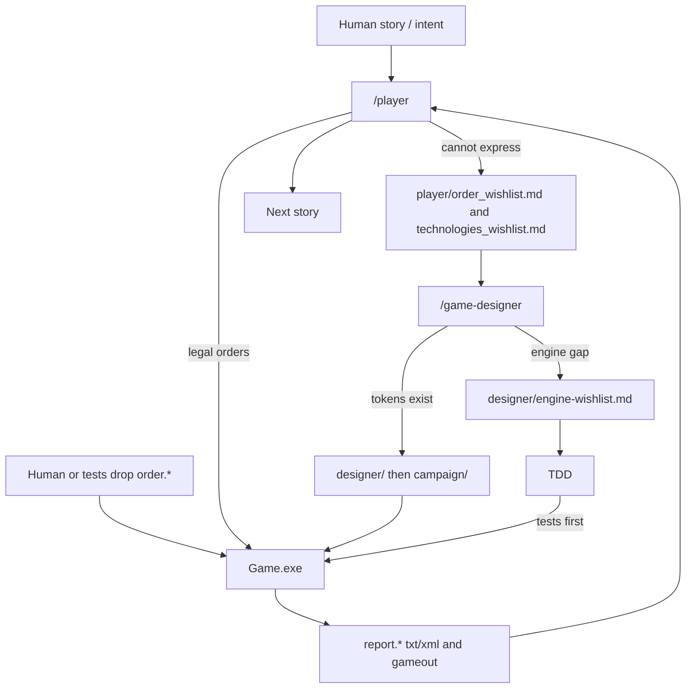
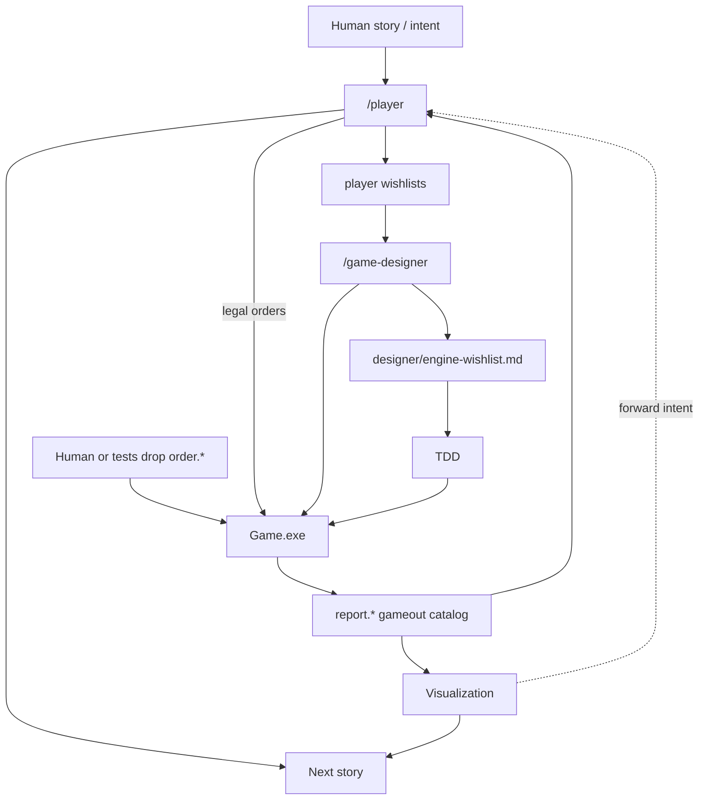
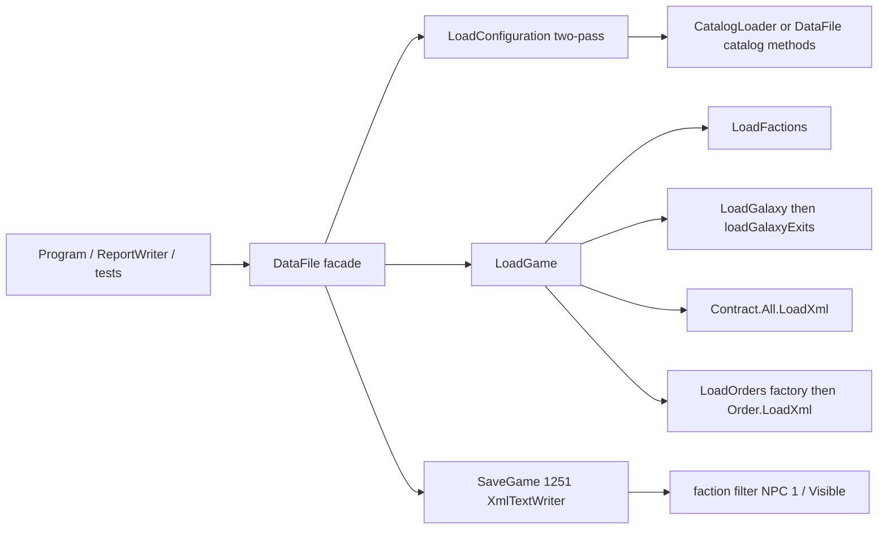
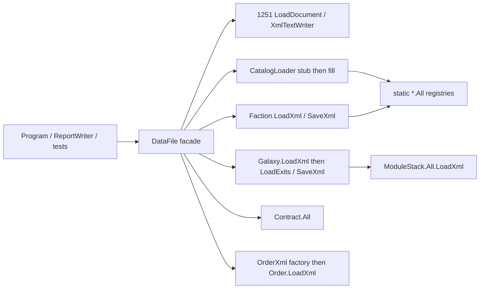
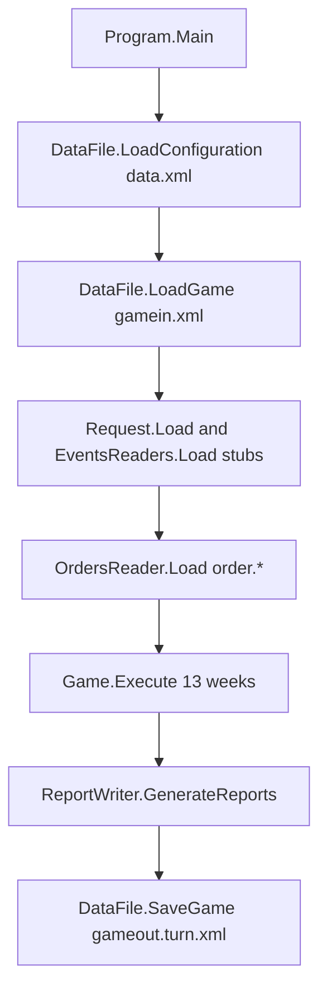

# SpaceAge-2024 — modules and integrations

Last updated: 2026-08-19

Engine types live in namespace `SpaceAge`. Folders under `Game/` are **bounded contexts by ownership**, not separate assemblies. Agents and (target) visualization are **additional bounded contexts** in this repo; they are not extra C# projects yet.

## Modules

| Module | Path | Owns | Talks to |
|--------|------|------|----------|
| **Host** | `Game/Program.cs`, `Game.cs` | CLI (`/data`, `/turn-dir`, `/check`), turn orchestration, `EngineVersion` | DataFile, OrdersReader, ReportWriter, stub Events/Request |
| **Persistence** | `Game/game/` | `DataFile` (host/test facade), `XMLProcessing` (1251 XML), `Sequence` RNG, `Market`, `Bank`. Target collaborators per [ADR-0006](adr/ADR-0006-datafile-facade-and-xml-seams.md): `CatalogLoader`, `OrderXml`, `ModuleTypeGroupXml`; faction/galaxy instance XML on those types | Catalog + game XML; fills static `*.All` registries. Host and tests talk to `DataFile` only |
| **Orders** | `Game/orders/` | Parse `order.*`, condition graph, weekly execute (immediate then one long) | `IOrderable` subjects (`Faction`, `ModuleStack`, `Person`); spawns **Effects** |
| **Effects** | `Game/effects/` | Timed activities (`Producing*`, `Moving`, `Training*`, `Receiving*`, damage/fuel) | `IEffectable` on stacks/persons; runs after orders in the week |
| **Battle** | `Game/battle/` | Combat instance, field, units, tactics | Triggered from movement/attack; reports via `IBattleReporting` |
| **Reports** | `Game/reports/` | `ReportWriter`, line wrapping, event lines | Reads world + `DataFile` for faction-filtered XML sidecar |
| **World model** | `Game/data structures/` | Galaxy graph, factions, stacks, items, techs, offers | Used by every other module via `*.All` and object references |
| **Tests** | `Tests/` | Unit and SampleGame integration | Project reference to `Game`; filesystem fixtures |
| **Player agent** | `.cursor/agents/player.md`, `player/` | Live manuals, drafts, syntax/tech wishlists; translates **intent** → legal `order.*` | Reads `report.*` (txt/xml), manuals, parser/catalog as needed. Does not write C# or campaign XML |
| **Game-designer agent** | `.cursor/agents/game-designer.md`, `designer/`, `campaign/` | Galaxy, tech tree, catalog, contracts; `designer/engine-wishlist.md` for engine gaps | Writes design docs then live XML when tokens exist. Does not write C# or `Tests/**` |
| **Visualization (target)** | **Not present.** Future folder or project (open: `viz/` vs new csproj) | Read-only (or near-read-only) story of the world from engine artifacts | Consumes `report.*`, optional XML report, `gameout`, catalog. Must not reimplement rules. Must not write orders except forwarding intent to `/player` |

### World object graph



### Anti-patterns to avoid

- **Do not** introduce a second live `Game` instance without resetting `*.All` (`ClearDictionaries`).
- **Do not** add a database, HTTP API, or SMTP sender without an ADR — the integration surface is files.
- **Do not** collapse unit and SampleGame tests into one fixture style; keep golden files in `Tests/SampleGame/`.
- **Do not** parse orders with a different encoding than 1251.
- **Do not** silently add order types to `OrdersReader` without the matching XML load/save path in `DataFile` / `OrderXml` (today `research` / `see` already diverge — fix both sides together).
- **Do not** convert folders into C# namespaces as a drive-by refactor.
- **Do not** bypass the `DataFile` facade from `Program`, `ReportWriter`, or tests (`new CatalogLoader()` / `Galaxy.LoadXml` as a second public persistence API). Extracts construct collaborators inside `DataFile`.
- **Do not** change Windows-1251 (`loadXmlDocument` / `XmlTextWriter` with `Encoding.GetEncoding(1251)`).
- **Do not** collapse catalog two-pass (`LoadConfigurationItems(true)` then `(false)`); stubs must exist before `requires` / `use-produce`.
- **Do not** change faction XML-report filter semantics: name `"1"` is NPC (unfiltered); skip factions with no stacks; visibility uses existing `Visible(faction)`.
- **Do not** opportunistic-split `DataFile` outside [ADR-0006](adr/ADR-0006-datafile-facade-and-xml-seams.md) phases, and do not split the rest of `ModuleStack` (ADR-0005).
- **Do not** “complete” the capacity save switch (`research` group) or rewrite moon/exit save quirks in the same PR as an extract.
- **Do not** let an LLM invent live order verbs or patch C# from a story beat — wishlist (`player/order_wishlist.md`) instead.
- **Do not** put visualization or LLM logic in `Game.Execute` (or fold viz into `ReportWriter` as a second rules engine).
- **Do not** have `/game-designer` write C# or `Tests/**`.
- **Do not** have agents hand-edit `gameout.*` as a substitute for `Game.exe`.

## Agent / orchestration (PBAI)

Dated: 2026-08-19. Decision: [ADR-0007](adr/ADR-0007-pbai-product-loop.md). Engine pipeline below is unchanged.

Humans may **skip** `/player` and drop `order.*` files directly (tests always do).

### Interim (current, 2026-08-19)

Agents exist; visualization does not. Humans and `/player` read txt/xml reports. Optional external mailer may still wrap the same files (PBEM-compatible).



### Target (visualization added; engine still file-batch)

Same loop. A **new** presentation context consumes engine artifacts. It does not execute turns. Optional: forward human intent to `/player`. PBEM mailer remains optional compatibility.



## Persistence (`DataFile`)

Dated: 2026-08-18, engine `0.1.141`. Seams: [ADR-0006](adr/ADR-0006-datafile-facade-and-xml-seams.md).

`DataFile` is the **only** persistence entry point for the host and tests: `new DataFile(dir)`, `LoadConfiguration()`, `LoadGame()`, `SaveGame()` / `SaveGame(dir, file, faction)`, plus the granular methods tests already call. Encoding stays 1251.

Catalog load is two-pass because types cross-reference. Game load is ordered: factions → galaxy (objects, then exits) → contracts → orders. Save applies an optional faction filter for XML reports (`ReportWriter`); faction name `"1"` clears the filter.

### Interim (current code, and after catalog/order extracts)



### Target (after ADR-0006 phases)



`CatalogLoader` and `OrderXml` are internal collaborators, not a second API. `Galaxy` stays a domain type with collection-style XML (like `Contracts`), not a new `GalaxyLoader` god class.

## Turn pipeline (current)

Dated: 2026-08-18, engine `0.1.141`.



**`/check <file>`** skips the turn and calls `OrdersReader.Check` (currently a stub). PBAI does not change this CLI. Promoting `/check` to validate AI-drafted orders is future work, not this pivot.

### `Game.Execute()` (inner)

1. Increment `Turn`.
2. For `Week` 1..13: clear long/immediate executed flags → `ExecuteOrders()` (factions, then stacks until idle, then persons until idle) → `ProcessBuyOffers()`.
3. After weeks: `ClearUnformed()`, `UpdateBankAccounts()`, `UpdateRates()`, `GenerateOffers()` (several economy methods are incomplete/TODO).

### Order execution (`Orders.Execute`)

Per subject per week: all pending **immediate** orders → at most one **long** order → immediate again → drop non-repeating executed orders. Prefix `+`/`-` builds a condition tree; `@` is unlimited repeat.

## File contracts

Encoding: **Windows-1251** for all of the following. XML declaration: `encoding="windows-1251"`. Unchanged by [ADR-0007](adr/ADR-0007-pbai-product-loop.md). PBAI, optional mailer, and target viz **consume or produce** these files; they do not add engine I/O.

| File | Directory | Direction | Role |
|------|-----------|-----------|------|
| `data.xml` | `/data` game dir | in | Static catalog (`<entry>` under star/planet/moon/region/item/race/skill/technology/module) |
| `gamein.xml` | game dir | in | `<game turn="N">` factions, galaxy, persisted `<orders>` |
| `order.*` | `/turn-dir` | in | Text orders (`#faction`, `#modulestack`, `#person`, `#end`; `;` comments) |
| `gameout.{turn}.xml` | game dir | out | Full state after the turn |
| `report.{turn}.{faction}.txt` | turn dir | out | Player report (To/Subject headers for an external mailer) |
| `report.{turn}.{faction}.xml` | turn dir | out | Faction-visible XML subset (when `xml-report` is enabled) |
| `error.log` | CWD | out | RELEASE-only uncaught exceptions (1251) |

There is **no** network, message bus, or shared database. Faction `email` is metadata for an optional GM mailer. Product default is PBAI (intent → `/player` → these files), not SMTP.

### Order text sketch

```
#faction <name> "<password>"
#modulestack <id>
<optional +/-><repeat|@><command> <args>
#end
```

Subjects implementing `IOrderable`: `Faction`, `ModuleStack`, `Person`.

## Test layers (architecture-aligned)

One test assembly: `Tests.dll`. Layers are **namespaces**, not extra `.csproj` files. Do not add `*.UnitTests` / `*.IntegrationTests` projects unless an ADR says so.

| Layer | Namespace | Typical scope | Placement |
|-------|-----------|---------------|-----------|
| **Unit** | `UnitTests` | Single type or small in-process collaboration; XML fixtures `Tests/data.xml` + `Tests/gamein.xml`, or owned copies under `Tests/fixtures/`; no SampleGame goldens | `Tests/T*.cs` (`TOrder`, `TUse`, `TGetGiveHas`, `TMove`, `TFormStack`, `TSee`, `TTrain`, `TDataFile`, `TBattle`, `TMarket` (includes `TContract` fixture), `TResearch`, `TConsume`, `TRepair`, `TDiplomacy`, `TModuleStack(s)`, `TPoint2D/3D`, `TNamedObject`, `TTests`) |
| **Module** | — | **Not used.** Do not invent a third layer. | — |
| **Integration** | `IntegrationTests` | Multi-file SampleGame turns, report goldens, program smoke | `Tests/SampleGame/` (`SampleGame`, `TProgram`), `Tests/TReport.cs` |

**Rules**

- Put new tests in **Unit** unless the behavior can only be proved by a full turn or golden report/XML — then **Integration**.
- Base helpers live on `TTest` (`compareFiles`, `executeOrder`, 1251 file load). Teardown must clear static registries.
- Load **committed** files only. SampleGame tests must not `copyFile` (or otherwise write) the next turn’s `gamein`. `_4a` / `_6a` may save a generated contract XML and compare it to the checked-in `gamein.2_contract.xml` / `gamein.3_contract.xml`; they must not be the next execute-turn’s runtime input unless that XML is already committed.
- Unit tests must not load `Tests/SampleGame/` worlds. Campaign-shaped cases live under `Tests/fixtures/` (for example `scout-declare/`, `has-order-production/`).
- There are **no** NUnit `[Category]` / `[Trait]` attributes today. Optional filters:
  - Unit: `--where "namespace == UnitTests"`
  - Integration: `--where "namespace == IntegrationTests"`
- Fast local/cloud default: **entire** `Tests.dll` (`.cursor/run-tests.sh` on Mono / `vstest.console` on Windows).
- Integration tests for SampleGame turns 4–5 are `[Ignore("not ready")]` — do not enable them without goldens. Turns 1–3 are independently runnable from committed `gamein` files.
- `DataFile` extracts (ADR-0006): characterize with `TDataFile` (unit) and SampleGame load/save goldens (integration). Do not add a third test layer.
- PBAI does not collapse layers. Tests continue to use **precise** order syntax. This ADR does not change SampleGame goldens.

## Stub / incomplete boundaries

Treat as **not live integrations** until implemented with tests:

| Type | Status |
|------|--------|
| `Request.Load` | Stub |
| `EventsReaders.Load` / `Events.Execute` | Stub |
| `OrdersReader.Check` | Stub |
| `Game.GenerateOffers` / `UpdateRates` | Stub (later market/economy PR) |
| Market auto-offers / transfer XML | Incomplete; `ProcessGenerateAutoOffers` ignored |
| SampleGame turns 4–5 | Ignored |
| Visualization | Not present (target context) |

## Revision

- 2026-08-18: Persistence seams for `DataFile` (ADR-0006). Interim/target diagrams; anti-patterns for facade, 1251, two-pass catalog, faction XML-report filter. Engine citation `0.1.141`.
- 2026-08-19: PBAI agent loop ([ADR-0007](adr/ADR-0007-pbai-product-loop.md)). Rows for player agent, designer agent, visualization (target). Interim vs target orchestration diagrams. Anti-patterns: no invented verbs, no viz in `Game.Execute`, designer does not write C#.
