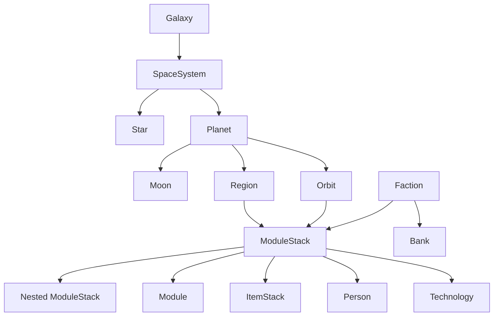
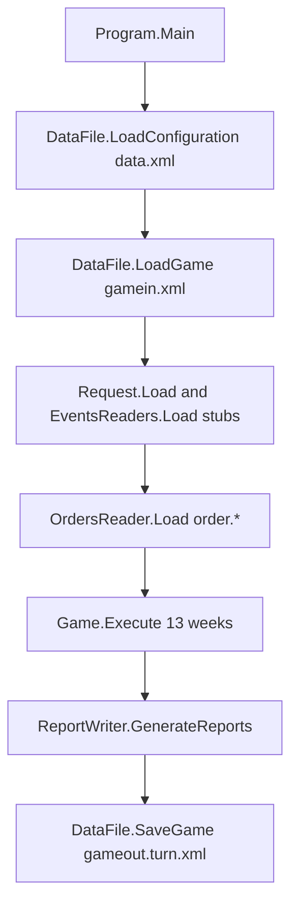

# SpaceAge-2024 — modules and integrations

Last updated: 2026-08-16

All engine types live in namespace `SpaceAge`. Folders below are **bounded contexts by ownership**, not separate assemblies.

## Modules

| Module | Path | Owns | Talks to |
|--------|------|------|----------|
| **Host** | `Game/Program.cs`, `Game.cs` | CLI (`/data`, `/turn-dir`, `/check`), turn orchestration, `EngineVersion` | DataFile, OrdersReader, ReportWriter, stub Events/Request |
| **Persistence** | `Game/game/` | `DataFile`, `XMLProcessing` (1251 XML), `Sequence` RNG, `Market`, `Bank` | Catalog + game XML; fills static `*.All` registries |
| **Orders** | `Game/orders/` | Parse `order.*`, condition graph, weekly execute (immediate then one long) | `IOrderable` subjects (`Faction`, `ModuleStack`, `Person`); spawns **Effects** |
| **Effects** | `Game/effects/` | Timed activities (`Producing*`, `Moving`, `Training*`, `Receiving*`, damage/fuel) | `IEffectable` on stacks/persons; runs after orders in the week |
| **Battle** | `Game/battle/` | Combat instance, field, units, tactics | Triggered from movement/attack; reports via `IBattleReporting` |
| **Reports** | `Game/reports/` | `ReportWriter`, line wrapping, event lines | Reads world + `DataFile` for faction-filtered XML sidecar |
| **World model** | `Game/data structures/` | Galaxy graph, factions, stacks, items, techs, offers | Used by every other module via `*.All` and object references |
| **Tests** | `Tests/` | Unit and SampleGame integration | Project reference to `Game`; filesystem fixtures |

### World object graph



### Anti-patterns to avoid

- **Do not** introduce a second live `Game` instance without resetting `*.All` (`ClearDictionaries`).
- **Do not** add a database, HTTP API, or SMTP sender without an ADR — the integration surface is files.
- **Do not** collapse unit and SampleGame tests into one fixture style; keep golden files in `Tests/SampleGame/`.
- **Do not** parse orders with a different encoding than 1251.
- **Do not** silently add order types to `OrdersReader` without the matching XML load/save path in `DataFile` (today `research` / `see` already diverge — fix both sides together).
- **Do not** convert folders into C# namespaces as a drive-by refactor.

## Turn pipeline (current)

Dated: 2026-08-16, engine `0.1.137`.



**`/check <file>`** skips the turn and calls `OrdersReader.Check` (currently a stub).

### `Game.Execute()` (inner)

1. Increment `Turn`.
2. For `Week` 1..13: clear long/immediate executed flags → `ExecuteOrders()` (factions, then stacks until idle, then persons until idle) → `ProcessBuyOffers()`.
3. After weeks: `ClearUnformed()`, `UpdateBankAccounts()`, `UpdateRates()`, `GenerateOffers()` (several economy methods are incomplete/TODO).

### Order execution (`Orders.Execute`)

Per subject per week: all pending **immediate** orders → at most one **long** order → immediate again → drop non-repeating executed orders. Prefix `+`/`-` builds a condition tree; `@` is unlimited repeat.

## File contracts

Encoding: **Windows-1251** for all of the following. XML declaration: `encoding="windows-1251"`.

| File | Directory | Direction | Role |
|------|-----------|-----------|------|
| `data.xml` | `/data` game dir | in | Static catalog (`<entry>` under star/planet/moon/region/item/race/skill/technology/module) |
| `gamein.xml` | game dir | in | `<game turn="N">` factions, galaxy, persisted `<orders>` |
| `order.*` | `/turn-dir` | in | Text orders (`#faction`, `#modulestack`, `#person`, `#end`; `;` comments) |
| `gameout.{turn}.xml` | game dir | out | Full state after the turn |
| `report.{turn}.{faction}.txt` | turn dir | out | Player report (To/Subject headers for an external mailer) |
| `report.{turn}.{faction}.xml` | turn dir | out | Faction-visible XML subset (when `xml-report` is enabled) |
| `error.log` | CWD | out | RELEASE-only uncaught exceptions (1251) |

There is **no** network, message bus, or shared database. Faction `email` is metadata for the GM mailer.

### Order text sketch

```
#faction <name> "<password>"
#modulestack <id>
<optional +/-><repeat|@><command> <args>
#end
```

Subjects implementing `IOrderable`: `Faction`, `ModuleStack`, `Person`.

## Test layers (architecture-aligned)

One test assembly: `Tests.dll`. Layers are **namespaces**, not extra `.csproj` files. Do not add `*.UnitTests` / `*.IntegrationTests` projects unless an ADR says so.

| Layer | Namespace | Typical scope | Placement |
|-------|-----------|---------------|-----------|
| **Unit** | `UnitTests` | Single type or small in-process collaboration; XML fixtures `Tests/data.xml` + `Tests/gamein.xml`; no multi-turn golden reports | `Tests/T*.cs` (`TOrder`, `TDataFile`, `TBattle`, `TMarket`, `TModuleStack(s)`, `TPoint2D/3D`, `TNamedObject`, `TTests`) |
| **Module** | — | **Not used.** Do not invent a third layer. | — |
| **Integration** | `IntegrationTests` | Multi-file SampleGame turns, report goldens, program smoke | `Tests/SampleGame/` (`SampleGame`, `TProgram`), `Tests/TReport.cs` |

**Rules**

- Put new tests in **Unit** unless the behavior can only be proved by a full turn or golden report/XML — then **Integration**.
- Base helpers live on `TTest` (`compareFiles`, `executeOrder`, 1251 file load). Teardown must clear static registries.
- There are **no** NUnit `[Category]` / `[Trait]` attributes today. Optional filters:
  - Unit: `--where "namespace == UnitTests"`
  - Integration: `--where "namespace == IntegrationTests"`
- Fast local/cloud default: **entire** `Tests.dll` (`scripts/run-tests.sh` / `vstest.console`).
- Integration tests that need later SampleGame turns (`ExecuteTurn3/4/5`) are `[Ignore("not ready")]` — do not enable them without goldens.

## Stub / incomplete boundaries

Treat as **not live integrations** until implemented with tests:

| Type | Status |
|------|--------|
| `Request.Load` | Stub |
| `EventsReaders.Load` / `Events.Execute` | Stub |
| `OrdersReader.Check` | Stub |
| `Game.GenerateOffers` / `UpdateRates` | Partial / TODO |
| SampleGame turns 3–5 | Ignored |
