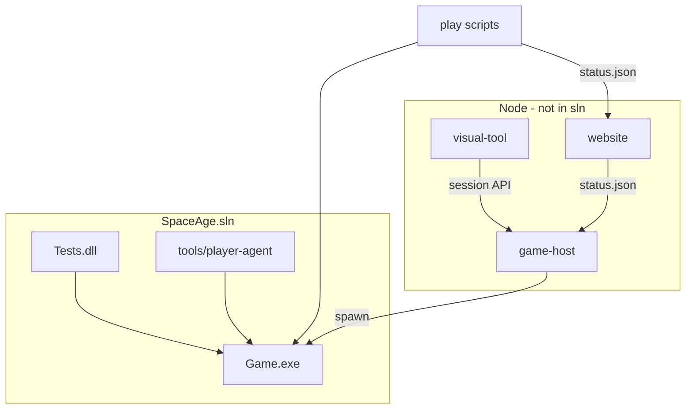

# SpaceAge-2024 — architecture overview

Status: **Current-state description** (open beta)  
Engine version: `Game/Program.cs` → `EngineVersion` (currently **0.8.001**)  
Last updated: 2026-09-16

Doc hub: [`docs/README.md`](../docs/README.md)

## Purpose

SpaceAge is a **turn-based play-by-email (PBEM) space 4X engine**. A GM (or script) runs a console executable that:

1. Loads static catalog XML and current game state.
2. Reads faction order files for the turn.
3. Advances the world **13 weeks** (one quarter).
4. Writes per-faction text reports (email-shaped headers) and a new game XML snapshot.

The engine does **not** send email or use a database. External mailers, GM scripts, and the **game-host** service wrap `Game.exe`.

## Product surfaces (beyond the engine)

| Surface | Folder | Role |
|---------|--------|------|
| **Public lobby** | `website/` | Static Astro site: flavour, `/turns` status, link to visual tool. [ADR-0007](adr/ADR-0007-public-campaign-website.md) |
| **Game host** | `game-host/` | Node HTTP service: faction auth, report XML, orders, GM turn runner. [ADR-0011](adr/ADR-0011-hosted-game-service.md) |
| **Visual tool** | `visual-tool/` | React/Vite authenticated report client. [ADR-0010](adr/ADR-0010-visual-tool.md) |
| **Player agent** | `tools/player-agent/` | Local LLM order drafting. [ADR-0009](adr/ADR-0009-local-llm-player-agent.md) |
| **AI campaign loop** | `play/` | PowerShell isolation path for factions 2–11 |
| **Campaign data** | `campaign/` | Live `data.xml` + scenario XML (game-designer) |

**Primary campaign path (open beta):** `game-host/runs/` — hosted sessions with faction auth and visual-tool API.

**Dev / AI isolation:** `play/runs/` — PowerShell loop for factions 2–11 and player-agent testing; not the public beta surface.

## Concise architecture

| Project | Assembly | Role |
|---------|----------|------|
| `Game` | `Game.exe` | Engine: load → orders → execute → reports → save |
| `Tests` | `Tests.dll` | NUnit 4: unit + SampleGame integration |
| `tools/player-agent` | CLI | Ollama/RAG order drafting |

Domain code lives under `Game/` in namespace **`SpaceAge`**. Almost every entity exposes a static `All` registry.

## Principles

1. **File-in / file-out batch** for the engine (`data.xml`, `gamein.xml`, `order.*`, `gameout.{turn}.xml`, reports).
2. **Windows-1251** on engine XML, orders, and reports.
3. **Do not retarget** off .NET Framework 4.8 without an ADR.
4. **Test-first** — see [`modules-and-integrations.md`](modules-and-integrations.md).
5. **Deterministic turns** — `Sequence` for RNG and IDs.
6. **Small diffs** — no drive-by modernization (DI, namespace splits) without ADR.

## Live vs legacy documentation

| Source | Use for |
|--------|---------|
| `player/rules.md`, `architecture/` | **Live behavior** |
| `designer/` | Campaign design intent (feeds XML) |
| `docs/legacy/alderson/` | Historical Alderson-era design text — **not** live rules |

Known engine stubs (not product backlog unless ADR): `Request`, `Events`, `OrdersReader.Check`; partial types in `Location`, `DataFile.LoadXml` domain paths.

## Glossary

| Term | Meaning |
|------|---------|
| **Turn** | One engine run; calendar quarter |
| **Week** | Inner loop 1..13 in `Game.Execute()` |
| **Faction** | Player corporation |
| **Module stack** | Primary unit (ship, base, army) |
| **status.json** | UTF-8 lobby status (not an engine file) |
| **Game host** | Node wrapper exposing faction-scoped APIs over `Game.exe` |

## What to read first

1. This file.
2. [`modules-and-integrations.md`](modules-and-integrations.md) — modules, pipeline, test layers.
3. [`dependencies/repo-map.md`](dependencies/repo-map.md) — project graph.
4. [`technology.md`](technology.md) — stack pins.
5. [`delivery/cicd-conventions.md`](delivery/cicd-conventions.md) — build and test.
6. Human rules: [`player/rules.md`](../player/rules.md) or [`docs/human/rules.md`](../docs/human/rules.md).
