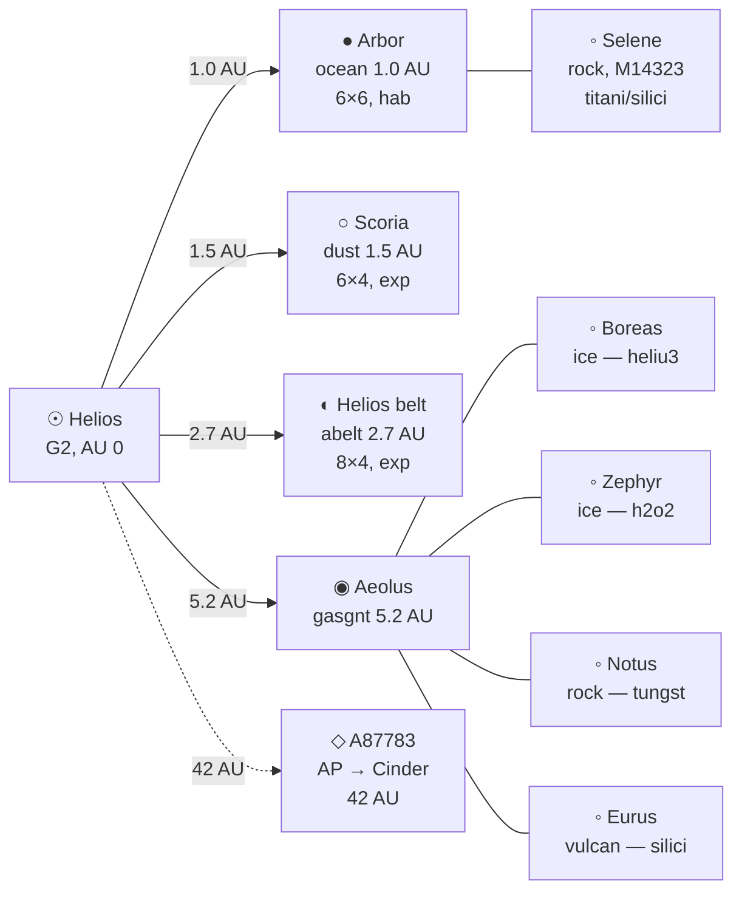
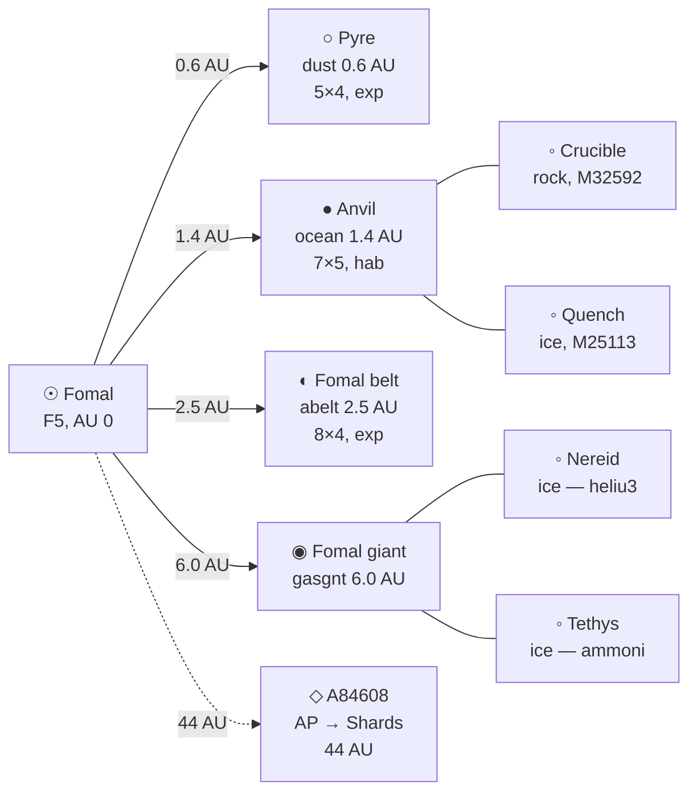
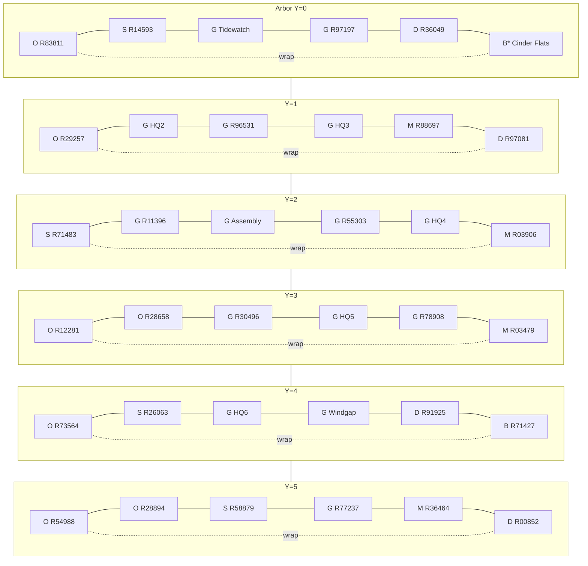
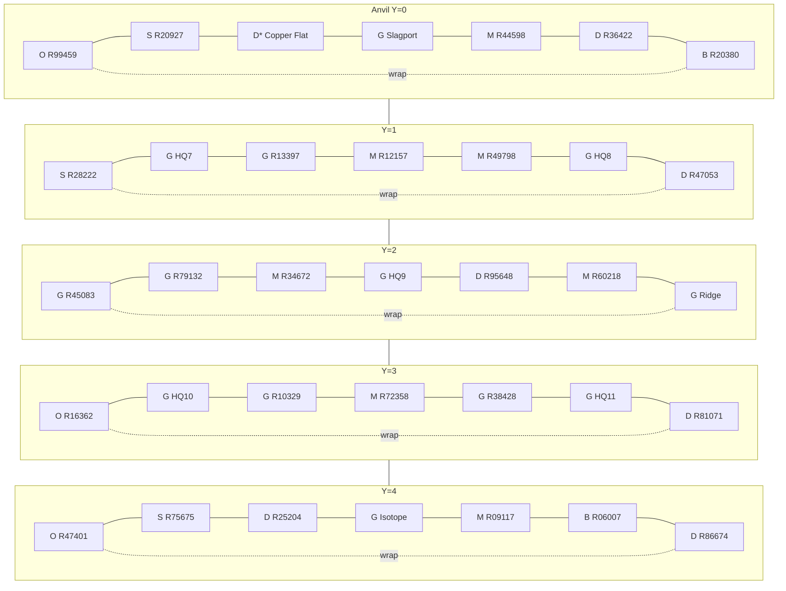

# Galaxy — 10 players, two starting systems

Ten corporations (factions `2`–`11`) plus NPC faction `1` (**United Star Nations**). Seed is **not** one home system per player.

**Turn 1 occupancy:** two star systems only. Five players on starting system A, five on starting system B. Each player owns **one exclusive region** on that system’s habitable planet. The other **eight systems have no player HQ and no NPC cities**. They are exploration destinations.

Helios and Fomal are a **wide bound pair** (~200 AU), not light-years apart. No FTL. Inner-system hops are weeks; the pair hop is a season or more on chemical/fission stages. Empty systems hang off **Alderson chokepoints** (Cinder west, Shards east) — see **[starmap.md](starmap.md)**. Deep-space (52+ wk, no jump) later retires those chokes.

## Scale

| Object | Count | Notes |
|--------|-------|--------|
| Player factions | 10 (`name` 2–11) | Faction `1` = United Star Nations (cities, markets, later patrons) |
| Star systems | 10 | **2 occupied at t=1**, **8 empty** (no HQ, no NPC `city`) |
| Planets + belts / system | 1–4 | Mix of `ocean`, `dust`, `gasgnt`, `abelt` |
| Initially habitable / system | 0–1 | `terair` + food + liquid water + settlement capacity on grassland/ocean |
| Initially exploitable / system | 0–2 | Ores/volatiles without a breathable mix; drills work, farms do not |
| Moons / planet | 0–4 | Gas giants carry most moons; belts have 0 |
| Regions / planet or moon | 10–50 | See size table |

**Habitable** means a human can run `city` / `farms` without imported air and food. **Exploitable** means extraction techs have a regional resource they produce.

### Dual resource model

Region resource quantities represent **renewable yield caps** — the maximum extraction rate per turn from geological or biological sources (iron veins, soil, aquifers). Multiple drills on the same region share the cap; they do not multiply it. Renewable yields never deplete.

**Finite deposits** are one-time bonanzas seeded by GM events, contract rewards, or `PROSPECT` discoveries (meteorite impacts, alien wreckage, towed asteroids). Extraction consumes from a finite deposit until it reaches zero. Until the engine supports the `renewable` attribute, treat all current `<resource>` entries as renewable.

**Renewable/finite classification:** L0–L3 resources (`iron`, `food`, `carbon`, `oil`, `titani`, `copper`, `silici`, `h2o2`, `water`, `uraniu`, `terair`) are renewable everywhere. L4+ resources (`nickfe`, `tungst`, `xenon`, `reeox`, `ammoni`, `methn`, `deutrm`, `heliu3`, `alumin`, `platnm`, `gold`, `lithia`, `boron`, `grphit`, `berylm`, `nitrat`, `kerogn`, `volatl`) are renewable on moons and gas giants but finite on planets and asteroids.

Leave empty regions. A ~36-region ocean world with eight occupied cells still has a hinterland.

**XML star `type`:** live catalog currently has only `M4`. Emit `type="M4"` until `campaign/data.xml` adds more star entries. Spectral class in `name-en` / description is flavour.

## Seed vs exploration (retired layout)

The previous seed was **one player per system** (four habitable starts, six vacuum/ISRU starts). That table is **retired as the t=1 seed**. The eight empty systems below **reuse those briefs as exploration destinations** (including virgin habitable worlds with no cities).

## Turn-1 occupancy

| Role | System | Planet | Type | AU | `surface-size` | Regions | Who |
|------|--------|--------|------|----|----------------|---------|-----|
| Start A | **SS4034 Helios** | **P09288 Arbor** | `ocean` | 1.0 | 6×6 | 36 (`R83811`–`R00852`) | Factions **2–6**; UN capital + 2 towns |
| Start B | **SS9486 Fomal** | **P87685 Anvil** | `ocean` | 1.4 | 7×5 | 35 (`R99459`–`R86674`) | Factions **7–11**; 3 UN towns |

Both worlds are **initially habitable** (grassland/ocean, `terair`, food, water, settlement capacity). Both are **at least medium**: empty hinterland for uncontested growth. Neither planet holds the full industrial diet.

## Resource split (bootstrap diet)

Canonical ids, rarities, quantities, and empty-system deposits: **[resources.md](resources.md)**. Arbor/Anvil split is unchanged: Arbor has no surface `titani`/`copper`/`uraniu`; Anvil has no `oil` and poor `food`. Higher-level ores (`nickfe` `tungst` `deutrm` `ammoni` `methn` `volatl` `kerogn` `alumin` `platnm` `gold`) follow that file — none of them put forbidden metals on Arbor’s grid or petroleum on Anvil’s crust.

Corporations bootstrap on local organics **or** local metals, then **trade, contract, or fly** for the rest. Complementary pockets sit on **other planets/belts in the same system**. Do not stack the same `type` twice on one region.

## NPC polity — United Star Nations (faction `1`)

Trade-friendly charterer, not a conquering empire. Issues later `give-module` contracts. Faction `name-en`: **United Star Nations**.

| City | Planet | Region | `city` qty | Nested (order of) | Why |
|------|--------|--------|------------|-------------------|-----|
| **Assembly** (capital) | Arbor | `R77398` (2,2) grassland | **6** | farms 24, `cplant` 10, `wnplnt` 5, `inftry` 4, granary `cargob` 2 (food ~4000), cash ~8000, terran ~80 | Calories and coal can actually feed a metro; diplomatic seat sits on the food-export world |
| **Tidewatch** | Arbor | `R03279` (2,0) grassland | 2 | farms 6, `cplant` 2, `inftry` 1, granary 1 | Coastal UN town; oil-adjacent |
| **Windgap** | Arbor | `R85182` (3,4) grassland | 1 | farms 4, `wnplnt` 6, `inftry` 1, granary 1 | Interior market |
| **Slagport** | Anvil | `R55393` (3,0) grassland | 2 | farms 6, `wnplnt` 10, `inftry` 1, granary 1 (food tight) | Hungry metal-export town; **buys food at a premium** |
| **Ridge** | Anvil | `R70285` (6,2) grassland | 1 | farms 4, `wnplnt` 6, `inftry` 1 | Eastern concession |
| **Isotope** | Anvil | `R92350` (3,4) grassland | 1 | farms 4, `wnplnt` 4, `inftry` 1 | Near uraninite mountains |

NPC cities occupy **their own regions**. Players never start nested inside a UN `city`.

### Assembly market (t=1, like SampleGame Berlin)

On stack **Assembly** (`city`):

- `buying item="food" quantity="500" price="1"`
- `buying module="farms" quantity="2" price="100"`
- `buying item="titani" quantity="50" price="8"` (Arbor buys what it lacks)
- `buying item="copper" quantity="30" price="10"` (Arbor buys what it lacks)
- `selling item="food" quantity="120" price="4"`
- `selling item="terran" quantity="50" price="50"`
- `selling item="titani" quantity="10" price="25"` (bootstrap supply)

### Slagport market (t=1)

On stack **Slagport** (`city`):

- `buying item="food" quantity="200" price="2"` (premium)
- `buying item="carbon" quantity="40" price="8"` (Anvil needs carbon)
- `buying item="oil" quantity="20" price="12"` (Anvil needs oil, high price)
- `selling item="terran" quantity="12" price="50"`
- `selling item="food" quantity="50" price="6"` (if food arrives, sell at premium)
- `selling item="titani" quantity="30" price="5"` (Anvil has plenty, sell cheap)
- `selling item="copper" quantity="20" price="6"`

**Arbitrage:** buy titani at Slagport (5), sell at Assembly (8). Buy food at Assembly (4), sell at Slagport (6). Cross-system trade is profitable.

## Faction → region (players 2–11)

Each player region: top-level `corphq` (not inside a UN city) + nested modest `cargob` / energy / `cdrill` / `factry` / `farms`. **Cargo is not a complete diet.**

| Fac | `name-en` (placeholder) | Planet | Region | XY | Terrain | HQ cargo (have) | HQ cargo (omit) | Energy |
|-----|-------------------------|--------|--------|----|---------|-----------------|-----------------|--------|
| 2 | Northwind | Arbor | `R18290` | 1,1 | `grassl` | food, terair, h2o2, iron, carbon | titani, copper, uraniu | `cplant` 2 |
| 3 | Greenwell | Arbor | `R13435` | 3,1 | `grassl` | same pattern | same | `cplant` 2 |
| 4 | Rivermark | Arbor | `R04166` | 4,2 | `grassl` | same pattern | same | `cplant` 2 |
| 5 | Sundock | Arbor | `R66238` | 3,3 | `grassl` | same pattern | same | `cplant` 2 |
| 6 | Copse | Arbor | `R93851` | 2,4 | `grassl` | same pattern | same | `cplant` 2 |
| 7 | Ironclad | Anvil | `R44119` | 1,1 | `grassl` | terair, modest food+water, titani, silici, copper, uraniu, some iron | carbon, oil, bulk food | `wnplnt` 8 |
| 8 | Oreline | Anvil | `R12677` | 5,1 | `grassl` | same pattern | same | `wnplnt` 8 |
| 9 | Basalt | Anvil | `R05696` | 3,2 | `grassl` | same pattern | same | `wnplnt` 8 |
| 10 | Silicate | Anvil | `R49616` | 1,3 | `grassl` | same pattern | same | `wnplnt` 8 |
| 11 | Fission | Anvil | `R82398` | 5,3 | `grassl` | same pattern | same | `wnplnt` 8 |

Shared HQ nest (all ten): `corphq` 1 + CEO `terran` officer, `cargob` 2, `farms` 2–3, `cdrill` 1, `factry` 2, crew tens not hundreds. Faction `balance` ~10000 as SampleGame. Settlement `capacity` 8–12 on player grassland.

Arbor HQ cargo quantities (order of): food 400, terair 200, h2o2 200, iron 40, carbon 40, silici 10.  
Anvil HQ cargo: food 80, terair 200, h2o2 80, iron 15, titani 40, silici 40, copper 30, uraniu 20.

## Region count by size

| Body | `surface-size` | Regions | Typical types |
|------|----------------|---------|----------------|
| Tiny moon / ring shepherd | 5×2 | 10 | `barren` `dust` `mountn` |
| Small moon | 5×3 or 4×4 | 12–16 | `dust` `barren` `mountn` (ice moons: same types + `h2o2`/`water`; **no** region type `ice`) |
| Large moon / small dusty planet | 5×4 or 6×4 | 20–24 | mix + 1–2 `mountn` |
| Earthlike / starting worlds | 6×6 to 7×6 | 30–42 | `grassl` `ocean` `sea` `mountn` `dust` |
| Large dusty world | 7×6 to 8×6 | 42–48 | `dust` `barren` `mountn` |
| Asteroid belt | 8×4 to 8×5 | 24–40 | `smmast` `smcast` `lrmast` `lrcast` |
| Gas giant | — | 0 surface | one `orbit` only; regions live on moons |

Grid: unique `(X,Y)` on that body. 4-neighbour `exit` pairs, both directions. Ground `duration`: grassland/dust 2–3, barren 3, mountain 4–6, sea/ocean 5–8.

The 6×6 / 7×5 starting grids are the **playable continent** (settled land + coastal seas), not a 1:1 globe. Planet `type="ocean"` still means a water world; most pelagic area is off-map.

Settlement `capacity` only on habitable or planned colony sites (4 tiny, 8 town, 12–16 metro basin). Extraction worlds: `extraction` capacity 2–6, no `settlement` until habitats exist.

Live region types only: `orbit` `ocean` `sea` `grassl` `dust` `mountn` `barren` `smmast` `smcast` `lrmast` `lrcast`.

## Space travel times (until drive speed is wired)

Orbit-to-orbit and planet-orbit exits use `exitmode mode="space" duration="N"` weeks.

**All regions access orbit directly** — there are no dedicated spaceport regions. Any region on a planet or moon can have space exits to other bodies. Designated "arrival" regions are simply the first regions with convenient space exits, not functionally different from other regions.

| Hop | Chemical / fission (L0–2) | L10 fusion ark (design target) |
|-----|---------------------------|--------------------------------|
| Surface ↔ local orbit | 0–1 | 0 |
| Planet ↔ its moon | 1–4 | 1 |
| Inner system (0.5–2 AU) | 8–13 | 2–4 |
| Helios ↔ Fomal (~200 AU pair) | 26 | 4–8 |
| To gas giant (5 AU) | 13+ | 4–8 |
| Outer belt (20–40 AU) | many turns | 8–13 |
| Occupied pair → empty system | 52+ | 8–13 |

**t=1 space exits (arrival regions, empty of cities/HQ):**

| From | To | Duration |
|------|----|----------|
| Arbor `R32099` Cinder Flats (5,0) `barren` | Scoria `R29872` | 8 |
| Arbor `R32099` | Anvil `R91507` Copper Flat (2,0) `dust` | 26 |
| Arbor `R32099` | Helios–Cinder AP orbit (use `MOVE`) | — |
| Arbor `R32099` | Selene `R74342` | 4 |
| Arbor `R32099` | Boreas `R70645` / Zephyr `R66785` / Notus `R55334` / Eurus `R70382` | 8 |
| Anvil `R91507` | Pyre `R95569` | 8 |
| Anvil `R91507` | Fomal–Shards AP orbit (use `MOVE`) | — |
| Anvil `R91507` | Crucible `R94330` / Quench `R99944` | 4 |
| Anvil `R91507` | Nereid `R47577` / Tethys `R09072` | 8 |
| Reverse of each | — | same |

No space exit from Helios/Fomal to empty-system landings (would skip the Alderson chokes). Empty-system landing ↔ local AP: 13 wk. Belt orbits are reachable but have no pre-generated regions — use `PROSPECT` to discover asteroid objects dynamically.

## Id allocation

| Kind | Pattern | Count (10-player seed) |
|------|---------|-------------------------|
| System | `SS` + 4 digits (random) | 10 |
| Star | `S` + 5 digits (random) | 10 + extras if a visual binary |
| Planet/belt | `P` + 5 digits (random) | 31 bodies + empty stubs |
| Alderson point | `A` + 5 digits (random) | 18 planet objects `type="adpnt"`; see `starmap.md` |
| Moon | `M` + 5 digits (random) | 9; unique ids even if loader currently copies planet id |
| Orbit | `O` + 5 digits (random), AP `O0A` + 3 digits | one per planet/moon |
| Region | `R` + 5 digits (random) | ~240 regions; see grids below |
| Contract | `CTnnnn` | 6 chars |
| Wreckage stacks | `W` + 5 digits | faction 1; **not** on Arbor/Anvil grids at t=1 |
| NPC city stacks | 6 digits (random) | shared namespace with player stacks |
| Player HQ stacks | 6 digits (random) | shared namespace with NPC stacks |
| Officers (persons) | 6 digits (random) | same namespace as stacks |

## Occupied systems — bodies

### SS4034 Helios (start A) — G2 flavour, XML star `M4`

`X="0" Y="0" Z="0"`. Star `S09881` Helios.

| Id | Name | Type | AU | Size | Hab/exp | Notes |
|----|------|------|----|------|---------|-------|
| `P09288` | Arbor | `ocean` | 1.0 | 6×6 | **hab** | Player + UN start; organics/iron/carbon; no titani/uraniu/copper |
| `P67392` | Scoria | `dust` | 1.5 | 6×4 (24) | **exp** | Ilmenite/copper plains; no biosphere |
| `P31196` | (Helios belt) | `abelt` | 2.7 | 8×4 (32) | **exp** | Metal rocks = `uraniu`/`nickfe`; some `lrcast` carbon |
| `P36501` | Aeolus | `gasgnt` | 5.2 | — | — | Orbit only |
| `A87783` | Helios-Cinder AP | `adpnt` | 42 | orbit only | — | West choke pair |

Moons: Arbor `M14323` **Selene** `rock` 5×3 (titani, silici). Aeolus: 4 moons — `M24932` **Boreas** `ice` (heliu3), `M70293` **Zephyr** `ice` (h2o2), `M58801` **Notus** `rock` (tungst), `M18374` **Eurus** `vulcan` (silici). Moon region exits: wishlist.

**Arbor flavour:** ~1 bar N2/O2. Grasslands fix carbon; banded iron in old basins; peat and coastal oil. Crust is sediment and granite — little rutile or pitchblende at the surface.

### SS9486 Fomal (start B) — F5 flavour, XML star `M4`

`X="1" Y="0" Z="0"` (pair axis). Star `S58083` Fomal.

| Id | Name | Type | AU | Size | Hab/exp | Notes |
|----|------|------|----|------|---------|-------|
| `P87685` | Anvil | `ocean` | 1.4 | 7×5 | **hab** | Player + UN towns; metals/fissiles; poor food/oil |
| `P63625` | Pyre | `dust` | 0.6 | 5×4 (20) | **exp** | Hot iron/silica; not habitable |
| `P28081` | (Fomal belt) | `abelt` | 2.5 | 8×4 (32) | **exp** | Carbonaceous: `carbon`, `oil`/`kerogn`, `volatl` |
| `P70679` | Fomal giant | `gasgnt` | 6.0 | — | — | Orbit only |
| `A84608` | Fomal-Shards AP | `adpnt` | 44 | orbit only | — | East choke pair |

Moons: Anvil 2 (`M32592` **Crucible** `rock` 5×3, `M25113` **Quench** `ice` 5×2) — extra rock metals; ice = water. Giant: 2 ice moons — `M55297` **Nereid** `ice` (heliu3), `M24051` **Tethys** `ice` (ammoni).

**Anvil flavour:** Breathable mix over a younger, thinner biosphere. Shield volcanoes expose ilmenite, native copper, uraninite veins. Soils are mineral; wetlands scarce; no commercial petroleum. Seas exist but ice and aquifers are modest.

## System maps

Visual AU-axis layouts for the two occupied systems. Bodies listed in the tables above; these diagrams add spatial context. All moons and their region grids are now emitted in `gamein.xml`.

### Helios system map (SS4034)

G2-class star, 1.05 M☉. Inner system is warm enough for liquid water at 1 AU; the Alderson point orbits at 42 AU.

```
AU   0       1.0      1.5         2.7              5.2                         42
     |        |        |           |                |                           |
   ☉ Helios   ● Arbor  ○ Scoria   �ite◐ Belt       ◉ Aeolus                    ◇ AP→Cinder
     |        |        |           |                |
              └ Selene             (uraniu,nickfe)  ├ Boreas  (ice, heliu3)
               (rock,titani)                        ├ Zephyr  (ice, h2o2)
                                                    ├ Notus   (rock, tungst)
                                                    └ Eurus   (vulcan, silici)
```

Aeolus moons named for the four Anemoi (Greek wind gods) — each orbits inside the giant's Hill sphere. `Boreas` (north wind) and `Zephyr` (west wind) are icy; `Notus` (south wind) is rocky with refractory tungsten veins; `Eurus` (east wind) is volcanically resurfaced.



### Fomal system map (SS9486)

F5-class star, 1.4 M☉, higher luminosity — habitable zone pushed to ~1.4 AU. Inner hot world Pyre bakes at 0.6 AU.

```
AU   0     0.6     1.4         2.5              6.0                         44
     |      |       |           |                |                           |
   ☉ Fomal  ○ Pyre  ● Anvil    ◐ Belt           ◉ Fomal giant               ◇ AP→Shards
     |              |           |                |
                    ├ Crucible                   ├ Nereid  (ice, heliu3)
                    └ Quench                     └ Tethys  (ice, ammoni)
                     (rock,ice)  (carbon,kerogn,
                                  oil,volatl)
```

Fomal giant moons named from sea mythology (Nereid, Tethys) — icy bodies with subsurface volatiles. `Nereid` carries helium-3 adsorbed in regolith ice; `Tethys` has ammonia-rich crust.



## Arbor region grid (P09288, 6×6, cylindrical east–west wrap)

Index: `R83811` + `Y*6+X`. 4-neighbour ground exits **plus east–west wrap** (X=5 ↔ X=0 on each row). No north–south wrap (not a torus). Occupied cells in **bold**.

**Wrap exits (6 pairs, 12 exit elements):** R32099↔R83811 (Y0), R97081↔R29257 (Y1), R03906↔R71483 (Y2), R03479↔R12281 (Y3), R71427↔R73564 (Y4), R00852↔R54988 (Y5). Duration = max of the two terrain types.

| Id | XY | Type | Name-en | Occupant | Resources (qty order of) |
|----|----|------|---------|----------|---------------------------|
| R83811 | 0,0 | ocean | West Pelagic | empty | terair 100, water 600, food 40 |
| R14593 | 1,0 | sea | Shelf | empty | terair 100, water 400, food 80, h2o2 100 |
| **R03279** | 2,0 | grassl | Tidewatch Coast | **UN Tidewatch** | terair 100, food 500, oil 30, iron 15, water 150 |
| R97197 | 3,0 | grassl | South Vale | empty | terair 100, food 450, carbon 25, iron 20, water 120 |
| R36049 | 4,0 | dust | Launch Steppe | empty | iron 30, silici 25, carbon 10, **titani 5** (rutile-bearing regolith exposed by aeolian erosion) |
| **R32099** | 5,0 | barren | Cinder Flats | arrival (space exits) | iron 20, silici 15 |
| R29257 | 0,1 | ocean | West Deep | empty | terair 100, water 600, food 40 |
| **R18290** | 1,1 | grassl | Northwind Grant | **fac 2 HQ** | terair 100, food 600, carbon 30, iron 20, water 150 |
| R96531 | 2,1 | grassl | Mid Vale | empty | terair 100, food 500, carbon 20, iron 15, water 140 |
| **R13435** | 3,1 | grassl | Greenwell Grant | **fac 3 HQ** | terair 100, food 600, carbon 30, iron 20, water 150 |
| R88697 | 4,1 | mountn | South Ridge | empty | iron 70, silici 20, carbon 5, **titani 3** (trace ilmenite in metamorphic gneiss) |
| R97081 | 5,1 | dust | East Dune | empty | iron 30, silici 25, carbon 10 |
| R71483 | 0,2 | sea | West Coast | empty | terair 100, water 400, food 80, h2o2 80 |
| R11396 | 1,2 | grassl | Farm Belt | empty | terair 100, food 700, carbon 35, iron 20, water 160 |
| **R77398** | 2,2 | grassl | Assembly Basin | **UN Assembly** | terair 100, food 800, carbon 40, iron 25, water 180 ; settlement 16 |
| R55303 | 3,2 | grassl | Central Basin | empty | terair 100, food 550, carbon 25, iron 20, water 150 |
| **R04166** | 4,2 | grassl | Rivermark Grant | **fac 4 HQ** | terair 100, food 600, carbon 30, iron 20, water 150 |
| R03906 | 5,2 | mountn | East Peak | empty | iron 80, silici 25 |
| R12281 | 0,3 | ocean | Mid Pelagic | empty | terair 100, water 600, food 30 |
| R28658 | 1,3 | ocean | Inner Pelagic | empty | terair 100, water 600, food 30 |
| R30496 | 2,3 | grassl | Prairie | empty | terair 100, food 500, carbon 20, iron 15, water 140 |
| **R66238** | 3,3 | grassl | Sundock Grant | **fac 5 HQ** | terair 100, food 600, oil 20, iron 20, water 150 |
| R78908 | 4,3 | grassl | East Steppe | empty | terair 100, food 480, carbon 20, iron 18, water 130 |
| R03479 | 5,3 | mountn | East Crag | empty | iron 75, silici 20 |
| R73564 | 0,4 | ocean | North Pelagic | empty | terair 100, water 600, food 30 |
| R26063 | 1,4 | sea | North Sound | empty | terair 100, water 400, food 70, h2o2 90 |
| **R93851** | 2,4 | grassl | Copse Grant | **fac 6 HQ** | terair 100, food 600, carbon 30, iron 20, water 150 |
| **R85182** | 3,4 | grassl | Windgap | **UN Windgap** | terair 100, food 450, carbon 20, iron 15, water 140 |
| R91925 | 4,4 | dust | Loess | empty | iron 35, silici 20, carbon 15 |
| R71427 | 5,4 | barren | East Flat | empty | iron 20, silici 15 |
| R54988 | 0,5 | ocean | Polar Ocean | empty | terair 100, water 700, food 20 |
| R28894 | 1,5 | ocean | Polar Ocean E | empty | terair 100, water 700, food 20 |
| R58879 | 2,5 | sea | Polar Sea | empty | terair 100, water 500, food 40, h2o2 120 |
| R77237 | 3,5 | grassl | Tundra | empty | terair 100, food 250, carbon 10, iron 10, water 200 |
| R36464 | 4,5 | mountn | North Spine | empty | iron 60, silici 20 |
| R00852 | 5,5 | dust | Polar Dust | empty | iron 25, silici 20 |

Trace `titani` only (2 regions, yield 3–5); no `copper`, `uraniu`, or `heliu3`. Hinterland: 28 empty of 36.

### Arbor map (P09288)

Terrain: G `grassl`, O `ocean`, S `sea`, M `mountn`, D `dust`, B `barren`. Occupants: HQ2–6, UN-A Assembly, UN-T Tidewatch, UN-W Windgap. `*` = arrival region (space exits). Other cells empty hinterland. Cylindrical (east–west wrap).

```
      X0        X1        X2        X3        X4        X5       ←wrap→
Y0    O -------S---------G UN-T----G---------D---------B* ------→ O
Y1    O -------G HQ2-----G---------G HQ3-----M---------D ------→ O
Y2    S -------G---------G UN-A----G---------G HQ4-----M ------→ S
Y3    O -------O---------G---------G HQ5-----G---------M ------→ O
Y4    O -------S---------G HQ6-----G UN-W----D---------B ------→ O
Y5    O -------O---------S---------G---------M---------D ------→ O
```



## Anvil region grid (P87685, 7×5, cylindrical east–west wrap)

Index: `R99459` + `Y*7+X`. 4-neighbour ground exits **plus east–west wrap** (X=6 ↔ X=0 on each row). No north–south wrap. Occupied cells in **bold**.

**Wrap exits (5 pairs, 10 exit elements):** R20380↔R99459 (Y0), R47053↔R28222 (Y1), R70285↔R45083 (Y2), R81071↔R16362 (Y3), R86674↔R47401 (Y4). Duration = max of the two terrain types.

| Id | XY | Type | Name-en | Occupant | Resources (qty order of) |
|----|----|------|---------|----------|---------------------------|
| R99459 | 0,0 | ocean | West Sea | empty | terair 100, water 350, food 10 |
| R20927 | 1,0 | sea | West Shelf | empty | terair 100, water 200, food 30 |
| **R91507** | 2,0 | dust | Copper Flat | arrival (space exits) | copper 25, silici 40, titani 20, iron 25 |
| **R55393** | 3,0 | grassl | Slagport | **UN Slagport** | terair 100, food 120, water 80, iron 20, silici 30, titani 20 |
| R44598 | 4,0 | mountn | South Ore | empty | titani 60, silici 40, copper 30, iron 30 |
| R36422 | 5,0 | dust | South Dune | empty | copper 20, silici 40, titani 15, iron 25 |
| R20380 | 6,0 | barren | South Scarp | empty | silici 50, titani 20 |
| R28222 | 0,1 | sea | Northwest Sea | empty | terair 100, water 200, food 25 |
| **R44119** | 1,1 | grassl | Ironclad Grant | **fac 7 HQ** | terair 100, food 140, water 80, iron 20, titani 25, silici 30 |
| R13397 | 2,1 | grassl | Slope | empty | terair 100, food 100, water 70, silici 25, titani 15 |
| R12157 | 3,1 | mountn | West Spine | empty | titani 70, copper 35, silici 40, iron 30 |
| R49798 | 4,1 | mountn | Mid Spine | empty | titani 50, **uraniu 80**, silici 30, copper 20 |
| **R12677** | 5,1 | grassl | Oreline Grant | **fac 8 HQ** | terair 100, food 140, water 80, iron 20, titani 25, silici 30 |
| R47053 | 6,1 | dust | East Talus | empty | copper 25, silici 40, titani 20 |
| R45083 | 0,2 | grassl | Marsh | empty | terair 100, food 150, water 100, iron 15, silici 20 |
| R79132 | 1,2 | grassl | Bench | empty | terair 100, food 110, water 70, silici 25, titani 15 |
| R34672 | 2,2 | mountn | Crag | empty | titani 80, copper 40, silici 45, iron 35 |
| **R05696** | 3,2 | grassl | Basalt Grant | **fac 9 HQ** | terair 100, food 140, water 80, iron 20, copper 20, silici 30 |
| R95648 | 4,2 | dust | Scree | empty | copper 30, silici 40, titani 25, iron 20 |
| R60218 | 5,2 | mountn | East Peak | empty | titani 55, **uraniu 120**, silici 35, copper 25 |
| **R70285** | 6,2 | grassl | Ridge | **UN Ridge** | terair 100, food 100, water 70, silici 30, titani 20, iron 15 |
| R16362 | 0,3 | ocean | Gulf | empty | terair 100, water 350, food 10 |
| **R49616** | 1,3 | grassl | Silicate Grant | **fac 10 HQ** | terair 100, food 140, water 80, silici 40, titani 20, iron 15 |
| R10329 | 2,3 | grassl | Vale | empty | terair 100, food 90, water 70, silici 25, iron 15 |
| R72358 | 3,3 | mountn | Uraninite | empty | **uraniu 150**, titani 40, silici 30, copper 20 |
| R38428 | 4,3 | grassl | Thin Soil | empty | terair 100, food 80, water 60, silici 20, titani 10 |
| **R82398** | 5,3 | grassl | Fission Grant | **fac 11 HQ** | terair 100, food 140, water 80, uraniu 15, titani 20, silici 30 |
| R81071 | 6,3 | dust | Fan | empty | copper 20, silici 45, titani 15 |
| R47401 | 0,4 | ocean | North Sea | empty | terair 100, water 350, food 8 |
| R75675 | 1,4 | sea | North Shelf | empty | terair 100, water 200, food 20 |
| R25204 | 2,4 | dust | Ash | empty | copper 15, silici 35, titani 15, iron 20 |
| **R92350** | 3,4 | grassl | Isotope | **UN Isotope** | terair 100, food 90, water 70, silici 25, titani 15, iron 15 |
| R09117 | 4,4 | mountn | Shield | empty | titani 65, silici 40, copper 30, iron 30 |
| R06007 | 5,4 | barren | Glass | empty | silici 50, titani 15 |
| R86674 | 6,4 | dust | North Reg | empty | copper 20, silici 40, iron 20 |

No `oil`. No commercial `carbon` (belt holds kerogen/coal analogues). `heliu3` not on this grid. Hinterland: 27 empty of 35.

### Anvil map (P87685)

Same terrain letters. Occupants: HQ7–11, UN-S Slagport, UN-R Ridge, UN-I Isotope. `*` = arrival region (space exits). Cylindrical (east–west wrap).

```
      X0        X1        X2        X3        X4        X5        X6       ←wrap→
Y0    O -------S---------D*--------G UN-S----M---------D---------B ------→ O
Y1    S -------G HQ7-----G---------M---------M---------G HQ8-----D ------→ S
Y2    G -------G---------M---------G HQ9-----D---------M---------G UN-R -→ G
Y3    O -------G HQ10----G---------M---------G---------G HQ11----D ------→ O
Y4    O -------S---------D---------G UN-I----M---------B---------D ------→ O
```



## Same-system pockets (summary)

Region ids after `R86674`. Full grids below.

| Body | First region | Size | Theme |
|------|----------------|------|--------|
| Scoria `P67392` | `R29872` | 6×4 (24) | `dust`/`mountn`/`barren`; titani, copper, silici, iron; `extraction` 3 |
| Helios belt `P31196` | — | dynamic | Metallic-dominant; `PROSPECT` to discover |
| Selene `M14323` | `R74342` | 5×3 (15) | `dust`/`mountn`/`barren`; titani, silici; `extraction` 3 |
| Boreas `M24932` | `R70645` | 5×2 (10) | `dust`/`barren`; heliu3, h2o2; `extraction` 2–4 |
| Zephyr `M70293` | `R66785` | 5×2 (10) | `dust`/`barren`; h2o2, water; `extraction` 2–4 |
| Notus `M58801` | `R55334` | 5×3 (15) | `dust`/`mountn`/`barren`; tungst, iron, silici; `extraction` 3 |
| Eurus `M18374` | `R70382` | 4×3 (12) | `dust`/`barren`/`mountn`; silici, iron, titani; `extraction` 3 |
| Pyre `P63625` | `R95569` | 5×4 (20) | `dust`/`mountn`/`barren`; iron, silici, copper, titani; `extraction` 3 |
| Fomal belt `P28081` | — | dynamic | Carbonaceous-dominant; `PROSPECT` to discover |
| Crucible `M32592` | `R94330` | 5×3 (15) | `dust`/`mountn`/`barren`; iron, copper, titani; `extraction` 3 |
| Quench `M25113` | `R99944` | 5×2 (10) | `dust`/`barren`; water, h2o2; `extraction` 3 |
| Nereid `M55297` | `R47577` | 5×2 (10) | `dust`/`barren`; heliu3, h2o2; `extraction` 2–4 |
| Tethys `M24051` | `R09072` | 5×2 (10) | `dust`/`barren`; ammoni, water, methn; `extraction` 3 |

Aeolus / Fomal giant: 0 surface regions (orbit only; skimmer/cloud-platform techs operate from orbit/atmosphere regions — see `technology.md`).

All grids are **cylindrical (east–west wrap)**. No north–south wrap (poles bounded).

**Total:** 2 planet grids (44 regions) + 9 moon grids (107 regions) = 151 new regions beyond Arbor (36) + Anvil (35). Belts have no static regions.

---

### Scoria region grid (P67392, dust, 6×4) — cylindrical

Index: `R29872` + `Y*6+X`. Airless; no `terair`, no food, no settlement. Extraction 3.

| Id | XY | Type | Name-en | Resources |
|----|----|------|---------|-----------|
| R29872 | 0,0 | dust | Scoria West | titani 50, copper 30, silici 30, iron 25 |
| R37931 | 1,0 | dust | Scoria Flats | titani 60, copper 40, silici 40, iron 30 |
| R10459 | 2,0 | mountn | Scoria Ridge | titani 80, copper 50, silici 35, iron 40 |
| R30513 | 3,0 | dust | Scoria Central | titani 55, copper 35, silici 30, iron 25 |
| R13239 | 4,0 | barren | Scoria East | silici 20, iron 15 |
| R49824 | 5,0 | dust | Scoria Crater | titani 45, copper 25, silici 25, iron 20 |
| R36435 | 0,1 | barren | Scoria Polar S | silici 15, iron 10 |
| R59430 | 1,1 | dust | Scoria Basin | titani 70, copper 45, silici 35, iron 35 |
| R83321 | 2,1 | mountn | Scoria Peak | titani 90, copper 60, silici 40, iron 50 |
| R47820 | 3,1 | dust | Scoria Rill | titani 50, copper 30, silici 25, iron 20 |
| R21320 | 4,1 | dust | Scoria Dune | titani 40, copper 20, silici 25, iron 20 |
| R48521 | 5,1 | barren | Scoria Rim E | silici 20, iron 10 |
| R46567 | 0,2 | dust | Scoria Trench | titani 55, copper 35, silici 30, iron 25 |
| R27461 | 1,2 | mountn | Scoria Vein | titani 85, copper 55, silici 40, iron 45 |
| R87842 | 2,2 | dust | Scoria Plain | titani 60, copper 40, silici 30, iron 30 |
| R34994 | 3,2 | barren | Scoria Waste | silici 20, iron 15 |
| R91989 | 4,2 | dust | Scoria Fan | titani 45, copper 25, silici 25, iron 20 |
| R89594 | 5,2 | barren | Scoria Rim SE | silici 15, iron 10 |
| R84940 | 0,3 | barren | Scoria Polar N | silici 15, iron 10 |
| R09359 | 1,3 | dust | Scoria North | titani 50, copper 30, silici 25, iron 20 |
| R79841 | 2,3 | dust | Scoria Shelf | titani 55, copper 35, silici 30, iron 25 |
| R83228 | 3,3 | dust | Scoria NE | titani 40, copper 20, silici 20, iron 15 |
| R22432 | 4,3 | barren | Scoria Far | silici 15, iron 10 |
| R70011 | 5,3 | barren | Scoria Polar NE | silici 10 |

Space exit: `R29872` (arrival) ↔ Arbor `R32099` (8 wk).

```
    X0     X1     X2     X3     X4     X5       → wraps to X0
Y0  D      D      M      D      B      D
Y1  B      D      M*     D      D      B
Y2  D      M      D      B      D      B
Y3  B      D      D      D      B      B
```
D `dust`, M `mountn`, B `barren`. * richest (titani 90, copper 60).

---

### Pyre region grid (P63625, dust, 5×4) — cylindrical

Index: `R95569` + `Y*5+X`. Hot Mercury-like world at 0.6 AU. Airless; no food, no water, no settlement. Extraction 3.

| Id | XY | Type | Name-en | Resources |
|----|----|------|---------|-----------|
| R95569 | 0,0 | dust | Pyre West | iron 50, silici 35, copper 15 |
| R32088 | 1,0 | dust | Pyre Basin | iron 70, silici 45, copper 20, titani 10 |
| R21418 | 2,0 | mountn | Pyre Ridge | iron 90, silici 50, copper 25, titani 15 |
| R60590 | 3,0 | dust | Pyre East | iron 55, silici 35, copper 15 |
| R49736 | 4,0 | barren | Pyre Scarp | silici 25, iron 20 |
| R35383 | 0,1 | barren | Pyre Polar S | silici 20, iron 15 |
| R83887 | 1,1 | dust | Pyre Crucible | iron 80, silici 50, copper 25, titani 12 |
| R90199 | 2,1 | mountn | Pyre Core | iron 100, silici 55, copper 30, titani 20 |
| R73001 | 3,1 | dust | Pyre Vent | iron 60, silici 40, copper 18 |
| R28786 | 4,1 | barren | Pyre Rim | silici 20, iron 15 |
| R89734 | 0,2 | dust | Pyre Trench | iron 55, silici 35, copper 15 |
| R42505 | 1,2 | dust | Pyre Flats | iron 65, silici 40, copper 20 |
| R07332 | 2,2 | dust | Pyre Central | iron 75, silici 45, copper 22, titani 10 |
| R30022 | 3,2 | barren | Pyre Waste | silici 25, iron 20 |
| R04208 | 4,2 | barren | Pyre Far E | silici 15, iron 10 |
| R41348 | 0,3 | barren | Pyre Polar N | silici 15, iron 10 |
| R52582 | 1,3 | dust | Pyre North | iron 60, silici 35, copper 15 |
| R35094 | 2,3 | dust | Pyre Shelf | iron 50, silici 30, copper 12 |
| R08676 | 3,3 | barren | Pyre NE | silici 20, iron 15 |
| R27654 | 4,3 | barren | Pyre Polar NE | silici 10 |

Space exit: `R95569` (arrival) ↔ Anvil `R91507` (8 wk).

```
    X0     X1     X2     X3     X4       → wraps to X0
Y0  D      D      M      D      B
Y1  B      D      M*     D      B
Y2  D      D      D      B      B
Y3  B      D      D      B      B
```
D `dust`, M `mountn`, B `barren`. * richest (iron 100, copper 30, titani 20).

---

### Selene region grid (M14323, Arbor moon, rock, 5×3) — cylindrical

Index: `R74342` + `Y*5+X`. Airless; no `terair`, no food, no settlement. Extraction 2–4.

| Id | XY | Type | Name-en | Resources |
|----|----|------|---------|-----------|
| R74342 | 0,0 | dust | Selene West | titani 40, silici 30, iron 15 |
| R94099 | 1,0 | dust | Selene Flats | titani 50, silici 25, iron 10 |
| R41246 | 2,0 | mountn | Selene Ridge | titani 80, silici 40, iron 25 |
| R27870 | 3,0 | dust | Selene East | titani 35, silici 30, iron 15 |
| R85910 | 4,0 | barren | Selene Scarp | silici 20, iron 10 |
| R65436 | 0,1 | barren | Selene Polar S | silici 25, iron 10 |
| R51857 | 1,1 | dust | Selene Basin | titani 60, silici 35, iron 20 |
| R84260 | 2,1 | mountn | Selene Peak | titani 70, silici 45, iron 30 |
| R60143 | 3,1 | dust | Selene Rill | titani 45, silici 30, iron 15 |
| R18727 | 4,1 | barren | Selene Rim | silici 20, iron 10 |
| R34719 | 0,2 | barren | Selene Polar N | silici 20, iron 10 |
| R18302 | 1,2 | dust | Selene Trench | titani 55, silici 30, iron 15 |
| R32326 | 2,2 | dust | Selene Caldera | titani 45, silici 35, iron 20 |
| R97648 | 3,2 | barren | Selene Waste | silici 25, iron 10 |
| R73580 | 4,2 | barren | Selene Far | silici 15 |

```
    X0    X1    X2    X3    X4
Y0  D     D     M     D     B
Y1  B     D     M     D     B
Y2  B     D     D     B     B
```

### Boreas region grid (M24932, Aeolus ice moon, 5×2) — cylindrical

Index: `R70645` + `Y*5+X`. Airless ice; heliu3 primary. Extraction 2–4.

| Id | XY | Type | Name-en | Resources |
|----|----|------|---------|-----------|
| R70645 | 0,0 | dust | Boreas West Ice | heliu3 30, h2o2 50, water 40 |
| R34439 | 1,0 | dust | Boreas Basin | heliu3 40, h2o2 60, water 50 |
| R97913 | 2,0 | barren | Boreas Ridge | heliu3 20, h2o2 30 |
| R76623 | 3,0 | dust | Boreas East Ice | heliu3 35, h2o2 45, water 40 |
| R56156 | 4,0 | barren | Boreas Scarp | heliu3 15, h2o2 25 |
| R76485 | 0,1 | barren | Boreas South | heliu3 15, h2o2 30 |
| R52351 | 1,1 | dust | Boreas Deep Ice | heliu3 50, h2o2 80, water 60 |
| R47448 | 2,1 | dust | Boreas Vent | heliu3 45, h2o2 70, water 50 |
| R28747 | 3,1 | barren | Boreas Polar | heliu3 20, h2o2 35 |
| R18132 | 4,1 | barren | Boreas Far | heliu3 10, h2o2 20 |

```
    X0    X1    X2    X3    X4
Y0  D     D     B     D     B
Y1  B     D     D     B     B
```

### Zephyr region grid (M70293, Aeolus ice moon, 5×2) — cylindrical

Index: `R66785` + `Y*5+X`. Ice crust; h2o2 primary. Extraction 2–4.

| Id | XY | Type | Name-en | Resources |
|----|----|------|---------|-----------|
| R66785 | 0,0 | dust | Zephyr West | h2o2 80, water 60 |
| R64687 | 1,0 | dust | Zephyr Basin | h2o2 100, water 80, heliu3 10 |
| R11916 | 2,0 | barren | Zephyr Crest | h2o2 40, water 30 |
| R99062 | 3,0 | dust | Zephyr East | h2o2 70, water 50 |
| R06176 | 4,0 | barren | Zephyr Rim | h2o2 30, water 20 |
| R14372 | 0,1 | barren | Zephyr Polar S | h2o2 35, water 25 |
| R20034 | 1,1 | dust | Zephyr Deep | h2o2 120, water 100, heliu3 15 |
| R82241 | 2,1 | dust | Zephyr Vent | h2o2 90, water 70 |
| R20970 | 3,1 | barren | Zephyr Shelf | h2o2 40, water 30 |
| R89193 | 4,1 | barren | Zephyr Far | h2o2 25 |

```
    X0    X1    X2    X3    X4
Y0  D     D     B     D     B
Y1  B     D     D     B     B
```

### Notus region grid (M58801, Aeolus rock moon, 5×3) — cylindrical

Index: `R55334` + `Y*5+X`. Refractory rock; tungsten veins. Extraction 2–4.

| Id | XY | Type | Name-en | Resources |
|----|----|------|---------|-----------|
| R55334 | 0,0 | dust | Notus West | tungst 20, iron 30, silici 25 |
| R78173 | 1,0 | mountn | Notus Vein | tungst 60, iron 40, silici 30 |
| R08327 | 2,0 | dust | Notus Central | tungst 30, iron 35, silici 25 |
| R50433 | 3,0 | mountn | Notus East Peak | tungst 50, iron 45, silici 35 |
| R50020 | 4,0 | barren | Notus Scarp | iron 15, silici 20 |
| R78105 | 0,1 | barren | Notus Polar S | iron 10, silici 15 |
| R61349 | 1,1 | dust | Notus Basin | tungst 40, iron 35, silici 25 |
| R69353 | 2,1 | mountn | Notus Core | tungst 80, iron 50, silici 40 |
| R32954 | 3,1 | dust | Notus Rill | tungst 25, iron 30, silici 20 |
| R72513 | 4,1 | barren | Notus Rim | iron 15, silici 15 |
| R01505 | 0,2 | barren | Notus Far W | iron 10, silici 10 |
| R89167 | 1,2 | dust | Notus Trench | tungst 35, iron 30, silici 20 |
| R94467 | 2,2 | dust | Notus Shelf | tungst 25, iron 25, silici 20 |
| R15015 | 3,2 | barren | Notus Waste | iron 15, silici 15 |
| R89354 | 4,2 | barren | Notus Polar N | iron 10, silici 10 |

```
    X0    X1    X2    X3    X4
Y0  D     M     D     M     B
Y1  B     D     M     D     B
Y2  B     D     D     B     B
```

### Eurus region grid (M18374, Aeolus vulcan moon, 4×3) — cylindrical

Index: `R70382` + `Y*4+X`. Volcanically resurfaced silicates. Extraction 2–4.

| Id | XY | Type | Name-en | Resources |
|----|----|------|---------|-----------|
| R70382 | 0,0 | dust | Eurus Caldera | silici 60, iron 25, titani 15 |
| R98420 | 1,0 | mountn | Eurus Flow | silici 80, iron 40, titani 25 |
| R34974 | 2,0 | dust | Eurus Ash | silici 50, iron 20, titani 10 |
| R84013 | 3,0 | barren | Eurus Scarp | silici 30, iron 15 |
| R44588 | 0,1 | barren | Eurus Polar S | silici 25, iron 10 |
| R14622 | 1,1 | dust | Eurus Vent | silici 70, iron 35, titani 20 |
| R38470 | 2,1 | mountn | Eurus Spine | silici 90, iron 45, titani 30 |
| R56986 | 3,1 | barren | Eurus Rim | silici 25, iron 10 |
| R20731 | 0,2 | barren | Eurus Far W | silici 20, iron 10 |
| R59471 | 1,2 | dust | Eurus Plain | silici 50, iron 25, titani 15 |
| R00426 | 2,2 | dust | Eurus Basin | silici 45, iron 20, titani 10 |
| R94647 | 3,2 | barren | Eurus Polar N | silici 20, iron 10 |

```
    X0    X1    X2    X3
Y0  D     M     D     B
Y1  B     D     M     B
Y2  B     D     D     B
```

### Crucible region grid (M32592, Anvil rock moon, 5×3) — cylindrical

Index: `R94330` + `Y*5+X`. Forge-satellite; iron/copper/titani for Anvil. Extraction 2–4.

| Id | XY | Type | Name-en | Resources |
|----|----|------|---------|-----------|
| R94330 | 0,0 | dust | Crucible West | iron 40, copper 25, titani 20, silici 15 |
| R34523 | 1,0 | mountn | Crucible Lode | iron 60, copper 40, titani 35, silici 25 |
| R65613 | 2,0 | dust | Crucible Central | iron 35, copper 20, titani 15, silici 20 |
| R99872 | 3,0 | mountn | Crucible East Vein | iron 55, copper 35, titani 30, silici 25 |
| R23417 | 4,0 | barren | Crucible Scarp | iron 15, silici 15 |
| R66543 | 0,1 | barren | Crucible Polar S | iron 10, silici 10 |
| R13948 | 1,1 | dust | Crucible Basin | iron 50, copper 30, titani 25, silici 20 |
| R81960 | 2,1 | mountn | Crucible Core | iron 70, copper 45, titani 40, silici 30 |
| R39118 | 3,1 | dust | Crucible Rill | iron 40, copper 25, titani 20, silici 15 |
| R83749 | 4,1 | barren | Crucible Rim | iron 15, silici 10 |
| R66541 | 0,2 | barren | Crucible Far W | iron 10, silici 10 |
| R79819 | 1,2 | dust | Crucible Trench | iron 45, copper 30, titani 20, silici 15 |
| R26072 | 2,2 | dust | Crucible Shelf | iron 35, copper 20, titani 15, silici 15 |
| R20033 | 3,2 | barren | Crucible Waste | iron 15, silici 10 |
| R49010 | 4,2 | barren | Crucible Polar N | iron 10, silici 10 |

```
    X0    X1    X2    X3    X4
Y0  D     M     D     M     B
Y1  B     D     M     D     B
Y2  B     D     D     B     B
```

### Quench region grid (M25113, Anvil ice moon, 5×2) — cylindrical

Index: `R99944` + `Y*5+X`. Water-ice crust. Extraction 2–4.

| Id | XY | Type | Name-en | Resources |
|----|----|------|---------|-----------|
| R99944 | 0,0 | dust | Quench West | water 80, h2o2 50 |
| R21175 | 1,0 | dust | Quench Basin | water 120, h2o2 80 |
| R70698 | 2,0 | barren | Quench Ridge | water 40, h2o2 30 |
| R69515 | 3,0 | dust | Quench East | water 90, h2o2 60 |
| R00075 | 4,0 | barren | Quench Rim | water 30, h2o2 20 |
| R78505 | 0,1 | barren | Quench Polar S | water 30, h2o2 20 |
| R42488 | 1,1 | dust | Quench Deep | water 150, h2o2 100 |
| R64043 | 2,1 | dust | Quench Vent | water 100, h2o2 70 |
| R02553 | 3,1 | barren | Quench Shelf | water 40, h2o2 25 |
| R14663 | 4,1 | barren | Quench Far | water 20, h2o2 15 |

```
    X0    X1    X2    X3    X4
Y0  D     D     B     D     B
Y1  B     D     D     B     B
```

### Nereid region grid (M55297, Fomal giant ice moon, 5×2) — cylindrical

Index: `R47577` + `Y*5+X`. He-3 in regolith ice. Extraction 2–4.

| Id | XY | Type | Name-en | Resources |
|----|----|------|---------|-----------|
| R47577 | 0,0 | dust | Nereid West | heliu3 35, h2o2 50, water 40 |
| R40307 | 1,0 | dust | Nereid Basin | heliu3 45, h2o2 70, water 55 |
| R31386 | 2,0 | barren | Nereid Crest | heliu3 20, h2o2 30 |
| R07593 | 3,0 | dust | Nereid East | heliu3 40, h2o2 55, water 40 |
| R31572 | 4,0 | barren | Nereid Rim | heliu3 15, h2o2 20 |
| R74365 | 0,1 | barren | Nereid Polar S | heliu3 15, h2o2 25 |
| R10323 | 1,1 | dust | Nereid Deep | heliu3 55, h2o2 80, water 65 |
| R11227 | 2,1 | dust | Nereid Vent | heliu3 40, h2o2 65, water 50 |
| R95933 | 3,1 | barren | Nereid Shelf | heliu3 20, h2o2 30 |
| R63700 | 4,1 | barren | Nereid Far | heliu3 10, h2o2 15 |

```
    X0    X1    X2    X3    X4
Y0  D     D     B     D     B
Y1  B     D     D     B     B
```

### Tethys region grid (M24051, Fomal giant ice moon, 5×2) — cylindrical

Index: `R09072` + `Y*5+X`. NH3-rich crust. Extraction 2–4.

| Id | XY | Type | Name-en | Resources |
|----|----|------|---------|-----------|
| R09072 | 0,0 | dust | Tethys West | ammoni 50, water 40, methn 10 |
| R99694 | 1,0 | dust | Tethys Basin | ammoni 70, water 60, methn 15 |
| R69823 | 2,0 | barren | Tethys Crest | ammoni 25, water 20 |
| R16484 | 3,0 | dust | Tethys East | ammoni 55, water 45, methn 12 |
| R16829 | 4,0 | barren | Tethys Rim | ammoni 20, water 15 |
| R86475 | 0,1 | barren | Tethys Polar S | ammoni 20, water 15 |
| R62297 | 1,1 | dust | Tethys Deep | ammoni 80, water 70, methn 20 |
| R72064 | 2,1 | dust | Tethys Vent | ammoni 60, water 50, methn 15 |
| R21644 | 3,1 | barren | Tethys Shelf | ammoni 25, water 20 |
| R34742 | 4,1 | barren | Tethys Far | ammoni 15, water 10 |

```
    X0    X1    X2    X3    X4
Y0  D     D     B     D     B
Y1  B     D     D     B     B
```

### Helios belt (P31196, 2.7 AU)

Belts have **no pre-generated region grids**. Individual asteroid objects are created dynamically after a `PROSPECT` order. The belt planet element exists in `gamein.xml` with an orbit but no child regions.

Composition: **metallic-dominant**.
- 40% large metallic `lrmast` (uraniu 50–150, nickfe 30–80, iron 40–100)
- 25% small metallic `smmast` (titani 20–60, copper 15–40, iron 20–50)
- 20% large carbonaceous `lrcast` (carbon 40–100, kerogn 20–50)
- 15% small carbonaceous `smcast` (volatl 10–30, carbon 15–40)

Extraction capacity per prospected rock: 2–6. No settlement, no `terair`.

### Fomal belt (P28081, 2.5 AU)

Composition: **carbonaceous-dominant**.
- 45% large carbonaceous `lrcast` (carbon 60–110, oil 20–55, kerogn 15–45, volatl 10–30)
- 25% small carbonaceous `smcast` (volatl 20–50, carbon 15–30, kerogn 10–20)
- 20% small metallic `smmast` (titani 20–30, iron 20–25, copper 10–15)
- 10% large metallic `lrmast` (iron 30–50, titani 15–25)

Extraction capacity per prospected rock: 2–6. No settlement, no `terair`.

## Empty systems (exploration briefs)

No player HQ, no NPC `city`, no t=1 contracts on these grids. Sparse resources allowed. Optional **hidden** wreckage in a later XML pass (outer moons/belts), not on the two starting continents. Virgin **habitable** worlds (Graph, Deep’s ice moon) are mid-game land grabs.

| SS | Star flavour | Bodies (type, AU, hab/exp) | Moons | Signature resources | Later alien seed (not t=1 on start worlds) |
|----|--------------|----------------------------|-------|---------------------|--------------------------------------------|
| SS9741 Ember | K2 | dust 0.7 (hot, not hab); ice-giant 4.1 **exp** (as `gasgnt`); abelt 2.2 **exp** | ice-giant 3 ice | titani, silici, heliu3 on ices; **`lithia` signature** (brines) | He3 plant wreck → production+energy |
| SS0652 Gleam | M1 | barren-dust 0.12; abelt 0.4 **exp**; ice-dust 0.8 **exp** | 0 | nickfe, uraniu, copper; **`reeox` signature** | Drone hangar wreck → military |
| SS1344 Cinder | K5 | dust 1.2 **exp**; abelt 2.8; gasgnt 8 | gasgnt 3 (vulcan, rock, ice) | carbon, tungst, uraniu; **`boron` + `grphit` signature** (vulcan / baked carbon) | Foundry wreck → production |
| SS6869 Ash | M0 giant | abelt 3 **exp**; gasgnt 6; gasgnt 18 | inner giant 4 mixed | heliu3, volatiles, ammoni; **`xenon` signature** (outer ices) | Fusion core wreck → propulsion+production |
| SS9563 Shards | G8 young | abelt 2.0 **exp**; abelt 3.1 **exp**; dust 0.9 | 0 | carbon, organics, ice; **`nitrat` signature** (evaporites) | Fauna/anomaly later |
| SS9261 Deep | K7 | gasgnt 4.5; gasgnt 9.2; dust 0.5 | 4+3 moons; one ice moon **hab** (thin `sea`+`grassl`, 12 regions) | water, methn, food (tight) | Spinal-weapon wreck → military |
| SS8566 Graph | G4 | ocean 0.95 **hab**; dust 1.6; abelt 2.5 **exp** | ocean 0; dust 1 rock | carbon, silici, iron, gold | Habitat wheel wreck → production/habitat |
| SS5184 Spare | K3 | dust 1.1 **exp**; abelt 2.4 | dust 1 ice | titani, copper, ice; **`berylm` signature** | Life-support wreck → research+habitat |

Place empty systems **west of Cinder** and **east of Shards** (`designer/starmap.md` XYZ). XML star `type` remains `M4` until the catalog grows.

**L3+ signature ores** (not on Arbor/Anvil basins; see `resources.md`):

| Ore | Empty system | Why that world |
|-----|--------------|----------------|
| `lithia` | SS9741 Ember | Hot dust + ice-giant brine chemistry |
| `reeox` | SS0652 Gleam | Metal-belt REE with `nickfe` |
| `boron` | SS1344 Cinder | Vulcan fumaroles |
| `grphit` | SS1344 Cinder | High-T baked carbon, not peat |
| `xenon` | SS6869 Ash | Outer-ice adsorbed nobles |
| `nitrat` | SS9563 Shards | Young-system evaporites |
| `berylm` | SS5184 Spare | Light-metal barren crust |

SS9261 Deep keeps `methn` as its L3 volatile (already in the diet dictionary). SS8566 Graph stays a habitable carbon/silica prize, not an L3+ industrial signature.

Planet ids continue `P17343`+. Do not pre-place wreck stacks on Arbor/Anvil.

---

## SS9741 Ember — K2 flavour, XML star `M4`

`X="-4" Y="1" Z="0"`. Star `S72133` Ember. Leaf off Cinder (west chokepoint) via Alderson point `A31286` (Ember-Cinder, AU 40). No player HQ, no NPC cities, no t=1 contracts. **Signature resource: `lithia`** (spodumene/brine on hot dust; Li for MPD cathodes and batteries).

### Bodies

| Id | Name | Type | AU | Size | Hab/exp | Notes |
|----|------|------|----|------|---------|-------|
| `P17343` | Ember dust | `dust` | 0.7 | 5×3 (15) | **exp** | Hot airless; lithia brines in evaporite basins, titani/silici crust |
| `P94812` | Ember belt | `abelt` | 2.2 | — | **exp** | Metallic-dominant; dynamic prospecting, no static regions |
| `P74848` | Ember giant | `gasgnt` | 4.1 | — | — | Orbit only; 3 ice moons |
| `A31286` | Ember-Cinder AP | `adpnt` | 40 | orbit only | — | Stable AP to SS1344 Cinder |

Moons (all on Ember giant): `M36510` **Calx** `ice` 5×2 (primary heliu3), `M60638` **Vitre** `ice` 5×2 (heliu3 + deutrm), `M32743` **Gelid** `ice` 5×2 (water/ammoni utility). Orbits `O10501`, `O24357`, `O08982`.

**System flavour:** Ember is a tired K2 dwarf — cooler than Helios, hotter than Fomal. The inner dust planet bakes at ~450 K, driving lithium-bearing brines to the surface through evaporite basins. The ice-giant at 4.1 AU is a standard H₂/He body with three captured icy satellites: the inner two retain primordial helium-3 in regolith, the outer one is a water-ammonia reservoir. The asteroid belt is metal-rich detritus from a failed planetesimal.

### Ember system map

```
AU   0       0.7        2.2              4.1                              40
     |        |          |                |                                |
   ☉ Ember   ○ Dust*    ◐ Belt           ◉ Giant                          ◇ AP→Cinder
     |        |          (prospecting)    |
              (lithia)                    ├ Calx   (ice, heliu3)
                                          ├ Vitre  (ice, heliu3+deutrm)
                                          └ Gelid  (ice, water+ammoni)
```
`*` arrival region. Ships use `MOVE` to reach the AP orbit directly (no space exit needed).

---

### Ember dust region grid (P17343, dust, 5×3) — cylindrical

Airless, ~450 K surface. No `terair`, no food, no water, no settlement. Extraction capacity 3. **`lithia` signature:** spodumene pegmatites and Li-brine pans in solar-heated evaporite basins. Secondary `titani` (ilmenite in regolith) and `silici` (feldspar). Sparse `iron` in impact melt.

Region IDs are placeholders (R6xxxx); the generator pool must be expanded from 260 to ~310 before XML emission.

| Id | XY | Type | Name-en | Resources |
|----|----|------|---------|-----------|
| R60001 | 0,0 | dust | Ember West | lithia 35, titani 25, silici 20, iron 15 |
| R60002 | 1,0 | dust | Ember Brine Pan | **lithia 60**, titani 30, silici 25, iron 10 |
| R60003 | 2,0 | mountn | Ember Pegmatite | **lithia 55**, titani 35, silici 30, iron 20 |
| R60004 | 3,0 | dust | Ember Central | lithia 30, titani 20, silici 20, iron 15 |
| R60005 | 4,0 | barren | Ember Scarp E | silici 15, iron 10 |
| R60006 | 0,1 | barren | Ember Polar S | silici 15, iron 10 |
| R60007 | 1,1 | dust | Ember Evaporite | **lithia 50**, titani 30, silici 25, iron 15 |
| R60008 | 2,1 | mountn | Ember Ridge | lithia 40, **titani 40**, silici 35, iron 25 |
| R60009 | 3,1 | dust | Ember Flats | lithia 25, titani 20, silici 20, iron 15 |
| R60010 | 4,1 | barren | Ember Rim | silici 15, iron 10 |
| R60011 | 0,2 | barren | Ember Polar N | silici 10, iron 10 |
| R60012 | 1,2 | dust | Ember Basin | lithia 35, titani 25, silici 20, iron 15 |
| R60013 | 2,2 | dust | Ember Shelf | lithia 30, titani 20, silici 20, iron 12 |
| R60014 | 3,2 | barren | Ember Waste | silici 15, iron 10 |
| R60015 | 4,2 | barren | Ember Far E | silici 10 |

Ships use `MOVE A31286` to reach the AP orbit directly from any region (no space exit).

```
    X0     X1     X2     X3     X4       → wraps to X0
Y0  D*     D      M      D      B
Y1  B      D      M      D      B
Y2  B      D      D      B      B
```
D `dust`, M `mountn`, B `barren`. `*` arrival. Bold = best lithia yields (50–60).

**Lithia total renewable yield:** ~360 units across 7 regions (30–60 per region). Peak extraction with 3 `cdrill` per rich region: ~180/turn shared across drills.

---

### Calx region grid (M36510, Ember giant moon, ice, 5×2) — cylindrical

Primary heliu3 ice moon. Surface ~80 K. Solar-wind-implanted ³He in regolith grains; sub-surface water ice. Airless. Extraction capacity 3.

| Id | XY | Type | Name-en | Resources |
|----|----|------|---------|-----------|
| R60101 | 0,0 | dust | Calx West | heliu3 30, h2o2 30, water 20 |
| R60102 | 1,0 | dust | Calx Basin | **heliu3 50**, h2o2 45, water 35 |
| R60103 | 2,0 | barren | Calx Ridge | heliu3 20, h2o2 20 |
| R60104 | 3,0 | dust | Calx East | heliu3 40, h2o2 40, water 30 |
| R60105 | 4,0 | barren | Calx Scarp | heliu3 15, h2o2 15 |
| R60106 | 0,1 | barren | Calx Polar | heliu3 15, h2o2 20 |
| R60107 | 1,1 | dust | Calx Deep | **heliu3 60**, h2o2 50, water 40 |
| R60108 | 2,1 | dust | Calx Vent | heliu3 45, h2o2 40, water 30 |
| R60109 | 3,1 | barren | Calx Shelf | heliu3 20, h2o2 25 |
| R60110 | 4,1 | barren | Calx Far | heliu3 10, h2o2 15 |

Space exit: `R60101` (arrival) ↔ Ember dust `R60001` (8 wk).

```
    X0     X1     X2     X3     X4       → wraps to X0
Y0  D*     D      B      D      B
Y1  B      D      D      B      B
```
`*` arrival. Bold = richest heliu3 (50–60).

---

### Vitre region grid (M60638, Ember giant moon, ice, 5×2) — cylindrical

Secondary heliu3 + deuterium ice moon. Colder orbit (~60 K), D/H enrichment in ancient ice. Airless. Extraction capacity 3.

| Id | XY | Type | Name-en | Resources |
|----|----|------|---------|-----------|
| R60201 | 0,0 | dust | Vitre West | heliu3 20, deutrm 15, h2o2 25 |
| R60202 | 1,0 | dust | Vitre Basin | heliu3 30, **deutrm 25**, h2o2 30 |
| R60203 | 2,0 | barren | Vitre Crest | heliu3 15, deutrm 10, h2o2 15 |
| R60204 | 3,0 | dust | Vitre East | heliu3 25, deutrm 20, h2o2 25 |
| R60205 | 4,0 | barren | Vitre Rim | heliu3 10, h2o2 15 |
| R60206 | 0,1 | barren | Vitre Polar | heliu3 10, deutrm 10, h2o2 15 |
| R60207 | 1,1 | dust | Vitre Deep | **heliu3 35**, **deutrm 25**, h2o2 30 |
| R60208 | 2,1 | dust | Vitre Shelf | heliu3 25, deutrm 15, h2o2 20 |
| R60209 | 3,1 | barren | Vitre Waste | heliu3 10, h2o2 15 |
| R60210 | 4,1 | barren | Vitre Far | h2o2 10 |

Space exit: `R60201` (arrival) ↔ Ember dust `R60001` (8 wk).

```
    X0     X1     X2     X3     X4       → wraps to X0
Y0  D*     D      B      D      B
Y1  B      D      D      B      B
```
`*` arrival. Bold = richest deutrm (25).

---

### Gelid region grid (M32743, Ember giant moon, ice, 5×2) — cylindrical

Water/ammonia utility moon. Outer orbit (~50 K), ammonia ice crust over a water-ice mantle. Airless. Extraction capacity 3.

| Id | XY | Type | Name-en | Resources |
|----|----|------|---------|-----------|
| R60301 | 0,0 | dust | Gelid West | water 35, h2o2 30, ammoni 12 |
| R60302 | 1,0 | dust | Gelid Basin | **water 55**, h2o2 45, ammoni 18 |
| R60303 | 2,0 | barren | Gelid Crest | water 20, h2o2 15 |
| R60304 | 3,0 | dust | Gelid East | water 40, h2o2 35, ammoni 15 |
| R60305 | 4,0 | barren | Gelid Rim | water 15, h2o2 10 |
| R60306 | 0,1 | barren | Gelid Polar | water 15, h2o2 15 |
| R60307 | 1,1 | dust | Gelid Deep | **water 60**, **h2o2 50**, **ammoni 20** |
| R60308 | 2,1 | dust | Gelid Vent | water 45, h2o2 35, ammoni 15 |
| R60309 | 3,1 | barren | Gelid Shelf | water 20, h2o2 20 |
| R60310 | 4,1 | barren | Gelid Far | water 10, h2o2 10 |

Space exit: `R60301` (arrival) ↔ Ember dust `R60001` (8 wk).

```
    X0     X1     X2     X3     X4       → wraps to X0
Y0  D*     D      B      D      B
Y1  B      D      D      B      B
```
`*` arrival. Bold = richest (water 60, ammoni 20).

---

### Ember belt composition (P94812, abelt, 2.2 AU)

No static regions. Dynamic prospecting via `PROSPECT` order. Metallic-dominant detritus from a disrupted Fe-Ni planetesimal.

| Rock type | Fraction | Terrain | Resources (per prospected rock) |
|-----------|----------|---------|----------------------------------|
| Small metallic | 50% | `smmast` | titani 20–50, silici 15–30 |
| Large metallic | 30% | `lrmast` | iron 30–60, titani 20–40 |
| Small carbonaceous | 20% | `smcast` | carbon 15–30, volatl 5–15 |

Extraction capacity per prospected rock: 2–4. No settlement, no `terair`.

### Ember space exits

| From | To | Duration | Notes |
|------|----|----------|-------|
| Ember dust (any region) | AP orbit `A31286` | `MOVE` | Ships use `MOVE` to reach the AP orbit directly |
| Calx `R60101` | Ember dust `R60001` | 8 wk | Inner ice moon |
| Vitre `R60201` | Ember dust `R60001` | 8 wk | Middle ice moon |
| Gelid `R60301` | Ember dust `R60001` | 8 wk | Outer ice moon |

All exits are bidirectional. No direct moon↔moon exits; route through the dust planet arrival region.

### Ember same-system pockets

| Resource | Where | Yield (renewable cap) | Tech needed |
|----------|-------|-----------------------|-------------|
| `lithia` (signature) | Ember dust — Brine Pan, Pegmatite, Evaporite, Ridge | 40–60 per rich region | L4 `liming` |
| `titani` | Ember dust — Ridge, Evaporite, Brine Pan | 25–40 | L0 `tminng` |
| `silici` | Ember dust — scattered | 15–35 | L0 `slcmlt` |
| `iron` | Ember dust — Ridge, Brine Pan | 15–25 | L0 `iminng` |
| `heliu3` | Calx, Vitre | 10–60 per region | L2 `he3min` |
| `deutrm` | Vitre | 10–25 | L4 `d2ext` |
| `water` | Gelid | 10–60 | L0 `wtrdst` (as h2o2) |
| `h2o2` | All 3 moons | 10–50 | L0 `wtrdst` |
| `ammoni` | Gelid | 12–20 | L3 `amnext` |

**Bootstrap path:** L0–L1 extraction on Ember dust for `titani`/`silici`/`iron`. L2+ on Calx for `heliu3`. L4 on Ember dust for `lithia` (the prize — needed for L5 lithium MPD cathodes). L4 on Vitre for `deutrm`. L3 on Gelid for `ammoni`. Ember is a **propulsion fuel depot** once exploited.

---

## SS0652 Gleam — M1 red dwarf, XML star `M4`

`X="-4" Y="0" Z="0"`. Star `S30496` Gleam. Leaf off Cinder (west chokepoint) via Alderson point `A51877` (Gleam-Cinder, AU 38). No player HQ, no NPC cities, no t=1 contracts. **Signature resource: `reeox`** (rare-earth monazite/bastnäsite in Fe-Ni asteroids) plus `nickfe`, `uraniu`, `copper`, and trace `platnm`.

### Bodies

| Id | Name | Type | AU | Size | Hab/exp | Notes |
|----|------|------|----|------|---------|-------|
| `P44598` | Gleam inner | `dust` | 0.12 | 4×3 (12) | marginal | Tidally locked scorched crust; poor silici/iron slag |
| `P36422` | Gleam belt | `abelt` | 0.4 | — | **exp** | Metallic-dominant; `reeox`+`nickfe` signature; dynamic prospecting |
| `P20380` | Gleam ice | `dust` | 0.8 | 5×3 (15) | **exp** | Cold outer world; copper/uraniu/iron/h2o2 |
| `A51877` | Gleam-Cinder AP | `adpnt` | 38 | orbit only | — | Stable AP to SS1344 Cinder |

No moons.

**System flavour:** Gleam is a dim M1 red dwarf — low luminosity, tight habitable zone well inside 0.5 AU. The inner world is tidally locked at 0.12 AU, one hemisphere a lava-glazed slag field, the other a frozen waste. The asteroid belt at 0.4 AU is the shattered core of a differentiated protoplanet: dense in siderophile metals (Fe-Ni, PGM traces) and lanthanide-bearing phosphate minerals (monazite). The outer ice-dust world at 0.8 AU never received enough solar flux to melt — copper sulphides and uraninite sit in a permafrost matrix with sub-surface water ice. This system is the galaxy's premier source of rare-earth oxides and nickel-iron.

### Gleam system map

```
AU   0     0.12     0.4           0.8                          38
     |      |        |             |                            |
   ☉ Gleam  ○ Inner  ◐ Belt       ○ Ice*                       ◇ AP→Cinder
     |      (slag)   (reeox,       (copper,uraniu)
                      nickfe)
```
`*` arrival region. Ships use `MOVE` to reach the AP orbit directly (no space exit needed). Inner planet arrival reached from ice planet (8 wk).

---

### Gleam inner region grid (P44598, dust/barren, 4×3) — cylindrical

Tidally locked at 0.12 AU. Sub-stellar hemisphere ~900 K (molten glass); anti-stellar side ~100 K (frozen slag). Terminator belt has modest silica/iron residues. No atmosphere, no water, no settlement. Extraction capacity 2.

Region IDs are placeholders (R6xxxx); generator pool expansion required.

| Id | XY | Type | Name-en | Resources |
|----|----|------|---------|-----------|
| R62001 | 0,0 | barren | Gleam Slag W | silici 15, iron 10 |
| R62002 | 1,0 | dust | Gleam Terminator S | silici 25, iron 15 |
| R62003 | 2,0 | dust | Gleam Sub-stellar | silici 20, iron 12 |
| R62004 | 3,0 | barren | Gleam Dark S | silici 10, iron 8 |
| R62005 | 0,1 | barren | Gleam Slag NW | silici 12, iron 8 |
| R62006 | 1,1 | dust | Gleam Terminator C | silici 25, iron 15 |
| R62007 | 2,1 | barren | Gleam Glaze | silici 15, iron 10 |
| R62008 | 3,1 | barren | Gleam Dark C | silici 10, iron 5 |
| R62009 | 0,2 | barren | Gleam Slag E | silici 12, iron 8 |
| R62010 | 1,2 | dust | Gleam Terminator N | silici 22, iron 14 |
| R62011 | 2,2 | barren | Gleam Furnace | silici 18, iron 12 |
| R62012 | 3,2 | barren | Gleam Dark N | silici 10, iron 5 |

Space exit: `R62001` (arrival) ↔ Gleam ice `R62101` (8 wk).

```
    X0     X1     X2     X3       → wraps to X0
Y0  B*     D      D      B
Y1  B      D      B      B
Y2  B      D      B      B
```
D `dust`, B `barren`. `*` arrival. Terminator strip (X1) has the best yields; sub-stellar is reprocessed slag; anti-stellar (X3) is frozen rubble.

---

### Gleam ice region grid (P20380, dust, 5×3) — cylindrical

Cold outer world at 0.8 AU. Surface ~180 K. Copper sulphide veins and uraninite in permafrost; sub-surface water ice. Airless; no food, no `terair`, no settlement. Extraction capacity 3. **Main exploitable body.**

| Id | XY | Type | Name-en | Resources |
|----|----|------|---------|-----------|
| R62101 | 0,0 | dust | Gleam Ice West | copper 25, uraniu 20, iron 15, h2o2 15 |
| R62102 | 1,0 | dust | Gleam Ice Basin | **copper 40**, uraniu 30, iron 25, h2o2 20 |
| R62103 | 2,0 | mountn | Gleam Ice Ridge | **copper 50**, **uraniu 40**, iron 30, h2o2 15 |
| R62104 | 3,0 | dust | Gleam Ice Central | copper 30, uraniu 25, iron 20, h2o2 18 |
| R62105 | 4,0 | barren | Gleam Ice Scarp | iron 10, h2o2 10 |
| R62106 | 0,1 | barren | Gleam Ice Polar S | iron 10, h2o2 12 |
| R62107 | 1,1 | dust | Gleam Ice Vein | copper 35, **uraniu 35**, iron 20, h2o2 20 |
| R62108 | 2,1 | mountn | Gleam Ice Peak | **copper 45**, uraniu 30, iron 25, **h2o2 25** |
| R62109 | 3,1 | dust | Gleam Ice Flats | copper 25, uraniu 20, iron 15, h2o2 15 |
| R62110 | 4,1 | barren | Gleam Ice Rim | iron 10, h2o2 10 |
| R62111 | 0,2 | barren | Gleam Ice Polar N | iron 10, h2o2 10 |
| R62112 | 1,2 | dust | Gleam Ice Trench | copper 30, uraniu 25, iron 18, h2o2 18 |
| R62113 | 2,2 | dust | Gleam Ice Shelf | copper 25, uraniu 20, iron 15, h2o2 15 |
| R62114 | 3,2 | barren | Gleam Ice Waste | iron 12, h2o2 12 |
| R62115 | 4,2 | barren | Gleam Ice Far | iron 8, h2o2 8 |

Ships use `MOVE A51877` to reach the AP orbit directly from any region (no space exit).

```
    X0     X1     X2     X3     X4       → wraps to X0
Y0  D*     D      M      D      B
Y1  B      D      M      D      B
Y2  B      D      D      B      B
```
D `dust`, M `mountn`, B `barren`. `*` arrival. Bold = best yields (copper 50, uraniu 40).

---

### Gleam belt composition (P36422, abelt, 0.4 AU)

No static regions. Dynamic prospecting via `PROSPECT` order. Shattered differentiated protoplanet core — the galaxy's richest source of `reeox` (monazite in Fe-Ni matrix) and `nickfe`.

| Rock type | Fraction | Terrain | Resources (per prospected rock) |
|-----------|----------|---------|----------------------------------|
| Large metallic (Fe-Ni) | 40% | `lrmast` | nickfe 30–80, uraniu 20–50, iron 30–60 |
| Small metallic (Cu-Ti) | 30% | `smmast` | copper 20–40, titani 15–30 |
| Large metallic + REE | 20% | `lrmast` | **reeox 20–50**, nickfe 40–80, platnm 3–8 |
| Small carbonaceous | 10% | `smcast` | carbon 10–25 |

Extraction capacity per prospected rock: 3–6. No settlement, no `terair`.

**REE-bearing rocks** are the prize: monazite grains (Ce, La, Nd, Pr phosphates) and bastnäsite (Ce, La fluocarbonates) co-precipitated with kamacite in the protoplanetary core. `PROSPECT` reveals them; without it, they read as generic `lrmast`. Trace `platnm` (3–8 yield) accompanies the REE fraction — platinum-group siderophiles concentrated by fractional crystallisation.

### Gleam space exits

| From | To | Duration | Notes |
|------|----|----------|-------|
| Gleam ice (any region) | AP orbit `A51877` | `MOVE` | Ships use `MOVE` to reach the AP orbit directly |
| Gleam inner `R62001` | Gleam ice `R62101` | 8 wk | Inner planet approach |

All exits are bidirectional. No direct inner↔AP exit; route through the ice planet arrival region.

### Gleam same-system pockets

| Resource | Where | Yield (renewable cap) | Tech needed |
|----------|-------|-----------------------|-------------|
| `reeox` (signature) | Gleam belt (20% of rocks) | 20–50 per rock | L6 `reemin` |
| `nickfe` | Gleam belt (40% + 20% REE rocks) | 30–80 per rock | L1 `nminng` |
| `platnm` | Gleam belt (20% REE rocks) | 3–8 per rock | L6 `ptminn` |
| `uraniu` | Gleam ice — Ridge, Peak, Vein | 20–40 | L0 `uminng` |
| `copper` | Gleam ice — Ridge, Peak, Basin | 25–50 | L0 `cminng` |
| `iron` | Gleam ice — scattered | 8–30 | L0 `iminng` |
| `h2o2` | Gleam ice — scattered | 8–25 | L0 `wtrdst` |
| `silici` | Gleam inner — terminator belt | 10–25 | L0 `slcmlt` |

**Bootstrap path:** L0 extraction on Gleam ice for `copper`/`uraniu`/`iron`/`h2o2` — standard industrial diet. L1 `nminng` on belt rocks for `nickfe` (feeds L4 `orbfnd` orbital foundry). L6 `reemin` on REE-bearing belt rocks for `reeox` (feeds L6+ mag-sail, EW, sensors) and `ptminn` for `platnm` (feeds L6 D-He3 fusion, L8 recycling). Gleam is a **heavy-metal refinery** — mid-to-late game industrial prize for orbital construction and advanced propulsion.

---

## SS1344 Cinder — K5 orange dwarf, XML star `M4`

`X="-2" Y="0" Z="0"`. Star `S66238` Cinder. **West chokepoint** — degree 5 (four stable APs + one unstable). All west-side traffic between Helios and the three leaf systems (Ember, Gleam, Ash) passes through Cinder. The unstable AP to Shards bypasses both chokepoints but requires L5 `ujpdvr`. No player HQ, no NPC cities, no t=1 contracts. **Signature resources: `boron` + `grphit`** (fumarole borates and high-temperature graphite on the vulcan moon).

### Bodies

| Id | Name | Type | AU | Size | Hab/exp | Notes |
|----|------|------|----|------|---------|-------|
| `P28222` | Cinder dust | `dust` | 1.2 | 6×3 (18) | **exp** | Volcanic plains; carbon, uraniu, iron — the transit fortress |
| `P44119` | Cinder belt | `abelt` | 2.8 | — | **exp** | Carbonaceous-dominant; grphit + kerogn + uraniu |
| `P13397` | Cinder giant | `gasgnt` | 8.0 | — | — | Orbit only; 3 moons |
| `A93873` | Cinder-Helios AP | `adpnt` | 45 | orbit only | — | Stable |
| `A41181` | Cinder-Ember AP | `adpnt` | 48 | orbit only | — | Stable |
| `A34815` | Cinder-Gleam AP | `adpnt` | 52 | orbit only | — | Stable |
| `A17155` | Cinder-Ash AP | `adpnt` | 58 | orbit only | — | Stable |
| `A81417` | Cinder-Shards UAP | `adpnt` | 55 | orbit only | — | **Unstable**; requires `ujpdvr` (L5) |

Moons (all on Cinder giant): `M63001` **Forge** `vulcan` 4×3 (boron + grphit signature), `M63002` **Tuyere** `rock` 5×2 (tungst, uraniu), `M63003` **Sleet** `ice` 5×2 (water, carbon). Moon IDs are placeholders (M pool exhausted at 12; expand to ~18). Orbits `O89734`, `O42505`, `O07332`.

**System flavour:** Cinder is a K5 orange dwarf — cooler and dimmer than Sol, with a compact planetary system. The dust planet at 1.2 AU is a volcanic ash field over basaltic crust, heated by tidal interaction with the gas giant and radiogenic decay from abundant uraninite. Carbon exists as baked anthracite in ancient lava tubes. The gas giant at 8 AU is a cold H₂/He body with three captured satellites: an inner vulcan moon venting boron-bearing fumaroles, a mid-orbit rock moon with scheelite tungsten veins, and an outer ice moon with water and entrained carbon. The asteroid belt at 2.8 AU is carbonaceous detritus — baked organics and graphite from the inner system's violent youth. Five Alderson points orbit at 45–58 AU, making Cinder the only transit hub for the west side of the galaxy.

### Cinder system map

```
AU   0      1.2       2.8            8.0                    45  48  52  55  58
     |       |         |              |                      |   |   |   |   |
   ☉ Cinder  ○ Dust*   ◐ Belt        ◉ Giant                ◇   ◇   ◇   ◆   ◇
     |       (carbon,   (graphite,    |                      Hel Emb Gle UAP Ash
              uraniu)   kerogn)       ├ Forge  (vulcan, boron+grphit)
                                      ├ Tuyere (rock, tungst+uraniu)
                                      └ Sleet  (ice, water+carbon)
```
`*` arrival region. Ships use `MOVE` to reach any AP orbit directly (no space exit needed). `◆` = unstable AP.

---

### Cinder dust region grid (P28222, dust, 6×3) — cylindrical

Volcanic ash plains over basaltic crust. Surface ~340 K. Baked anthracite in lava tubes; uraninite in shield-volcano flanks; scattered iron in impact ejecta. Airless; no food, no `terair`, no settlement. Extraction capacity 3.

**Strategic note:** This is the natural fortification point for the west chokepoint — ships arriving at any of the 5 AP orbits must transit the dust planet. Whoever garrisons the dust planet controls west-side interstellar traffic.

Region IDs are placeholders (R63xxx); generator pool expansion required.

| Id | XY | Type | Name-en | Resources |
|----|----|------|---------|-----------|
| R63001 | 0,0 | dust | Cinder West Ash | carbon 30, uraniu 20, iron 20, silici 15 |
| R63002 | 1,0 | dust | Cinder Lava Field | carbon 40, uraniu 25, iron 25, silici 20 |
| R63003 | 2,0 | mountn | Cinder Shield | carbon 35, **uraniu 40**, iron 30, silici 20 |
| R63004 | 3,0 | dust | Cinder Central | carbon 30, uraniu 20, iron 20, silici 15 |
| R63005 | 4,0 | dust | Cinder Vent | **carbon 50**, uraniu 25, iron 20, silici 15 |
| R63006 | 5,0 | barren | Cinder Scarp E | iron 15, silici 10 |
| R63007 | 0,1 | barren | Cinder Polar S | iron 12, silici 10 |
| R63008 | 1,1 | dust | Cinder Basin | carbon 35, uraniu 25, iron 25, silici 18 |
| R63009 | 2,1 | mountn | Cinder Peak | carbon 40, **uraniu 35**, iron 30, silici 25 |
| R63010 | 3,1 | dust | Cinder Trough | carbon 30, uraniu 20, iron 20, silici 15 |
| R63011 | 4,1 | dust | Cinder Tube | **carbon 45**, uraniu 20, iron 18, silici 12 |
| R63012 | 5,1 | barren | Cinder Rim E | iron 12, silici 10 |
| R63013 | 0,2 | barren | Cinder Polar N | iron 10, silici 10 |
| R63014 | 1,2 | dust | Cinder North Ash | carbon 30, uraniu 20, iron 20, silici 15 |
| R63015 | 2,2 | dust | Cinder Caldera | carbon 35, uraniu 25, iron 22, silici 18 |
| R63016 | 3,2 | barren | Cinder Waste | iron 15, silici 12 |
| R63017 | 4,2 | dust | Cinder Fan | carbon 25, uraniu 15, iron 15, silici 12 |
| R63018 | 5,2 | barren | Cinder Far E | silici 10, iron 8 |

Ships use `MOVE` to reach any AP orbit directly from any region (no space exits to APs).

```
    X0     X1     X2     X3     X4     X5       → wraps to X0
Y0  D*     D      M      D      D      B
Y1  B      D      M      D      D      B
Y2  B      D      D      B      D      B
```
D `dust`, M `mountn`, B `barren`. `*` arrival (5 AP exits). Bold = best yields (carbon 50, uraniu 40).

---

### Forge region grid (M63001, Cinder giant moon, vulcan, 4×3) — cylindrical

Inner vulcan moon. Active fumarole venting — boron trioxide sublimates and borate crusts coat caldera rims. Graphite crystallises in high-temperature metamorphic veins (>1200 K contact zones). Airless. Extraction capacity 3. **THE source of `boron` and `grphit` in the galaxy.**

| Id | XY | Type | Name-en | Resources |
|----|----|------|---------|-----------|
| R63101 | 0,0 | dust | Forge West | boron 30, grphit 20, silici 20, iron 12 |
| R63102 | 1,0 | mountn | Forge Caldera | **boron 55**, grphit 35, silici 30, iron 18 |
| R63103 | 2,0 | dust | Forge Central | boron 35, grphit 25, silici 20, iron 15 |
| R63104 | 3,0 | barren | Forge Scarp | silici 15, iron 10 |
| R63105 | 0,1 | barren | Forge Polar S | silici 12, iron 8 |
| R63106 | 1,1 | dust | Forge Fumarole | **boron 60**, **grphit 45**, silici 35, iron 20 |
| R63107 | 2,1 | mountn | Forge Spine | boron 45, grphit 35, silici 30, iron 18 |
| R63108 | 3,1 | barren | Forge Rim | silici 15, iron 10 |
| R63109 | 0,2 | barren | Forge Polar N | silici 10, iron 8 |
| R63110 | 1,2 | dust | Forge Basin | boron 35, grphit 25, silici 22, iron 15 |
| R63111 | 2,2 | dust | Forge Shelf | boron 25, grphit 20, silici 18, iron 12 |
| R63112 | 3,2 | barren | Forge Far | silici 12, iron 8 |

Space exit: `R63101` (arrival) ↔ Cinder dust `R63001` (8 wk).

```
    X0     X1     X2     X3       → wraps to X0
Y0  D*     M      D      B
Y1  B      D      M      B
Y2  B      D      D      B
```
`*` arrival. Bold = richest (boron 60, grphit 45 at Forge Fumarole).

---

### Tuyere region grid (M63002, Cinder giant moon, rock, 5×2) — cylindrical

Mid-orbit rocky satellite. Scheelite (CaWO₄) veins in skarn contact zones; uraninite disseminated in granitic intrusions. Airless. Extraction capacity 3.

| Id | XY | Type | Name-en | Resources |
|----|----|------|---------|-----------|
| R63201 | 0,0 | dust | Tuyere West | tungst 25, iron 20, uraniu 15 |
| R63202 | 1,0 | mountn | Tuyere Vein | **tungst 50**, iron 35, uraniu 20 |
| R63203 | 2,0 | dust | Tuyere Central | tungst 30, iron 25, uraniu 18 |
| R63204 | 3,0 | barren | Tuyere Scarp | iron 15, uraniu 10 |
| R63205 | 4,0 | barren | Tuyere Rim | iron 10 |
| R63206 | 0,1 | barren | Tuyere Polar | iron 12, uraniu 10 |
| R63207 | 1,1 | dust | Tuyere Basin | **tungst 45**, iron 30, **uraniu 25** |
| R63208 | 2,1 | dust | Tuyere Shelf | tungst 30, iron 20, uraniu 15 |
| R63209 | 3,1 | barren | Tuyere Waste | iron 12, uraniu 10 |
| R63210 | 4,1 | barren | Tuyere Far | iron 8 |

Space exit: `R63201` (arrival) ↔ Cinder dust `R63001` (8 wk).

```
    X0     X1     X2     X3     X4       → wraps to X0
Y0  D*     M      D      B      B
Y1  B      D      D      B      B
```
`*` arrival. Bold = richest (tungst 50, uraniu 25).

---

### Sleet region grid (M63003, Cinder giant moon, ice, 5×2) — cylindrical

Outer ice moon. Permafrost surface with entrained carbonaceous material — ancient cometary accretion. Water ice dominates; carbon exists as amorphous soot and PAH organics. Airless. Extraction capacity 3.

| Id | XY | Type | Name-en | Resources |
|----|----|------|---------|-----------|
| R63301 | 0,0 | dust | Sleet West | water 30, h2o2 25, carbon 12 |
| R63302 | 1,0 | dust | Sleet Basin | **water 50**, h2o2 35, carbon 18 |
| R63303 | 2,0 | barren | Sleet Crest | water 20, h2o2 15 |
| R63304 | 3,0 | dust | Sleet East | water 35, h2o2 30, carbon 15 |
| R63305 | 4,0 | barren | Sleet Rim | water 15, h2o2 12 |
| R63306 | 0,1 | barren | Sleet Polar | water 15, h2o2 15 |
| R63307 | 1,1 | dust | Sleet Deep | **water 45**, **h2o2 40**, **carbon 20** |
| R63308 | 2,1 | dust | Sleet Shelf | water 30, h2o2 25, carbon 14 |
| R63309 | 3,1 | barren | Sleet Waste | water 18, h2o2 15 |
| R63310 | 4,1 | barren | Sleet Far | water 10, h2o2 10 |

Space exit: `R63301` (arrival) ↔ Cinder dust `R63001` (8 wk).

```
    X0     X1     X2     X3     X4       → wraps to X0
Y0  D*     D      B      D      B
Y1  B      D      D      B      B
```
`*` arrival. Bold = richest (water 50, carbon 20).

---

### Cinder belt composition (P44119, abelt, 2.8 AU)

No static regions. Dynamic prospecting via `PROSPECT` order. Carbonaceous-dominant — baked organics and metamorphic graphite from the system's high-energy youth.

| Rock type | Fraction | Terrain | Resources (per prospected rock) |
|-----------|----------|---------|----------------------------------|
| Large carbonaceous | 35% | `lrcast` | carbon 40–80, grphit 15–30, kerogn 10–25 |
| Large metallic | 30% | `lrmast` | iron 30–60, uraniu 15–35 |
| Small metallic | 20% | `smmast` | titani 15–30, copper 10–20 |
| Small carbonaceous | 15% | `smcast` | volatl 10–20, carbon 15–30 |

Extraction capacity per prospected rock: 3–5. No settlement, no `terair`.

### Cinder space exits

| From | To | Duration | Notes |
|------|----|----------|-------|
| Cinder dust (any region) | AP orbit `A93873` (Helios) | `MOVE` | → Helios (Arbor, Scoria) |
| Cinder dust (any region) | AP orbit `A41181` (Ember) | `MOVE` | → Ember (lithia) |
| Cinder dust (any region) | AP orbit `A34815` (Gleam) | `MOVE` | → Gleam (reeox, nickfe) |
| Cinder dust (any region) | AP orbit `A17155` (Ash) | `MOVE` | → Ash (xenon) |
| Cinder dust (any region) | AP orbit `A81417` (Shards UAP) | `MOVE` | → Shards (**unstable**, requires `ujpdvr`) |
| Forge `R63101` | Cinder dust `R63001` | 8 wk | Vulcan moon |
| Tuyere `R63201` | Cinder dust `R63001` | 8 wk | Rock moon |
| Sleet `R63301` | Cinder dust `R63001` | 8 wk | Ice moon |

All exits bidirectional. No direct moon↔moon exits. The dust planet arrival is the central hub connecting 5 APs and 3 moons — **8 space exits** from one region.

### Cinder same-system pockets

| Resource | Where | Yield (renewable cap) | Tech needed |
|----------|-------|-----------------------|-------------|
| `boron` (signature) | Forge — Fumarole, Caldera, Spine | 25–60 | L5 `bormin` |
| `grphit` (signature) | Forge — Fumarole, Caldera, Spine | 20–45 | L6 `grmine` |
| `carbon` | Cinder dust — Vent, Tube, Lava Field; Sleet | 25–50 | L0 `hcdril` |
| `uraniu` | Cinder dust — Shield, Peak; Tuyere | 15–40 | L0 `uminng` |
| `tungst` | Tuyere — Vein, Basin | 25–50 | L5 `wminng` |
| `iron` | Cinder dust + Tuyere — scattered | 8–35 | L0 `iminng` |
| `silici` | Forge + Cinder dust — scattered | 10–35 | L0 `slcmlt` |
| `water` | Sleet — Basin, Deep | 10–50 | L0 `wtrdst` |
| `h2o2` | Sleet — scattered | 10–40 | L0 `wtrdst` |
| `kerogn` | Cinder belt (large carbonaceous rocks) | 10–25 per rock | L2 `krogen` |

**Bootstrap path:** L0 extraction on Cinder dust for `carbon`/`uraniu`/`iron`. L0 on Sleet for `water`/`h2o2`. L5 on Forge for `boron` (feeds L5 `ceramp` engineering ceramics → armour) and L6 `grmine` for `grphit` (feeds L6 `cccomp` carbon-carbon composites, L8+ radiation shielding). L5 on Tuyere for `tungst` (feeds L5 `kpdgun` kinetic cannon, L6 `matlib`, L9 `hiisp` pulse drive). Cinder is the **strategic chokepoint** and a **late-game materials depot** — controlling it means controlling both west-side traffic and the supply of boron, graphite, and tungsten.

---

## SS6869 Ash — M0 large red dwarf, XML star `M4`

`X="-4" Y="-1" Z="0"`. Star `S32099` Ash. Leaf off Cinder via AP `A88040` (Ash-Cinder, AU 70 — beyond the outer giant). No player HQ, no NPC cities, no t=1 contracts. **Signature resource: `xenon`** (adsorbed noble gas in outer-system ices). Also rich in `heliu3`, `ammoni`, `volatl`, `methn`. **Unique layout:** no rocky/dust planets at all — everything is moons and belt. Players must sustain themselves entirely on satellite and asteroid resources.

### Bodies

| Id | Name | Type | AU | Size | Hab/exp | Notes |
|----|------|------|----|------|---------|-------|
| `P71427` | Ash belt | `abelt` | 3.0 | — | **exp** | Volatile-rich carbonaceous; dynamic prospecting |
| `P54988` | Ash inner giant | `gasgnt` | 6.0 | — | — | Orbit only; 4 moons |
| `P28894` | Ash outer giant | `gasgnt` | 18.0 | — | — | Orbit only; no moons. Far from AP (20+ wk) |
| `A88040` | Ash-Cinder AP | `adpnt` | 70 | orbit only | — | Stable. Beyond the outer giant |

Moons (all on inner giant): `M64001` **Crucis** `vulcan` 4×3 (silici, iron, titani), `M64002` **Ferrum** `rock` 5×2 (iron, copper, uraniu), `M64003` **Nieve** `ice` 5×2 (**xenon signature**, heliu3), `M64004` **Brine** `ice` 5×2 (ammoni, volatl, water, methn). Moon IDs are placeholders (M pool exhausted). Orbits `O48521`, `O46567`, `O27461`, `O87842`.

**System flavour:** Ash is a bloated M0 red dwarf — larger and more luminous than a typical M-class, but still too dim for a habitable zone inside 1 AU. The system never formed rocky planets: angular momentum concentrated in two massive gas giants that swept the protoplanetary disc clean. The inner giant at 6 AU captured four satellites during the chaotic early epoch — a tidally-heated vulcan moon, a dense rocky body, and two outer ice moons. The belt at 3 AU is carbonaceous debris that the giants' resonances prevented from accreting. The AP sits at 70 AU, well beyond the outer giant — arriving ships face a long burn inward. Xenon is trapped in amorphous ice on Nieve's surface, adsorbed from the primordial solar nebula and preserved by the cold outer orbit.

### Ash system map

```
AU   0        3.0            6.0                     18.0                       70
     |         |              |                       |                          |
   ☉ Ash      ◐ Belt         ◉ Inner giant            ◉ Outer giant             ◇ AP→Cinder
     |        (volatl,        |                       (no moons, remote)
              ammoni)         ├ Crucis  (vulcan, silici)
                              ├ Ferrum  (rock, iron+copper)
                              ├ Nieve   (ice, XENON+heliu3)
                              └ Brine   (ice, ammoni+volatl+methn)
```
AP at 70 AU is beyond both giants — arriving via Cinder, ships enter far out and must burn inward to reach the moons.

---

### Crucis region grid (M64001, Ash inner giant moon, vulcan, 4×3) — cylindrical

Inner vulcan moon. Tidal flexing from the giant drives silicate volcanism. Basaltic flows rich in feldspar (silici) and ilmenite (titani). Airless. Extraction capacity 3.

| Id | XY | Type | Name-en | Resources |
|----|----|------|---------|-----------|
| R64001 | 0,0 | dust | Crucis West | silici 25, iron 18, titani 12 |
| R64002 | 1,0 | mountn | Crucis Flow | **silici 45**, iron 28, titani 18 |
| R64003 | 2,0 | dust | Crucis Central | silici 30, iron 20, titani 15 |
| R64004 | 3,0 | barren | Crucis Scarp | silici 15, iron 10 |
| R64005 | 0,1 | barren | Crucis Polar S | silici 15, iron 10 |
| R64006 | 1,1 | dust | Crucis Caldera | **silici 40**, iron 30, **titani 20** |
| R64007 | 2,1 | mountn | Crucis Spine | silici 35, iron 25, titani 18 |
| R64008 | 3,1 | barren | Crucis Rim | silici 12, iron 8 |
| R64009 | 0,2 | barren | Crucis Polar N | silici 12, iron 8 |
| R64010 | 1,2 | dust | Crucis Basin | silici 30, iron 22, titani 15 |
| R64011 | 2,2 | dust | Crucis Shelf | silici 25, iron 18, titani 12 |
| R64012 | 3,2 | barren | Crucis Far | silici 10, iron 8 |

Ships use `MOVE A88040` to reach the AP orbit directly from any region (no space exit).

```
    X0     X1     X2     X3       → wraps to X0
Y0  D*     M      D      B
Y1  B      D      M      B
Y2  B      D      D      B
```
`*` arrival. Bold = richest (silici 45, titani 20).

---

### Ferrum region grid (M64002, Ash inner giant moon, rock, 5×2) — cylindrical

Mid-orbit rocky satellite. Dense iron-nickel core with copper sulphide veins and trace uraninite. Airless. Extraction capacity 3.

| Id | XY | Type | Name-en | Resources |
|----|----|------|---------|-----------|
| R64101 | 0,0 | dust | Ferrum West | iron 20, copper 15, uraniu 8 |
| R64102 | 1,0 | mountn | Ferrum Lode | **iron 35**, **copper 25**, uraniu 12 |
| R64103 | 2,0 | dust | Ferrum Central | iron 25, copper 18, uraniu 10 |
| R64104 | 3,0 | barren | Ferrum Scarp | iron 12, copper 8 |
| R64105 | 4,0 | barren | Ferrum Rim | iron 10 |
| R64106 | 0,1 | barren | Ferrum Polar | iron 12, uraniu 8 |
| R64107 | 1,1 | dust | Ferrum Vein | iron 30, copper 22, **uraniu 15** |
| R64108 | 2,1 | dust | Ferrum Shelf | iron 20, copper 15, uraniu 10 |
| R64109 | 3,1 | barren | Ferrum Waste | iron 12, copper 8 |
| R64110 | 4,1 | barren | Ferrum Far | iron 8 |

Space exit: `R64101` (arrival) ↔ Crucis `R64001` (4 wk).

```
    X0     X1     X2     X3     X4       → wraps to X0
Y0  D*     M      D      B      B
Y1  B      D      D      B      B
```
`*` arrival. Bold = richest (iron 35, copper 25, uraniu 15).

---

### Nieve region grid (M64003, Ash inner giant moon, ice, 5×2) — cylindrical

Outer ice moon. Surface ~55 K. **THE galaxy's xenon source.** Xenon is trapped as a clathrate hydrate in amorphous water ice — adsorbed from the primordial solar nebula and preserved by the perpetual cold. Heliu3 co-exists in the regolith (solar wind implantation on exposed grains). Airless. Extraction capacity 4.

| Id | XY | Type | Name-en | Resources |
|----|----|------|---------|-----------|
| R64201 | 0,0 | dust | Nieve West | xenon 30, heliu3 25, h2o2 20 |
| R64202 | 1,0 | dust | Nieve Basin | **xenon 50**, heliu3 35, h2o2 30 |
| R64203 | 2,0 | barren | Nieve Crest | xenon 20, heliu3 15, h2o2 15 |
| R64204 | 3,0 | dust | Nieve East | **xenon 45**, heliu3 30, h2o2 25 |
| R64205 | 4,0 | barren | Nieve Rim | xenon 15, h2o2 12 |
| R64206 | 0,1 | barren | Nieve Polar | xenon 15, heliu3 15, h2o2 15 |
| R64207 | 1,1 | dust | Nieve Deep | **xenon 60**, **heliu3 45**, h2o2 35 |
| R64208 | 2,1 | dust | Nieve Shelf | xenon 35, heliu3 30, h2o2 25 |
| R64209 | 3,1 | barren | Nieve Waste | xenon 15, h2o2 15 |
| R64210 | 4,1 | barren | Nieve Far | xenon 10, h2o2 10 |

Space exit: `R64201` (arrival) ↔ Crucis `R64001` (4 wk).

```
    X0     X1     X2     X3     X4       → wraps to X0
Y0  D*     D      B      D      B
Y1  B      D      D      B      B
```
`*` arrival. Bold = richest (xenon 60, heliu3 45 at Nieve Deep).

---

### Brine region grid (M64004, Ash inner giant moon, ice, 5×2) — cylindrical

Outermost ice moon. Ammonia-water eutectic crust over a methane-clathrate interior. Rich in volatile ices — the system's propellant and ECLSS feedstock depot. Airless. Extraction capacity 3.

| Id | XY | Type | Name-en | Resources |
|----|----|------|---------|-----------|
| R64301 | 0,0 | dust | Brine West | ammoni 28, volatl 18, water 25, methn 12 |
| R64302 | 1,0 | dust | Brine Basin | **ammoni 45**, volatl 30, water 35, **methn 20** |
| R64303 | 2,0 | barren | Brine Crest | ammoni 15, water 15 |
| R64304 | 3,0 | dust | Brine East | ammoni 35, volatl 25, water 30, methn 15 |
| R64305 | 4,0 | barren | Brine Rim | ammoni 12, water 12 |
| R64306 | 0,1 | barren | Brine Polar | ammoni 15, water 15 |
| R64307 | 1,1 | dust | Brine Deep | **ammoni 50**, **volatl 35**, **water 40**, methn 18 |
| R64308 | 2,1 | dust | Brine Shelf | ammoni 30, volatl 22, water 28, methn 12 |
| R64309 | 3,1 | barren | Brine Waste | ammoni 15, water 15 |
| R64310 | 4,1 | barren | Brine Far | ammoni 10, water 10 |

Space exit: `R64301` (arrival) ↔ Crucis `R64001` (4 wk).

```
    X0     X1     X2     X3     X4       → wraps to X0
Y0  D*     D      B      D      B
Y1  B      D      D      B      B
```
`*` arrival. Bold = richest (ammoni 50, volatl 35, methn 20).

---

### Ash belt composition (P71427, abelt, 3.0 AU)

No static regions. Dynamic prospecting via `PROSPECT` order. Volatile-rich carbonaceous detritus — never accreted due to giant-resonance sweeping.

| Rock type | Fraction | Terrain | Resources (per prospected rock) |
|-----------|----------|---------|----------------------------------|
| Small carbonaceous | 40% | `smcast` | volatl 15–35, ammoni 10–25, carbon 10–20 |
| Large carbonaceous | 30% | `lrcast` | carbon 30–60, kerogn 15–30, oil 10–20 |
| Small metallic | 20% | `smmast` | iron 15–30, titani 10–20 |
| Large metallic | 10% | `lrmast` | iron 25–50, copper 10–20 |

Extraction capacity per prospected rock: 2–4. No settlement, no `terair`.

### Ash space exits

| From | To | Duration | Notes |
|------|----|----------|-------|
| Crucis (any region) | AP orbit `A88040` | `MOVE` | Route to Cinder and wider network |
| Ferrum `R64101` | Crucis `R64001` | 4 wk | Moon-to-moon via Crucis hub |
| Nieve `R64201` | Crucis `R64001` | 4 wk | Moon-to-moon via Crucis hub |
| Brine `R64301` | Crucis `R64001` | 4 wk | Moon-to-moon via Crucis hub |

All exits bidirectional. Crucis (vulcan) serves as the arrival hub — all moons connect through it. The outer giant at 18 AU is accessible only via long-burn (20+ wk from Crucis, no dedicated exit — must fly through interplanetary space). The AP at 70 AU means arriving ships face a long inward transit.

### Ash same-system pockets

| Resource | Where | Yield (renewable cap) | Tech needed |
|----------|-------|-----------------------|-------------|
| `xenon` (signature) | Nieve — Deep, Basin, East | 10–60 | L4 `xeming` |
| `heliu3` | Nieve — scattered | 15–45 | L2 `he3min` |
| `ammoni` | Brine — Basin, Deep, East | 10–50 | L3 `amnext` |
| `volatl` | Brine + belt rocks | 15–35 | L4 `volext` |
| `methn` | Brine — Basin, Deep | 12–20 | L3 `ch4min` |
| `water` | Brine — scattered | 10–40 | L0 `wtrdst` |
| `h2o2` | Nieve — scattered | 10–35 | L0 `wtrdst` |
| `silici` | Crucis — Flow, Caldera | 10–45 | L0 `slcmlt` |
| `iron` | Ferrum — Lode, Vein; Crucis | 8–35 | L0 `iminng` |
| `copper` | Ferrum — Lode, Vein | 8–25 | L0 `cminng` |
| `titani` | Crucis — Caldera, Flow | 12–20 | L0 `tminng` |
| `uraniu` | Ferrum — Vein, Lode | 8–15 | L0 `uminng` |
| `kerogn` | Belt (large carbonaceous) | 15–30 per rock | L2 `krogen` |

**Bootstrap path:** L0 on Ferrum for `iron`/`copper`/`uraniu`, L0 on Crucis for `silici`/`titani`. L2 on Nieve for `heliu3`. L3 on Brine for `ammoni`/`methn`. L4 on Nieve for `xenon` — the prize. Xenon feeds Hall-effect thrusters (`hlthst`), high-power xenon ion (`xendrv`), trim/tug propulsion, and critically the gas plasma for `shplas`/`capshd`/`arkshd` shields and `pdefls`/`bmdir`/`arkdef` beam weapons. Ash is the **propulsion fuel and plasma gas depot** — mid-game for shields and drives, late-game for ark-scale military.

---

## SS9563 Shards — G8 young star, XML star `G8`

`X="3" Y="0" Z="0"`. Star `S29257` Shards. **EAST CHOKEPOINT** — degree 5 (4 stable + 1 unstable AP). Mirrors Cinder on the west side. No player HQ, no NPC cities, no t=1 contracts. **Signature resource: `nitrat`** (evaporite deposits on the young dust planet surface). Also rich in `carbon`, `kerogn`, `h2o2`. **Unique layout:** single dust planet with two asteroid belts, no moons, no gas giants. The young G8 star has not yet cleared its protoplanetary debris — organic-rich belts remain.

### Bodies

| Id | Name | Type | AU | Size | Hab/exp | Notes |
|----|------|------|----|------|---------|-------|
| `P58879` | Shards dust | `dust` | 0.9 | 5×4=20 | **exp** | Airless, nitrat evaporites |
| `P77237` | Shards inner belt | `abelt` | 2.0 | — | **exp** | Organic/carbonaceous; dynamic prospecting |
| `P36464` | Shards outer belt | `abelt` | 3.1 | — | **exp** | Icy/volatile; dynamic prospecting |
| `A39322` | Shards-Fomal AP | `adpnt` | 46 | orbit only | — | Stable |
| `A59930` | Shards-Deep AP | `adpnt` | 50 | orbit only | — | Stable |
| `A98549` | Shards-Graph AP | `adpnt` | 54 | orbit only | — | Stable |
| `A01221` | Shards-Spare AP | `adpnt` | 60 | orbit only | — | Stable |
| `A73793` | Shards-Cinder UAP | `adpnt` | 58 | orbit only | — | **Unstable**; requires `ujpdvr` (L5) |

**System flavour:** Shards is a young G8 dwarf — 200 Myr old, slightly cooler than Sol. The protoplanetary disc never fully accreted: two residual debris rings orbit at 2.0 and 3.1 AU, rich in unprocessed organics and volatile ices. The single dust planet at 0.9 AU has a baked regolith surface where primordial nitrate salts crystallised from sublimating ice during the star's T-Tauri phase — evaporite deposits unlike anything in the older systems. No gas giants formed to sweep the disc, so the belts remain dense and prospectable. Five Alderson points orbit in the outer system, making Shards the mandatory transit hub for all east-side traffic.

### Shards system map

```
AU   0        0.9           2.0              3.1                    46-60
     |         |             |                |                       |
   ☉ Shards   ● Dust        ◐ Inner belt     ◐ Outer belt           ◇◇◇◇◇ 5 APs
               (nitrat,      (carbon,          (h2o2,volatl)
                carbon)       kerogn,oil)
                                                                     ├ →Fomal (46)
                                                                     ├ →Deep (50)
                                                                     ├ →Graph (54)
                                                                     ├ →Cinder UAP (58)
                                                                     └ →Spare (60)
```
All five APs in the outer system. The dust planet is the natural fortification point — control the planet, control the chokepoint.

---

### Shards dust planet region grid (P58879, 5×4 = 20 regions) — cylindrical

Young airless dust world at 0.9 AU. Surface temperature ~400 K on the subsolar hemisphere. Nitrate-salt evaporites in basin floors and canyon walls — crystallised from primordial brines during the star's early luminosity increase. Carbon-rich regolith with silicate bedrock. Extraction capacity 3.

| Id | XY | Type | Name-en | Resources |
|----|----|------|---------|-----------|
| R65001 | 0,0 | dust | Shards West | nitrat 30, carbon 20, silici 18, iron 12 |
| R65002 | 1,0 | mountn | Shards Ridge | nitrat 35, carbon 25, silici 25, iron 18 |
| R65003 | 2,0 | dust | Shards Central | **nitrat 50**, carbon 30, silici 20, iron 15 |
| R65004 | 3,0 | barren | Shards Scarp | nitrat 15, silici 10, iron 8 |
| R65005 | 4,0 | barren | Shards Rim | carbon 10, iron 8 |
| R65006 | 0,1 | dust | Shards Basin N | **nitrat 55**, carbon 28, silici 22, iron 15, h2o2 10 |
| R65007 | 1,1 | dust | Shards Flat | nitrat 40, carbon 25, silici 18, iron 12 |
| R65008 | 2,1 | mountn | Shards Spine | nitrat 35, carbon 30, **silici 30**, iron 20 |
| R65009 | 3,1 | barren | Shards Waste | nitrat 12, carbon 10, iron 8 |
| R65010 | 4,1 | barren | Shards Dust E | carbon 12, iron 10 |
| R65011 | 0,2 | dust | Shards Basin S | **nitrat 60**, carbon 35, silici 20, iron 15, h2o2 15 |
| R65012 | 1,2 | dust | Shards Pan | nitrat 45, carbon 28, silici 15, iron 12, h2o2 8 |
| R65013 | 2,2 | dust | Shards Shelf | nitrat 30, carbon 22, silici 18, iron 12 |
| R65014 | 3,2 | mountn | Shards Bluff | nitrat 25, carbon 20, silici 25, iron 18 |
| R65015 | 4,2 | barren | Shards Far | nitrat 10, iron 8 |
| R65016 | 0,3 | barren | Shards Polar S | nitrat 15, carbon 12, iron 8 |
| R65017 | 1,3 | dust | Shards Trench | nitrat 40, carbon 25, silici 15, iron 12, h2o2 12 |
| R65018 | 2,3 | dust | Shards Floor | nitrat 35, carbon 20, silici 18, iron 15 |
| R65019 | 3,3 | barren | Shards Edge | nitrat 12, iron 8 |
| R65020 | 4,3 | barren | Shards Polar N | carbon 8, iron 5 |

Ships use `MOVE` to reach any AP orbit directly from any region (no space exits to APs).

```
    X0     X1     X2     X3     X4       → wraps to X0
Y0  D*     M      D      B      B
Y1  D      D      M      B      B
Y2  D      D      D      M      B
Y3  B      D      D      B      B
```
`*` arrival. Bold = richest (nitrat 60 at Basin S, nitrat 55 at Basin N). The basins (Y1–Y2, X0–X1) are the evaporite heartland.

---

### Shards inner belt composition (P77237, abelt, 2.0 AU) — organic/carbonaceous

No static regions. Dynamic prospecting via `PROSPECT` order. Warm carbonaceous debris — unprocessed organics from the young star's disc. The kerogen-rich rocks are fossil precursors that never underwent planetary differentiation.

| Rock type | Fraction | Terrain | Resources (per prospected rock) |
|-----------|----------|---------|----------------------------------|
| Large carbonaceous | 45% | `lrcast` | carbon 40–80, kerogn 20–40, oil 10–25 |
| Small carbonaceous | 25% | `smcast` | volatl 15–30, h2o2 10–20 |
| Small metallic | 20% | `smmast` | iron 15–30, silici 10–20 |
| Large metallic | 10% | `lrmast` | iron 25–50, titani 10–20 |

Extraction capacity per prospected rock: 2–4. No settlement, no `terair`.

### Shards outer belt composition (P36464, abelt, 3.1 AU) — icy/volatile

No static regions. Dynamic prospecting via `PROSPECT` order. Cold debris beyond the ice line — water ice, peroxide crusts, and volatile-rich carbonaceous rubble.

| Rock type | Fraction | Terrain | Resources (per prospected rock) |
|-----------|----------|---------|----------------------------------|
| Small carbonaceous | 40% | `smcast` | h2o2 20–40, volatl 15–30, water 10–25 |
| Large carbonaceous | 30% | `lrcast` | carbon 30–50, kerogn 15–25 |
| Small metallic | 20% | `smmast` | iron 15–25, copper 5–15 |
| Large metallic | 10% | `lrmast` | iron 20–40 |

Extraction capacity per prospected rock: 2–3. No settlement, no `terair`.

### Shards space exits

| From | To | Duration | Notes |
|------|----|----------|-------|
| Dust planet (any region) | AP orbit `A39322` (Fomal) | `MOVE` | Route to Fomal and east-side home system |
| Dust planet (any region) | AP orbit `A59930` (Deep) | `MOVE` | Route to Deep |
| Dust planet (any region) | AP orbit `A98549` (Graph) | `MOVE` | Route to Graph |
| Dust planet (any region) | AP orbit `A01221` (Spare) | `MOVE` | Route to Spare |
| Dust planet (any region) | AP orbit `A73793` (Cinder UAP) | `MOVE` | **Unstable** — requires `ujpdvr` (L5) |

All exits bidirectional. Ships use `MOVE` to reach any AP orbit directly. No moon-to-moon routes (no moons). Belt rocks are accessed from the dust planet via standard interplanetary flight.

### Shards same-system pockets

| Resource | Where | Yield (renewable cap) | Tech needed |
|----------|-------|-----------------------|-------------|
| `nitrat` (signature) | Dust — Basin S, Basin N, Central | 10–60 | L0 `nminng` |
| `carbon` | Dust — scattered; inner belt rocks | 8–35 (planet), 40–80 (belt) | L0 `cminng` |
| `silici` | Dust — Spine, Ridge | 10–30 | L0 `slcmlt` |
| `iron` | Dust — scattered; both belts | 5–20 (planet), 15–50 (belt) | L0 `iminng` |
| `kerogn` | Inner belt (large carbonaceous) | 20–40 per rock | L2 `krogen` |
| `oil` | Inner belt (large carbonaceous) | 10–25 per rock | L0 `oilext` |
| `h2o2` | Dust — basins (trace); outer belt | 5–15 (planet), 20–40 (belt) | L0 `wtrdst` |
| `volatl` | Both belts (small carbonaceous) | 15–35 per rock | L4 `volext` |
| `water` | Outer belt (small carbonaceous) | 10–25 per rock | L0 `wtrdst` |
| `copper` | Outer belt (small metallic, trace) | 5–15 per rock | L0 `cminng` |
| `titani` | Inner belt (large metallic, trace) | 10–20 per rock | L0 `tminng` |

**Bootstrap path:** L0 on the dust planet for `nitrat`/`carbon`/`silici`/`iron` — basic production immediately. Belts supply `kerogn`/`oil`/`h2o2` via prospecting (L0–L2). No moons means no `heliu3`/`xenon`/`ammoni` — those must be imported from Deep, Graph, or Spare via the APs. The system's strategic value is the chokepoint itself plus `nitrat` for missile propellant and point-defence munitions. Holding Shards controls all east-side trade.

---

## SS9261 Deep — K7 dim orange dwarf, XML star `K7`

`X="5" Y="1" Z="0"`. Star `S18290` Deep. Leaf off Shards via AP `A41442` (Deep-Shards, AU 55). No player HQ, no NPC cities, no t=1 contracts. **Signature resources: `methn` (methane ice, outer moons), `alumin` (rock moons), `food`/`water` (habitable moon — tight).** Unique feature: the inner gas giant hosts a **small habitable ice moon** — thin grasslands and shallow seas under a marginal atmosphere. The only free habitable world in the eastern empty systems. Seven moons total across two gas giants.

### Bodies

| Id | Name | Type | AU | Size | Hab/exp | Notes |
|----|------|------|----|------|---------|-------|
| `P00852` | Deep dust | `dust` | 0.5 | 4×3=12 | **exp** | Hot, airless slag world |
| `P99459` | Deep inner giant | `gasgnt` | 4.5 | — | — | Orbit only; 4 moons (incl. habitable) |
| `P20927` | Deep outer giant | `gasgnt` | 9.2 | — | — | Orbit only; 3 moons |
| `A41442` | Deep-Shards AP | `adpnt` | 55 | orbit only | — | Stable |

**Inner giant moons (4):** `M66001` **Haven** `ice/hab` 4×3 (food, water, terair — habitable), `M66002` **Basalt** `rock` 5×2 (alumin, iron, copper), `M66003` **Shale** `rock` 5×2 (iron, silici, titani), `M66004` **Rime** `ice` 5×2 (heliu3, h2o2, water).

**Outer giant moons (3):** `M66005` **Fathom** `ice` 5×2 (**methn signature**, ammoni, h2o2), `M66006` **Murk** `ice` 5×2 (water, h2o2, volatl), `M66007` **Anvil Rock** `rock` 5×2 (iron, uraniu, tungst).

Moon orbits: `O83228` (Haven), `O22432` (Basalt), `O70011` (Shale), `O95569` (Rime), `O32088` (Fathom), `O66001` (Murk, placeholder), `O66002` (Anvil Rock, placeholder). Moon and remaining orbit IDs are placeholders — M/O pools need expansion in the generator.

**System flavour:** Deep is a dim K7 dwarf — cool, quiescent, long-lived. The inner dust world at 0.5 AU is baked slag, useful only for bulk silicates. The real wealth orbits the two gas giants. The inner giant at 4.5 AU hosts Haven, a geologically young ice moon where tidal heating from the giant maintains a thin nitrogen-oxygen atmosphere, shallow brine seas, and hardy grassland biomes — marginal but habitable. Three companion moons provide alumin, silici, and heliu3. The outer giant at 9.2 AU is colder and darker; its moons hold methane ice (Fathom), volatile ices (Murk), and refractory metals (Anvil Rock). Methane is the key propulsion feedstock for high-Isp MPD thrusters — Deep is the galaxy's primary `methn` source.

### Deep system map

```
AU   0        0.5            4.5                         9.2                  55
     |         |              |                           |                    |
   ☉ Deep     ● Dust         ◉ Inner giant                ◉ Outer giant      ◇ AP→Shards
               (slag)         |                           |
                              ├ Haven   (hab! food+water) ├ Fathom (METHN+ammoni)
                              ├ Basalt  (alumin+copper)   ├ Murk   (water+volatl)
                              ├ Shale   (iron+silici)     └ Anvil Rock (tungst+uraniu)
                              └ Rime    (heliu3+h2o2)
```

---

### Deep dust planet region grid (P00852, 4×3 = 12 regions) — cylindrical

Hot inner slag world at 0.5 AU. Surface temperature ~550 K. Regolith is vitrified silicate with trace peroxide frost in shadowed craters. Poor resources — a waypoint, not a destination. Airless. Extraction capacity 2.

| Id | XY | Type | Name-en | Resources |
|----|----|------|---------|-----------|
| R66001 | 0,0 | dust | Deep West | silici 18, iron 12, h2o2 8 |
| R66002 | 1,0 | barren | Deep Flat | silici 15, iron 10 |
| R66003 | 2,0 | dust | Deep Central | silici 25, iron 18, h2o2 12 |
| R66004 | 3,0 | barren | Deep Rim | silici 10, iron 8 |
| R66005 | 0,1 | dust | Deep Basin | **silici 30**, iron 20, h2o2 15 |
| R66006 | 1,1 | barren | Deep Waste | silici 12, iron 8 |
| R66007 | 2,1 | dust | Deep Shelf | silici 22, iron 15, h2o2 10 |
| R66008 | 3,1 | barren | Deep Far | silici 10, iron 5 |
| R66009 | 0,2 | barren | Deep Polar S | silici 12, iron 8 |
| R66010 | 1,2 | dust | Deep Trench | silici 20, iron 15, h2o2 10 |
| R66011 | 2,2 | barren | Deep Scarp | silici 15, iron 10 |
| R66012 | 3,2 | barren | Deep Polar N | silici 8, iron 5 |

Ships use `MOVE A41442` to reach the AP orbit directly from any region (no space exit).

```
    X0     X1     X2     X3       → wraps to X0
Y0  D*     B      D      B
Y1  D      B      D      B
Y2  B      D      B      B
```
`*` arrival. Poor world — silici 30 is the peak.

---

### Haven region grid (M66001, Deep inner giant moon, ice/hab, 4×3) — cylindrical

**THE habitable prize of the eastern galaxy.** A tidally-heated ice moon with a thin N₂/O₂ atmosphere (0.4 atm surface pressure), shallow brine seas (NaCl + MgSO₄), and hardy cyanobacteria-derived grasslands. Surface gravity 0.3 g. Mean temperature 268 K. Marginal but livable — food yields are tight (not a breadbasket like Arbor), water is saline but extractable, and terair is present on habitable cells. The grasslands occupy equatorial lowlands; mountains are bare rock at the poles; seas fill impact basins. Extraction capacity 3.

| Id | XY | Type | Name-en | Resources |
|----|----|------|---------|-----------|
| R66101 | 0,0 | grassl | Haven Meadow | **food 200**, water 30, terair 1 |
| R66102 | 1,0 | sea | Haven Shallows | **water 60**, food 40, terair 1 |
| R66103 | 2,0 | grassl | Haven Steppe | **food 150**, water 25, terair 1 |
| R66104 | 3,0 | mountn | Haven Ridge | iron 20, alumin 10 |
| R66105 | 0,1 | grassl | Haven Green | **food 120**, water 20, terair 1 |
| R66106 | 1,1 | sea | Haven Basin | **water 50**, food 30, terair 1 |
| R66107 | 2,1 | barren | Haven Flats | iron 15, silici 12 |
| R66108 | 3,1 | mountn | Haven Spine | iron 18, alumin 15 |
| R66109 | 0,2 | sea | Haven Deep | **water 45**, terair 1 |
| R66110 | 1,2 | grassl | Haven Fringe | food 80, water 15, terair 1 |
| R66111 | 2,2 | barren | Haven Waste | iron 12, silici 10 |
| R66112 | 3,2 | barren | Haven Polar | iron 8, alumin 5 |

Space exit: `R66101` (arrival) ↔ dust planet `R66001` (8 wk).

```
    X0     X1     X2     X3       → wraps to X0
Y0  G*     S      G      M
Y1  G      S      B      M
Y2  S      G      B      B
```
`*` arrival. G=grassland, S=sea, M=mountain, B=barren. Total food ~620 (renewable cap) — tight; supports a small colony, not mass export. Total water ~245. Terair on 7 of 12 cells.

---

### Basalt region grid (M66002, Deep inner giant moon, rock, 5×2) — cylindrical

Dense differentiated rock moon. Aluminium-rich anorthosite crust over an iron-nickel core. Copper sulphide veins in fracture zones. Airless. Extraction capacity 3.

| Id | XY | Type | Name-en | Resources |
|----|----|------|---------|-----------|
| R66201 | 0,0 | dust | Basalt West | alumin 25, iron 18, copper 12 |
| R66202 | 1,0 | mountn | Basalt Lode | **alumin 45**, iron 28, **copper 20** |
| R66203 | 2,0 | dust | Basalt Central | alumin 30, iron 20, copper 15 |
| R66204 | 3,0 | barren | Basalt Scarp | alumin 15, iron 10 |
| R66205 | 4,0 | barren | Basalt Rim | alumin 10, iron 8 |
| R66206 | 0,1 | barren | Basalt Polar | alumin 12, iron 10 |
| R66207 | 1,1 | dust | Basalt Vein | **alumin 40**, iron 25, copper 18 |
| R66208 | 2,1 | dust | Basalt Shelf | alumin 28, iron 18, copper 12 |
| R66209 | 3,1 | barren | Basalt Waste | alumin 10, iron 8 |
| R66210 | 4,1 | barren | Basalt Far | iron 8 |

Space exit: `R66201` (arrival) ↔ Haven `R66101` (4 wk).

```
    X0     X1     X2     X3     X4       → wraps to X0
Y0  D*     M      D      B      B
Y1  B      D      D      B      B
```
Bold = richest (alumin 45, copper 20).

---

### Shale region grid (M66003, Deep inner giant moon, rock, 5×2) — cylindrical

Silicate-rich layered moon. Metamorphic bedrock with titani-bearing ilmenite seams. Airless. Extraction capacity 3.

| Id | XY | Type | Name-en | Resources |
|----|----|------|---------|-----------|
| R66301 | 0,0 | dust | Shale West | iron 20, silici 15, titani 8 |
| R66302 | 1,0 | mountn | Shale Ridge | **iron 35**, silici 22, **titani 15** |
| R66303 | 2,0 | dust | Shale Central | iron 25, silici 18, titani 10 |
| R66304 | 3,0 | barren | Shale Scarp | iron 12, silici 10 |
| R66305 | 4,0 | barren | Shale Rim | iron 8 |
| R66306 | 0,1 | barren | Shale Polar | iron 10, silici 8 |
| R66307 | 1,1 | dust | Shale Vein | iron 30, **silici 25**, titani 12 |
| R66308 | 2,1 | dust | Shale Shelf | iron 22, silici 18, titani 10 |
| R66309 | 3,1 | barren | Shale Waste | iron 10, silici 8 |
| R66310 | 4,1 | barren | Shale Far | iron 8 |

Space exit: `R66301` (arrival) ↔ Haven `R66101` (4 wk).

```
    X0     X1     X2     X3     X4       → wraps to X0
Y0  D*     M      D      B      B
Y1  B      D      D      B      B
```

---

### Rime region grid (M66004, Deep inner giant moon, ice, 5×2) — cylindrical

Cold ice moon in wide orbit around the inner giant. Solar-wind implanted heliu3 in exposed regolith grains; peroxide frost in perpetual shadow. Airless. Extraction capacity 3.

| Id | XY | Type | Name-en | Resources |
|----|----|------|---------|-----------|
| R66401 | 0,0 | dust | Rime West | heliu3 20, h2o2 25, water 15 |
| R66402 | 1,0 | dust | Rime Basin | **heliu3 40**, h2o2 40, water 22 |
| R66403 | 2,0 | barren | Rime Crest | heliu3 12, h2o2 15, water 10 |
| R66404 | 3,0 | dust | Rime East | heliu3 30, h2o2 35, water 18 |
| R66405 | 4,0 | barren | Rime Rim | heliu3 10, h2o2 12 |
| R66406 | 0,1 | barren | Rime Polar | heliu3 10, h2o2 15, water 10 |
| R66407 | 1,1 | dust | Rime Deep | **heliu3 35**, **h2o2 45**, **water 25** |
| R66408 | 2,1 | dust | Rime Shelf | heliu3 25, h2o2 30, water 15 |
| R66409 | 3,1 | barren | Rime Waste | heliu3 8, h2o2 12 |
| R66410 | 4,1 | barren | Rime Far | h2o2 10 |

Space exit: `R66401` (arrival) ↔ Haven `R66101` (4 wk).

```
    X0     X1     X2     X3     X4       → wraps to X0
Y0  D*     D      B      D      B
Y1  B      D      D      B      B
```

---

### Fathom region grid (M66005, Deep outer giant moon, ice, 5×2) — cylindrical

**THE galaxy's primary methane source.** Outer-giant ice moon at ~80 K. Methane clathrate ice dominates the upper crust, with ammonia hydrate sublayers. Surface is a patchwork of methane frost plains and ammonia-stained ridges. Critical propulsion feedstock for MPD thruster reaction mass and cryogenic fuel. Airless. Extraction capacity 4.

| Id | XY | Type | Name-en | Resources |
|----|----|------|---------|-----------|
| R66501 | 0,0 | dust | Fathom West | methn 28, ammoni 12, h2o2 18 |
| R66502 | 1,0 | dust | Fathom Basin | **methn 50**, ammoni 18, h2o2 25 |
| R66503 | 2,0 | barren | Fathom Crest | methn 18, h2o2 12 |
| R66504 | 3,0 | dust | Fathom East | **methn 45**, ammoni 15, h2o2 22 |
| R66505 | 4,0 | barren | Fathom Rim | methn 12, h2o2 10 |
| R66506 | 0,1 | barren | Fathom Polar | methn 15, ammoni 10, h2o2 12 |
| R66507 | 1,1 | dust | Fathom Deep | **methn 55**, **ammoni 20**, h2o2 30 |
| R66508 | 2,1 | dust | Fathom Shelf | methn 35, ammoni 15, h2o2 20 |
| R66509 | 3,1 | barren | Fathom Waste | methn 12, h2o2 10 |
| R66510 | 4,1 | barren | Fathom Far | methn 10, h2o2 8 |

Space exit: `R66501` (arrival) ↔ Haven `R66101` (12 wk).

```
    X0     X1     X2     X3     X4       → wraps to X0
Y0  D*     D      B      D      B
Y1  B      D      D      B      B
```
Bold = richest (methn 55, ammoni 20).

---

### Murk region grid (M66006, Deep outer giant moon, ice, 5×2) — cylindrical

Dark ice moon. Water-ice crust with peroxide weathering and trapped volatiles. A utility body for ECLSS feedstocks. Airless. Extraction capacity 3.

| Id | XY | Type | Name-en | Resources |
|----|----|------|---------|-----------|
| R66601 | 0,0 | dust | Murk West | water 25, h2o2 20, volatl 12 |
| R66602 | 1,0 | dust | Murk Basin | **water 45**, h2o2 30, volatl 18 |
| R66603 | 2,0 | barren | Murk Crest | water 15, h2o2 12 |
| R66604 | 3,0 | dust | Murk East | water 35, h2o2 28, **volatl 20** |
| R66605 | 4,0 | barren | Murk Rim | water 10, h2o2 10 |
| R66606 | 0,1 | barren | Murk Polar | water 15, h2o2 12 |
| R66607 | 1,1 | dust | Murk Deep | **water 40**, **h2o2 35**, volatl 15 |
| R66608 | 2,1 | dust | Murk Shelf | water 28, h2o2 22, volatl 12 |
| R66609 | 3,1 | barren | Murk Waste | water 12, h2o2 10 |
| R66610 | 4,1 | barren | Murk Far | water 8 |

Space exit: `R66601` (arrival) ↔ Haven `R66101` (12 wk).

```
    X0     X1     X2     X3     X4       → wraps to X0
Y0  D*     D      B      D      B
Y1  B      D      D      B      B
```

---

### Anvil Rock region grid (M66007, Deep outer giant moon, rock, 5×2) — cylindrical

Refractory rock moon. Dense metal-oxide crust with uraninite veins and tungsten-bearing wolframite seams. The only tungsten source east of Cinder. Airless. Extraction capacity 3.

| Id | XY | Type | Name-en | Resources |
|----|----|------|---------|-----------|
| R66701 | 0,0 | dust | Anvil Rock West | iron 18, uraniu 12, tungst 8 |
| R66702 | 1,0 | mountn | Anvil Rock Lode | iron 28, **uraniu 20**, **tungst 15** |
| R66703 | 2,0 | dust | Anvil Rock Central | iron 22, uraniu 15, tungst 10 |
| R66704 | 3,0 | barren | Anvil Rock Scarp | iron 12, uraniu 8 |
| R66705 | 4,0 | barren | Anvil Rock Rim | iron 8 |
| R66706 | 0,1 | barren | Anvil Rock Polar | iron 10, uraniu 8 |
| R66707 | 1,1 | dust | Anvil Rock Vein | **iron 30**, uraniu 18, tungst 12 |
| R66708 | 2,1 | mountn | Anvil Rock Shelf | iron 25, uraniu 15, tungst 10 |
| R66709 | 3,1 | barren | Anvil Rock Waste | iron 10, uraniu 5 |
| R66710 | 4,1 | barren | Anvil Rock Far | iron 8 |

Space exit: `R66701` (arrival) ↔ Haven `R66101` (12 wk).

```
    X0     X1     X2     X3     X4       → wraps to X0
Y0  D*     M      D      B      B
Y1  B      D      M      B      B
```

---

### Deep space exits

| From | To | Duration | Notes |
|------|----|----------|-------|
| Dust planet (any region) | AP orbit `A41442` | `MOVE` | Route to Shards and wider network |
| Haven `R66101` | Dust planet `R66001` | 8 wk | Inner moon → dust planet |
| Basalt `R66201` | Haven `R66101` | 4 wk | Inner moon hub |
| Shale `R66301` | Haven `R66101` | 4 wk | Inner moon hub |
| Rime `R66401` | Haven `R66101` | 4 wk | Inner moon hub |
| Fathom `R66501` | Haven `R66101` | 12 wk | Outer → inner moon (long transit) |
| Murk `R66601` | Haven `R66101` | 12 wk | Outer → inner moon (long transit) |
| Anvil Rock `R66701` | Haven `R66101` | 12 wk | Outer → inner moon (long transit) |

All exits bidirectional. Haven serves as the inner-moon hub — all inner giant moons connect through it (4 wk). Outer giant moons connect to Haven at 12 wk (long cross-system transit). Dust planet is the AP waypoint (8 wk from Haven; ships use `MOVE` to reach the AP orbit).

### Deep same-system pockets

| Resource | Where | Yield (renewable cap) | Tech needed |
|----------|-------|-----------------------|-------------|
| `food` | Haven — Meadow, Steppe, Green, Fringe | 80–200 | L0 `agrplx` |
| `water` | Haven — seas; Rime; Murk | 10–60 | L0 `wtrdst` |
| `terair` | Haven — 7 of 12 cells | 1 per cell | L0 (present) |
| `methn` (signature) | Fathom — Basin, Deep, East | 10–55 | L3 `ch4min` |
| `alumin` | Basalt — Lode, Vein, Central | 10–45 | L3 `almelt` |
| `heliu3` | Rime — Basin, Deep, East | 8–40 | L2 `he3min` |
| `h2o2` | Rime; Fathom; Murk — scattered | 8–45 | L0 `wtrdst` |
| `ammoni` | Fathom — Basin, Deep, East | 10–20 | L3 `amnext` |
| `volatl` | Murk — East, Basin | 12–20 | L4 `volext` |
| `iron` | Shale; Basalt; Anvil Rock | 8–35 | L0 `iminng` |
| `silici` | Dust planet; Shale | 8–30 | L0 `slcmlt` |
| `copper` | Basalt — Lode, Vein | 12–20 | L0 `cminng` |
| `titani` | Shale — Ridge, Vein | 8–15 | L0 `tminng` |
| `uraniu` | Anvil Rock — Lode, Vein | 5–20 | L0 `uminng` |
| `tungst` | Anvil Rock — Lode, Vein, Shelf | 8–15 | L2 `tnmelt` |

**Bootstrap path:** Land on Haven for food+water+terair (habitable, immediate). Inner moons (Basalt, Shale, Rime) for L0 metals and L2 heliu3 at 4 wk hop. Outer moons (Fathom, Murk, Anvil Rock) for L3 methn/ammoni and L2 tungst at 12 wk transit — expensive but rewarding. Deep is the **eastern breadbasket and propulsion feedstock depot**: Haven feeds colonists, Fathom fuels drives, Anvil Rock provides refractory metals. The system rewards patient, multi-moon logistics chains.

---

## SS8566 Graph — G4 yellow star, XML star `G4`

`X="5" Y="0" Z="0"`. Star `S96531` Graph. Leaf off Shards via AP `A09509` (Graph-Shards, AU 42). No player HQ, no NPC cities, no t=1 contracts. **THE habitable prize of the galaxy.** An ocean world at 0.95 AU with island continents, deep oceans, and a thick N₂/O₂ atmosphere — the largest livable world in all eight empty systems. Also holds a dust planet with a rock moon for industrial metals, and a carbonaceous belt. **Signature resources:** `food`, `water`, `carbon`, `gold` (trace hydrothermal).

### Bodies

| Id | Name | Type | AU | Size | Hab/exp | Notes |
|----|------|------|----|------|---------|-------|
| `P91507` | Graph ocean | `ocean` | 0.95 | 7×4=28 | **hab** | Ocean world, island continents, thick atmo |
| `P55393` | Graph dust | `dust` | 1.6 | 5×3=15 | **exp** | Airless, silicate/alumin |
| `P44598` | Graph belt | `abelt` | 2.5 | — | **exp** | Carbonaceous; dynamic prospecting |
| `A09509` | Graph-Shards AP | `adpnt` | 42 | orbit only | — | Stable |

Moon on dust planet: `M67001` **Cairn** `rock` 5×2 (alumin, iron, copper). Orbit `O67001` (placeholder).

**System flavour:** Graph orbits a G4 yellow dwarf — near-solar luminosity, 4.2 Gyr old, stable main sequence. The ocean planet formed in the liquid-water zone and retained its hydrosphere: 70% surface coverage by saline ocean, 30% emergent island continents with grassland biomes and volcanic mountain chains. Atmospheric pressure 0.9 atm (N₂ 78%, O₂ 20%, Ar 2%). Mean surface temperature 285 K. Indigenous photosynthetic mat-forming organisms produce food-grade biomass. The dust planet at 1.6 AU is a desiccated Mars-analogue — airless but mineral-rich. Its single rock moon Cairn holds anorthosite aluminium deposits. The belt at 2.5 AU is carbonaceous debris from the system's formation epoch.

### Graph system map

```
AU   0        0.95           1.6              2.5                   42
     |         |              |                |                     |
   ☉ Graph    ◉ Ocean        ● Dust           ◐ Belt               ◇ AP→Shards
               (HAB! food,    |                (carbon,kerogn)
                water,carbon) └ Cairn (alumin+copper)
```

---

### Graph ocean planet region grid (P91507, 7×4 = 28 regions) — cylindrical

**THE habitable prize.** A living ocean world. Deep pelagic oceans cover most of the surface; island continents cluster in the equatorial and temperate bands with grassland lowlands and volcanic highlands. Shallow coastal seas ring the continents. Food yields are generous — enough to sustain a large colony and export surplus. Hydrothermal gold deposits occur in two mountain regions where magmatic fluids concentrate auriferous quartz veins. Carbon is abundant as peat and lignite in grassland soils. Extraction capacity 4.

| Id | XY | Type | Name-en | Resources |
|----|----|------|---------|-----------|
| R67001 | 0,0 | ocean | Graph Abyss W | water 60, terair 1 |
| R67002 | 1,0 | sea | Graph Coast W | water 45, food 80, terair 1 |
| R67003 | 2,0 | grassl | Graph Lowland W | **food 600**, water 20, carbon 30, terair 1 |
| R67004 | 3,0 | mountn | Graph Peak W | iron 25, silici 22, **gold 6**, terair 1 |
| R67005 | 4,0 | grassl | Graph Plain | **food 500**, water 15, carbon 25, terair 1 |
| R67006 | 5,0 | sea | Graph Shallows | water 50, food 60, terair 1 |
| R67007 | 6,0 | ocean | Graph Deep W | water 70, terair 1 |
| R67008 | 0,1 | ocean | Graph Abyss NW | water 55, terair 1 |
| R67009 | 1,1 | grassl | Graph Meadow N | **food 450**, water 18, carbon 22, terair 1 |
| R67010 | 2,1 | grassl | Graph Steppe | food 350, water 15, carbon 20, terair 1 |
| R67011 | 3,1 | sea | Graph Lagoon | water 40, food 50, terair 1 |
| R67012 | 4,1 | mountn | Graph Caldera | iron 22, silici 20, **gold 8**, carbon 15, terair 1 |
| R67013 | 5,1 | grassl | Graph Green E | food 400, water 15, carbon 28, terair 1 |
| R67014 | 6,1 | ocean | Graph Deep NW | water 65, terair 1 |
| R67015 | 0,2 | ocean | Graph Trench | **water 80**, terair 1 |
| R67016 | 1,2 | sea | Graph Coast S | water 48, food 70, terair 1 |
| R67017 | 2,2 | grassl | Graph Lowland S | **food 550**, water 18, carbon 35, terair 1 |
| R67018 | 3,2 | grassl | Graph Savanna | food 300, water 12, carbon 18, terair 1 |
| R67019 | 4,2 | mountn | Graph Ridge | iron 20, silici 25, carbon 12, terair 1 |
| R67020 | 5,2 | sea | Graph Bay | water 42, food 55, terair 1 |
| R67021 | 6,2 | ocean | Graph Deep E | water 60, terair 1 |
| R67022 | 0,3 | ocean | Graph Polar S | water 50, terair 1 |
| R67023 | 1,3 | ocean | Graph Polar SW | water 55, terair 1 |
| R67024 | 2,3 | sea | Graph Polar Coast | water 35, food 40, terair 1 |
| R67025 | 3,3 | barren | Graph Ice Cap | silici 10, iron 8 |
| R67026 | 4,3 | barren | Graph Polar Waste | iron 8 |
| R67027 | 5,3 | ocean | Graph Polar SE | water 50, terair 1 |
| R67028 | 6,3 | ocean | Graph Polar E | water 45, terair 1 |

Ships use `MOVE A09509` to reach the AP orbit directly from any region (no space exit).

```
    X0     X1     X2     X3     X4     X5     X6       → wraps to X0
Y0  O      S*     G      M      G      S      O
Y1  O      G      G      S      M      G      O
Y2  O      S      G      G      M      S      O
Y3  O      O      S      B      B      O      O
```
`*` arrival (Coast W). O=ocean, S=sea, G=grassland, M=mountain, B=barren. Bold = richest (food 600 at Lowland W, gold 8 at Caldera, water 80 at Trench). Total food ~3505 renewable cap. Total water ~1013. Terair on 26 of 28 cells. Gold on 2 mountain cells only (6 + 8 = 14 total yield).

---

### Graph dust planet region grid (P55393, 5×3 = 15 regions) — cylindrical

Desiccated Mars-analogue at 1.6 AU. Airless, thin iron-oxide regolith over silicate bedrock. Aluminium-bearing plagioclase in highland regions. Industrial resource node — not habitable. Extraction capacity 3.

| Id | XY | Type | Name-en | Resources |
|----|----|------|---------|-----------|
| R67101 | 0,0 | dust | Graph Dust W | silici 25, iron 18, alumin 12, titani 8 |
| R67102 | 1,0 | mountn | Graph Dust Ridge | **silici 40**, iron 28, alumin 22, **titani 15** |
| R67103 | 2,0 | dust | Graph Dust Central | silici 30, iron 20, alumin 15, titani 10 |
| R67104 | 3,0 | barren | Graph Dust Scarp | silici 15, iron 12 |
| R67105 | 4,0 | barren | Graph Dust Rim | silici 10, iron 8 |
| R67106 | 0,1 | dust | Graph Dust Basin | silici 28, iron 22, **alumin 25**, titani 12 |
| R67107 | 1,1 | dust | Graph Dust Flat | silici 22, iron 18, alumin 18, titani 8 |
| R67108 | 2,1 | mountn | Graph Dust Spine | **silici 35**, **iron 30**, alumin 20, titani 12 |
| R67109 | 3,1 | barren | Graph Dust Waste | silici 12, iron 10 |
| R67110 | 4,1 | barren | Graph Dust Far | iron 8 |
| R67111 | 0,2 | barren | Graph Dust Polar S | silici 12, iron 8 |
| R67112 | 1,2 | dust | Graph Dust Trench | silici 25, iron 18, alumin 15, titani 8 |
| R67113 | 2,2 | dust | Graph Dust Shelf | silici 20, iron 15, alumin 12 |
| R67114 | 3,2 | barren | Graph Dust Edge | silici 10, iron 8 |
| R67115 | 4,2 | barren | Graph Dust Polar N | iron 5 |

Space exit: `R67101` (arrival) ↔ ocean planet `R67002` (8 wk).

```
    X0     X1     X2     X3     X4       → wraps to X0
Y0  D*     M      D      B      B
Y1  D      D      M      B      B
Y2  B      D      D      B      B
```

---

### Cairn region grid (M67001, Graph dust planet moon, rock, 5×2) — cylindrical

Dense anorthosite rock moon. Aluminium-rich plagioclase feldspar crust with chalcopyrite copper veins. The eastern galaxy's secondary aluminium source (after Deep's Basalt). Airless. Extraction capacity 3.

| Id | XY | Type | Name-en | Resources |
|----|----|------|---------|-----------|
| R67201 | 0,0 | dust | Cairn West | alumin 22, iron 18, copper 10 |
| R67202 | 1,0 | mountn | Cairn Lode | **alumin 45**, iron 28, **copper 15** |
| R67203 | 2,0 | dust | Cairn Central | alumin 30, iron 20, copper 12 |
| R67204 | 3,0 | barren | Cairn Scarp | alumin 12, iron 10 |
| R67205 | 4,0 | barren | Cairn Rim | alumin 8, iron 8 |
| R67206 | 0,1 | barren | Cairn Polar | alumin 10, iron 8 |
| R67207 | 1,1 | dust | Cairn Vein | **alumin 40**, iron 25, copper 12 |
| R67208 | 2,1 | dust | Cairn Shelf | alumin 25, iron 18, copper 10 |
| R67209 | 3,1 | barren | Cairn Waste | alumin 8, iron 8 |
| R67210 | 4,1 | barren | Cairn Far | iron 5 |

Space exit: `R67201` (arrival) ↔ dust planet `R67101` (4 wk).

```
    X0     X1     X2     X3     X4       → wraps to X0
Y0  D*     M      D      B      B
Y1  B      D      D      B      B
```

---

### Graph belt composition (P44598, abelt, 2.5 AU)

No static regions. Dynamic prospecting via `PROSPECT` order. Carbonaceous debris from the system's formation — organic-rich with trace gold in large metallic bodies (iron-gold alloy nodules from differentiated parent body).

| Rock type | Fraction | Terrain | Resources (per prospected rock) |
|-----------|----------|---------|----------------------------------|
| Small carbonaceous | 40% | `smcast` | carbon 25–50, volatl 10–20 |
| Large carbonaceous | 25% | `lrcast` | carbon 40–70, kerogn 15–25, oil 5–15 |
| Small metallic | 20% | `smmast` | iron 15–30, silici 10–20 |
| Large metallic | 15% | `lrmast` | iron 30–50, gold 1–4 (trace) |

Extraction capacity per prospected rock: 2–4. No settlement, no `terair`. Gold on large metallic rocks is trace (1–4 per rock) but the only belt source in the galaxy.

### Graph space exits

| From | To | Duration | Notes |
|------|----|----------|-------|
| Ocean planet (any region) | AP orbit `A09509` | `MOVE` | Route to Shards and wider network |
| Dust planet `R67101` | Ocean planet `R67002` | 8 wk | Inner-system hop |
| Cairn `R67201` | Dust planet `R67101` | 4 wk | Moon to parent planet |

All exits bidirectional. The ocean planet is the arrival hub from the AP. Dust planet is one hop further (8 wk), Cairn moon one more (4 wk). Simple linear chain: AP → ocean → dust → Cairn.

### Graph same-system pockets

| Resource | Where | Yield (renewable cap) | Tech needed |
|----------|-------|-----------------------|-------------|
| `food` | Ocean — grasslands (7 cells) | 300–600 | L0 `agrplx` |
| `water` | Ocean — oceans+seas (15 cells) | 12–80 | L0 `wtrdst` |
| `terair` | Ocean — 26 of 28 cells | 1 per cell | L0 (present) |
| `carbon` | Ocean — grasslands; belt rocks | 12–35 (planet), 25–70 (belt) | L0 `cminng` |
| `gold` | Ocean — Caldera, Peak W (2 cells) | 6–8 | L3 `gldext` |
| `silici` | Dust planet — Ridge, Spine | 10–40 | L0 `slcmlt` |
| `iron` | Dust planet; Cairn | 5–30 | L0 `iminng` |
| `alumin` | Cairn — Lode, Vein; dust planet | 8–45 | L3 `almelt` |
| `titani` | Dust planet — Ridge, Basin | 8–15 | L0 `tminng` |
| `copper` | Cairn — Lode, Vein, Central | 10–15 | L0 `cminng` |
| `kerogn` | Belt (large carbonaceous) | 15–25 per rock | L2 `krogen` |
| `oil` | Belt (large carbonaceous) | 5–15 per rock | L0 `oilext` |

**Bootstrap path:** Land on the ocean planet for immediate food+water+terair — self-sustaining from turn 1. Carbon from grassland soils. Gold is a late-game bonus (L3, trace yields). Dust planet and Cairn provide industrial metals (silici, iron, alumin, titani, copper) at 8+4 wk. Belt for carbon/kerogen. Graph is the **eastern colony prize**: whoever claims the ocean planet gets a second breadbasket rivalling Arbor, plus the galaxy's only natural gold deposits.

---

## SS5184 Spare — K3 orange dwarf, XML star `K3`

`X="5" Y="-1" Z="0"`. Star `S13435` Spare. Leaf off Shards via AP `A60069` (Spare-Shards, AU 40). No player HQ, no NPC cities, no t=1 contracts. **Signature resource: `berylm`** (beryllium — rare light-metal oxide in barren crust, critical for radiation shielding, neutron diagnostics, and cryodetector arrays at L5+). Also rich in `titani` and `copper`. The simplest empty system: one planet, one moon, one belt.

### Bodies

| Id | Name | Type | AU | Size | Hab/exp | Notes |
|----|------|------|----|------|---------|-------|
| `P36422` | Spare dust | `dust` | 1.1 | 6×3=18 | **exp** | Airless, berylm crust |
| `P20380` | Spare belt | `abelt` | 2.4 | — | **exp** | Metal-dominant; dynamic prospecting |
| `A60069` | Spare-Shards AP | `adpnt` | 40 | orbit only | — | Stable |

Moon on dust planet: `M68001` **Sliver** `ice` 5×2 (h2o2, water, trace heliu3). Orbit `O68001` (placeholder).

**System flavour:** Spare orbits a K3 orange dwarf — moderate luminosity, long-lived, quiescent. The dust planet at 1.1 AU is a barren world with an unusual crustal composition: during planetary differentiation, beryllium concentrated in the upper lithosphere as chrysoberyl and phenakite minerals — light-metal oxides stable at low pressures. Ilmenite highlands hold rich titanium deposits, and copper sulphide veins thread volcanic fracture zones. The single ice moon Sliver is a captured Kuiper-belt object with peroxide frost and subsurface water ice. The metal-dominant belt at 2.4 AU contains further titani and berylm in differentiated metallic fragments. A straightforward industrial system — compact, well-connected, and strategically valuable for its beryllium monopoly.

### Spare system map

```
AU   0        1.1               2.4                    40
     |         |                 |                      |
   ☉ Spare    ● Dust            ◐ Belt                 ◇ AP→Shards
               |                 (titani,iron,berylm)
               └ Sliver (ice, h2o2+water)
```

---

### Spare dust planet region grid (P36422, 6×3 = 18 regions) — cylindrical

Barren airless world at 1.1 AU. Chrysoberyl-bearing regolith over ilmenite highlands. Copper sulphide veins in volcanic rift zones. Berylm deposits are concentrated in 5 cells across the equatorial and polar-adjacent bands — the galaxy's only significant beryllium source. Extraction capacity 3.

| Id | XY | Type | Name-en | Resources |
|----|----|------|---------|-----------|
| R68001 | 0,0 | dust | Spare West | titani 25, copper 18, iron 18, silici 12 |
| R68002 | 1,0 | mountn | Spare Highland | **titani 45**, copper 30, iron 25, silici 18 |
| R68003 | 2,0 | dust | Spare Central | titani 30, copper 22, iron 20, silici 15, **berylm 25** |
| R68004 | 3,0 | barren | Spare Scarp | titani 15, iron 12, **berylm 20** |
| R68005 | 4,0 | dust | Spare East | titani 28, copper 20, iron 18, silici 12 |
| R68006 | 5,0 | barren | Spare Rim | titani 10, iron 8 |
| R68007 | 0,1 | dust | Spare Basin | titani 22, copper 15, iron 15, **berylm 35** |
| R68008 | 1,1 | mountn | Spare Ridge | **titani 40**, **copper 35**, iron 28, silici 20 |
| R68009 | 2,1 | dust | Spare Flat | titani 25, copper 18, iron 18, **berylm 30** |
| R68010 | 3,1 | barren | Spare Waste | titani 12, iron 10 |
| R68011 | 4,1 | dust | Spare Shelf | titani 22, copper 15, iron 15, silici 12 |
| R68012 | 5,1 | barren | Spare Far | iron 8 |
| R68013 | 0,2 | barren | Spare Polar S | titani 10, iron 8, **berylm 22** |
| R68014 | 1,2 | dust | Spare Trench | titani 28, copper 22, iron 20, silici 15 |
| R68015 | 2,2 | dust | Spare Floor | titani 22, copper 18, iron 15 |
| R68016 | 3,2 | mountn | Spare Bluff | titani 35, iron 25, silici 18 |
| R68017 | 4,2 | barren | Spare Edge | titani 12, iron 10 |
| R68018 | 5,2 | barren | Spare Polar N | iron 5 |

Ships use `MOVE A60069` to reach the AP orbit directly from any region (no space exit).

```
    X0     X1     X2     X3     X4     X5       → wraps to X0
Y0  D*     M      D      B      D      B
Y1  D      M      D      B      D      B
Y2  B      D      D      M      B      B
```
`*` arrival. Bold = richest (titani 45, copper 35, berylm 35). Berylm on 5 cells: Central (25), Scarp (20), Basin (35), Flat (30), Polar S (22). Total berylm yield: 132 renewable cap.

---

### Sliver region grid (M68001, Spare dust planet moon, ice, 5×2) — cylindrical

Captured Kuiper-belt object in close orbit around the dust planet. Dark, porous ice with hydrogen peroxide weathering crust and subsurface water ice. Trace heliu3 from solar-wind implantation. Airless. Extraction capacity 3.

| Id | XY | Type | Name-en | Resources |
|----|----|------|---------|-----------|
| R68101 | 0,0 | dust | Sliver West | h2o2 28, water 20, heliu3 8 |
| R68102 | 1,0 | dust | Sliver Basin | **h2o2 50**, **water 35**, heliu3 12 |
| R68103 | 2,0 | barren | Sliver Crest | h2o2 18, water 12 |
| R68104 | 3,0 | dust | Sliver East | h2o2 35, water 25, heliu3 10 |
| R68105 | 4,0 | barren | Sliver Rim | h2o2 12, water 8 |
| R68106 | 0,1 | barren | Sliver Polar | h2o2 15, water 10 |
| R68107 | 1,1 | dust | Sliver Deep | **h2o2 45**, **water 30**, **heliu3 15** |
| R68108 | 2,1 | dust | Sliver Shelf | h2o2 30, water 22, heliu3 8 |
| R68109 | 3,1 | barren | Sliver Waste | h2o2 12, water 8 |
| R68110 | 4,1 | barren | Sliver Far | h2o2 10 |

Space exit: `R68101` (arrival) ↔ dust planet `R68001` (4 wk).

```
    X0     X1     X2     X3     X4       → wraps to X0
Y0  D*     D      B      D      B
Y1  B      D      D      B      B
```

---

### Spare belt composition (P20380, abelt, 2.4 AU)

No static regions. Dynamic prospecting via `PROSPECT` order. Metal-dominant debris from a disrupted differentiated parent body — titani and berylm concentrated in metallic fragments.

| Rock type | Fraction | Terrain | Resources (per prospected rock) |
|-----------|----------|---------|----------------------------------|
| Small metallic | 40% | `smmast` | titani 20–40, copper 15–25, iron 15–30 |
| Large metallic | 25% | `lrmast` | iron 30–60, titani 20–35 |
| Small carbonaceous | 20% | `smcast` | carbon 15–25, volatl 10–20 |
| Large metallic w/ berylm | 15% | `lrmast` | berylm 5–15, titani 15–30, iron 20–40 |

Extraction capacity per prospected rock: 2–4. Belt berylm is lower grade than planet surface deposits but supplements supply.

### Spare space exits

| From | To | Duration | Notes |
|------|----|----------|-------|
| Dust planet (any region) | AP orbit `A60069` | `MOVE` | Route to Shards and wider network |
| Sliver `R68101` | Dust planet `R68001` | 4 wk | Moon to parent planet |

All exits bidirectional. Simple two-node chain: AP → dust planet → Sliver.

### Spare same-system pockets

| Resource | Where | Yield (renewable cap) | Tech needed |
|----------|-------|-----------------------|-------------|
| `berylm` (signature) | Dust — Basin, Flat, Central, Polar S, Scarp | 20–35 | L5 `brymlt` |
| `titani` | Dust — Highland, Ridge; belt rocks | 10–45 (planet), 15–40 (belt) | L0 `tminng` |
| `copper` | Dust — Ridge, Highland; belt rocks | 15–35 (planet), 15–25 (belt) | L0 `cminng` |
| `iron` | Dust — scattered; belt rocks | 5–28 (planet), 15–60 (belt) | L0 `iminng` |
| `silici` | Dust — Highland, Ridge | 12–20 | L0 `slcmlt` |
| `h2o2` | Sliver — Basin, Deep, East | 10–50 | L0 `wtrdst` |
| `water` | Sliver — Basin, Deep, East | 8–35 | L0 `wtrdst` |
| `heliu3` | Sliver — Deep, Basin (trace) | 8–15 | L2 `he3min` |
| `carbon` | Belt (small carbonaceous) | 15–25 per rock | L0 `cminng` |

**Bootstrap path:** L0 on the dust planet for `titani`/`copper`/`iron`/`silici` — strong industrial base immediately. Sliver at 4 wk for h2o2/water fuel. Berylm requires L5 `brymlt` — the planet sits dormant as a beryllium reserve until mid-game tech arrives. Belt prospecting supplements titani and provides trace berylm. Spare is the **eastern beryllium monopoly**: compact, easy to defend (one AP, one planet), and strategically critical once L5 shielding and detector technologies unlock.

---

## Resource placement (general)

Use **[resources.md](resources.md)** (bands, environments, Arbor/Anvil, empty systems). Do not keep a second placement list here.

## Evolution after turn 1

Do not pre-build the whole inner-system industry. Add: depleted resource quantities after heavy extraction (edit `gamein` between GM runs), new NPC stacks (pirates, UN outposts), new contracts, and — rarely — a new moon/region only if a survey “reveals” it (prefer contracts + existing empty regions). First UN outposts on empty systems should be **new** `city`/`smhabi` stacks, not retroactive t=1 cities.

## Military threat lanes (Arbor First + HCS)

These rules keep early combat pressure meaningful but survivable.

### Hostile-risk geography

- **Arbor First lane (Arbor):** threats originate near the Arbor First city perimeter and move through hinterland approach regions before touching core HQ lanes.
- **HCS lane (Anvil):** threats originate near HCS city perimeter and push through Anvil industrial approaches, not direct HQ-adjacent spawn cells.
- Avoid first-contact spawns on faction HQ cell, HQ orbit, or immediate launch cell.

### Safe-distance spawn rules

1. First hostile spawn must be at least two regional moves away from an HQ core region.
2. First wave on a planet must include at least one warning turn (report event + visible stack).
3. Orbit-side harassment stacks should enter from non-core orbit lanes first; no instant overlap spawn on player logistics hub.
4. If two hostile NPC factions are active at once, stagger their first major waves by at least one turn.

### Survivability constraints

- Early (turns 1-6): single-lane raids only, no pincer.
- Mid-early (turns 7-12): optional two-lane pressure but only one lane can carry heavy damage modules.
- Mid (turns 13-20): pincer allowed if one branch is deliberately weaker and slower.
- Preserve at least one recoverable retreat route from threatened extraction lanes to defended interior regions.

## Wreckage and anomaly seeding

Full catalog: **[anomalies.md](anomalies.md)** (61 sites across 6 tiers).

**Summary by tier:**

| Tier | Count | Location | RP range | Placement |
|------|-------|----------|----------|-----------|
| Early | 12 | Starting-system moons (Scoria, Pyre, Selene, Aeolus, Fomal ices) | 20–40 | t=1 in `gamein.xml` |
| Mid | 14 | Helios/Fomal belts, gas giant orbits, outer moons | 60–100 | t=1, harder to reach |
| Late | 16 | Empty system planets/moons | 120–200 | GM-injected turn 10–15 |
| Deep | 10 | AP orbits, outer giant orbits | 250–400 | GM-injected turn 25+ |
| Stellar close-orbit | 6 | 0.1 AU orbits (shield required) | 180–350 | t=1, inaccessible without L6 shields |
| Drone-related | 3 | Empty system bodies | 160–220 | With late tier |

**Discovery:** bodies must be surveyed (`SURVEY` order, 1 RP per region) before hidden wreckage becomes visible. Close-orbit sites require shield-equipped stacks.

**Not placed on Arbor/Anvil surface.** Starting planets are clean.

---

## Resource model and balance

1. **Renewable yields** — current region `<resource quantity="">` values are the maximum extraction rate per turn. Geological/biological sources (iron veins, aquifers, soil biomass) replenish each quarter. Multiple drills share the cap; they do not multiply it.

2. **Finite deposits** — one-time bonanzas seeded by GM events, contract rewards, asteroid towing, or `PROSPECT` discoveries. Extraction consumes from the deposit until it reaches zero. Not present at t=1; added during play.

3. **Renewable/finite by level** — L0–L3 resources (`iron`, `food`, `carbon`, `oil`, `titani`, `copper`, `silici`, `h2o2`, `water`, `uraniu`, `terair`) are renewable everywhere. L4+ resources (`nickfe`, `tungst`, `xenon`, `reeox`, `ammoni`, `methn`, `deutrm`, `heliu3`, `alumin`, `platnm`, `gold`, `lithia`, `boron`, `grphit`, `berylm`, `nitrat`, `kerogn`, `volatl`) are renewable on moons and gas giants but finite on planets and asteroids.

4. **Module cost tiers** — see `designer/technology.md`. Trivial (<500 size): 2–10 total resources. Light (500–1000): 10–30. Medium (1000–2000): 30–80. Heavy (2000–10000): 80–200. Capital (10000–30000): 200–600. Mega (30000+): 600–2000. Each tier pulls progressively rarer materials.

5. **Cross-system trade flow** — Arbor exports food and carbon (organic world). Anvil exports titani, copper, silici, and uraniu (metal world). Assembly buys titani at 8, Slagport sells at 5. Assembly sells food at 4, Slagport buys at 2–6. Arbitrage drives inter-system shuttle traffic.

6. **Pacing target** — off-world (Scoria/Selene) by turn 10–15. First inter-system cargo run by turn 20. Jump-drive transit by turn 30.

## XML pass status

**`campaign/gamein.xml` turn 1** and **`campaign/data.xml`** (`adpnt` + seed item ids). Full Arbor + Anvil grids (cylindrical wrap), Helios/Fomal bodies, **all 18 Alderson planet-objects**, full Scoria (24) and Pyre (20) grids, **all 9 moon grids** with regions (107 regions total), belts as orbit-only (no static regions — dynamic prospecting), empty systems with signature landing regions (`R69164`+). L3–L10 campaign techs remain spec-only in `designer/technology.md` (not dumped into `data.xml` this pass).
