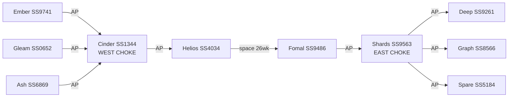

# Starmap and Alderson points

Hard-science flavour: `Game/documentation/Rules.txt` §Alderson (design intent, **not** live `JUMP`). Weak points sit in the **stellar gravity-well corona**, typically **beyond the outermost planet**, always in **pairs**. Instant jump between matched points; getting *to* the point is in-system travel (weeks). No FTL except through points.

**Deep-space travel** (L10 ark / AU×drive, 52+ week interstellar without a jump) is the bypass that **retires chokepoints**. Until that engine rule exists, the only loadable path between the occupied pair and the empty leaves is: `MOVE` to AP orbit (AU-distance travel) then `JUMP`. Helios↔Fomal remains a **slow space** hop (26 wk), not a wormhole.

Galaxy occupancy and region tables: [galaxy.md](galaxy.md).

## Topology (two named chokes)

Helios (`SS4034`) and Fomal (`SS9486`) are a ~200 AU bound pair. That hop is **not** a chokepoint.

- **West choke: Cinder (`SS1344`).** Helios's only Alderson leads to Cinder. Ember, Gleam, Ash hang off Cinder's other points. Lithium / REE / xenon from Arbor must pass **Cinder**.
- **East choke: Shards (`SS9563`).** Fomal's only Alderson leads to Shards. Deep, Graph, Spare hang off Shards. Nitrates / methane / beryllium / extra habitable from Anvil must pass **Shards**.

No Helios↔empty or Fomal↔empty Alderson shortcuts. No Cinder↔Shards link.

```
[Ember] [Gleam] [Ash]
     \     |     /
        Cinder  ← WEST CHOKE
           |
        Helios ←→ (200 AU space) ←→ Fomal
           |                           |
        (no AP to east)            Shards ← EAST CHOKE
                                 /    |    \
                            [Deep] [Graph] [Spare]
```



## System coordinates (`X Y Z`)

Loader currently comments these out — still emit them.

| System | Id | X | Y | Z | Role |
|--------|----|---|---|---|------|
| Helios | `SS4034` | 0 | 0 | 0 | Occupied start A |
| Fomal | `SS9486` | 1 | 0 | 0 | Occupied start B (pair axis) |
| Cinder | `SS1344` | -2 | 0 | 0 | **West choke** |
| Ember | `SS9741` | -4 | 1 | 0 | Leaf off Cinder (`lithia`) |
| Gleam | `SS0652` | -4 | 0 | 0 | Leaf off Cinder (`reeox`) |
| Ash | `SS6869` | -4 | -1 | 0 | Leaf off Cinder (`xenon`) |
| Shards | `SS9563` | 3 | 0 | 0 | **East choke** |
| Deep | `SS9261` | 5 | 1 | 0 | Leaf off Shards (`methn`, hab moon later) |
| Graph | `SS8566` | 5 | 0 | 0 | Leaf off Shards (habitable prize) |
| Spare | `SS5184` | 5 | -1 | 0 | Leaf off Shards (`berylm`) |

## Alderson points as in-system objects

Each point is a **planet** `type="adpnt"` (catalog) at high **AU** (beyond the outermost body). Ids 6 chars. Attrs `to-system` / `to-point` define the paired AP. No regions — only an `<orbit>` element.

A ship `MOVE`s to the AP **orbit** directly (e.g., `MOVE A87783`). The engine resolves to `Planet.All[id].Orbit`. Duration is calculated from AU distance and drive thrust. Once at the AP orbit, `JUMP` transits instantly to the paired AP orbit. No regions exist on APs — only an orbit for stacks to occupy (fortresses, stations).

| Local id | name-en | System | AU | Outermost body AU | Peer system | Peer id | Orbit |
|----------|---------|--------|----|-------------------|-------------|---------|-------|
| `A87783` | Helios-Cinder Alderson point | `SS4034` Helios | 42 | Aeolus 5.2 | `SS1344` | `A93873` | `O0A271` |
| `A93873` | Cinder-Helios Alderson point | `SS1344` Cinder | 45 | giant 8 | `SS4034` | `A87783` | `O0A119` |
| `A41181` | Cinder-Ember Alderson point | `SS1344` Cinder | 48 | giant 8 | `SS9741` | `A31286` | `O0A912` |
| `A31286` | Ember-Cinder Alderson point | `SS9741` Ember | 40 | ice-giant 4.1 | `SS1344` | `A41181` | `O0A110` |
| `A34815` | Cinder-Gleam Alderson point | `SS1344` Cinder | 52 | giant 8 | `SS0652` | `A51877` | `O0A761` |
| `A51877` | Gleam-Cinder Alderson point | `SS0652` Gleam | 38 | ice-dust 0.8 | `SS1344` | `A34815` | `O0A567` |
| `A17155` | Cinder-Ash Alderson point | `SS1344` Cinder | 58 | giant 8 | `SS6869` | `A88040` | `O0A160` |
| `A88040` | Ash-Cinder Alderson point | `SS6869` Ash | 70 | outer giant 18 | `SS1344` | `A17155` | `O0A279` |
| `A84608` | Fomal-Shards Alderson point | `SS9486` Fomal | 44 | giant 6.0 | `SS9563` | `A39322` | `O0A289` |
| `A39322` | Shards-Fomal Alderson point | `SS9563` Shards | 46 | outer belt 3.1 | `SS9486` | `A84608` | `O0A620` |
| `A59930` | Shards-Deep Alderson point | `SS9563` Shards | 50 | outer belt 3.1 | `SS9261` | `A41442` | `O0A216` |
| `A41442` | Deep-Shards Alderson point | `SS9261` Deep | 55 | outer giant 9.2 | `SS9563` | `A59930` | `O0A735` |
| `A98549` | Shards-Graph Alderson point | `SS9563` Shards | 54 | outer belt 3.1 | `SS8566` | `A09509` | `O0A352` |
| `A09509` | Graph-Shards Alderson point | `SS8566` Graph | 42 | belt 2.5 | `SS9563` | `A98549` | `O0A209` |
| `A01221` | Shards-Spare Alderson point | `SS9563` Shards | 60 | outer belt 3.1 | `SS5184` | `A60069` | `O0A704` |
| `A60069` | Spare-Shards Alderson point | `SS5184` Spare | 40 | belt 2.4 | `SS9563` | `A01221` | `O0A650` |

**Counts:** occupied systems **one** AP each. Each choke **degree 4** (four AP objects). Each leaf **one** AP back to its choke. **16** objects, **8** pairs. No inner-system APs (none at 1 AU).

XML structure (no regions, orbit only):

```xml
<planet name="A87783" name-en="Helios-Cinder Alderson point" type="adpnt" AU="42"
        to-system="SS1344" to-point="A93873">
  <orbit name="O0A271"/>
</planet>
```

Ships `MOVE` to AP id; engine resolves to AP orbit. Then `JUMP` for instant transit to paired AP orbit. To leave: `MOVE` to any planet/moon in-system (resolves to its orbit).

Engine growth: [engine-wishlist.md](engine-wishlist.md) — orbit-to-orbit movement duration (AU-based), `JUMP` order, `unstable` gating, chokepoint until deep-space transit.
