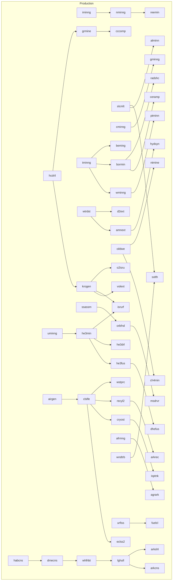
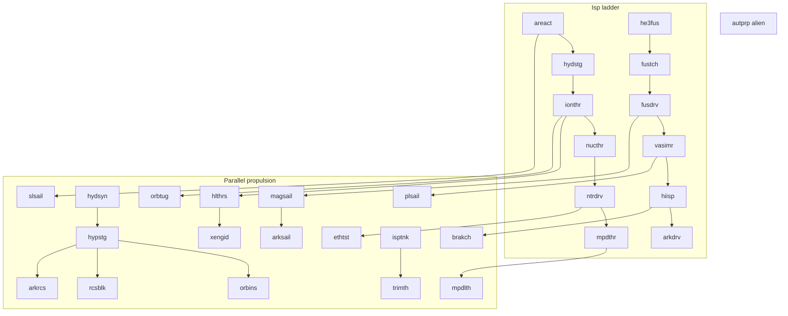
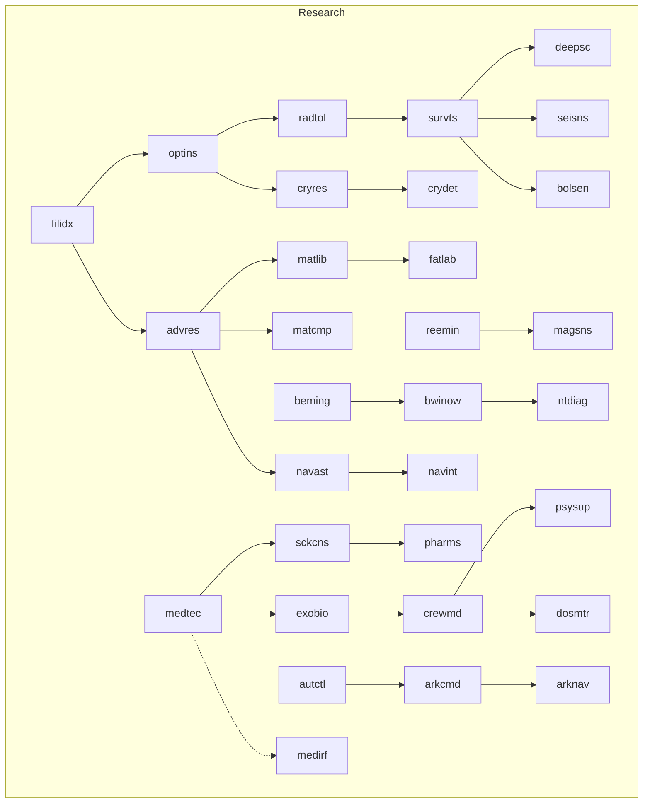
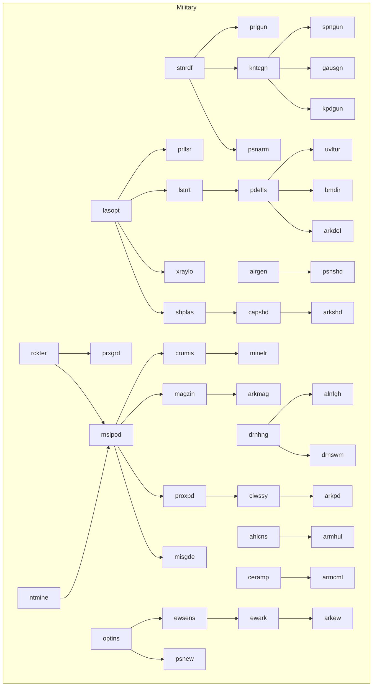

# Technology tree (levels 0–10)

Campaign baseline: **every live id** from `Tests/data.xml` (player manuals `player/basic_technologies.md`, `player/advanced_technologies.md`). Do **not** rename live ids. Tech `airgen` builds module `lifsys` — there is no live tech named `lifsys`.

Tags used for `RESEARCH` targeting: `production`, `propulsion`, `research`, `military`. One primary tag per tech. Extraction, energy, habitat, and medical sit under production or research as noted.

`requires` is a research *preference*, not a USE gate. Campaign XML should still set it so `RESEARCH TECHNOLOGY` walks the branch. Live catalog omits `requires` on most L0–L1 and several alien L2–L3 ids; **campaign may add** the edges in the mermaid without changing Tests fixtures.

Research cost if `cost` omitted: `8 * 2^(level-1)` (L1=8 … L10=4096). Live overrides: `rckter` 4, `engshp` 4. Do not cheapen except alien-derived copies.

**Level 10:** a pressure hull for **thousands of crew**, nested closed-loop ECLSS and agriculture, fusion-pulse drive, inner-system transits in **weeks** (Gate in **4 weeks**). **Level 2** already unlocks a basic He3 **fusion torch** for AU hops (13-week Gate band). No FTL. Physics: [au-transit.md](au-transit.md).

Combat attack/damage/HP and military `use-time` ladders: **[combat-balance.md](combat-balance.md)** (capture in ≤10 rounds; small=3 / medium=8).

Gravity, atmosphere, temperature, and water→fuel/food: **[environments.md](environments.md)**.

Module ids ≤ 6 characters. Live module **groups** only. New consume item ids are the closed set in `designer/resources.md` — do not invent an ore here without a row there.

Alien wreckage: one tech copy per find, mixed branches. t=1 wrecks L3–L6. L9–L10 unique, outer systems, mid-game.

## Combat matchups

Four **weapon groups** and the defence that **resists** them:

| Weapon group | Resisted by | Typical modules |
|--------------|-------------|-----------------|
| **Laser** (photons, beams) | **Shields** (plasma / magnetic / gas-fed) | turrets, beam directors, personal laser |
| **Drone** (autonomous vehicles as weapons) | **EW** (jamming, spoofing, datalink kill) | drone hangars, fighters used as drones, EW suites |
| **Missile** (guided, standoff, magazines) | **Point-blank defence** (last-ditch PD: CIWS, proximity, nuclear/isotope burst) | missile pods, cruise, magazines, mines-as-missiles |
| **Kinetic** (rails, guns, unguided mass, rams) | **Armour** (plates, Whipple, ceramics, composites) | railguns, gauss, gun placements, spinal kinetics |

**Same groups at every scale.** Fighters and drones mount the **same** four weapon groups (a fighter is a drone-scale platform that can carry laser, kinetic, missile, or be the drone-group weapon itself). Infantry and tanks mount the **same** four groups plus personal defences: rocket launchers (missile), rail guns (kinetic), lasers, personal armour, personal shields. Do not invent a fifth space-only damage type.

Notes column labels: `laser` `shield` `drone` `ew` `missile` `pbpd` `kinetic` `armour`.

Until Battle grows typed resolution, encode intent as `attack`/`damage` on weapons, `defense` on the matching resist module, plus flavour and **signature consume** (gases → laser/shield, minerals → kinetic/armour, isotopes → missile/pbpd, silicons → drone/EW). See `resources.md` Military affinities.

| Scale | Laser | Shield | Drone | EW | Missile | PBPD | Kinetic | Armour |
|-------|-------|--------|-------|-----|---------|------|---------|--------|
| Infantry / tank | item `prllsr`; `bltlas` | item `psnshd` | — | item `psnew` | live `rctlnc` | item `prxgrd` | item `prlgun`; `gunplc`; `tanks` | item `psnarm`; `tanks` platform |
| Fighter / drone | same `prllsr`; nest `laztrt` | same `psnshd` | live `alndrn` **is** the drone weapon; `drnbay` | nest `ewantn` | `rctlnc` / nest `msltub` | nest `proxpd` | same `prlgun`; nest `railgn` | nest `cermpl` / `psnarm` |
| Capital / ark | `laztrt` `xraylz` `pdltur` `uvltur` `bmdir` `arkdef` | `shplas` `capshd` `arkshd` | `drnbay` `alndrn` `drnctl` | `ewantn` `ewark` `arkew` | `msltub` `crumis` `magzin` `knmine` `arkmag` | `proxpd` `ciwst` `arkpd` | `gunplc` `railgn` `kpdtur` `coilgn` `spnknc` | `cermpl` `armplt` nested |

`arkdef` is **laser** area grid, not a blob. Nest `arkshd` (shield), `arkew` (EW), `arkpd` (pbpd), `arkmag` (missile ammo), `armplt`/`cermpl` (armour). `arkshl` remains the **radiation** habitat shelter (production), not a combat shield.

`kpdgun`/`kpdtur` is **kinetic**, not missile-PD. `pdefls`/`pdltur` is **laser**. `ciwssy`/`ciwst` is **pbpd** only.

### Classification (live + campaign)

| Group | Techs | Modules / items |
|-------|-------|-----------------|
| `laser` | live `lasopt` `lstrrt` `xraylo`; campaign `prllsr` `pdefls` `uvltur` `bmdir` `arkdef` | `bltlas` `laztrt` `xraylz` `pdltur` `uvltur` `bmdir` `arkdfn`; item `prllsr` |
| `shield` | `psnshd` `shplas` `capshd` `arkshd` | `shplas` `capshd` `arkshd`; item `psnshd` |
| `drone` | live `drnhng` `alnfgh`; campaign `drnswm` | `drnbay` `alndrn` `drnctl` — `alndrn` **is** the drone-group weapon; a fighter may also **mount** the other three weapons |
| `ew` | `psnew` `ewsens` `ewark` `arkew` | `ewantn` `ewark` `arkew`; item `psnew` |
| `missile` | live `rckter`; campaign `mslpod` `misgde` `crumis` `magzin` `minelr` `arkmag` | `msltub` `crumis` `magzin` `knmine` `arkmag` `miscpu`; live item `rctlnc` |
| `pbpd` | `prxgrd` `proxpd` `ciwssy` `arkpd` | `proxpd` `ciwst` `arkpd`; item `prxgrd` |
| `kinetic` | live `stnrdf`; campaign `prlgun` `kntcgn` `kpdgun` `gausgn` `spngun` | `gunplc` `railgn` `kpdtur` `coilgn` `spnknc`; item `prlgun`; live `smlarm` is L0 kinetic flavour |
| `armour` | `psnarm` `armcml` `armhul` | `cermpl` `armplt`; item `psnarm` |
| mixed platform | live `frminf` `armcbt`; `miltac` (command, not a damage type) | `inftry` `tanks` — mount the four weapon items plus personal defences |

## Branch coverage (no empty branch at a level)

L3–L10 target: production 3–5, propulsion 2–3, research 2–3, military 2–3. Live L3 production is already dense; extras there are energy/chemical/extract **variety**, not more factories. Propulsion keeps the Isp ladder **and** sail / hypergolic / Hall / lithium-MPD / mag-sail options.

| Lv | Production | Propulsion | Research | Military |
|----|------------|------------|----------|----------|
| 0 | dense live | `areact` | `filidx` | `stnrdf` **kinetic** |
| 1 | live + `nminng` `gminng` | `hydstg` | `optins` | armour/infantry/lasers + **`prlgun` `prllsr` `psnarm`** |
| 2 | live He3/autfab/habitat + `alminn` `krogen` | **`fustch`** `ionthr` | `medtec` `medirf` | `xraylo` **laser** + **`psnshd` `psnew`** |
| 3 | live He3/dome/hull + `amnext` `ch4min` `ntmine` `solth` `hydsyn` | `autprp` `nucthr` `slsail` | `advres` `sckcns` `pharms` | `drnhng` **drone** `mslpod` **missile** `ewsens` **ew** `prxgrd` **pbpd** |
| 4 | `orbfnd` `d2ext` `volext` `fuelcl` `liming` `xeming` | `ntrdrv` `hypstg` `hlthrs` | `radtol` `cryres` `matcmp` | `alnfgh` **drone** `kntcgn` **kinetic** `shplas` **shield** |
| 5 | `clslfe` `isrurf` `wminng` `o2isru` `ceramp` `bormin` `beming` | `mpdthr` `mpdlth` `ethtst` | `survts` `seisns` `bwinow` | `pdefls` **laser** `kpdgun` **kinetic** `armcml` **armour** |
| 6 | `dhefus` `whlhbt` `ptminn` `reemin` `grmine` `cccomp` | `fusdrv` `magsail` `xengid` | `matlib` `magsns` `ntdiag` | `drnswm` **drone** `gausgn` **kinetic** `proxpd` **pbpd** |
| 7 | `msdrvr` `cryost` `metrec` `biofab` | `vasimr` `orbins` `plsail` | `exobio` `navast` `fatlab` | `armhul` **armour** `crumis` **missile** `uvltur` **laser** |
| 8 | `lghull` `radshc` `recyl2` `insltc` | `isptnk` `rcsblk` `trimth` | `deepsc` `bolsen` `crydet` | `spngun` **kinetic** `magzin` **missile** `capshd` **shield** `bmdir` **laser** |
| 9 | `eclss2` `agrark` `shldsp` `wstprc` | `hiisp` `orbtug` `brakch` | `crewmd` `psysup` `navint` | `ciwssy` **pbpd** `ewark` **ew** `minelr` **missile** |
| 10 | `arkcns` `arkshl` `arkrec` | `arkdrv` `arkrcs` `arksail` | `arkcmd` `arknav` `dosmtr` | `arkdef` **laser** `arkshd` **shield** `arkew` **ew** `arkpd` **pbpd** |

**L0–L1 gaps:** filled at L1 (`hydstg`, `optins`). **L4** is not only `alnfgh`. **L10** ark hull/drive/bridge/grid plus shielding, recycling, RCS, sail abort, nav, dosimetry, magazines, EW.

New ids are **bold** in the tables below. Live rows keep catalog consume/produce.

## Requires (campaign tree)

Arrow = `requires` (research preference). Grey = live. Campaign-only edges on live ids are marked `*`.









`nucthr` prefers both `ionthr` and `urfiss` — catalog `requires` is a single id; set `requires="ionthr"` and treat `urfiss` as flavour (fission power for the electric stage).

| Tech | Requires |
|------|----------|
| `he3min` | `uminng` (live) |
| `he3fus` | `he3min` (live) |
| `he3drl` | `he3min` (live) |
| `xraylo` | `lasopt` (live) |
| `lstrrt` | `lasopt` (live) |
| `advres` | `filidx` (live) |
| `nminng` | `iminng` |
| `gminng` | `cminng` |
| `alminn` | `slcmlt` |
| `krogen` | `hcdril` |
| `amnext` | `wtrdst` |
| `ch4min` | `oildwe` |
| `volext` | `krogen` |
| `d2ext` | `wtrdst` |
| `wminng` | `tminng` |
| `ptminn` | `wminng` |
| `hydstg` | `areact` |
| `ionthr` | `hydstg` |
| `nucthr` | `ionthr` |
| `ntrdrv` | `nucthr` |
| `mpdthr` | `ntrdrv` |
| `fustch` | `he3fus` |
| `fusdrv` | `fustch` |
| `vasimr` | `fusdrv` |
| `hiisp` | `vasimr` |
| `arkdrv` | `hiisp` |
| `optins` | `filidx` |
| `medirf` | `medtec` (campaign edge; ocean harvest) |
| `sckcns` | `medtec` |
| `pharms` | `sckcns` |
| `radtol` | `optins` |
| `survts` | `radtol` |
| `deepsc` | `survts` |
| `matlib` | `advres` |
| `exobio` | `medtec` |
| `crewmd` | `exobio` |
| `arkcmd` | `autctl` |
| `orbfnd` | `ssassm` |
| `msdrvr` | `orbfnd` |
| `clslfe` | `airgen` |
| `eclss2` | `clslfe` |
| `cryost` | `clslfe` |
| `isptnk` | `cryost` |
| `isrurf` | `he3min` |
| `whlhbt` | `dmecns` |
| `lghull` | `whlhbt` |
| `arkcns` | `lghull` |
| `agrark` | `afrmng` |
| `dhefus` | `he3fus` |
| `kntcgn` | `stnrdf` |
| `spngun` | `kntcgn` |
| `pdefls` | `lstrrt` |
| `ciwssy` | `proxpd` |
| `arkdef` | `pdefls` |
| `kpdgun` | `kntcgn` |
| `shplas` | `lasopt` |
| `prlgun` | `stnrdf` |
| `prllsr` | `lasopt` |
| `psnarm` | `stnrdf` |
| `psnshd` | `airgen` |
| `psnew` | `optins` |
| `proxpd` | `mslpod` |
| `capshd` | `shplas` |
| `arkshd` | `capshd` |
| `arkpd` | `ciwssy` |
| `drnswm` | `drnhng` |
| `armhul` | `ahlcns` |
| `ntmine` | `oildwe` |
| `solth` | `wndtrb` |
| `hydsyn` | `amnext` |
| `slsail` | `areact` |
| `mslpod` | `ntmine` |
| `ewsens` | `optins` |
| `fuelcl` | `urfiss` |
| `liming` | `wtrdst` |
| `xeming` | `volext` |
| `hypstg` | `hydsyn` |
| `hlthrs` | `ionthr` |
| `cryres` | `optins` |
| `matcmp` | `advres` |
| `o2isru` | `krogen` |
| `ceramp` | `bormin` |
| `bormin` | `tminng` |
| `beming` | `tminng` |
| `mpdlth` | `mpdthr` |
| `ethtst` | `ntrdrv` |
| `seisns` | `survts` |
| `bwinow` | `beming` |
| `armcml` | `ceramp` |
| `reemin` | `nminng` |
| `grmine` | `hcdril` |
| `cccomp` | `grmine` |
| `magsail` | `fusdrv` |
| `xengid` | `hlthrs` |
| `magsns` | `reemin` |
| `ntdiag` | `bwinow` |
| `gausgn` | `kntcgn` |
| `misgde` | `mslpod` |
| `metrec` | `orbfnd` |
| `biofab` | `krogen` |
| `orbins` | `hypstg` |
| `plsail` | `vasimr` |
| `navast` | `advres` |
| `fatlab` | `matlib` |
| `crumis` | `mslpod` |
| `uvltur` | `lstrrt` |
| `radshc` | `bormin` |
| `recyl2` | `clslfe` |
| `insltc` | `slcmlt` |
| `rcsblk` | `hypstg` |
| `trimth` | `isptnk` |
| `bolsen` | `survts` |
| `crydet` | `cryres` |
| `magzin` | `mslpod` |
| `prxgrd` | `rckter` |
| `bmdir` | `pdefls` |
| `shldsp` | `radshc` |
| `wstprc` | `clslfe` |
| `orbtug` | `ionthr` |
| `brakch` | `hiisp` |
| `psysup` | `crewmd` |
| `navint` | `navast` |
| `ewark` | `ewsens` |
| `minelr` | `crumis` |
| `arkshl` | `radshc` |
| `arkrec` | `recyl2` |
| `arkrcs` | `rcsblk` |
| `arksail` | `magsail` |
| `arknav` | `arkcmd` |
| `dosmtr` | `crewmd` |
| `arkmag` | `magzin` |
| `arkew` | `ewark` |

---

## Level 0 — live (always known)

Primary tags assigned for campaign research targeting. Consume/produce are live catalog.

### Production

| Id | Name | Consume | Produce | Notes |
|----|------|---------|---------|-------|
| `fossil` | fossil use | 100 `iron` | `cplant` | Burns `carbon`. Use-time 8. Tag production |
| `oilbrn` | oil burning | 80 `iron` | `oplant` | Burns `oil`. Use-time 10 |
| `wndtrb` | wind turbines | 1 `iron` | `wnplnt` | Needs `terair` world to operate. Use-time 2. `wnplnt` may sit on solid-surface or liquid-surface |
| `hcdril` | hydrocarbons drilling | — | 1 `carbon` | Extraction, solid-surface |
| `indust` | industrial automation | 15 `iron`, 10 `titani` | `factry` | Use-time 4. Tag production |
| `popcnt` | population center | 100 `iron` | `city` | Solid-surface + `terair`. Use-time 26 |
| `agrplx` | agricultural complex | 10 `iron` | `farms` | Solid-surface + `terair`. Use-time 4 |
| `farmng` | intensive farming | — | 5 `food` | Agricultural, ocean world, `terair` |
| `corpmg` | corporate management | 10 `iron`, 2 `copper`, 5 `silici` | `corphq` | Use-time 6. Tag production |
| `iminng` | iron mining | — | 3 `iron` | Extraction, solid-surface |
| `sdrill` | mineral surface drilling | 25 `iron` | `sdrill` | Use-time 3 |
| `slcmlt` | silicium melting | — | 1 `silici` | Extraction, solid-surface. Use-time 2 |
| `tminng` | titanium mining | — | 2 `titani` | Extraction, solid-surface |
| `oildwe` | oil dwelling | — | 2 `oil` | Extraction |
| `uminng` | uranium mining | — | 1 `uraniu` | Extraction. Use-time 8 |
| `cminng` | copper mining | — | 2 `copper` | Extraction |
| `wtrdst` | water distillation | — | 3 `h2o2` | Extraction (electrolysis/distill of regional water/ice) |
| `grndtr` | ground transport | 2 `iron` | `trucks` | Use-time 2 |
| `nvltrs` | naval transport | 2 `iron` | `coastr` | Use-time 2. Displacement cargo hull; naval MOVE; operates on solid-surface (port) and liquid-surface |
| `fshng` | fishery construction | 10 `iron` | `fshfrm` | Use-time 4. Built in a factory. Flavour: terair worlds; nets plus photic seaweed/algae; tow to sea |
| `fshhrv` | fishery harvest | — | 5 `food` | Agricultural, `fshfrm` only, liquid-surface + `terair` (no ocean-planet gate). Fish plus photic seaweed/algae |
| `strans` | small scale transportation | 2 `iron`, 2 `titani` | `cargob` | Use-time 2 |
| `crewhs` | crew housing | 3 `iron`, 2 `titani` | `crwqrt` | Use-time 2 |
| `airgen` | breathing-gas generation | 2 `iron`, 1 `copper` | `lifsys` | Produces `terair` in operation. Use-time 2 |
| `orassm` | orbital complexes assembly | 2 `iron` | `orcmpx` | Orbit. Use-time 5 |
| `ssassm` | space ship assembly | 6 `iron`, 4 `titani` | `sshull` | Orbit. Use-time 4 |
| `shtlas` | shuttles assembly | 2 `iron`, 1 `titani`, 1 `silici` | `shuttl` | Use-time 4 |
| `spctrl` | space control | 1 `iron`, 4 `titani`, 1 `silici` | `cbridg` | Use-time 3 |
| `urfiss` | uranium fission | 2 `iron`, 8 `titani`, 5 `copper` | `fisrec` | Burns `uraniu`, produces `wastes`. Use-time 6 |

### Propulsion

| Id | Name | Consume | Produce | Notes |
|----|------|---------|---------|-------|
| `areact` | action and reaction | 10 `iron`, 10 `titani` | `rctdrv` | Chemical/thermal rocket; **fuel `h2o2`**. Space speed **0.5** — orbit / short hops, **not** AU. Use-time 2. **Only live L0 propulsion** |

### Research

| Id | Name | Consume | Produce | Notes |
|----|------|---------|---------|-------|
| `filidx` | file indexing | 1 `iron`, 3 `silici` | `cmplib` | Tag research. Use-time 2. **Only live L0 research** |

### Military

| Id | Name | Consume | Produce | Notes |
|----|------|---------|---------|-------|
| `stnrdf` | stationary defense | 2 `iron`, 2 `titani` | `gunplc` | Tag military. **kinetic**. Use-time 4 |

---

## Level 1 — live + gap fills

Copy required. Capacity 1. Cost 8 unless noted.

### Production

| Id | Name | Requires | Use-time | Consume | Produce | Notes |
|----|------|----------|----------|---------|---------|-------|
| `ctypln` | city planning | — | 26 | 500 `cash`, 26 `iron`, 1 `city` | `mtrply` | Live |
| `afrmng` | advanced farming | — | 1 | — | 8 `food` | Live; ocean + `terair` |
| `cdrill` | mineral core drilling | — | 3 | 25 `iron`, 10 `titani` | `cdrill` | Live |
| `servic` | preventive servicing | — | 1 | 1 `titani`, 1 `iron`, 1 `copper`, 1 `silici` | 10 `spare` | Tag repair |
| `repair` | repair and maintenance | — | 2 | 1 `spare` | effect repair | USE of effect not executed; issue `REPAIR` |
| `engshp` | engineering shop | — | 2 | 5 `iron` | `engshp` | Cost 4. Tags production, repair |
| `lawenf` | law enforcement | — | 4 | 6 `iron` | `jail` | Live |
| `wastdp` | waste disposal | — | 1 | 2 `wastes` | — | Spacecraft; solar disposal |
| **`nminng`** | nickel-iron extraction | `iminng` | 1 | — | 2 `nickfe` | M-type metal: Fe-Ni alloy from `lrmast`/`smmast`. Extraction, solid-surface |
| **`gminng`** | gold recovery | `cminng` | 2 | — | 1 `gold` | Cyanide-free gravity/amalgam analogue on hydrothermal veins. Extraction |

### Propulsion (gap)

| Id | Name | Requires | Use-time | Consume | Produce | Notes |
|----|------|----------|----------|---------|---------|-------|
| **`hydstg`** | staged hydrolox / oxyhydro | `areact` | 5 | 8 `iron`, 4 `titani`, 2 `copper` | `hydnoz` | Regenerative-cooled nozzle, staged combustion of H2/O2 from water or stored `h2o2`. Vacuum Isp ~450 s. **Fuel `water` or `h2o2`**. Space speed **0.5**. Not nuclear, not AU |

### Research (gap)

| Id | Name | Requires | Use-time | Consume | Produce | Notes |
|----|------|----------|----------|---------|---------|-------|
| **`optins`** | optical and IR instruments | `filidx` | 4 | 6 `silici`, 4 `copper`, 2 `iron`, 1 `gold` | `optlab` | Diffraction-limited telescopes, FTIR, gold-coated contacts. Tag research. Output 1, tech-cap 5 |

### Military

| Id | Name | Requires | Use-time | Consume | Produce | Notes |
|----|------|----------|----------|---------|---------|-------|
| `armcbt` | armored combat | — | 4 | 6 `iron`, 2 `titani` | `tanks` | **kinetic**+**armour** platform (oil engines). Tag military |
| `nvlcbt` | naval combat | — | 10 | 8 `iron`, 2 `titani` | `gunbot` | **kinetic** gunboat (oil engines). Naval MOVE. Tag military |
| `frminf` | form infantry battalion | — | 13 | 1 `iron` | `inftry` | Mixed infantry; mount items below. Tag military |
| `rckter` | rocket launcher production | — | 2 | 1 `iron` | item `rctlnc` | **missile**. Cost 4. Live consume; L3+ missiles pull `nitrat`/`uraniu` |
| `lasopt` | laser optics | — | 4 | 2 `terair`, 2 `h2o2`, 2 `copper` | `bltlas` | **laser**. Campaign retune: working gas + electrodes. Tag military |
| `lstrrt` | laser turret | `lasopt` | 4 | 2 `iron`, 4 `terair`, 2 `h2o2` | `laztrt` | **laser**. Campaign retune: gases |
| `miltac` | military tactics | — | 1 | — | — | Battle tech; initiative 5; command group |
| **`prlgun`** | personal rail gun | `stnrdf` | 3 | 2 `iron`, 1 `titani` | item `prlgun` | **kinetic**. Infantry/tank/fighter item. `tungst` from L5 guns |
| **`prllsr`** | personal laser | `lasopt` | 3 | 2 `terair`, 1 `copper`, 1 `h2o2` | item `prllsr` | **laser**. Same item at infantry and fighter scale |
| **`psnarm`** | personal armour | `stnrdf` | 3 | 2 `iron`, 1 `titani` | item `psnarm` | **armour**. Infantry/tank/EVA |

---

## Level 2 — live + gap fills

Capacity 2. Cost 16.

### Production

| Id | Name | Requires | Use-time | Consume | Produce | Notes |
|----|------|----------|----------|---------|---------|-------|
| `autfab` | automated fabrication | — | 6 | 15 `iron`, 10 `silici` | `robofc` | Alien; no crew. Tag production |
| `he3min` | helium-3 mining | `uminng` | 8 | — | 1 `heliu3` | Extraction; regolith/ice, **not** habitable basins |
| `he3fus` | helium-3 fusion | `he3min` | 1 | 1 `heliu3` | `fusrec` | Burns 3 `heliu3` / 13 wk |
| `habcns` | small habitat construction | — | 6 | 20 `iron`, 8 `titani` | `smhabi` | Pressure shell, solid-surface |
| **`alminn`** | aluminium from anorthosite | `slcmlt` | 2 | — | 2 `alumin` | Hall–Héroult analogue on highlands. Extraction, solid-surface |
| **`krogen`** | kerogen retorting | `hcdril` | 2 | — | 1 `kerogn` | Slow pyrolysis of carbonaceous chondrite organics. Extraction |

### Propulsion

AU hops (planet → local Gate) need a **fusion torch**, not chemical or ion. Physics and fuel: **[au-transit.md](au-transit.md)**. `he3fus` is already live L2 power; **`fustch`** is the missing drive.

| Id | Name | Requires | Use-time | Consume | Produce | Notes |
|----|------|----------|----------|---------|---------|-------|
| **`fustch`** | fusion torch drive | `he3fus` | 6 | 20 `titani`, 8 `silici`, 6 `copper`, 4 `heliu3` | `fustor` | Magnetic-nozzle He3 torch. **Fuel 2 `heliu3` / week** (thirstier than `rctdrv` 1 `h2o2` / wk). Space `speed` 1: Gate ~14 wk. Burn–coast–burn at ≤1.5 g. **Live in `campaign/data.xml`** |
| **`ionthr`** | electrostatic ion thrust | `hydstg` | 6 | 8 `titani`, 10 `copper`, 6 `silici` | `iondrv` | Gridded ion; water electrolyzed to H+/OH− then accelerated. High Isp, millinewtons. **Fuel `water`**. Station-keeping / cargo, **not** the Gate unlock |

### Research

| Id | Name | Requires | Use-time | Consume | Produce | Notes |
|----|------|----------|----------|---------|---------|-------|
| `medtec` | medical services | — | 6 | 1 `iron`, 2 `copper`, 2 `silici` | `medfac` | Live tag repair; **campaign primary tag research**. Builds the **clinic** (`medfac`), not the sick bay |
| `medirf` | medicines refining | `medtec` | 1 | — | 1 `medici` | **Ocean worlds only**, no cargo consume. Marine/coastal biomass, iodine, dissolved organics harvested in place. Campaign tag research. Keep as the cheap planetary path; do not silently move this USE onto `sckbay` |

### Military

| Id | Name | Requires | Use-time | Consume | Produce | Notes |
|----|------|----------|----------|---------|---------|-------|
| `xraylo` | x-ray laser optics | `lasopt` | 4 | 2 `terair`, 2 `volatl`, 2 `copper` | `xraylz` | **laser**. Campaign retune: gases. Tag military |
| **`psnshd`** | personal plasma shield | `airgen` | 4 | 3 `terair`, 2 `h2o2`, 1 `copper` | item `psnshd` | **shield**. Infantry/tank/fighter. Requires L2; campaign `requires` `airgen` until `shplas` exists |
| **`psnew`** | personal EW pack | `optins` | 3 | 3 `silici`, 2 `copper` | item `psnew` | **ew**. Datalink spoof; infantry and fighter |

---

## Level 3 — live + human propulsion + ices

Capacity 3. Cost 32.

### Production

| Id | Name | Requires | Use-time | Consume | Produce | Notes |
|----|------|----------|----------|---------|---------|-------|
| `he3drl` | dedicated helium-3 drilling | `he3min` | 1 | 30 `iron`, 10 `titani` | `he3ext` | 20 `heliu3` / 13 wk |
| `dmecns` | dome city construction | — | 10 | 40 `iron`, 20 `titani` | `dmdcty` | Airless rock; upkeep `food`+`terair` |
| `ahlcns` | advanced hull construction | — | 8 | 20 `titani` | `alnhul` | Alien geometry; no crew |
| `he3unc` | unmanned helium plant | — | 6 | 12 `titani` | `he3aut` | Burns `heliu3` |
| `autctl` | automated command systems | — | 5 | 8 `silici` | `autcmd` | Alien; sits under **research** for `arkcmd` edge, production build |
| **`amnext`** | ammonia ice mining | `wtrdst` | 2 | — | 2 `ammoni` | Outer-moon NH3 ice; N2 for air mix. Extraction, solid-surface |
| **`ch4min`** | methane ice mining | `oildwe` | 2 | — | 2 `methn` | Titan-class ices. Extraction, solid-surface |
| **`ntmine`** | nitrate evaporites | `oildwe` | 2 | — | 2 `nitrat` | Dry-lake oxidizer salts (NO3). Extraction. Signature **SS0007 Shards** |
| **`solth`** | solar thermal plant | `wndtrb` | 6 | 12 `silici`, 8 `alumin`, 4 `iron` | `solthp` | Concentrated sunlight, heat engine, no combustion. Energy group. Works in vacuum if radiators exist; best inner-system |
| **`hydsyn`** | hydrazine synthesis | `amnext` | 4 | 2 `ammoni` | 2 `hydzn` | Raschig analogue: NH3 → N2H4. Storable hypergolic fuel. Production USE |

`autctl` remains a live production USE; campaign **research tag** so the command branch is researchable as sensors/autonomy.

### Propulsion

| Id | Name | Requires | Use-time | Consume | Produce | Notes |
|----|------|----------|----------|---------|---------|-------|
| `autprp` | automated propulsion | — | 5 | 10 `titani` | `autdrv` | Alien; fuel `h2o2`. **Alien propulsion seed** |
| **`nucthr`** | nuclear-electric propulsion | `ionthr` | 8 | 12 `titani`, 6 `uraniu`, 8 `copper` | `nepeng` | Fission heat → Brayton/Rankine → kV to ion/MPD. **Fuel `uraniu`** (reactor) and **`water`** (propellant). Human line to NTR |
| **`slsail`** | solar sail | `areact` | 6 | 15 `alumin`, 4 `silici` | `slsmod` | Micron aluminium film, no reaction mass. Thrust falls as 1/r². Inner-system only. **No fuel** |

### Research

| Id | Name | Requires | Use-time | Consume | Produce | Notes |
|----|------|----------|----------|---------|---------|-------|
| `advres` | advanced computing | `filidx` | 1 | 4 `iron`, 12 `silici` | `advlib` | Live tag research. `autctl` stays a live production USE; `arkcmd` still `requires` it |
| **`sckcns`** | sick bay construction | `medtec` | 8 | 8 `iron`, 4 `titani`, 4 `copper`, 3 `silici` | `sckbay` | Inpatient ward. Tag research. **Not** a re-role of `medfac` |
| **`pharms`** | shipboard pharmacy | `sckcns` | 1 | 1 `food` | 1 `medici` | USE on a `sckbay` (live gate: `module-type-group="habitat"` until wishlist `module=`). Fermentation + sterile fill; energy of the ward runs the still. Anywhere the bay is nested — not ocean-gated |

### Sick bay vs medical facility (do not merge)

Live Tests `medfac` stays the L2 **clinic**: isolation, first aid, `habitat` 5, catalog `heal` 1.0 / `cure-chance="25"` (those tags are **not executed** today). Campaign does **not** re-role `medfac` into the sick bay.

New module **`sckbay`** (id 6 chars) is the inpatient surgical/recovery ward. Built only by **`sckcns`**. `crwqrt` `heal` 0.1 stays flavour and unimplemented; do not stack it with `sckbay`.

**`medirf` vs `pharms`:** ocean `medirf` is site-locked harvest (no cargo consume) — algae, iodine, dissolved organics in the water column. `pharms` spends 1 `food` (sugars/amino acids in rations; the ward’s energy runs a still so `water` cargo is not required — live catalog never produces `water` as an item before L5 `clslss`). Keep both. Do not ocean-gate the sick bay.

**Heal cadence** (engine must grow; unknown attrs on `<effect>` are ignored at load):

| Condition | Rate | Consume | Scope |
|-----------|------|---------|--------|
| No `medici` on the stack | 2 `wndtrn` → `terran` every **4 weeks** | none | **per `sckbay` quantity** (2 bays = 4 patients / 4 wk) |
| `medici` available | 4 `wndtrn` → `terran` every **1 week** | **1 `medici` per conversion**, not per week of occupancy | per `sckbay` quantity |

Weekly race `medici` deduct for remaining `wndtrn`/`madtrn` is separate supportive care. Do **not** also bill 1 `medici` per week while a bed is occupied — that double-taxes against the race consume TDD just landed.

**Order each week** (so the ward reduces who faces death, and does not double-kill):

1. Sick-bay conversions (`sckbay`), medici-funded first, then unmedicated 4-week clocks.
2. Weekly `medici` race consume for **remaining** `wndtrn`/`madtrn`.
3. On week 13 only: quarterly 25% die / 50% stay / 25% recover for whoever is still `wndtrn`. Converted patients skip the roll.

Unmedicated clock: each module quantity counts weeks without a medici-funded conversion; at 4, convert 2 `wndtrn` and reset. A week that converts with `medici` does **not** also tick this clock. Week 13 still runs step 1 before the quarterly roll. `madtrn` is psychiatric, not trauma — `sckbay` does not convert them.

These rates are **stronger than `medfac`**: the clinic’s catalog `heal` 1.0 is unused flavour; the ward actually returns two unmedicated casualties per four weeks, or four per week on packed doses.

Intended module XML (extra attrs ignored until TDD):

```xml
<effect type="heal" value="2" target="wndtrn" weeks="4" weeks-with-item="1" with-item-value="4" consume-item="medici" consume-quantity="1"/>
```

### Military

| Id | Name | Requires | Use-time | Consume | Produce | Notes |
|----|------|----------|----------|---------|---------|-------|
| `drnhng` | drone hangar construction | — | 6 | 8 `silici`, 6 `copper` | `drnbay` | **drone**. Campaign retune: silicons. `reeox` from L6 |
| **`mslpod`** | missile tube | `ntmine` | 5 | 6 `iron`, 6 `nitrat`, 2 `uraniu` | `msltub` | **missile**. Nitrate/U grain. Attack 6 damage 8 |
| **`ewsens`** | electronic warfare suite | `optins` | 4 | 6 `silici`, 4 `copper` | `ewantn` | **ew**. Jamming as defense/initiative. No cartoon disable |
| **`prxgrd`** | proximity grenades | `rckter` | 3 | 2 `nitrat`, 1 `uraniu`, 1 `iron` | item `prxgrd` | **pbpd**. Infantry/tank last-ditch burst; same item on fighters |

---

## Level 4 — industrial orbit (alnfgh is not the only L4)

Capacity 4. Cost 64.

### Production

| Id | Name | Requires | Use-time | Consume | Produce | Description |
|----|------|----------|----------|---------|---------|-------------|
| **`orbfnd`** | orbital foundry methods | `ssassm` | 8 | 40 `iron`, 20 `titani`, 15 `silici`, 8 `nickfe` | `orbfry` | Vacuum induction melting and electron-beam welding. Orbit `use`. Group production |
| **`d2ext`** | deuterium from ices | `wtrdst` | 6 | — | 1 `deutrm` | Electrolysis + cryogenic distillation of D/H. Extraction. **Not** habitable basins |
| **`volext`** | mixed-volatile ISRU | `krogen` | 4 | — | 2 `volatl` | Heat carbonaceous fines; capture H2O, CO2, N2. Extraction, `smcast`/`lrcast` |
| **`fuelcl`** | alkaline fuel cell | `urfiss` | 5 | 10 `silici`, 8 `copper`, 6 `titani` | `h2cell` | H2/O2 from `water`/`h2o2`; no PGM required. Energy ~40 / 13 wk. **Fuel `h2o2`** |
| **`liming`** | lithium brines | `wtrdst` | 3 | — | 1 `lithia` | Spodumene/brine; Li for MPD cathodes and batteries. Extraction. Signature **SS0003 Ember** |
| **`xeming`** | xenon from ices | `volext` | 8 | — | 1 `xenon` | Adsorbed noble gas in outer ice. Slow. Extraction. Signature **SS0006 Ash**. **Not** habitable basins |

### Propulsion

| Id | Name | Requires | Use-time | Consume | Produce | Description |
|----|------|----------|----------|---------|---------|-------------|
| **`ntrdrv`** | nuclear thermal propulsion | `nucthr` | 6 | 20 `titani`, 8 `uraniu`, 10 `copper` | `ntreng` | Solid-core UO2 heats H2. Isp ~800–900 s. **Fuel `water`** |
| **`hypstg`** | hypergolic upper stage | `hydsyn` | 5 | 10 `iron`, 6 `titani`, 4 `copper` | `hypeng` | Storable N2H4/NTO-class. Capture burns when NTR is off. **Fuel `hydzn`** |
| **`hlthrs`** | Hall-effect thruster | `ionthr` | 6 | 8 `titani`, 12 `copper`, 4 `silici` | `hlthst` | ExB plasma, **fuel `xenon`**. Higher thrust than water-ion, still electric |

### Research

| Id | Name | Requires | Use-time | Consume | Produce | Description |
|----|------|----------|----------|---------|---------|-------------|
| **`radtol`** | radiation-tolerant computing | `optins` | 4 | 8 `silici`, 4 `copper`, 2 `uraniu` | `radlab` | Shielded labs, ECC, SOI. Output 2, tech-cap 6 |
| **`cryres`** | cryogenic instrumentation | `optins` | 5 | 8 `copper`, 6 `titani`, 4 `silici` | `crylab` | LN2/LHe3 sensors, IR arrays. Output 2, tech-cap 5 |
| **`matcmp`** | composite layup methods | `advres` | 5 | 10 `silici`, 8 `carbon`, 4 `alumin` | `cmplab` | Fibre/matrix characterisation. Output 2, tech-cap 6 |

### Military

| Id | Name | Requires | Use-time | Consume | Produce | Description |
|----|------|----------|----------|---------|---------|-------------|
| `alnfgh` | alien fighter construction | — | 4 | 4 `silici`, 4 `copper` | `alndrn` | **drone**. Live alien seed. Campaign retune: silicons. The fighter **is** the drone-group weapon |
| **`kntcgn`** | kinetic gunnery | `stnrdf` | 5 | 20 `iron`, 8 `tungst`, 6 `nickfe` | `railgn` | **kinetic**. Rails, not magnets-as-EW. Attack 8 / damage 8 |
| **`shplas`** | ship plasma shield | `lasopt` | 5 | 8 `xenon`, 6 `terair`, 4 `methn` | `shplas` | **shield**. Resists **laser**. Defense 12, attack 0. Gas-fed plasma/magnetic bottle. **Not** a laser battery |

---

## Level 5 — closed loops and ISRU

Capacity 5. Cost 128.

### Production

| Id | Name | Requires | Use-time | Consume | Produce | Description |
|----|------|----------|----------|---------|---------|-------------|
| **`clslfe`** | closed-loop life support | `airgen` | 6 | 15 `titani`, 10 `copper`, 8 `silici`, 4 `ammoni` | `clslss` | Sabatier + electrolysis + amine CO2. Habitat. `wastes` → `terair`+`water` |
| **`isrurf`** | ISRU metal refining | `he3min` | 8 | 30 `iron`, 15 `titani` | `isrplt` | Regolith → metals, slag. Parallel to oxygen ISRU |
| **`o2isru`** | oxygen ISRU | `krogen` | 6 | 20 `iron`, 10 `silici`, 8 `volatl` | `o2plt` | Ilmenite/chondrite reduction → O2 stored as `h2o2`/`terair`. Extraction. **Not** a metal foundry |
| **`wminng`** | tungsten extraction | `tminng` | 8 | — | 1 `tungst` | Scheelite on vulcan vents. Signature **SS0005** (with boron) |
| **`bormin`** | boron extraction | `tminng` | 6 | — | 1 `boron` | Fumarole borates. Extraction. Signature **SS0005 Cinder** vulcan |
| **`beming`** | beryllium extraction | `tminng` | 8 | — | 1 `berylm` | Bertrandite/phenakite. Extraction. Signature **SS0010 Spare** |
| **`ceramp`** | engineering ceramics | `bormin` | 8 | 8 `boron`, 12 `silici`, 6 `alumin` | `cerkil` | B4C/SiC kiln. Production. Feedstock for ceramic armour |

### Propulsion

| Id | Name | Requires | Use-time | Consume | Produce | Description |
|----|------|----------|----------|---------|---------|-------------|
| **`mpdthr`** | methane MPD | `ntrdrv` | 6 | 20 `titani`, 15 `copper`, 5 `silici` | `mpddrv` | J×B plasma. **Fuel `methn`** |
| **`mpdlth`** | lithium MPD | `mpdthr` | 6 | 18 `titani`, 12 `copper`, 8 `lithia` | `limpd` | Li cathode, higher Isp than methane MPD. **Fuel `lithia`** (consumable electrode) |
| **`ethtst`** | electrothermal arcjet | `ntrdrv` | 5 | 10 `titani`, 10 `copper` | `arcjet` | Arc-heats `water`. Between chemical and ion. **Fuel `water`** |

### Research

| Id | Name | Requires | Use-time | Consume | Produce | Description |
|----|------|----------|----------|---------|---------|-------------|
| **`survts`** | survey spectrometry | `radtol` | 4 | 6 `silici`, 4 `copper` | `survsc` | Reflectance/emission spectra. Wishlist SEE |
| **`seisns`** | gravimetry and seismics | `survts` | 5 | 8 `silici`, 6 `iron`, 2 `gold` | `seissc` | Surface/asteroid interior. Output 1, tech-cap 5 |
| **`bwinow`** | beryllium x-ray windows | `beming` | 4 | 4 `berylm`, 6 `silici`, 2 `copper` | `bwinow` | Transparent to soft x-rays; neutron-low. Research group |

### Military

| Id | Name | Requires | Use-time | Consume | Produce | Description |
|----|------|----------|----------|---------|---------|-------------|
| **`pdefls`** | point-defense lasers | `lstrrt` | 4 | 6 `xenon`, 6 `terair`, 4 `h2o2` | `pdltur` | **laser**. Short-range beam, not missile-PD. High initiative |
| **`kpdgun`** | kinetic cannon | `kntcgn` | 4 | 12 `iron`, 6 `tungst`, 4 `nickfe` | `kpdtur` | **kinetic**. Rapid mass driver. Not pbpd |
| **`armcml`** | ceramic applique armour | `ceramp` | 6 | 12 `boron`, 8 `titani`, 6 `alumin` | `cermpl` | **armour**. B4C tiles. Defense 12 |

---

## Level 6 — fusion industrial

Capacity 6. Cost 256.

### Production

| Id | Name | Requires | Use-time | Consume | Produce | Description |
|----|------|----------|----------|---------|---------|-------------|
| **`dhefus`** | deuterium–helium-3 fusion | `he3fus` | 8 | 1 `deutrm`, 1 `platnm`, 8 `titani`, 8 `silici` | `dhefrc` | D–He3. **Burns `heliu3`+`deutrm`**. Energy ~250 / 13 wk |
| **`whlhbt`** | centrifugal habitat | `dmecns` | 10 | 80 `iron`, 40 `titani`, 20 `alumin` | `whlhul` | ~1 g at rim. Pop max ~2000 |
| **`ptminn`** | platinum-group recovery | `wminng` | 10 | — | 1 `platnm` | Trace PGM with Fe-Ni. Extraction |
| **`reemin`** | rare-earth oxides | `nminng` | 8 | — | 1 `reeox` | Monazite/bastnäsite on metal asteroids. Signature **SS0004 Gleam** |
| **`grmine`** | nuclear graphite | `hcdril` | 4 | — | 1 `grphit` | High-purity C, not coal. Extraction. Signature **SS0005 Cinder** (with boron) |
| **`cccomp`** | carbon–carbon composites | `grmine` | 8 | 12 `grphit`, 6 `tungst`, 10 `carbon` | `ccplnk` | 3-D C-C for throats and heatshields. Production |

### Propulsion

| Id | Name | Requires | Use-time | Consume | Produce | Description |
|----|------|----------|----------|---------|---------|-------------|
| **`fusdrv`** | fusion drive | `fustch` | 8 | 30 `titani`, 10 `silici`, 5 `heliu3` | `fuseng` | Improved torch (speed 2 planned). **Fuel `heliu3`**. Mass-cap ~2e5 |
| **`magsail`** | magnetic sail | `fusdrv` | 8 | 20 `copper`, 8 `reeox`, 10 `titani` | `mgsail` | Superconducting loop vs solar wind. No propellant. Outer-system braking |
| **`xengid`** | high-power xenon ion | `hlthrs` | 7 | 12 `titani`, 15 `copper`, 6 `silici` | `xendrv` | Gridded ion, **fuel `xenon`**. Parallel to water-ion; higher Isp |

### Research

| Id | Name | Requires | Use-time | Consume | Produce | Description |
|----|------|----------|----------|---------|---------|-------------|
| **`matlib`** | materials characterisation | `advres` | 6 | 12 `silici`, 6 `tungst` | `matlab` | Diffraction, hardness, fatigue |
| **`magsns`** | magnetometry | `reemin` | 5 | 6 `reeox`, 8 `silici`, 4 `copper` | `maglab` | SQUID/fluxgate. Output 2, tech-cap 6 |
| **`ntdiag`** | neutron diagnostics | `bwinow` | 6 | 4 `berylm`, 6 `silici`, 2 `uraniu` | `ntdiag` | Be windows, He3 tubes. Fusion/NTR diagnostics |

### Military

| Id | Name | Requires | Use-time | Consume | Produce | Description |
|----|------|----------|----------|---------|---------|-------------|
| **`drnswm`** | coordinated drones | `drnhng` | 5 | 10 `silici`, 6 `copper`, 4 `reeox` | `drnctl` | **drone**. Command for `alndrn` |
| **`gausgn`** | coilgun | `kntcgn` | 8 | 20 `iron`, 10 `tungst`, 8 `nickfe` | `coilgn` | **kinetic**. Dense armature; a little copper in coils is structure, not signature. Attack 10 damage 10 |
| **`misgde`** | missile guidance | `mslpod` | 4 | 8 `silici`, 4 `copper` | `miscpu` | **missile** seekers (silicon brains on isotope warheads). Command group |
| **`proxpd`** | proximity burst PD | `mslpod` | 5 | 8 `nitrat`, 4 `uraniu`, 2 `deutrm` | `proxpd` | **pbpd**. Last-ditch isotope/frag bursts vs incoming missiles. Not a laser, not a rail |

---

## Level 7 — interplanetary industry

Capacity 7. Cost 512.

### Production

| Id | Name | Requires | Use-time | Consume | Produce | Description |
|----|------|----------|----------|---------|---------|-------------|
| **`msdrvr`** | electromagnetic mass driver | `orbfnd` | 10 | 60 `iron`, 30 `copper`, 20 `titani`, 15 `nickfe` | `msdrst` | kA rails, surface-to-orbit |
| **`cryost`** | cryogenic bulk storage | `clslfe` | 5 | 20 `titani`, 10 `copper` | `crytnk` | LH2, LOX, LHe3, LCH4 |
| **`metrec`** | metals recycling | `orbfnd` | 6 | 15 `iron`, 8 `silici`, 4 `copper` | `recykl` | Scrap + `wastes` → 2 `iron` or 1 `spare` per USE. Production |
| **`biofab`** | cultured structural polymer | `krogen` | 8 | 10 `kerogn`, 8 `food`, 6 `silici` | `bioplt` | Microbial cellulose/PHA. Mass-light fittings, not magic biomass hulls |

### Propulsion

| Id | Name | Requires | Use-time | Consume | Produce | Description |
|----|------|----------|----------|---------|---------|-------------|
| **`vasimr`** | variable-Isp plasma | `fusdrv` | 8 | 25 `titani`, 15 `copper`, 8 `silici` | `vasmdr` | RF plasma. **Fuel `water` or `methn`** |
| **`orbins`** | chemical insertion stage | `hypstg` | 6 | 12 `iron`, 8 `titani` | `chmup2` | Restartable hypergolic for orbit capture. **Fuel `hydzn`**. Still useful next to fusion |
| **`plsail`** | plasma magnet sail | `vasimr` | 8 | 15 `copper`, 6 `reeox`, 8 `titani` | `plsail` | Inflated magnetosphere vs solar wind. Larger than `mgsail`, still no onboard propellant |

### Research

| Id | Name | Requires | Use-time | Consume | Produce | Description |
|----|------|----------|----------|---------|---------|-------------|
| **`exobio`** | exobiology protocols | `medtec` | 6 | 8 `silici`, 4 `medici` | `xbiolb` | Containment, PCR |
| **`navast`** | astrogation computers | `advres` | 6 | 12 `silici`, 8 `copper`, 2 `gold` | `navcmp` | N-body integrators, not FTL. Command/research. Tech-cap 6 |
| **`fatlab`** | cryo-fatigue lab | `matlib` | 6 | 8 `silici`, 6 `tungst`, 4 `alumin` | `fatlab` | Thermal-cycle coupons. Output 2 |

### Military

| Id | Name | Requires | Use-time | Consume | Produce | Description |
|----|------|----------|----------|---------|---------|-------------|
| **`armhul`** | spaced armour | `ahlcns` | 6 | 40 `titani`, 10 `tungst`, 8 `nickfe` | `armplt` | **armour**. Whipple + W fibre. Defense 15 |
| **`crumis`** | cruise missile | `mslpod` | 8 | 12 `iron`, 8 `nitrat`, 4 `uraniu`, 4 `hydzn` | `crumis` | **missile**. Flyout fuel `hydzn`; signature is nitrate/U. Attack 12 damage 14 |
| **`uvltur`** | ultraviolet laser | `lstrrt` | 6 | 8 `xenon`, 6 `volatl`, 4 `terair`, 2 `silici` | `uvltur` | **laser**. Shorter wavelength; gases as working medium, a little Si for optics |

---

## Level 8 — large hulls

Capacity 8. Cost 1024.

### Production

| Id | Name | Requires | Use-time | Consume | Produce | Description |
|----|------|----------|----------|---------|---------|-------------|
| **`lghull`** | large pressure hull | `whlhbt` | 12 | 120 `iron`, 80 `titani`, 20 `silici`, 20 `nickfe` | `lghul` | Thousands of m³. Group `frigate` until `capital` |
| **`radshc`** | radiation shelter construction | `bormin` | 8 | 15 `boron`, 8 `berylm`, 10 `grphit`, 20 `iron` | `radshd` | Boron + Be + graphite moderator/absorber stack. Habitat storm shelter |
| **`recyl2`** | closed-loop recycling | `clslfe` | 8 | 20 `titani`, 10 `silici`, 8 `copper`, 4 `platnm` | `recylr` | Metals, water, air from `wastes`. Production |
| **`insltc`** | silica aerogel insulation | `slcmlt` | 6 | 12 `silici`, 4 `alumin` | `insltn` | Supercritical-dried silica sol; habitat MLI analogue. No separate aerogel item |

### Propulsion

| Id | Name | Requires | Use-time | Consume | Produce | Description |
|----|------|----------|----------|---------|---------|-------------|
| **`isptnk`** | interplanetary tanker | `cryost` | 8 | 50 `titani`, 20 `copper` | `tanker` | Moves volatiles. **Fuel `h2o2`** |
| **`rcsblk`** | RCS cluster | `hypstg` | 4 | 8 `titani`, 6 `copper` | `rcspod` | Attitude/translation. **Fuel `hydzn`**. Storable when main drive is fusion |
| **`trimth`** | trim and station-keeping | `isptnk` | 5 | 10 `titani`, 8 `silici` | `trimth` | Low-thrust xenon/water. **Fuel `xenon` or `water`** |

### Research

| Id | Name | Requires | Use-time | Consume | Produce | Description |
|----|------|----------|----------|---------|---------|-------------|
| **`deepsc`** | long-baseline sensing | `survts` | 6 | 15 `silici`, 10 `copper`, 2 `gold` | `dpsens` | Interferometry, not FTL |
| **`bolsen`** | bolometer arrays | `survts` | 5 | 8 `silici`, 4 `gold`, 4 `reeox` | `bolsen` | Sub-mm thermal sensors |
| **`crydet`** | cryogenic detectors | `cryres` | 6 | 8 `copper`, 4 `berylm`, 6 `silici` | `crydet` | TES/KID at kelvin temperatures |

### Military

| Id | Name | Requires | Use-time | Consume | Produce | Description |
|----|------|----------|----------|---------|---------|-------------|
| **`spngun`** | spinal kinetic | `kntcgn` | 10 | 80 `iron`, 20 `tungst`, 15 `nickfe` | `spnknc` | **kinetic**. Ship-length rail. Attack 14 / damage 16 |
| **`magzin`** | missile magazine | `mslpod` | 6 | 20 `nitrat`, 10 `uraniu`, 8 `iron` | `magzin` | **missile**. Nested isotope grain, not rail slugs. Group storage |
| **`bmdir`** | beam director | `pdefls` | 8 | 10 `xenon`, 8 `terair`, 4 `h2o2`, 4 `silici` | `bmdir` | **laser**. Fast-steering optics; gases for the beam path, a little Si |
| **`capshd`** | capital plasma shield | `shplas` | 8 | 12 `xenon`, 8 `methn`, 6 `volatl` | `capshd` | **shield**. Scale-up of `shplas`. Defense 16, attack 0 |

---

## Level 9 — self-sufficiency parts

Capacity 9. Cost 2048.

### Production

| Id | Name | Requires | Use-time | Consume | Produce | Description |
|----|------|----------|----------|---------|---------|-------------|
| **`eclss2`** | regenerative ECLSS | `clslfe` | 8 | 25 `titani`, 15 `silici`, 10 `copper`, 2 `platnm` | `eclssx` | Near-closed C/N/H2O; Pt catalysts. Makeup `ammoni`/`water` |
| **`agrark`** | shipboard agriculture | `afrmng` | 8 | 20 `iron`, 10 `silici`, 8 `alumin` | `agrdek` | LED + greywater. Produces `food` in orbit/space |
| **`shldsp`** | storm-particle shelter | `radshc` | 8 | 20 `boron`, 10 `grphit`, 15 `iron` | `stmshd` | Dedicated SPE shelter; habitat. Nested in large hulls |
| **`wstprc`** | waste mineralisation | `clslfe` | 6 | 12 `titani`, 8 `silici` | `wstplt` | Oxidises `wastes` to slag + `water`. Production |

### Propulsion

| Id | Name | Requires | Use-time | Consume | Produce | Description |
|----|------|----------|----------|---------|---------|-------------|
| **`hiisp`** | high-Isp fusion pulse | `vasimr` | 10 | 40 `titani`, 10 `heliu3`, 10 `tungst` | `plsdv` | Pellet / magnetic nozzle. **Fuel `heliu3`+`deutrm`**. Mass-cap ~8e5 |
| **`orbtug`** | orbital tug | `ionthr` | 8 | 25 `titani`, 15 `copper` | `orbtug` | Workhorse electric tug. **Fuel `xenon` or `water`**. Spacecraft group |
| **`brakch`** | aerobrake heatshield | `hiisp` | 8 | 20 `silici`, 15 `carbon`, 8 `grphit` | `hshld` | Ablative/C-C for gas-giant or thick-air capture. Spacecraft. No fuel |

### Research

| Id | Name | Requires | Use-time | Consume | Produce | Description |
|----|------|----------|----------|---------|---------|-------------|
| **`crewmd`** | long-duration medicine | `exobio` | 6 | 10 `silici`, 8 `medici` | `arkmed` | Bone, radiation, isolation |
| **`psysup`** | isolation psychology | `crewmd` | 6 | 6 `silici`, 4 `medici`, 8 `food` | `psybrd` | Lighting, circadian, not psionics. Research. Helps `madtrn` flavour |
| **`navint`** | inertial/optical navigation | `navast` | 6 | 10 `silici`, 8 `copper`, 4 `reeox` | `insnav` | Star cameras + IMU. Not FTL |

### Military

| Id | Name | Requires | Use-time | Consume | Produce | Description |
|----|------|----------|----------|---------|---------|-------------|
| **`ciwssy`** | close-in weapon system | `proxpd` | 5 | 12 `nitrat`, 8 `uraniu`, 4 `heliu3` | `ciwst` | **pbpd** only. Proximity/isotope burst. Not laser PD, not a rail CIWS |
| **`ewark`** | area EW | `ewsens` | 6 | 12 `silici`, 8 `copper`, 4 `reeox` | `ewark` | **ew**. Fleet-scale jamming as defense/initiative |
| **`minelr`** | missile mines | `crumis` | 6 | 10 `nitrat`, 6 `uraniu`, 4 `iron` | `knmine` | **missile**. Coast-then-burst; mines-as-missiles. Space/orbit |

---

## Level 10 — ark

Capacity 10. Cost 4096. Capstone hull/drive/bridge/grid **plus** supporting systems.

### Production

| Id | Name | Requires | Use-time | Consume | Produce | Description |
|----|------|----------|----------|---------|---------|-------------|
| **`arkcns`** | self-sufficient ark construction | `lghull` | 13 | 200 `iron`, 120 `titani`, 40 `silici`, 20 `tungst`, 10 `heliu3`, 15 `nickfe` | `arkhul` | Pressure hull for **thousands of crew**. Nest `eclssx` `agrdek` `crytnk` `dhefrc` `plsdv` `cbridg` `radshd` `stmshd`. Group `frigate` until `capital`. Crew is nested `crwqrt`+`agrdek` (2000–8000 `terran`) |
| **`arkshl`** | ark storm shielding | `radshc` | 10 | 30 `boron`, 15 `berylm`, 20 `grphit`, 40 `iron` | `arkshl` | Scaled SPE/GCR shelter for a km-class hull. Habitat |
| **`arkrec`** | ark recycler | `recyl2` | 10 | 30 `titani`, 15 `silici`, 10 `platnm` | `arkrec` | Near-closed mass loop for thousands of crew. Production |

### Propulsion

| Id | Name | Requires | Use-time | Consume | Produce | Description |
|----|------|----------|----------|---------|---------|-------------|
| **`arkdrv`** | ark propulsion integration | `hiisp` | 13 | 80 `titani`, 20 `heliu3`, 20 `copper` | `arkeng` | Mass-capacity ~2e6. Gate in **4 weeks** (speed ~3.5 planned). **Fuel `heliu3`+`deutrm`**. See [au-transit.md](au-transit.md) |
| **`arkrcs`** | ark RCS | `rcsblk` | 8 | 25 `titani`, 15 `copper` | `arkrcs` | Attitude for a high-inertia hull. **Fuel `hydzn`** |
| **`arksail`** | ark abort sail | `magsail` | 10 | 40 `copper`, 15 `reeox`, 20 `titani` | `arksail` | Mag-sail for emergency braking if the pulse drive is dark. No onboard propellant |

### Research

| Id | Name | Requires | Use-time | Consume | Produce | Description |
|----|------|----------|----------|---------|---------|-------------|
| **`arkcmd`** | ark command and autonomy | `autctl` | 8 | 20 `silici`, 15 `copper` | `arkbrg` | Tech-cap 16, research-output 4 |
| **`arknav`** | ark navigation | `arkcmd` | 8 | 18 `silici`, 12 `copper`, 6 `reeox` | `arknav` | Long-baseline optical + IMU for week-scale inner-system legs |
| **`dosmtr`** | fleet dosimetry | `crewmd` | 6 | 8 `silici`, 4 `berylm`, 6 `medici` | `doslab` | Tissue-equivalent detectors. Research |

### Military

| Id | Name | Requires | Use-time | Consume | Produce | Description |
|----|------|----------|----------|---------|---------|-------------|
| **`arkdef`** | ark laser grid | `pdefls` | 10 | 20 `xenon`, 15 `terair`, 10 `volatl` | `arkdfn` | **laser**. Area beam grid for a km-scale target. Nest the other three defences; do not treat this as a blob |
| **`arkshd`** | ark plasma shield | `capshd` | 8 | 20 `xenon`, 12 `methn`, 8 `volatl` | `arkshd` | **shield**. Gas-fed bottle. Not `arkshl` (radiation habitat) |
| **`arkew`** | ark EW grid | `ewark` | 8 | 20 `silici`, 12 `copper`, 8 `reeox` | `arkew` | **ew**. Area jamming/defense stats |
| **`arkpd`** | ark point-blank PD | `ciwssy` | 8 | 20 `nitrat`, 10 `uraniu`, 6 `heliu3` | `arkpd` | **pbpd**. Last-ditch isotope bursts around the hull |
| **`arkmag`** | ark magazines | `magzin` | 8 | 40 `nitrat`, 20 `uraniu`, 10 `iron` | `arkmag` | **missile**. Deep grain wells. Storage |

---

## New modules (campaign; groups live)

Full stats: `designer/catalog.md`. Fuel/feedstock must match `resources.md`.

| Module | Group | Built by | Fuel / notable consume |
|--------|-------|----------|------------------------|
| `sckbay` | habitat | `sckcns` | heal cadence (wishlist); `pharms` USE → `medici` |
| `hydnoz` | propulsion | `hydstg` | `water` or `h2o2`; space speed 0.5 |
| `fustor` | propulsion | `fustch` | **2 `heliu3` / week**; space speed 1 (AU torch) |
| `iondrv` | propulsion | `ionthr` | `water` |
| `nepeng` | propulsion | `nucthr` | `uraniu` + `water` |
| `optlab` | research | `optins` | — |
| `solthp` | energy | `solth` | sunlight (no item fuel) |
| `slsmod` | propulsion | `slsail` | none |
| `msltub` | military | `mslpod` | `nitrat` in grain |
| `ewantn` | military | `ewsens` | silicons |
| `ntreng` | propulsion | `ntrdrv` | `water` |
| `hypeng` | propulsion | `hypstg` | `hydzn` |
| `hlthst` | propulsion | `hlthrs` | `xenon` |
| `orbfry` | production | `orbfnd` | orbit USE |
| `h2cell` | energy | `fuelcl` | `h2o2` |
| `radlab` | research | `radtol` | — |
| `crylab` | research | `cryres` | — |
| `cmplab` | research | `matcmp` | — |
| `railgn` | military | `kntcgn` | energy |
| `shplas` | military | `shplas` | gases; **defense**, attack 0 |
| `proxpd` | military | `proxpd` | isotopes |
| `capshd` | military | `capshd` | gases; defense |
| `clslss` | habitat | `clslfe` | `wastes` → `terair`+`water`; makeup `ammoni` |
| `isrplt` | extraction | `isrurf` | `volatl`/`kerogn` |
| `o2plt` | extraction | `o2isru` | `volatl` → `h2o2`/`terair` |
| `cerkil` | production | `ceramp` | `boron` |
| `mpddrv` | propulsion | `mpdthr` | `methn` |
| `limpd` | propulsion | `mpdlth` | `lithia` |
| `arcjet` | propulsion | `ethtst` | `water` |
| `pdltur` | military | `pdefls` | gases + energy |
| `kpdtur` | military | `kpdgun` | minerals + energy |
| `cermpl` | frigate | `armcml` | — |
| `survsc` | research | `survts` | — |
| `seissc` | research | `seisns` | — |
| `bwinow` | research | `bwinow` | — |
| `dhefrc` | energy | `dhefus` | `heliu3`+`deutrm` |
| `whlhul` | habitat | `whlhbt` | — |
| `ccplnk` | production | `cccomp` | — |
| `fuseng` | propulsion | `fusdrv` | `heliu3` |
| `mgsail` | propulsion | `magsail` | none |
| `xendrv` | propulsion | `xengid` | `xenon` |
| `drnctl` | command | `drnswm` | — |
| `coilgn` | military | `gausgn` | minerals + energy |
| `miscpu` | command | `misgde` | — |
| `matlab` | research | `matlib` | — |
| `maglab` | research | `magsns` | — |
| `ntdiag` | research | `ntdiag` | — |
| `msdrst` | production | `msdrvr` | solid-surface |
| `crytnk` | storage | `cryost` | — |
| `recykl` | production | `metrec` | `wastes` → `iron`/`spare` |
| `bioplt` | production | `biofab` | — |
| `vasmdr` | propulsion | `vasimr` | `water` or `methn` |
| `chmup2` | propulsion | `orbins` | `hydzn` |
| `plsail` | propulsion | `plsail` | none |
| `armplt` | frigate | `armhul` | — |
| `crumis` | military | `crumis` | `hydzn` flyout; isotopes in grain |
| `uvltur` | military | `uvltur` | gases + energy |
| `xbiolb` | research | `exobio` | — |
| `navcmp` | command | `navast` | — |
| `fatlab` | research | `fatlab` | — |
| `lghul` | frigate | `lghull` | — |
| `radshd` | habitat | `radshc` | — |
| `recylr` | production | `recyl2` | `wastes` |
| `insltn` | habitat | `insltc` | — |
| `tanker` | spacecraft | `isptnk` | `h2o2` |
| `rcspod` | propulsion | `rcsblk` | `hydzn` |
| `trimth` | propulsion | `trimth` | `xenon` or `water` |
| `dpsens` | research | `deepsc` | — |
| `bolsen` | research | `bolsen` | — |
| `crydet` | research | `crydet` | — |
| `spnknc` | military | `spngun` | minerals + energy |
| `magzin` | storage | `magzin` | isotopes |
| `bmdir` | military | `bmdir` | gases |
| `eclssx` | habitat | `eclss2` | makeup `ammoni`/`water` |
| `agrdek` | agricultural | `agrark` | produces `food` |
| `stmshd` | habitat | `shldsp` | — |
| `wstplt` | production | `wstprc` | `wastes` |
| `plsdv` | propulsion | `hiisp` | `heliu3`+`deutrm` |
| `orbtug` | spacecraft | `orbtug` | `xenon` or `water` |
| `hshld` | spacecraft | `brakch` | none |
| `ciwst` | military | `ciwssy` | isotopes |
| `ewark` | military | `ewark` | silicons |
| `knmine` | military | `minelr` | isotopes |
| `arkmed` | research | `crewmd` | — |
| `psybrd` | research | `psysup` | — |
| `insnav` | command | `navint` | — |
| `arkhul` | frigate | `arkcns` | — |
| `arkshl` | habitat | `arkshl` | — |
| `arkrec` | production | `arkrec` | `wastes` |
| `arkeng` | propulsion | `arkdrv` | `heliu3`+`deutrm` |
| `arkrcs` | propulsion | `arkrcs` | `hydzn` |
| `arksail` | propulsion | `arksail` | none |
| `arkbrg` | command | `arkcmd` | — |
| `arknav` | command | `arknav` | — |
| `doslab` | research | `dosmtr` | — |
| `arkdfn` | military | `arkdef` | gases |
| `arkshd` | military | `arkshd` | gases; defense |
| `arkpd` | military | `arkpd` | isotopes |
| `arkmag` | storage | `arkmag` | isotopes |
| `arkew` | military | `arkew` | silicons |

Live fuels: `rctdrv`/`autdrv`/`shuttl` `h2o2`; `fustor` 2 `heliu3` / week; `cplant` `carbon`; `oplant` `oil`; `fisrec` `uraniu`; `fusrec`/`he3aut` `heliu3`. Chemical space speed **0.5**; L2 torch speed **1**. See [au-transit.md](au-transit.md).

## Power vs cost (same role)

| Role | L0–1 example | L10 example | Mass × | Energy × | Crew | Attack (if armed) |
|------|--------------|-------------|--------|----------|------|-------------------|
| Hull | `sshull` 5000/100 | `arkhul` ~80000/25000 | ~16 | 1→80 | 0 on hull | def 10→20 |
| Drive | `rctdrv` 700 kg, 30 energy, 10k mass-cap | `arkeng` ~8000 mass, 200 energy, 2e6 mass-cap | ~10 | ~7 | 1→8 | — |
| Reactor | `fisrec` 60 energy / 13 wk | `dhefrc` ~250 energy / 13 wk | ~4 | ~4 | 1→6 | — |
| Gun | `gunplc` | `spnknc` | ~8 | — | 2→12 | dmg ~×4 |
| Lab | `cmplib` | `arkbrg` output 4, cap 16 | — | — | — | — |

Do not nerf L0 to make L10 look good.

## Alien copies (all branches)

| Branch | Example reward ids (one per find) |
|--------|-----------------------------------|
| production | `autfab`, `orbfnd`, `clslfe`, `arkcns` (at most one L8+ on the whole map at t=1) |
| propulsion | `autprp`, `fustch`, `ntrdrv`, `fusdrv`, `arkdrv` (L10 unique, outer) |
| research | `advres`, `radtol`, `arkcmd` |
| military | `alnfgh` (**drone**), `pdefls` (**laser**), `mslpod` (**missile**), `kntcgn` (**kinetic**) |

t=1 wrecks **L3–L6**, off Arbor/Anvil grids (`designer/contracts.md`).

## Closed consume set

Every item id a tech or module fuel uses: see **`designer/resources.md`**. Do not add a consume line here without a dictionary row and a seed location.
