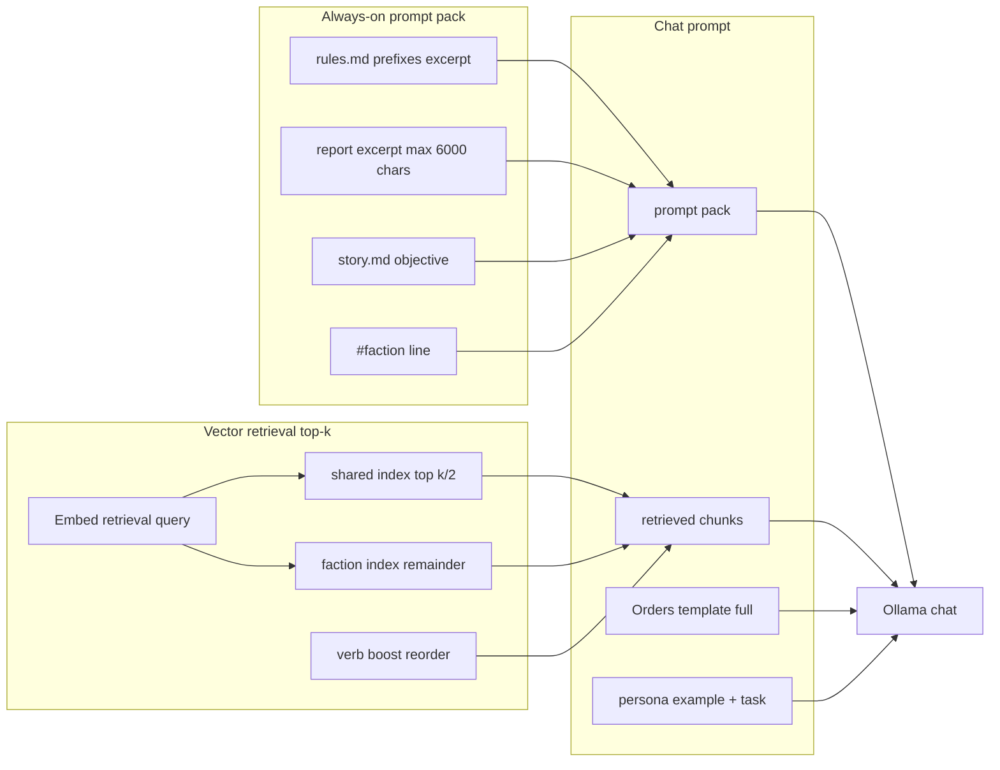
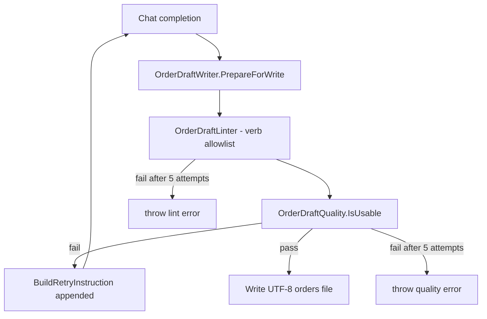

# Player-agent — context utilization, RAG, and hardware fit

Last updated: 2026-09-15  
Decision baseline: [ADR-0009](../adr/ADR-0009-local-llm-player-agent.md)  
Implementation: `tools/player-agent/`  
Related: [`local-player-agent.md`](local-player-agent.md), [`technology.md`](../technology.md) § Local player-agent inference

This document analyzes the **as-built** player-agent AI stack: model configuration, RAG parameters, prompt/token budgets, quality gates, context utilization vs model capacity, and RTX 4090 / Qwen upgrade feasibility. It is intended for implementers tuning retrieval, inference options, and RunPod pod setup.

---

## Executive summary

| Finding | Severity | Action |
|---------|----------|--------|
| **No `num_ctx` / `max_tokens` in API calls** — Ollama defaults (often 2K–8K) may **silently truncate** ~6–9K-token draft prompts | **High** | Pass `options.num_ctx` (recommend **16384** on 4090) via `OllamaClient`; document Modelfile on pod |
| **Code defaults lag ADR** — runtime uses `qwen2.5-coder:7b` / `14b`; ADR quality target is `qwen3-coder:30b` | Medium | Upgrade RunPod pull + `PLAYER_AGENT_CHAT_MODEL`; keep 7b for local smoke |
| **Prompt design is conservative** — capped excerpts + top-6 chunks ≈ **5–9K tokens** typical | Info | Room to grow context *after* fixing `num_ctx`; do not dump full 56K-char reports |
| **RAG has no chunk overlap** — splits at 3500 chars on `\n\n` only | Medium | Consider 10–15% overlap for verb rules spanning chunk boundaries |
| **Report chunks are size-only** — not by unit/section as planned in Phase 2 doc | Low | Optional: chunk reports at `##` / unit blocks before size cap |
| **Quality gates are strong** — 5-attempt retry with persona-specific checks beyond verb lint | Info | Primary quality lever today; model upgrade is secondary |

---

## 1. Current configuration

### 1.1 LLM model (chat)

| Setting | Local default | RunPod default | Override |
|---------|---------------|----------------|----------|
| Env var | — | — | `PLAYER_AGENT_CHAT_MODEL` |
| Model tag | `qwen2.5-coder:7b` | `qwen2.5-coder:14b` | Any Ollama tag on host |
| Selection logic | Non-localhost `OLLAMA_HOST` → 14b | Same | `PlayerAgentSettings.Load()` |

```7:8:tools/player-agent/Configuration/PlayerAgentSettings.cs
    public const string LocalDefaultChatModel = "qwen2.5-coder:7b";
    public const string RunPodDefaultChatModel = "qwen2.5-coder:14b";
```

```49:50:tools/player-agent/Configuration/PlayerAgentSettings.cs
        var chatModel = configuration["PLAYER_AGENT_CHAT_MODEL"]
            ?? (isRemote ? RunPodDefaultChatModel : LocalDefaultChatModel);
```

Play scripts mirror local default:

```9:10:play/_common.ps1
$script:DefaultOllamaHost = 'http://127.0.0.1:11434'
$script:DefaultChatModel = 'qwen2.5-coder:7b'
```

**ADR vs code:** [ADR-0009](../adr/ADR-0009-local-llm-player-agent.md) approves **Qwen3-Coder** (`qwen3-coder:30b` on 24 GB VRAM). The **implemented defaults remain Qwen2.5-Coder** for cost and local-7B smoke paths. Qwen3 is documented as manual pod pull + env override, not auto-selected.

### 1.2 Embeddings model

| Setting | Value |
|---------|-------|
| Default | `nomic-embed-text` |
| Override | `PLAYER_AGENT_EMBED_MODEL` |
| Host | Same Ollama instance as chat |

```9:9:tools/player-agent/Configuration/PlayerAgentSettings.cs
    public const string DefaultEmbedModel = "nomic-embed-text";
```

### 1.3 Inference parameters (API)

The runner sends a minimal OpenAI-compatible chat payload:

| Parameter | Value | Notes |
|-----------|-------|-------|
| `temperature` | **0.2** | Fixed in code |
| `stream` | `false` | |
| `max_tokens` / `num_predict` | **Not set** | Ollama default (−1 / until stop) |
| `num_ctx` / context window | **Not set** | **Ollama/model default** — often 2048–8192, not the model’s 32K native |
| `top_p`, `top_k`, `repeat_penalty` | **Not set** | Model defaults |

```57:63:tools/player-agent/Inference/OllamaClient.cs
        var payload = new ChatCompletionRequest
        {
            Model = _settings.ChatModel,
            Messages = messages,
            Stream = false,
            Temperature = 0.2,
        };
```

Chat timeout: **900 s** default (`PLAYER_AGENT_CHAT_TIMEOUT_SECONDS`).

### 1.4 RunPod / hardware selection

**No pod ID or GPU SKU is hard-coded.** Configuration is environment-only:

| Variable | Purpose | Default |
|----------|---------|---------|
| `OLLAMA_HOST` / `PLAYER_AGENT_INFERENCE_BASE_URL` | Pod HTTPS proxy or localhost | `http://127.0.0.1:11434` |
| `PLAYER_AGENT_ALLOW_RUNPOD` / `--allow-runpod` | Required for non-localhost | off |
| `PLAYER_AGENT_RUNPOD_POD_ID` | Ledger metadata | unset |
| `PLAYER_AGENT_GPU_CLASS` | Ledger metadata (e.g. `RTX 4090`) | unset |
| `PLAYER_AGENT_CLOUD_TIER` | e.g. `Secure` | unset |
| `PLAYER_AGENT_RUNPOD_HOURLY_RATE_USD` | Cost estimate | **$0.44/hr** |

```18:21:tools/player-agent/Configuration/PlayerAgentSettings.cs
    public string? RunPodPodId { get; set; }
    public string? GpuClass { get; set; }
    public string? CloudTier { get; set; }
    public double HourlyRateUsd { get; set; } = DefaultRunPodHourlyRateUsd;
```

**Approved topology (ADR-0009):** 1× **RTX 4090 (24 GB)**, Ollama-only pod, persistent volume for weights, local runner holds indexes/passwords/order writes.

**Remote concurrency:** `GuardedOllamaClient` serializes chat + embed on remote hosts (`SemaphoreSlim(1,1)`) to avoid thrashing one GPU across ten factions.

```8:8:tools/player-agent/Inference/GuardedOllamaClient.cs
    private static readonly SemaphoreSlim RemoteConcurrency = new(1, 1);
```

---

## 2. RAG architecture

### 2.1 Pattern: hybrid prompt pack + vector retrieval



### 2.2 Chunking

| Source | Strategy | Max size | Overlap | Metadata |
|--------|----------|----------|---------|----------|
| `rules.md` | By `##` / `###`; verb headings in order sections | 3500 chars cap via split | **None** | `doc=rules`, `verb=MOVE`… |
| `battle.md`, other manuals | By `##` heading | 3500 | None | `doc=battle` / `manual` |
| Tech manuals | Per `**entry**` line; sub-split at 3500 | 3500 | None | `doc=tech`, `mode=test\|campaign` |
| Faction report | **Paragraph split only** | 3500 | None | `doc=report`, `report-N` |
| `story.md` | **Single chunk** (whole file) | unbounded | — | `doc=story` |
| Prior orders | Per `#modulestack` / `#person` block | unbounded per block | — | `doc=order` |

```8:8:tools/player-agent/Rag/MarkdownChunker.cs
    public const int MaxChunkCharacters = 3500;
```

```30:36:tools/player-agent/Rag/MarkdownChunker.cs
    public static IReadOnlyList<TextChunk> ChunkReport(string sourcePath, string content) =>
        SplitWithSizeCap(content, MaxChunkCharacters)
            .Select((body, index) => new TextChunk(
                body.Trim(),
                new ChunkMetadata("report", null, null, sourcePath, $"report-{index}")))
```

**Gap vs plan:** [`local-player-agent.md`](local-player-agent.md) Phase 2B suggested report chunks “by unit / major section”; implementation uses **size cap only** (~17 chunks for a 56K-char turn-2 report).

### 2.3 Retrieval

| Parameter | Default | CLI override |
|-----------|---------|--------------|
| `topK` | **6** | `--top N` on `draft` / `retrieve` |
| Shared vs faction split | `max(1, topK/2)` shared, then faction fills remainder | — |
| Similarity | Cosine on stored embeddings | — |
| Verb boost | Re-rank: verb-matching chunks first, then fill to k | From `VerbInference.InferBoostVerbs` |

```210:210:tools/player-agent/Draft/OrderDraftService.cs
    public int TopK { get; init; } = 6;
```

```145:169:tools/player-agent/Draft/OrderDraftService.cs
        var sharedTop = Math.Max(1, request.TopK / 2);
        // ... shared store retrieve ...
        var factionTop = Math.Max(1, request.TopK - results.Count);
        // ... faction store retrieve ...
        return results
            .OrderByDescending(result => result.Score)
            .Take(request.TopK)
            .ToList();
```

Retrieval query construction (embedded, not injected verbatim):

```17:40:tools/player-agent/Draft/DraftPromptBuilder.cs
    public static string BuildRetrievalQuery(string? objectiveText, string? reportText, string? personaText = null)
    {
        // persona + objective + report excerpt (max 1200 chars) + MOVE readiness hint
```

### 2.4 Always-on prompt pack caps

| Component | Max characters | Source |
|-----------|----------------|--------|
| Prefixes & subjects | **2500** | `PromptPackBuilder.BuildPrefixesExcerpt` |
| Latest report | **6000** | `BuildReportExcerpt` |
| Objective | **Full story** (no cap) | `story.md` in pack |
| Password | Stripped when `IsRemoteHost` | `stripPassword: true` |

```8:20:tools/player-agent/Rag/PromptPackBuilder.cs
    public static string BuildPrefixesExcerpt(string rulesMarkdown, int maxCharacters = 2500)
    // ...
    public static string BuildReportExcerpt(string reportText, int maxCharacters = 6000) =>
        Truncate(reportText.Trim(), maxCharacters);
```

### 2.5 Additional prompt injection (not vector-retrieved)

| Block | Typical size | Notes |
|-------|--------------|-------|
| **Orders template** | Full text from report marker | **Not truncated** — `ExtractOrdersTemplate` |
| **Tactical objective** | Section from story | Repeated if present |
| **Example output** | ~1.5–2.5K chars | Persona-specific (`BuildExampleOutput`) |
| **Task** | ~400–900 chars | Persona-specific (`BuildTask`) |
| **Retry feedback** | Variable | Appended on attempts 2–5 |

### 2.6 Index layout and isolation

- **Shared:** `play/player/rules.md`, `battle.md`, mode-specific tech manuals → `.data/shared-{test|campaign}/shared.sqlite`
- **Faction:** latest report, `story.md`, last **3** order turns (incremental ingest) → `.data/runs/<run-id>/faction-NN/faction.sqlite`
- **Never indexed:** `gamein.xml`, other factions’ reports, full `data.xml` (per ADR)

Embeddings: one `EmbedAsync` call per chunk at ingest; query embedding once per draft (twice if both indexes exist — shared + faction each call embed today).

### 2.7 Cursor agents (orchestration layer)

| Agent | Role | LLM |
|-------|------|-----|
| `.cursor/agents/player.md` | Manual truth, human-quality orders, golden validation | Cursor cloud (`model: inherit`) |
| `.cursor/agents/campaign-ai.md` | Strategy / `story.md` | Cursor cloud |
| `tools/player-agent` | Scriptable draft + RAG + lint | Local Ollama / RunPod |

The C# runner **mirrors** `/player` I/O; it does not replace Cursor agents for goldens or docs refresh.

---

## 3. Quality gates

### 3.1 Pipeline



**Max attempts:** 5 (`OrderDraftService`).

```71:100:tools/player-agent/Draft/OrderDraftService.cs
        const int maxAttempts = 5;
        // ...
            if (lintResult.IsValid && OrderDraftQuality.IsUsable(prepared, hints.PersonaPreference, reportText))
            {
                break;
            }
            // ...
            prompt = chatPrompt + ... + OrderDraftQuality.BuildRetryInstruction(...);
```

### 3.2 Lint (`OrderDraftLinter`)

- Verbs must appear in allowlist derived from `play/player/rules.md` headings
- Requires `#faction` and `#end`
- Unknown verb → fail closed (no write)

### 3.3 Quality gate (`OrderDraftQuality`)

Beyond lint, checks include:

| Check | Purpose |
|-------|---------|
| Min structure | ≥2 `#modulestack`, ≥6 action lines, both immediate and `@` leftover verbs |
| Produce requirements | Persona-specific (`@produce terran` / cash / energy) |
| Researcher / military personas | USE+MOVE+RESEARCH or GRNDTR+2×ARMCBT+DECLARE+MOVE |
| Move readiness | Crew/fuel/h2o2/spctrl before `@move` |
| Use-tech placement | `farmng` on farms, `hcdril` on sdrill (via `ReportStackCatalog`) |
| Invalid item names | e.g. `titanium` → `titani` |
| Deferred nest GET | `has` + `-get` for HQ-nested armcbt/cdrill |
| Template boilerplate | Reject pasted `; +` / `; items:` comment lines |
| `#person` violations | Disallow non-TRAIN verbs under `#person` |

Retry prompt includes **enumerated violations** from describe* helpers when available.

### 3.4 Tests

`tools/player-agent-tests/` covers prompt building, chunking, retrieval verb boost, allowlist, and quality scenarios (`OrderDraftQualityTests.cs`).

---

## 4. Token usage estimate

Method: character counts from **campaign-2026-09-14-northwind faction 2** (`report.2.2.txt` ≈ 56,634 chars; `story.md` ≈ 1,981 chars; orders template ≈ 1,629 chars). Token estimate uses **~4 characters per token** (English + order syntax).

### 4.1 Breakdown (typical draft, turn 2, top-k=6)

| Component | Chars (typical / max) | Tokens (est.) |
|-----------|----------------------|---------------|
| System prompt | 616 | ~150 |
| Prompt pack — prefixes (capped) | 2,500 | ~625 |
| Prompt pack — objective (full story) | 1,981 | ~495 |
| Prompt pack — report excerpt (capped) | 6,000 | ~1,500 |
| Prompt pack — faction line | ~25 | ~6 |
| **Subtotal prompt pack** | **~10,500** | **~2,600** |
| Retrieved chunks (6 × ~800–3500 avg) | ~6,000–21,000 | ~1,500–5,250 |
| Orders template (full, not capped) | 1,629 | ~400 |
| Example output (military persona) | ~2,500 | ~625 |
| Task block | ~800 | ~200 |
| **Subtotal user prompt (attempt 1)** | **~21,000–37,000** | **~5,300–9,300** |
| **Total input (system + user)** | | **~5,500–9,500** |
| Output budget (orders file) | ~1,500–4,000 chars | ~400–1,000 |
| Retry append (attempt 2+) | +500–2,000 | +125–500 |

**Measured file facts (faction 2, northwind):**

- Full report: 56,634 chars (mostly **not** in prompt — only 6K excerpt + template + RAG hits)
- `rules.md`: 75,129 chars (only 2.5K prefixes in pack; verbs via RAG)

### 4.2 Model context capacity vs usage

| Model (Ollama tag) | Native context (vendor) | Ollama default `num_ctx` (typical) | Draft prompt vs default | Draft prompt vs 32K |
|--------------------|-------------------------|-----------------------------------|-------------------------|---------------------|
| `qwen2.5-coder:7b` | 32K | Often **2048–8192** unless Modelfile | **May exceed default → silent truncation** | ~18–29% |
| `qwen2.5-coder:14b` | 32K | Same | Same risk on RunPod | ~18–29% |
| `qwen3-coder:30b` | Up to 256K advertised; practical 32K+ | ~4K weights + KV at Q4 on 4090 | Same API gap | ~18–29% at 32K ctx |

**Utilization verdict:**

1. **Relative to Ollama defaults:** Likely **over-budget** (prompt may exceed unstated `num_ctx`) — **critical configuration gap**.
2. **Relative to model native 32K:** **Under-utilizing** (~25–30% of window) — healthy headroom once `num_ctx` is set explicitly.
3. **Relative to full report (56K chars):** **Under-utilizing game state** by design (isolation + caps); RAG must surface unit/cargo details not in the 6K excerpt.

---

## 5. Recommendations

### 5.1 Fix context configuration (priority 1)

**Implementers should:**

1. Extend `OllamaClient` chat payload with Ollama `options`:
   - `num_ctx`: **16384** for RunPod 4090 + `qwen2.5-coder:14b`; **8192** for local 7B if VRAM tight
   - `num_predict`: **4096** cap on output (orders rarely need more)
2. Document RunPod Modelfile or `ollama run … --context-length 16384` in `tools/player-agent/README.md`
3. Add `--dry-run` path that **skips embed** when indexes missing (today dry-run still calls Ollama for retrieval)

**ADR note:** Silent truncation undermines RAG investment; treat as bugfix, not optional tuning.

### 5.2 RAG chunk size and count

| Option | Pros | Cons | Recommendation |
|--------|------|------|----------------|
| **Increase chunk size** (3500 → 5000) | Fewer splits; more verb context per chunk | Lower retrieval precision; larger prompt if many hit | **Modest increase to 4500–5000 for `rules.md` only** |
| **Increase top-k** (6 → 8–10) | More manual coverage | +1.5–3K tokens; slower embed at ingest | **Try top-k=8 on RunPod** after `num_ctx` fix; A/B one faction |
| **Add overlap** (10–15%) | Reduces boundary misses | More index rows + embed cost | **Yes for rules + report chunks** |
| **Report chunk by section** | Aligns with unit blocks in reports | Ingest code change | **Phase next** — chunk at blank-line + `Stack`/`Unit` headers before size cap |
| **Raise report excerpt** (6000 → 8000) | More template-adjacent state in pack | Diminishing returns vs template block | **Only if retrieval scores for report chunks stay low** |

**Do not** inject the full 56K report — duplicates RAG, blows context, violates excerpt policy in ADR.

### 5.3 Model upgrade: Qwen2.5-Coder-14B → Qwen3-Coder-30B

| Aspect | Qwen2.5-Coder-14B | Qwen3-Coder-30B (MoE) |
|--------|-------------------|------------------------|
| VRAM on 4090 | ~9 GB weights + KV | ~18–20 GB Q4_K_M + KV |
| Fits 24 GB? | Comfortable | **Yes** at Q4, moderate context (~4–16K) |
| Quality for order syntax | Good | **Better** instruction following, fewer retries |
| Speed | Faster | ~70–115 tok/s cited for 4090 ( workload dependent ) |
| ADR alignment | Current default | **Approved quality target** |

**Recommendation:** On RunPod, set `PLAYER_AGENT_CHAT_MODEL=qwen3-coder:30b`, pull on persistent volume, keep `qwen2.5-coder:7b` local. Expect **fewer of the 5 retry loops**; measure via usage ledger chat-call counts per faction.

**Not recommended on local 7B path:** 30B exceeds typical laptop VRAM; keep 7b/14b local.

### 5.4 RTX 4090: larger context feasibility

| Context | Approx extra KV (14B) | 4090 @ 14B | 4090 @ qwen3-coder:30b Q4 |
|---------|----------------------|------------|---------------------------|
| 8K | Baseline | Easy | Easy |
| 16K | +~0.5–1 GB | Easy | **Recommended ceiling** |
| 32K | +~1–2 GB | OK with 14B | **Tight** — may need KV quant (`OLLAMA_KV_CACHE_TYPE`) or reduce parallel |
| 64K+ | Large | Possible for 14B only | **Not practical** full GPU |

**Recommendation:** Target **`num_ctx=16384`** on 4090 for draft workload; increase top-k / excerpt only within that budget. Full 32K native is possible for 14B but leaves little room for 30B MoE.

### 5.5 Quality vs context tradeoff

Quality today is dominated by **deterministic gates** (`OrderDraftQuality`), not raw context size. Gains from larger context are secondary to:

1. Fixing `num_ctx` (stop truncation)
2. Verb-boost retrieval hitting the right `rules.md` chunks
3. Full orders template in prompt (already present)
4. Model upgrade for multi-stack `@` nesting patterns

---

## 6. Implementer checklist

- [x] Set explicit `num_ctx` / `num_predict` in `OllamaClient`
- [ ] RunPod pod: RTX 4090, Ollama, `qwen3-coder:30b` + `nomic-embed-text`, **`PLAYER_AGENT_GPU_CLASS=RTX 4090`**
- [ ] Verify effective context: `ollama show qwen3-coder:30b --modelfile` on pod
- [ ] A/B: `top-k=6` vs `8`, measure lint/quality pass rate and chat calls per draft
- [x] Overlap + report section chunking in `MarkdownChunker`
- [x] RunPod default chat model → `qwen3-coder:30b` in `PlayerAgentSettings`

---

## Revision history

- **2026-09-15:** Initial analysis from `tools/player-agent/` as-built review and northwind campaign measurements.
