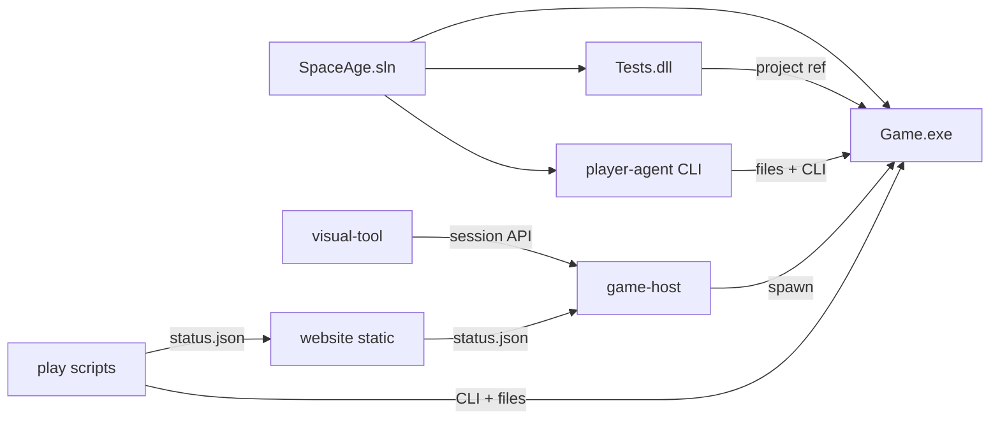

# Dependency map

Last updated: 2026-09-16

SpaceAge-2024 is a **single repository**. Engine and tests are in `SpaceAge.sln`; Node apps (`website/`, `game-host/`, `tools/visual-tool/`) and tools are sibling folders.

## Projects

| From | To | Contract |
|------|----|----------|
| `Tests` | `Game` | Project reference; in-process `DataFile` / `Game` |
| `tools/player-agent` | `Game.exe` | Order files, reports; reads `EngineVersion` from `Program.cs` |
| `game-host` | `Game.exe` | Spawn with `/data`, `/turn-dir`; session-scoped paths under `game-host/runs/` |
| `visual-tool` | `game-host` | Authenticated REST: reports, parse-orders, star map data |
| `website/` | `status.json` + static host | No `Game` reference; links to visual tool URL |
| `play/` scripts | `Game.exe` + `website/public/status.json` | AI isolation campaign (factions 2–11) |
| GM / mailer (external) | `Game.exe` | CLI + filesystem PBEM |

Do not add a second engine repo unless an ADR splits the solution.

## NuGet

See [`../technology.md`](../technology.md). NUnit 4 and net48 transitives from `Tests/packages.config` only.

## Filesystem contracts

Engine: [`../modules-and-integrations.md`](../modules-and-integrations.md).  
Lobby: [ADR-0007](../adr/ADR-0007-public-campaign-website.md).  
Hosted beta: [ADR-0011](../adr/ADR-0011-hosted-game-service.md).
