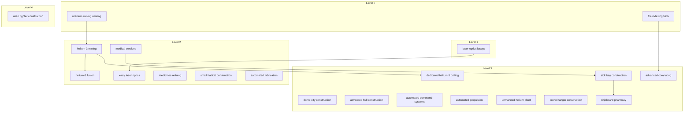

# Level 2 and above technologies

Catalog: `Tests/data.xml`, loaded by `Game/game/CatalogLoader.cs` (`DataFile.LoadConfigurationItems` delegates). Checked **21 Aug 2026**. Level 0–1: `player/basic_technologies.md`.

This file lists **level 2, 3, and 4** technologies, then the **module types** and **item types** those technologies produce or consume. Alphabetical by English `name-en` inside each level.

Omitted `use-time` defaults to **1** week in `CatalogLoader`. Omitted consume/produce `quantity` defaults to **1**.

## Levels

Same copy rule as level 1: a local copy on the using stack (`UseOrder.HasTechnology`). Capacity used is `technology.Level`. Labs only roll techs with `level >= 1` up to faction `MaxTechnologyLevel + 1` that fit remaining capacity (`Research.AvailableTechnologies`).

Catalog `requires="…"` is a **research preference**, not a USE gate. `RESEARCH TECHNOLOGY <id>` prefers techs whose `Requires` is that id (`Research.PreferredTechnologies`). Breakthroughs do **not** check that the prereq is already held.

## Prerequisites

Edges are catalog `requires` (arrow from prereq to the tech it enables for `RESEARCH TECHNOLOGY`). Techs with no `requires` sit in their level with no incoming arrow. Grey nodes are level 0–1 (see `basic_technologies.md`).

| Tech | Requires |
|------|----------|
| x-ray laser optics `[xraylo]` | laser optics `[lasopt]` (level 1) |
| helium-3 mining `[he3min]` | uranium mining `[uminng]` (level 0) |
| helium-3 fusion `[he3fus]` | helium-3 mining `[he3min]` |
| dedicated helium-3 drilling `[he3drl]` | helium-3 mining `[he3min]` |
| advanced computing `[advres]` | file indexing `[filidx]` (level 0) |
| sick bay construction `[sckcns]` | medical services `[medtec]` |
| shipboard pharmacy `[pharms]` | sick bay construction `[sckcns]` |

---

## Level 2

Need a local copy. Each copy uses 2 capacity.

**automated fabrication [autfab]**  
An unmanned alien fabrication plant. It has no crew requirement. Tag: `production`.  
Works in: production. Use consumes: 15 iron `[iron]`, 10 silicium `[silici]`. Use produces: advanced robo-factory `[robofc]`. Use-time: 6 weeks.

**helium-3 fusion [he3fus]**  
Controlled fusion of helium-3 for clean, abundant energy. Tag: `production`. **Requires:** helium-3 mining `[he3min]`.  
Works in: production. Use consumes: 1 helium-3 `[heliu3]`. Use produces: fusion reactor `[fusrec]`. Use-time: 1 week (default).

**helium-3 mining [he3min]**  
The extraction and refining of helium-3 from regolith and gas. Helium-3 mining can be carried out by any extraction module that has this technology loaded. Tag: `production`. **Requires:** uranium mining `[uminng]`.  
Works in: extraction. Use produces: 1 helium-3 `[heliu3]`. Use-time: 8 weeks.

**medical services [medtec]**  
The organized provision of medical services greatly increase the survival chances of the casualties. Tag: `repair`.  
Works in: production. Use consumes: 1 iron `[iron]`, 2 copper `[copper]`, 2 silicium `[silici]`. Use produces: medical facility `[medfac]`. Use-time: 6 weeks.

**medicines refining [medirf]**  
Without the medicines, even the best doctor can only watch his patient dies. The medicines are composed of small bits of different ingredients that can be bought on habitable planets. Tag: `repair`.  
Works in: production, **ocean** worlds. Use produces: 1 medicines `[medici]`. Use-time: 1 week (default).

**small habitat construction [habcns]**  
Methods for raising a root-level pressure shell sized to hold one or two support modules. It is not crew quarters.  
Works in: production, solid-surface. Use consumes: 20 iron `[iron]`, 8 titanium `[titani]`. Use produces: small habitat `[smhabi]`. Use-time: 6 weeks.

**x-ray laser optics [xraylo]**  
Advanced optics for penetrating x-ray lasers. **Requires:** laser optics `[lasopt]`.  
Works in: production. Use consumes: 2 titanium `[titani]`, 4 copper `[copper]`, 2 silicium `[silici]`. Use produces: x-ray laser `[xraylz]`. Use-time: 4 weeks.

---

## Level 3

Need a local copy. Each copy uses 3 capacity.

**advanced computing [advres]**  
Next-generation computing enabling far larger research complexes. Tag: `research`. **Requires:** file indexing `[filidx]`.  
Works in: production. Use consumes: 4 iron `[iron]`, 12 silicium `[silici]`. Use produces: advanced research complex `[advlib]`. Use-time: 1 week (default).

**advanced hull construction [ahlcns]**  
Recovered alien hull geometry. Automated internals need no crew and no life support.  
Works in: production. Use consumes: 20 titanium `[titani]`. Use produces: alien vessel hull `[alnhul]`. Use-time: 8 weeks.

**automated command systems [autctl]**  
A crewless command core that can wake nested alien systems.  
Works in: production. Use consumes: 8 silicium `[silici]`. Use produces: automated command module `[autcmd]`. Use-time: 5 weeks.

**automated propulsion [autprp]**  
A crewless reaction drive sized for an alien hull.  
Works in: production. Use consumes: 10 titanium `[titani]`. Use produces: automated propulsion module `[autdrv]`. Use-time: 5 weeks.

**dedicated helium-3 drilling [he3drl]**  
Purpose-built helium-3 core drills that double extraction efficiency at the cost of versatility and price. Tag: `production`. **Requires:** helium-3 mining `[he3min]`.  
Works in: production. Use consumes: 30 iron `[iron]`, 10 titanium `[titani]`. Use produces: helium-3 core drill `[he3ext]`. Use-time: 1 week (default).

**dome city construction [dmecns]**  
Construction of a compact domed settlement that can operate on airless rock if it is supplied with breathing gas and food.  
Works in: production, solid-surface. Use consumes: 40 iron `[iron]`, 20 titanium `[titani]`. Use produces: small dome city `[dmdcty]`. Use-time: 10 weeks.

**drone hangar construction [drnhng]**  
A hangar that stores and launches a squad of fighter drones. Tag: `military`.  
Works in: production. Use consumes: 8 titanium `[titani]`. Use produces: fighter drone bay `[drnbay]`. Use-time: 6 weeks.

**shipboard pharmacy [pharms]**  
Fermentation and sterile fill inside a sick bay. Sugars and amino acids from food grow antibiotic cultures; the ward energy budget runs a still for saline and antiseptic. No ocean harvest required. The feedstock is cargo rations, the constraint is sterility. Tag: `research`. **Requires:** sick bay construction `[sckcns]`.  
Works in: habitat, **module sick bay `[sckbay]`**. Use consumes: 1 food `[food]`. Use produces: 1 medicines `[medici]`. Use-time: 1 week.

**sick bay construction [sckcns]**  
A pressurized recovery ward: isolation beds, an autoclave, filtered air, and a surgical table. Trauma care is heat, sterility, fluids, and time. Without pharmaceuticals, two casualties still granulate over a four-week rest; with packed doses, infection drops fast enough that four patients can leave the ward each week. Tag: `research`. **Requires:** medical services `[medtec]`.  
Works in: production. Use consumes: 8 iron `[iron]`, 4 titanium `[titani]`, 4 copper `[copper]`, 3 silicium `[silici]`. Use produces: sick bay `[sckbay]`. Use-time: 8 weeks.

**unmanned helium plant [he3unc]**  
An unmanned helium-3 fusion plant with no crew stations.  
Works in: production. Use consumes: 12 titanium `[titani]`. Use produces: automated helium powerplant `[he3aut]`. Use-time: 6 weeks.

---

## Level 4

Need a local copy. Each copy uses 4 capacity.

**alien fighter construction [alnfgh]**  
A crewless alien fighter. It needs no life support. Tag: `military`.  
Works in: production. Use consumes: 4 titanium `[titani]`, 4 silicium `[silici]`. Use produces: alien fighter drone `[alndrn]`. Use-time: 4 weeks.

---

## Module types

Catalog `<module><entry>` that a level 2+ technology **produces**. Alphabetical by `name-en` inside the producing tech’s level.

### Level 2

**advanced robo-factory [robofc]**  
Unmanned alien fabrication plant. No crew and no life support.  
Group `production`. Built by automated fabrication `[autfab]`. Size 1000, mass 750, crew 0, energy 15, capacity 500, HP 100, tech-cap 4. Upkeep 60 cash. Operates in frigate, settlement.

**fusion reactor [fusrec]**  
Fuses helium-3 to deliver clean, abundant power.  
Group `energy`. Built by helium-3 fusion `[he3fus]`. Size 1200, mass 1200, crew 3, energy 5, HP 120. Upkeep 150 cash. Produces 120 energy / 13 weeks; burns 3 helium-3. Fuel duration 13. Operates on solid-surface.

**medical facility [medfac]**  
These sealed modules house crew members that need medical attention. They increase their chances of cure and contain undesired effects.  
Group `habitat`. Built by medical services `[medtec]`. Size 300, mass 200, crew 2, energy 2, capacity 150, HP 25, tech-cap 3. Upkeep 100 cash (catalog `quanity`). Catalog heal `target="stacked"` is **not** loaded; weekly wounded conversion is sick bay `[sckbay]` only.

**small habitat [smhabi]**  
A root-level pressure vessel that holds one or two nested modules such as a life support system.  
Group `habitat`. Built by small habitat construction `[habcns]`. Size 1000, mass 800, crew 0, energy 5, capacity 250, HP 80, tech-cap 1. Upkeep 40 cash. Operates on solid-surface and orbit.

**x-ray laser [xraylz]**  
The penetrating x-ray lasers are efficient weapons over large distances.  
Group `military`. Built by x-ray laser optics `[xraylo]`. Requires technology `[xraylo]`. Size 100, mass 100, crew 1, energy 10, capacity 50, HP 10, tech-cap 2, attack 10, defense 1, damage 10. Upkeep 100 cash.

### Level 3

**advanced research complex [advlib]**  
A large, high-throughput research facility building on computer-library methods.  
Group `research`. Built by advanced computing `[advres]`. Size 400, mass 100, energy 10, HP 80, tech-cap 8, research-output 2. Upkeep 200 cash.

**alien vessel hull [alnhul]**  
Crashed alien hull. Automated internals need no crew and no life support.  
Group `frigate`. Built by advanced hull construction `[ahlcns]`. Size 6500, mass 200, capacity 6000, energy 1, HP 120, tech-cap 4, defense 8. Cannot hold item stacks. Upkeep 20 cash. Operates on solid-surface and orbit.

**automated command module [autcmd]**  
Crewless alien command core.  
Group `command`. Built by automated command systems `[autctl]`. Size 800, mass 300, crew 0, energy 5, capacity 200, HP 55, tech-cap 2. Upkeep 80 cash. Operates in frigate.

**automated helium powerplant [he3aut]**  
Unmanned helium-3 fusion plant. No crew.  
Group `energy`. Built by unmanned helium plant `[he3unc]`. Size 400, mass 400, crew 0, energy 5, HP 80. Upkeep 80 cash. Produces 80 energy / 13 weeks; burns 2 helium-3. Fuel duration 13. Operates in frigate and on solid-surface.

**automated propulsion module [autdrv]**  
Crewless alien drive. No life support.  
Group `propulsion`. Built by automated propulsion `[autprp]`. Size 600, mass 700, crew 0, energy 30, capacity 150, HP 65, tech-cap 1. Upkeep 80 cash. Space move, mass-capacity 10000. Fuel duration 1 (1 oxyhydro `[h2o2]`). Operates in frigate.

**fighter drone bay [drnbay]**  
Hangar for a squad of crewless fighter drones.  
Group `military`. Built by drone hangar construction `[drnhng]`. Size 400, mass 300, crew 0, energy 5, capacity 400, HP 60, tech-cap 2. Upkeep 40 cash. Operates in frigate.

**helium-3 core drill [he3ext]**  
A specialised, costlier core drill dedicated to helium-3. It extracts helium-3 at twice the efficiency of a general core drill but cannot mine anything else.  
Group `extraction`. Built by dedicated helium-3 drilling `[he3drl]`. Size 1200, mass 1200, crew 6, energy 6, capacity 750, HP 100. Upkeep 60 cash. Produces 20 helium-3 / 13 weeks. Operates on solid-surface, in settlement or frigate.

**sick bay [sckbay]**  
Inpatient surgical and recovery ward. Isolation beds, autoclave, filtered air. Without medicines, two casualties still granulate over four weeks; with packed doses, four can return to duty each week. The ward can ferment medicines when pharmacy knowledge and food are present.  
Group `habitat`. Built by sick bay construction `[sckcns]`. Size 380, mass 250, crew 3, energy 4, capacity 180, HP 32, tech-cap 2, habitat 8, radiation −120. Upkeep 40 cash. Weekly heal (`ExecuteSickBayHeal`): with 1 medicines `[medici]` each, convert up to 4 `wndtrn` per bay to terran; without medicines, convert 2 per bay every 4 unmedicated weeks. `USE pharms` is restricted to this module type.

**small dome city [dmdcty]**  
A compact ownable dome for airless worlds. It must be supplied with food and terran breathing gas.  
Group `settlement`. Built by dome city construction `[dmecns]`. Size 5000, capacity 3500, energy 10, HP 250, tech-cap 2, population max 2000. Upkeep 20 food, 20 terran air, 80 cash. Produces 200 cash / 13 weeks. Operates on solid-surface.

### Level 4

**alien fighter drone [alndrn]**  
Crewless alien fighter. No life support. Slow space move at shuttle speed; launches from a fighter drone bay.  
Group `military`. Built by alien fighter construction `[alnfgh]`. Size 80, mass 80, crew 0, capacity 1, HP 8, attack 4, defense 1, damage 2, initiative 20. Upkeep 20 cash. Slow space move at shuttle speed (mass-capacity 750). Fuel duration 13 (1 helium-3 `[heliu3]`). Capacity 1 holds one helium-3 so a root drone can `GET` fuel. Operates in orbit, on solid-surface, and nested in military.

---

## Item types

Catalog `<item><entry>` that a level 2+ technology **produces** or **consumes**. Iron, copper, silicium, and titanium also appear in `basic_technologies.md`.

### Level 2

**medicines [medici]**  
Assorted medical supplies need to treat the wounded.  
Size 1, mass 1. Produced by medicines refining `[medirf]` (1) and shipboard pharmacy `[pharms]` (1). Weekly sick-bay heal and medical consume use this item (`Game.ExecuteSickBayHeal` then `ExecuteMedicalConsume`).

**unit of copper [copper]**  
See `basic_technologies.md`. Consumed by L2: medical services `[medtec]` (2), x-ray laser optics `[xraylo]` (4). Also L3: sick bay construction `[sckcns]` (4).

**unit of helium-3 [heliu3]**  
A light, non-radioactive helium isotope prized as clean fusion fuel; scarce on planets but abundant in lunar regolith.  
Size 1, mass 1. Produced by helium-3 mining `[he3min]` (1). Consumed by helium-3 fusion `[he3fus]` (1). Fusion reactors and automated helium plants also burn it as fuel (module, not a tech consume). Helium-3 core drill `[he3ext]` produces 20 per 13 weeks. Alien fighter drones `[alndrn]` hold 1 (capacity 1) and burn 1 per 13 weeks.

**unit of iron [iron]**  
See `basic_technologies.md`. Consumed by L2: automated fabrication `[autfab]` (15), medical services `[medtec]` (1), small habitat construction `[habcns]` (20). Also L3: advanced computing `[advres]` (4), dedicated helium-3 drilling `[he3drl]` (30), dome city construction `[dmecns]` (40), sick bay construction `[sckcns]` (8).

**unit of silicium [silici]**  
See `basic_technologies.md`. Consumed by L2: automated fabrication `[autfab]` (10), medical services `[medtec]` (2), x-ray laser optics `[xraylo]` (2). Also L3: advanced computing `[advres]` (12), automated command systems `[autctl]` (8), sick bay construction `[sckcns]` (3). Also L4: alien fighter construction `[alnfgh]` (4).

**unit of titanium [titani]**  
See `basic_technologies.md`. Consumed by L2: small habitat construction `[habcns]` (8), x-ray laser optics `[xraylo]` (2). Also L3: advanced hull construction `[ahlcns]` (20), automated propulsion `[autprp]` (10), dedicated helium-3 drilling `[he3drl]` (10), dome city construction `[dmecns]` (20), drone hangar construction `[drnhng]` (8), sick bay construction `[sckcns]` (4), unmanned helium plant `[he3unc]` (12). Also L4: alien fighter construction `[alnfgh]` (4).

### Level 3

**unit of food [food]**  
See `basic_technologies.md`. Consumed by shipboard pharmacy `[pharms]` (1). Not produced by a level 2+ technology.
